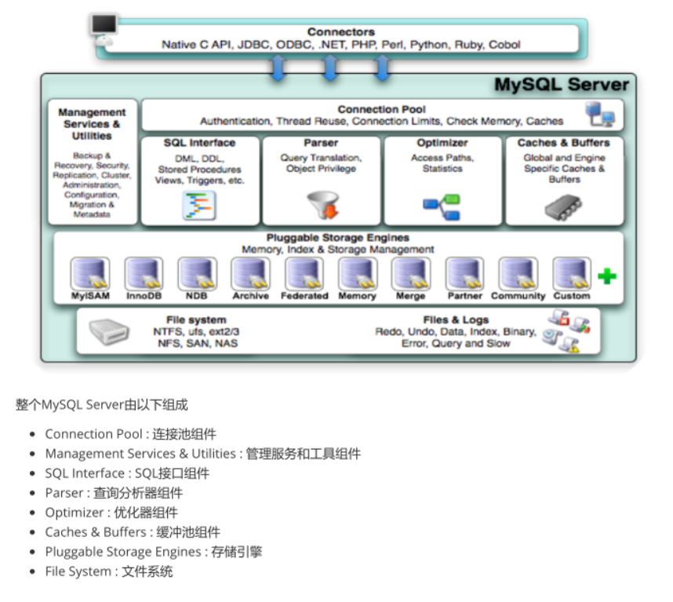
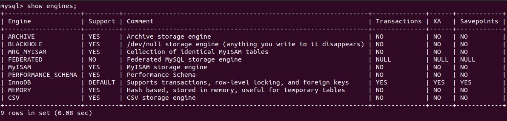
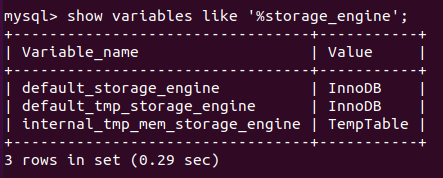
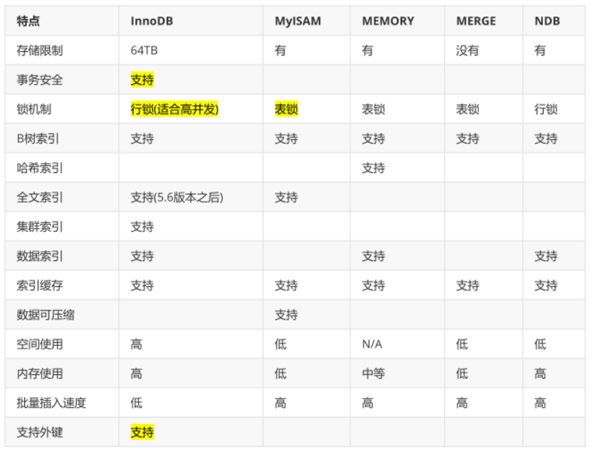

# 1. MySQL体系结构

# 2. 存储引擎

## 2.1 存储引擎概述

MySQL 可以根据不同的存储需求，选择最优的存储引擎。存储引擎就是存储数据、建立索引、更新查询数据等等技术的实现方式。存储引擎是基于表的，而不是基于库的，所以存储引擎也被称为表类型。

可以通过语句 `show engines;` 来查询当前数据库支持的存储引擎。

创建新表时，如果不指定存储引擎，系统就会使用默认的存储引擎。

查看 MySQL 数据库默认的存储引擎：`show variables like '%storage_engine';`

## 2.2 各种存储引擎特性

### InnoDB

InnoDB 是 MySQL 的默认存储引擎。InnoDB 提供了具有提交、回滚、崩溃恢复能力的事务安全。但是对比 MyISAM 引擎，InnoDB 写的处理效率较差，并且会占用更多的磁盘空间以保留数据和索引。

InnoDB 的特点：

* 事务控制
* 外键约束
* 存储方式    
	* 共享表空间存储：该方式创建的表的表结构存储在 .frm 文件中，数据和索引保存在 innodb_data_hom_dir 和 innodb_data_file_path 定义的表空间中，可以是多个文件
    * 多表空间存储：该方式创建的表仍然存储在 .frm 文件中，但是每个表的数据和索引单独存储在 .idb 中
	
### MyISAM

MyISAM 不支持事务，也不支持外键。其优势是访问速度快。对事务的完整性没有要求或者以 select、insert 为主的应用基本上都可以使用这个引擎来创建表。

MyISAM 特点：

* 不支持事务
* 文件存储方式：每个 MyISAM 在磁盘上的存储分为 3 个文件，其文件名和表名相同，拓展名分别为：    
	* .frm：存储表定义
    * .MYD：存储数据
    * .MYI：存储索引

