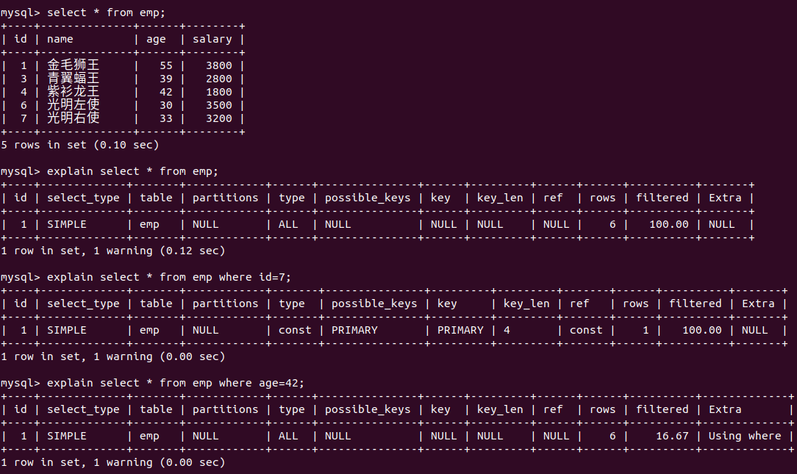

# 1. 查看SQL执行频率

MySQL 客户端连接成功后，可以通过语句 **`show [session|global] status`** 命令查看服务器的状态信息。其中 session 显示当前连接的统计结果，global 显示自数据库上次启动至今的统计结果。默认为 session。

参数具体含义：

# 2. 定位低效率执行的SQL

两种方式：

1. 慢查询日志：后续日志部分
2. **`show processlist`**：慢查询日志在查询结束之后才记录，并不能定位问题。使用`show processlist`命令查看当前 MySQL 的线程，包括线程的状态、是否锁表等问题，可以实时的查看 SQL 的执行情况。

参数说明：
| 列名 | 说明 |
| --- | --- |
| id | 用户登录时系统分配的id |
| user | 显示当前用户 |
| host | 显示这个语句是从哪个ip端口上发出的，可以跟踪出现问题语句的用户 |
| db | 显示这个进程连接的数据库 |
| command | 显示当前连接执行的命令，sleep休眠、query查询，connect连接，daemon守护 |
| time | 显示当前状态的持续时间(s) |
| state | 显示当前连接的sql语句的状态。一个sql语句，需要经过多个状态才能最终完成 |
| info | 显示当前执行的sql语句，这是判断问题语句的重要依据 |

# 3. explain分析执行计划

通过上一步查询到效率低的SQL语句之后，可以通过 explain 或者 desc 命令获取 MySQL 如何执行 select 语句的信息。

## 3.1 explain -- id

id 字段是 select 查询的序列号，是一组数字，表示的是查询中执行 select 子句或者是操作表的顺序。

id 有三种情况：

* **id 相同：表示加载表的顺序是从上到下的**

* **id 不同：id 值越大，优先级越高，越先被执行**

* **有相同也有不同：id 相同的可看作是一组，自上而下执行；在所有的组中，id 越大，越先被执行**

## 3.2 explain -- select_type

## 3.3 explain -- table

展示当前语句操作的表

## 3.4 explain -- type

type 显示的是访问类型，其取值和含义为：

结果值从好到怀依次是：

**system > const > eq_ref > ref > range > index > ALL**

一般来说，我们需要保证查询至少达到 range 级别，最好到 ref。

## 3.5 explain -- key

* possible_keys：显示可能应用在这张表的索引，一个或者多个
* key：实际使用的索引，若为 null，则没有使用索引
* key_len：表示索引中使用的字节数。该值为索引字段的最大可能长度，并非实际使用长度。在不损失精确性的前提下，长度越短越好

## 3.6 explain -- rows

扫描行的数量

## 3.7 explain -- extra

其他的额外的执行计划信息，在该列展示

# 4. show profile 分析 SQL

show profiles 能够在 SQL 优化中帮助我们了解时间都耗费到哪里去了。

使用 `show @@have_profiling;` 语句查看当前 MySQL 是否支持 profile

profile 默认关闭，需要手动开启

通过**`show profiles`**指令，我们可以更加详细的了解 SQL 的执行过程

通过**`show profile for query query_id`**指令可以查看该 SQL 执行过程中每个线程的状态和小号的时间

进一步使用**`show profile [all|cpu|block io|context switch|pagefaults] for query_id`**查询明细。例如查询CPU的耗费时间：

字段解释：

# 5. trace分析优化器执行计划

开启 trace，设置格式为 JSON，并设置trace最大能够使用的内存大小，避免解析过程中因为默认内存过小而不能够完整展示。

执行 SQL 并通过 **`select * from information_schema.optimizer_trace\G;`** 查看 SQL 如何被执行。

