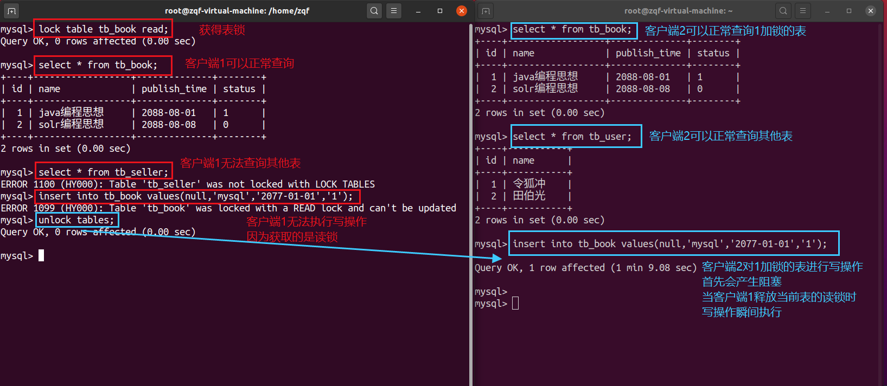

# 1. 锁概述

锁是计算机协调多个进程或线程并发访问某一资源的机制（避免争抢）。

在数据库中，除传统的计算资源（如 CPU、RAM、I/O 等）的争用以外，数据也是一种供许多用户共享的资源。如何保证数据并发访问的一致性、有效性是所有数据库必须解决的一个问题，锁冲突也是影响数据库并发访问性能的一个重要因素。从这个角度来说，锁对数据库而言显得尤其重要，也更加复杂。

# 2. 锁的分类

从对数据操作的粒度分 ：
* **表锁**：操作时，会锁定整个表。
* **行锁**：操作时，会锁定当前操作行。

从对数据操作的类型分：
* **读锁（共享锁）**：针对同一份数据，多个读操作可以同时进行而
* **写锁（排它锁）**：当前操作没有完成之前，它会阻断其他写锁和读锁。

MySQL 锁及其特点：

| 存储引擎 | 表级锁 | 行级锁 | 页面锁 |
| --- | --- | --- | --- |
| MyISAM | 支持 | 不支持 | 不支持 |
| InnoDB | 支持 | 支持 | 不支持 |

| 锁类型 | 特点 |
| --- | --- |
| 表级锁 | 偏向 MyISAM 存储引擎，开销小，加锁快；不会出现死锁；锁定粒度大，发生锁冲突的概率最高,并发度最低。 |
| 行级锁 | 偏向 InnoDB 存储引擎，开销大，加锁慢；会出现死锁；锁定粒度最小，发生锁冲突的概率最低，并发度也最高。 |
| 页面锁 | 开销和加锁时间界于表锁和行锁之间；会出现死锁；锁定粒度界于表锁和行锁之间，并发度一般。 |

# 3. MyISAM 表锁

MyISAM 存储引擎只支持表锁，这也是 MySQL 开始几个版本中唯一支持的锁类型。

MyISAM 在执行查询语句（SELECT）前，会自动给涉及的所有表加读锁；在执行更新操作（UPDATE、DELETE、INSERT 等）前，会自动给涉及的表加写锁。

这个过程并不需要用户干预，因此，用户一般不需要直接用 LOCK TABLE 命令给 MyISAM 表显式加锁。

显示加表锁语法：

```sql
加读锁 ： lock table table_name read;
加写锁 ： lock table table_name write；
```

## 3.1 读锁示例



## 3.2 写锁示例


## 3.3 结论

**读锁会阻塞写，但不会阻塞读；写锁既会阻塞读，又会阻塞写**

## 3.4 查看锁的争用情况


* `In_use`：表当前被查询使用的次数。若为0则表是打开的，但是当前没有被使用
* `Name_locked`：表名称是否被锁定。名称锁定用于取消表或对表进行重命名等操作


* `Table_locks_immediate`：指能够立刻获得表级锁的次数，每次立即获取锁，该值+1
* `Table_locks_waited`：指不能立刻获取表级锁而需要等待的次数，每等待一次，该值+1。该值高说明存在着较为严重的表级锁争用情况

# 4. InnoDB 行锁

行锁特点：

* 开销大、加锁慢
* 会出现死锁
* 锁的细粒度最小，发生锁冲突的概率最低
* 并发度最高
InnoDB 和 MyISAM 的不同：
* 支持事务
* 采用行级锁

## 4.1 背景知识

### 事务及其 ACID 属性

| ACID | 含义 |
| --- | --- |
| Atomicity 原子性 | 事务是一个原子操作单元，其对数据的修改，要么全部成功，要么全部失败 |
| Consistent 一致性 | 在事务开始和完成时，数据都必须保持一致状态 |
| Isolation 隔离性 | 数据库系统提供一定的隔离机制，保证事务在不受外部并发操作影响的“独立环境”下运行 |
| Durable 持久性 | 事务完成之后，对于数据的修改是永久的 |

### 并发事务处理带来的问题

| 问题 | 含义 |
| --- | --- |
| 丢失更新(Lost Update) | 当两个或多个事务选择同一行，最初事务修改的值会被后面事务修改的值覆盖 |
| 脏读(Dirty Reads) | 当一个事务正在访问数据，并且对数据进行了修改，而这个修改还没有提交到数据库中，此时另一个事务也访问到这个数据，并使用了这个数据 |
| 不可重复读(Non-Repetable Reads) | 一个事物在读取某些数据后的某个时间再次读取以前读过的数据，发现和之前不一样 |
| 幻读(Phantom Reads) | 一个事物按照相同的查询条件重新读取以前查询过的数据，却发现被其他事务插入了满足查询条件的新数据 |

### 事务隔离级别

| 隔离级别 | 丢失更新 | 脏读 | 不可重复读 | 幻读 |
| --- | --- | --- | --- | --- |
| Read uncommitted | × | ✔ | ✔ | ✔ |
| Read committeed | × | × | ✔ | ✔ |
| Repeatable read (默认) | × | × | × | ✔ |
| Serializable | × | × | × | × |

### 查看当前数据库的隔离级别

## 4.2 InnoDB 的行锁模式

InnoDB 实现了以下两种类型的行锁：

* **共享锁(S)**：又称为读锁，简称 S 锁。共享锁就是多个事务对于同一个数据可以共享一把锁，都能访问到数据，但是只能读不能修改。
* **排它锁(X)**：又称写锁，简称 X 锁。排它锁不能与其他锁并存，如果一个事务获取了一个数据行的排它锁，其他事物就不能再获取该行的其他锁，包括共享锁和排它锁。获取排它锁的事务可以对数据进行读取和修改。
对于 `UPDATE / DELETE / INSERT`，InnoDB 会自动给涉及数据集加排它锁。

对于普通的 SELECT，InnoDB 不会加任何锁。

## 4.3 行锁演示


## 4.4 无索引航说升级为表锁

若不通过索引条件进行数据检索，那么 InnoDB 将对表中的所有记录加锁，实际效果跟表锁一样。

## 4.5 间隙锁

当我们用范围条件，而不是使用相等条件检索数据，并请求共享或排他锁时，InnoDB会给符合条件的已有数据进行加锁。

对于键值在条件范围内但并不存在的记录，叫做"间隙（GAP）"， InnoDB 也会对这个 "间隙" 加锁，这种锁机制就是所谓的**间隙锁（Next-Key锁）**


## 4.6 InnoDB 行锁的争用情况


* Innodb_row_lock_current_waits: 当前正在等待锁定的数量
* Innodb_row_lock_time: 从系统启动到现在锁定总时间长度
* Innodb_row_lock_time_avg:每次等待所花平均时长
* Innodb_row_lock_time_max:从系统启动到现在等待最长的一次所花的时间
* Innodb_row_lock_waits: 系统启动后到现在总共等待的次数

当等待的次数很高，而且每次等待的时长也不小的时候，我们就需要分析系统中为什么会有如此多的等待，然后根据分析结果着手制定优化计划。

# 5. 总结

InnoDB 存储引擎由于实现了行级锁定，虽然在锁定机制的实现方面带来了性能损耗可能比表锁会更高一些，但是在整体并发处理能力方面要远远由于 MyISAM 的表锁的。当系统并发量较高的时候， InnoDB 的整体性能和 MyISAM 相比就会有比较明显的优势。

但是，InnoDB 的行级锁同样也有其脆弱的一面，当我们使用不当的时候，可能会让 InnoDB 的整体性能表现不仅不能比 MyISAM 高，甚至可能会更差。

