# 1. 简介

## 1.1 String（字符串）

* string 是 redis 最基本的类型，可以理解为与 memcached 一模一样的类型，一个 key 对应一个 value
* string 类型是二进制安全的。redis 的 string 可以包含任何数据，比如图片或者是序列化的对象
* string 类型是 redis 最基本的数据类型，一个 redis 中的字符串 value 最多可以是 512M

## 1.2 Hash（哈希，类似 java 中的 Map）

* redis hash 是一个键值对集合
* redis hash 是一个 string 类型的 field 与 value 的映射表，特别适合用于存储对象
* 类似 java 中的 Map<String, Object>

## 1.3 List（列表）

* redis 列表是简单的字符串列表，按照插入顺序排序
* redis 列表可以选择从头部和尾部添加
* 它的底层实际上是一个链表

## 1.4 Set（集合）

* redis Set 是一个 string 类型的无序集合
* 底层通过 hashTable 实现

## 1.5 Zset（有序集合）

* redis Zset 也是一个 string 类型的集合，且不允许存在重复的成员
* 与 set 不同，Zset 的每个元素关联一个 double 类型的分数
* redis 通过分数来为集合中的成员进行从小到大的排序。zset 的成员是唯一的，但分数(score)是可以重复的

# 2. Key 关键字

1. keys * ：展示所有内容
2. exists key：判断 key 是否存在
3. move key db：移除当前库
4. expire key second：为给定的 key 设置过期时间
5. ttl key：查看 key 还有多少秒过期。-1 表示永不过期；-2 表示已经过期
6. type key：查看 key 的类型

# 3. [String](https://www.runoob.com/redis/redis-strings.html) -- 单值单value

**set/get/del/append/strlen**

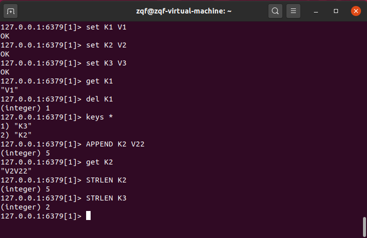

**Incr/decr/incrby/decrby：一定要是数字才能进行加减** 

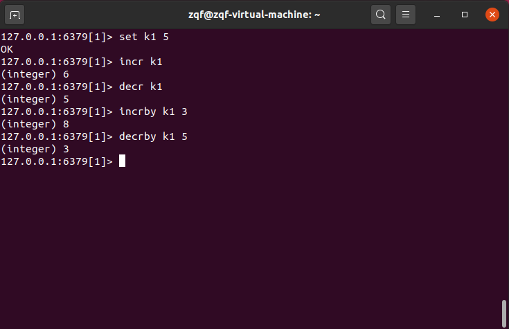

**getrange/setrange**

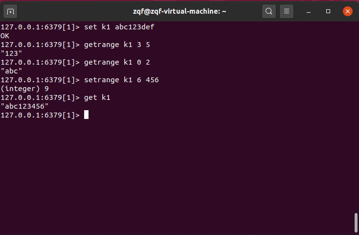

**setex/setnx**

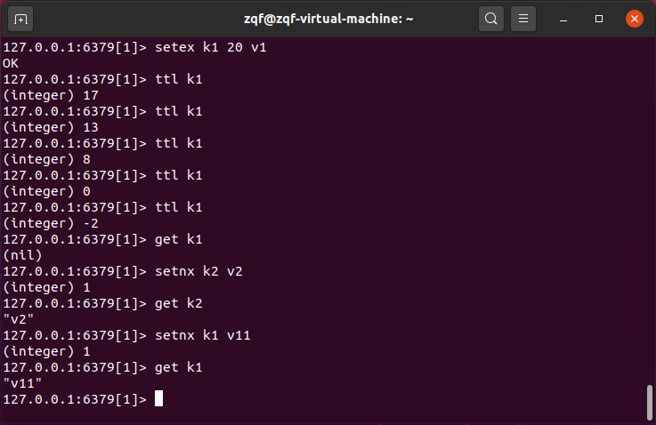

**mset/mget/msetnx**

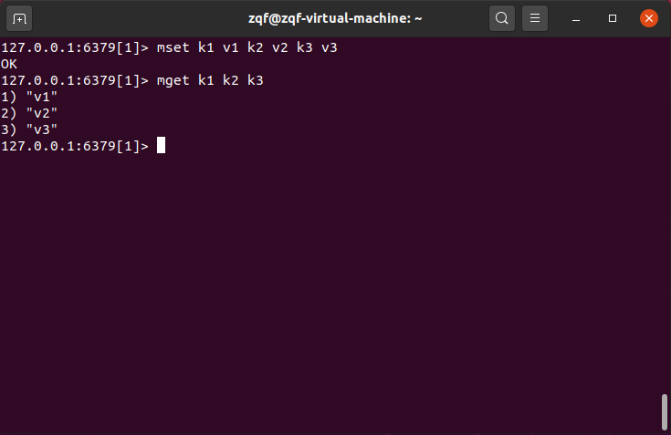

**getset(先get再set)**

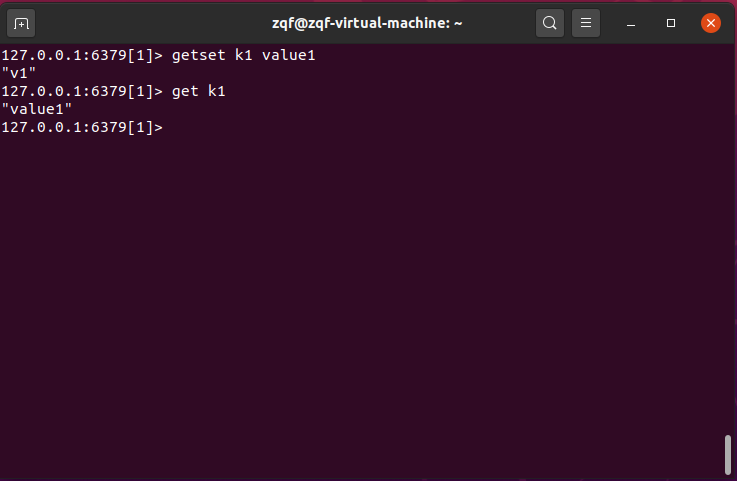

# 4. [List](https://www.runoob.com/redis/lists-linsert.html) -- 单值多value

**lpush/rpush/lrange**

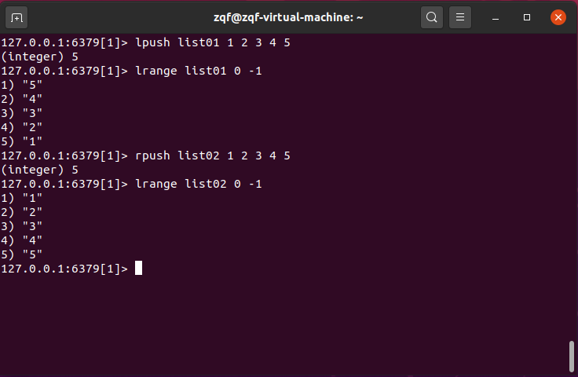

**lpop/rpop**

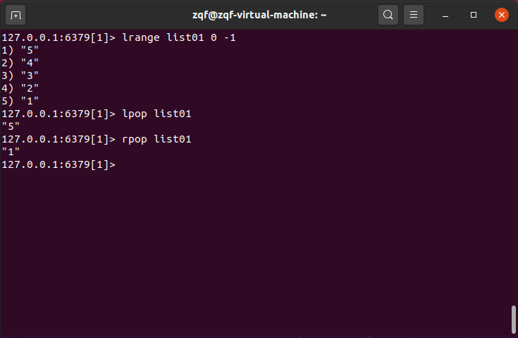

**lindex/llen**

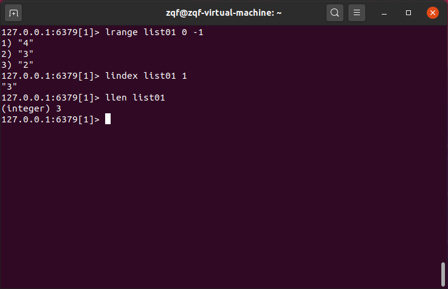

**lrem**

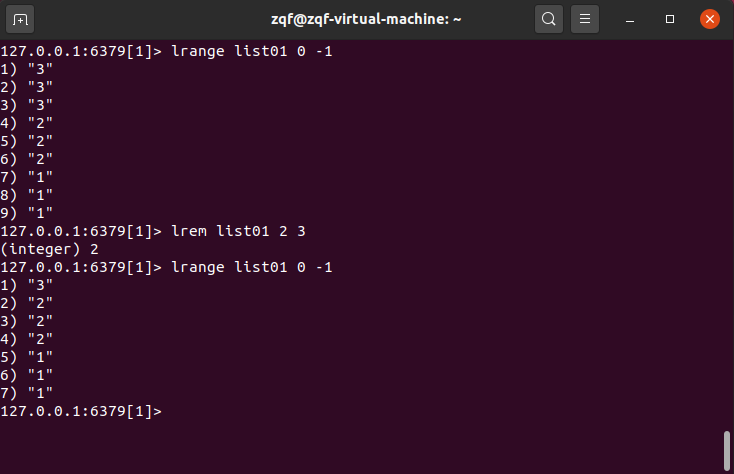

**ltrim**

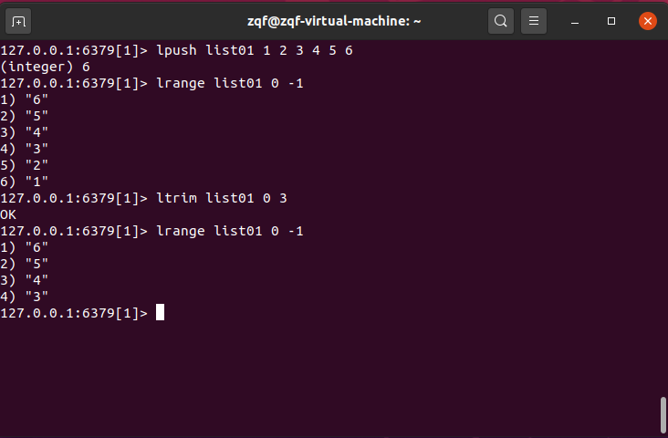

**rpoplpush/lset**

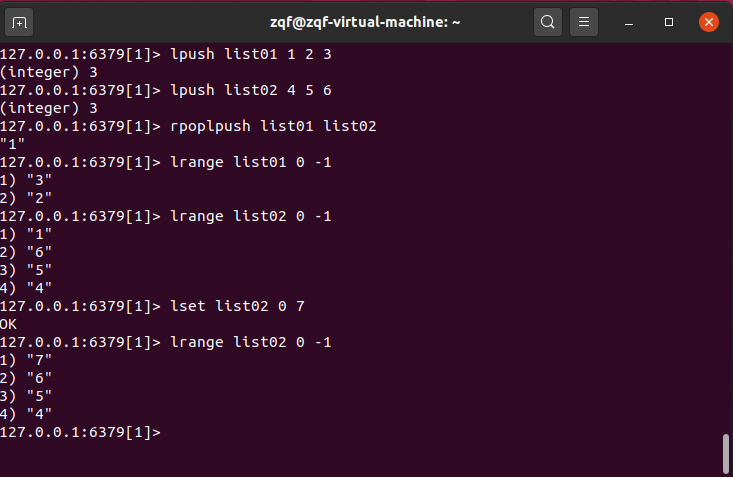

**linsert**

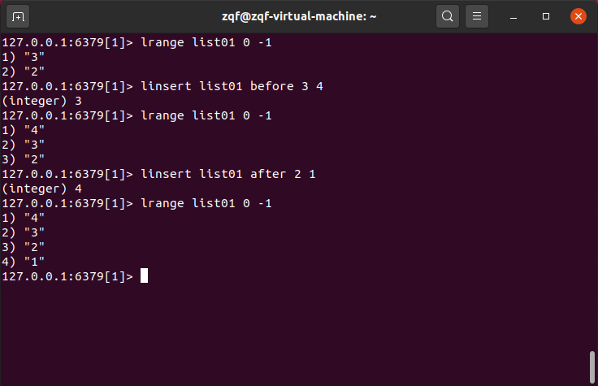

# 5. [Set](https://www.runoob.com/redis/redis-sets.html) -- 单值多value

**sadd/smembers/sismember/scard/srem**

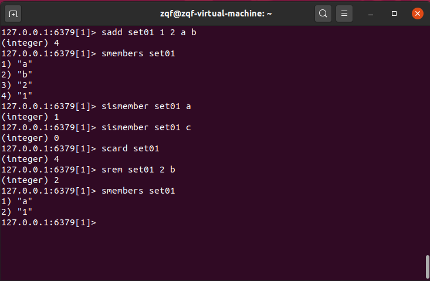

**srandmember/spop**

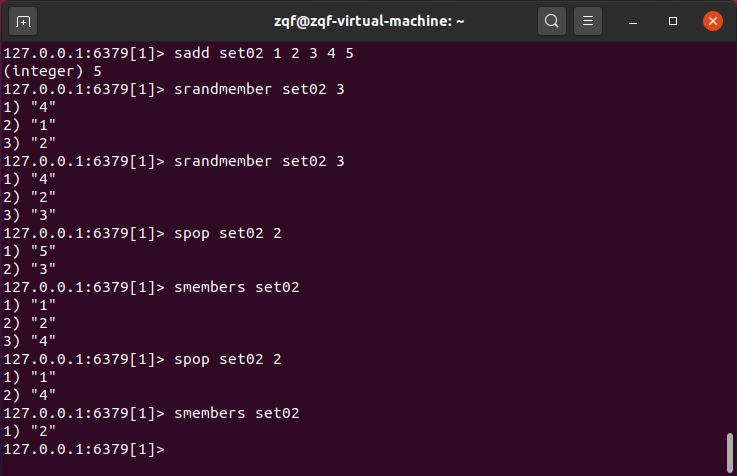

**smove**

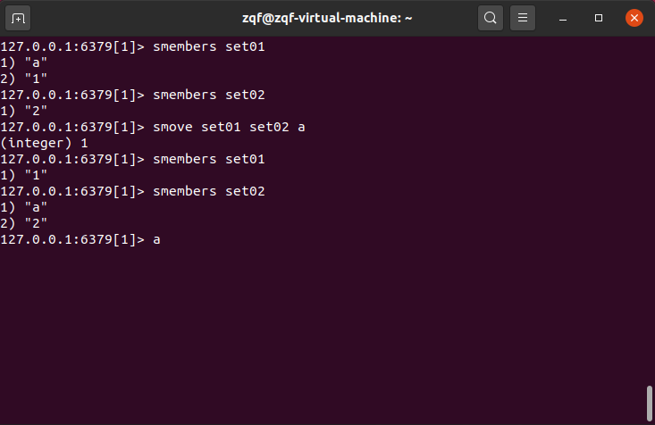

**sdiff/sinter/sunion**

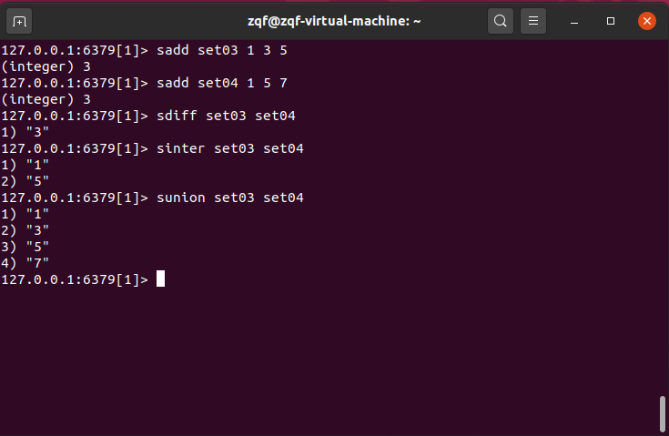

# 6. [Hash](https://www.runoob.com/redis/redis-hashes.html) -- kv模式不变，但v是一个键值对

**hset/hget/hlen/hmset/hmget/hgetall/hdel**

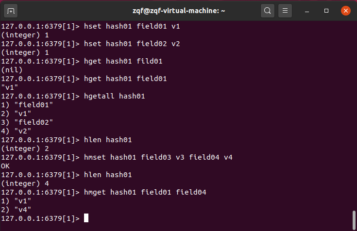

**hexists/hkeys/hvals**

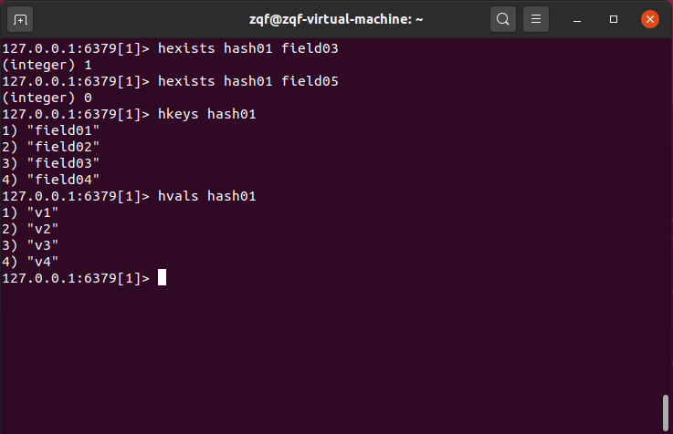

**hincrby/hincrbyfloat**

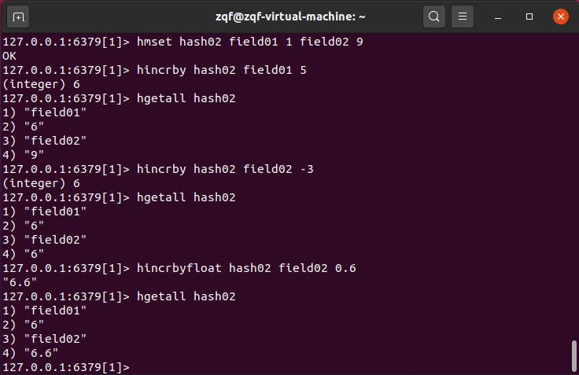

# 7. [Zset](https://www.runoob.com/redis/redis-sorted-sets.html) -- 在set的基础上加一个score值

**zadd/zrange/zrangebyscore/zrem**

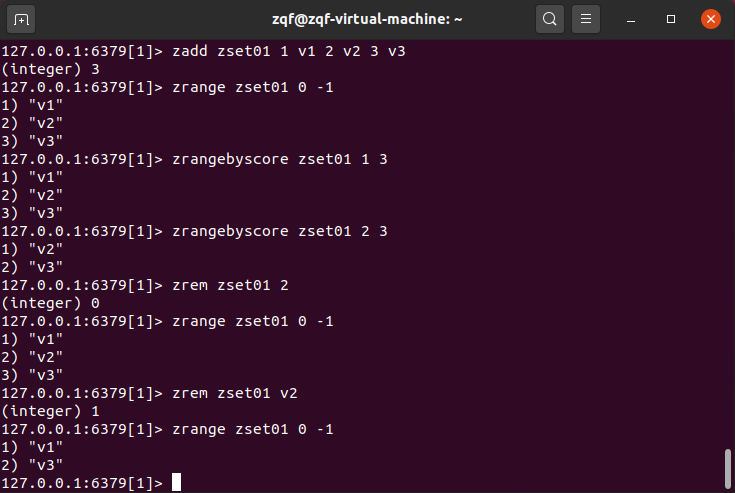

**zcard/zcount/zrank/zscore**

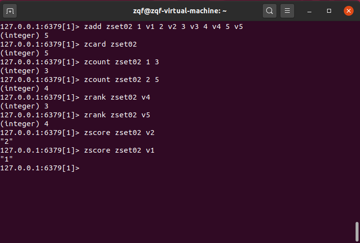

**zrevrank/zrevrange/zrevrangebyscore**

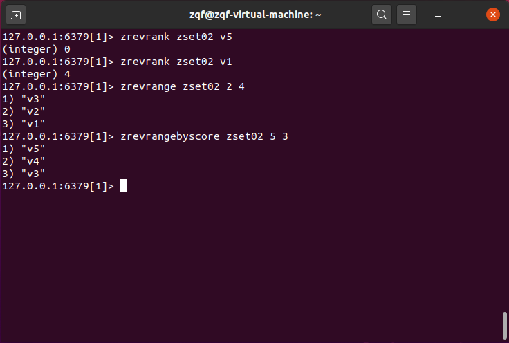

