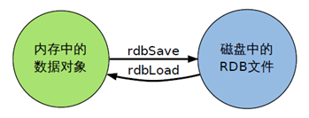
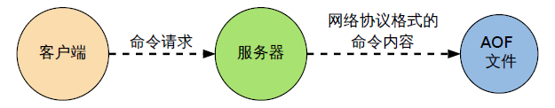

# 1. RDB -- Redis DataBase

## 1.1 RDB 是什么？

* 在指定的时间间隔内将内存中的数据集快照写入磁盘，也就是行话讲的 Snapshot 快照，它恢复时是将快照文件直接读到内存里
* Redis会**单独创建（fork）一个子进程来进行持久化**，会先将数据写入到一个临时文件中，待持久化过程都结束了，再用这个临时文件替换上次持久化好的文件。 整个过程中，主进程是**不进行任何 IO 操作**的，这就确保了极高的性能。如果需要进行**大规模数据的恢复，且对于数据恢复的完整性不是非常敏感，那 RDB 方式要比 AOF 方式更加的高效**。RDB 的缺点是最后一次持久化后的数据可能丢失。
* Fork的作用是复制一个与当前进程一样的进程。新进程的所有数据（变量、环境变量、程序计数器等） 数值都和原进程一致，但是是一个全新的进程，并作为原进程的子进程
* rdb 保存的是 **dump.rdb** 文件
* 相关配置：**SNAPSHOTTING**

## 1.2 RDB 快照的使用

* 在配置文件中默认配置了 dump.rbd 作为存入磁盘的文件
* 可以使用 save 或者 bgsave 命令将当前数据库内容写入磁盘持久化
* 执行拷贝命令 cp dump.rdb dump_new.rdb 保存当前的数据，当需要恢复数据时删除 dump.rdb 并将 dump_new.rdb 重新复制并命名为 dump.rdb 即可
* 执行flushall命令，也会产生dump.rdb文件，但里面是空的，无意义
* 停止使用 RDB 快照：redis-cli config set save ""

## 1.3 RDB 的优劣

* 优势：    
	* 适合大规模的数据恢复
    * 对数据的完整性和一致性要求不高

* 劣势：    
	* 在一定间隔时间内做一次备份，如果 redis 意外宕机，就会丢失最后一次快照后的所有更改
    * Fork 的时候，内存中的数据被克隆了一份，占用的磁盘空间膨胀一倍
	
## 1.4 总结

* RDB是一个非常紧凑的文件。
* RDB 在保存 RDB 文件时父进程唯一需要做的就是 fork 出一个子进程，接下来的工作全部由子进程来做，父进程不需要再做其他 IO 操作，所以 RDB 持久化方式可以最大化redis的性能。
* 与 AOF 相比，在恢复大的数据集的时候，RDB 方式会更快一。
* 数据丢失风险大。
* RDB 需要经常 fork 子进程来保存数据集到硬盘上，当数据集比较大的时候 fork 的过程是非常耗时的，可能会导致Redis 在一些毫秒级不能回应客户端请求。

# 2. AOF -- Append Only File

## 2.1 AOF 是什么？

AOF 以日志的形式来记录每个写操作，将 Redis 执行过的所有写指令记录下来(读操作不记录)， 只许追加文件但不可以改写文件，redis 启动之初会读取该文件重新构建数据，即 redis 重启的话就根据日志文件的内容将写指令从前到后执行一次以完成数据的恢复工作

## 2.2 AOF 的使用

* 相关配置：APPEND ONLY MODE
* aof保存的是 appendonly.aof 文件（在配置文件可修改文件名）
* 使用是首先在配置文件中启用 AOF：appendonly no，改为yes
* 备份当前的 appendonly.aof 文件，当需要恢复数据时重新拷贝一份即可
* 当 appendonly.aof 文件出现损坏时，可以使用

Redis-check-aof --fix 文件名 来进行持久化文件的修复

## 2.3 Rewrite

* 是什么？

AOF采用文件追加方式，文件会越来越大。为避免出现此种情况，新增了重写机制。

当 AOF 文件的大小超过所设定的阈值时，Redis就会启动 AOF 文件的内容压缩，只保留可以恢复数据的最小指令集。可以使用命令 bgrewriteaof

* 重写原理

AOF 文件持续增长而过大时，会 fork 出一条新进程来将文件重写(也是先写临时文件最后再 rename)， 遍历新进程的内存中数据，每条记录有一条的 Set 语句。

重写 aof 文件的操作，并没有读取旧的 aof 文件， 而是将整个内存中的数据库内容用命令的方式重写了一个新的 aof 文件，这点和快照有点类似

* 触发机制

Redis会记录上次重写时的 AOF 大小，默认配置是当 AOF 文件大小是上次 rewrite 后大小的一倍且文件大于 64M 时触发

## 2.4 AOF 的优劣

* 优势：    
	* 每修改同步：appendfsync always 同步持久化 每次发生数据变更会被立即记录到磁盘，性能较差但数据完整性比较好
    * 每秒同步：appendfsync everysec 异步操作，每秒记录，如果一秒内宕机，有数据丢失
    * 不同步：appendfsync no 从不同步

* 劣势：    
	* 相同数据集的数据而言 aof 文件要远大于 rdb 文件，恢复速度慢于 rdb
    * Aof运行效率要慢于 rdb，每秒同步策略效率较好，不同步效率和 rdb 相同
	
## 2.5 小结

* AOF 文件时一个只进行追加的日志文件
* Redis 可以在AOF文件体积变得过大时，自动地在后台对 AOF 进行重写
* AOF 文件有序地保存了对数据库执行的所有写入操作，这些写入操作以Redis协议的格式保存，因此AOF文件的内容非常容易被人读懂，对文件进行分析也很轻松
* 对于相同的数据集来说，AOF 文件的体积通常要大于 RDB 文件的体积
* 根据所使用的 fsync 策略，AOF 的速度可能会慢于 RDB
* 当 RDB 与 AOF 同时存在时，Redis 会优先根据 AOF 的文件来恢复数据库

