# 1. 主从复制简介

* 主从复制：主机数据更新后根据配置和策略， 自动同步到备机的master/slaver机制，**Master以写为主，Slave以读为主**
* 作用：**读写分离、容灾恢复**

# 2. 主库与从库的配置

复制三份配置文件并修改配置，主要关注**端口号、pid文件名、日志文件名、dump.rdb文件名**的修改

完成配置后开启 3 个 redis 服务器，并使用 3 个客户端连接

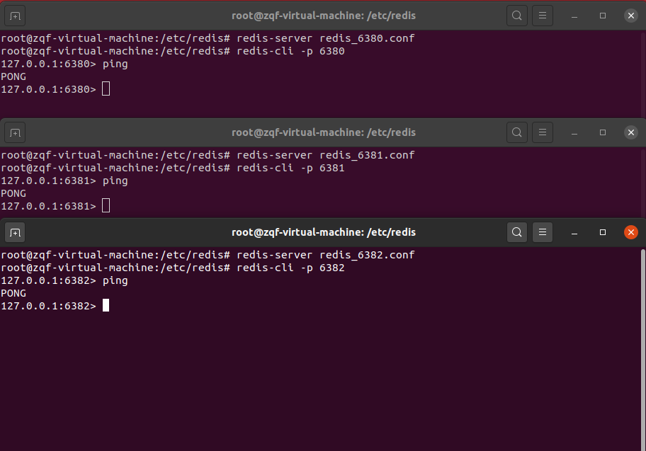

使用命令查询信息，配置从库

* info replication：查询当前库详细信息
* slaveof 主库IP 主库端口号：配置从库

配置完成后。当前三个库没有关系，均是主库，且无从库：

设置从库后：

从库跟随主库作相应的操作：

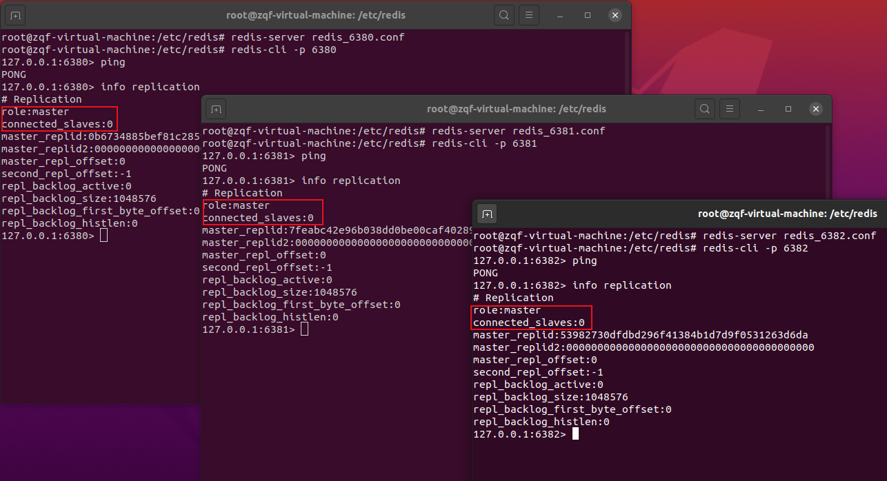

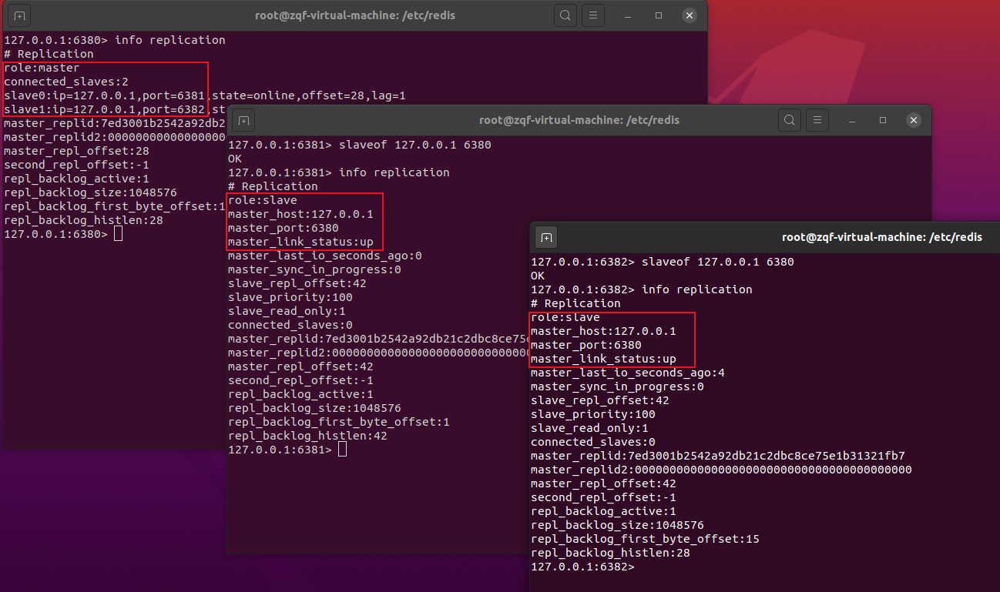

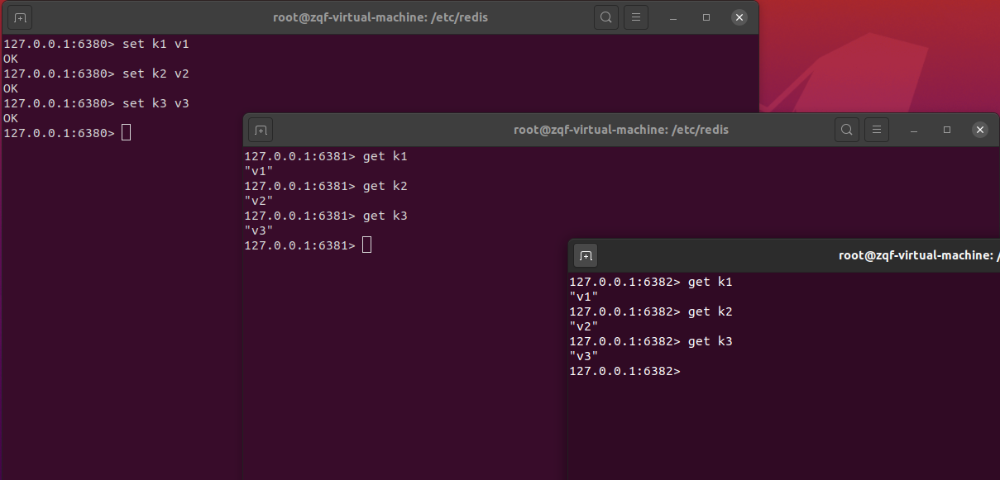

# 3. 常用三招

## 3.1 “一主二仆”

即上述配置过程所示

问题：

1. 切入点问题？slave1、slave2是从头开始复制还是从切入点开始复制?比如从k4进来，那之前的123是否也可以复制？

答：从头开始复制，123也可以复制

2. 从机是否可以写？

答：从机不可写，主机可写

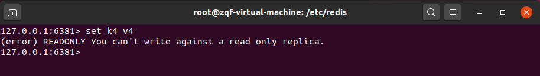

3. 主机 shutdown 后情况如何？从机是上位还是原地待命？

答：原地待命（咸鱼翻身还是咸鱼）

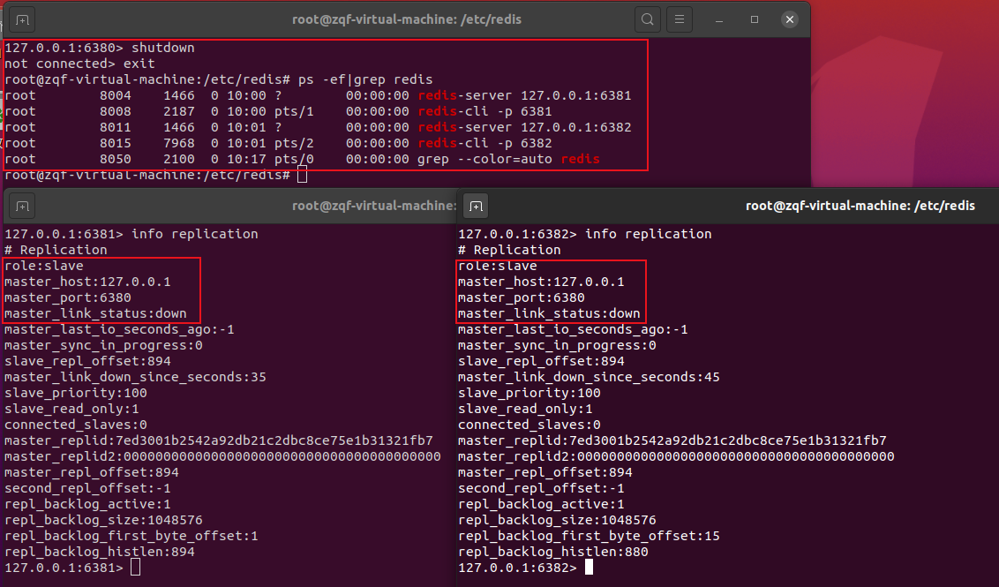

4. 主机又回来了后，主机新增记录，从机还能否顺利复制？

答：可以

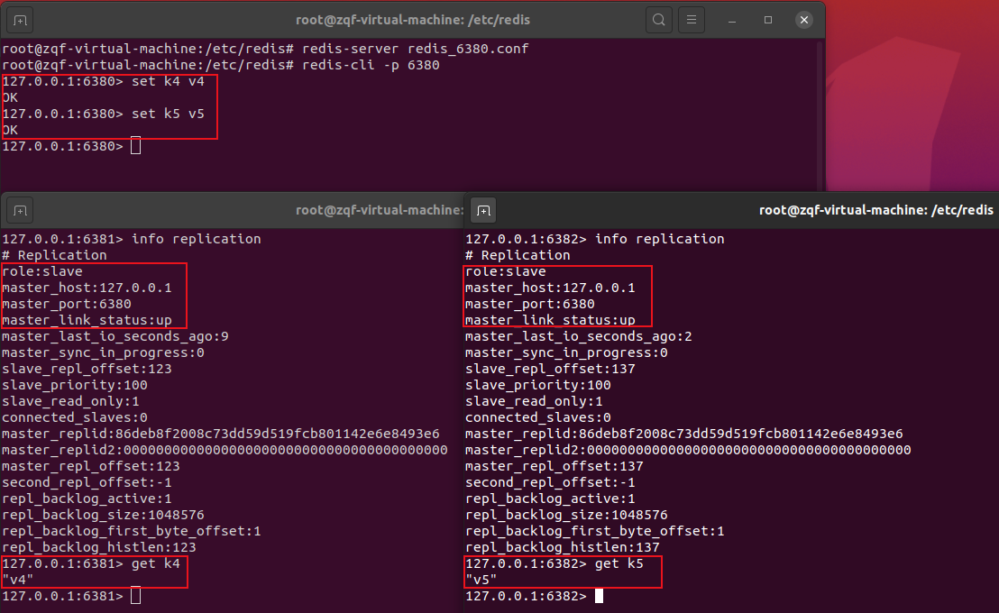

5. 其中一台从机down后情况如何？依照原有它能跟上大部队吗？

答：不能跟上，每次与master断开之后，都需要重新连接，除非你配置进redis.conf文件

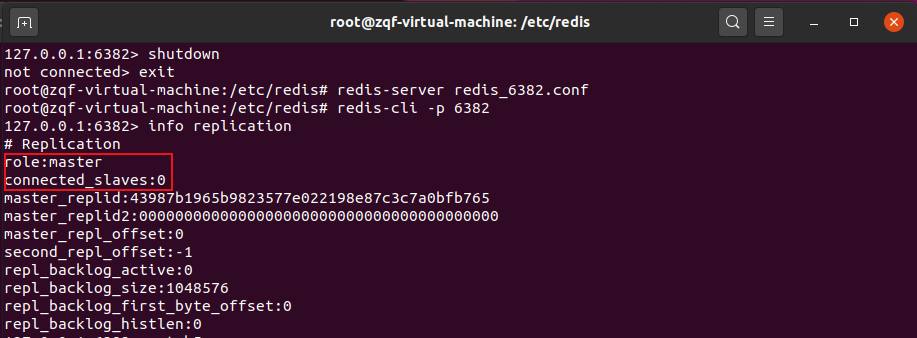

## 3.2 “薪火相传”

* 上一个Slave可以是下一个slave的Master，Slave同样可以接收其他 slaves的连接和同步请求，那么该slave作为了链条中下一个的master, 可以有效减轻master的写压力（奴隶的奴隶还是奴隶）
* 中途变更转向：会清除之前的数据，重新建立拷贝最新的

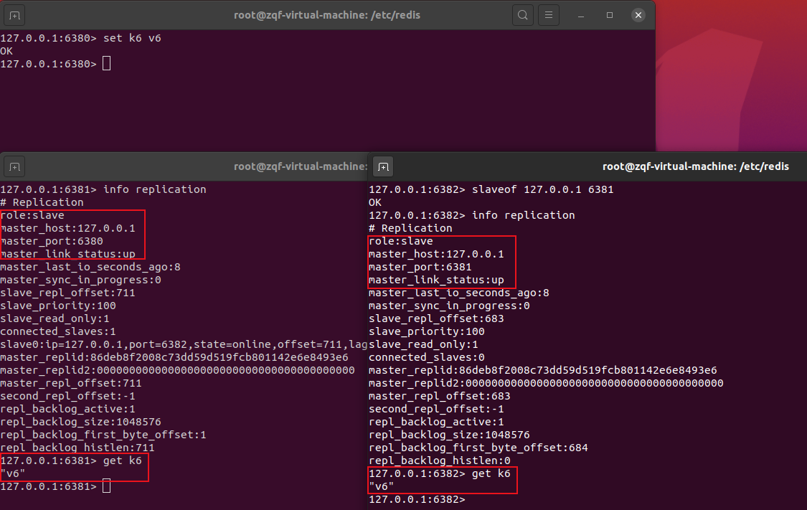

## 3.3 “反客为主”

slaveof no one：是当前数据库停止与其他数据库同步，转为主数据库

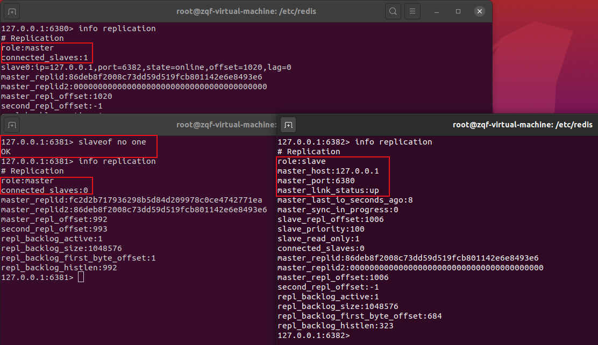

# 4. 复制原理

* slave 启动成功连接到 master 后会发送一个 sync 命令
* master 接到命令启动后台的存盘进程，同时收集所有接收到的用于修改数据集命令， 在后台进程执行完毕之后， master 将传送整个数据文件到 slave，以完成一次完全同步
* 全量复制： slave 服务在接收到数据库文件数据后，将其存盘并加载到内存中。
* 增量复制：master 继续将新的所有收集到的修改命令依次传给 slave，完成同步。但是只要是重新连接 master，一次完全同步(全量复制)将被自动执行

# 5. 哨兵模式（sentinel）

## 5.1 简介

使用一组 sentinel 监控多个 master，是反客为主的自动版，能够在后台监控主库的运行状态，如果主库宕机则采取投票的方式自动选取一个从库转换为主库

## 5.2 配置与使用

1. 新建 sentinel.conf 文件，并配置内容

**`sentinel monitor <master-group-name> <ip> <port> <quorum>`**

2. 使用**`redis-server sentinel.conf --sentinel`**命令启动哨兵

输出工作日志：

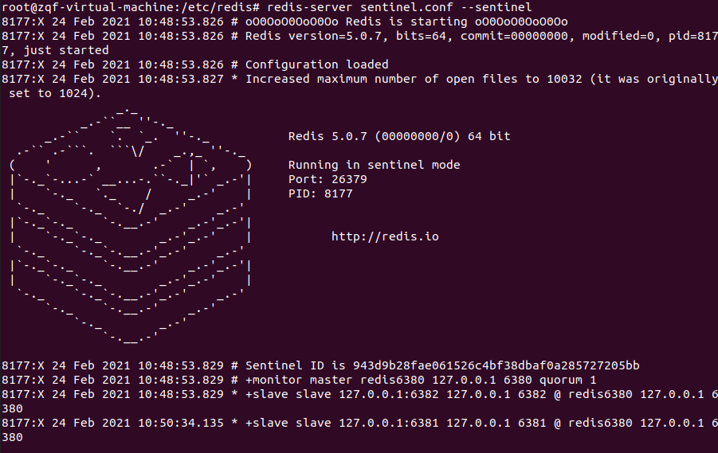

3. 演示主库宕机后的自动配置

端口号为6382的从库被自动选举为主库：

工作日志：

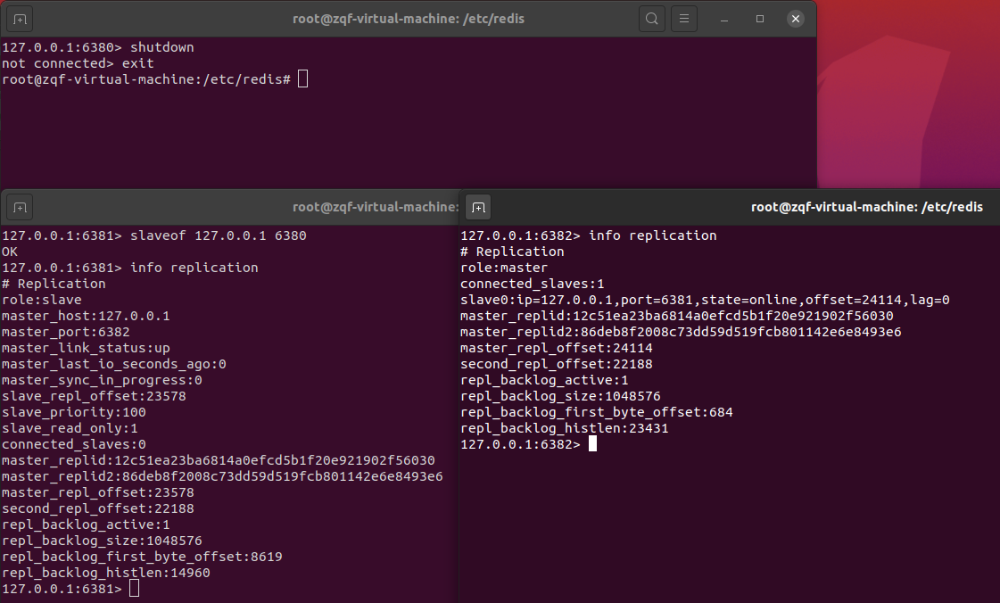

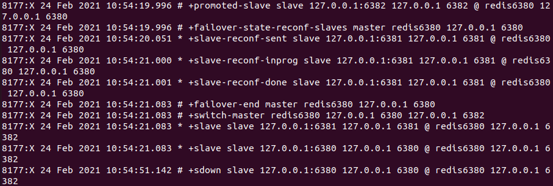

4. 原主库6380重新上线后沦为从库

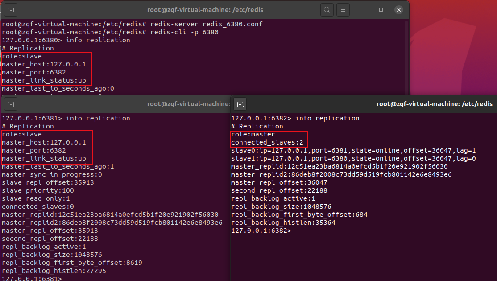

## 5.3 复制的缺点

由于所有的写操作都是先在 Master 上操作，然后同步更新到 slave 上，所以从 Master 同步到 Slave 机器有一定的延迟，当系统很繁忙的时候，延迟问题会更加严重，Slave 机器数量的增加也会使这个问题更加严重
