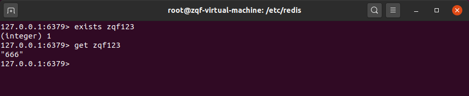

# 1. jedis 依赖

从 redis_windows.conf 启动 redis-server

```xml
        <dependency>
            <groupId>redis.clients</groupId>
            <artifactId>jedis</artifactId>
            <version>3.5.1</version>
        </dependency>
```

连通性测试：

```java
    @Test
    public void testPing() {
        System.out.println(jedis.ping()); // PONG
    }
```

# 2. 基本数据类型测试

```java
@Test
    public void testKeys() {
        Set<String> keys = jedis.keys("*");
        for (String key: keys) {
            System.out.println(key); // k1,k2
        }
        System.out.println(jedis.exists("k1")); // true
        System.out.println(jedis.ttl("k2")); // -1
    }

    @Test
    public void testString() {
        jedis.set("k3", "hello");
        System.out.println(jedis.get("k3")); // hello
        jedis.append("k3", "world");
        System.out.println(jedis.get("k3")); // helloworld
        jedis.mset("k4", "v4", "k5", "v5", "k6", "v6");
        System.out.println(jedis.mget("k4", "k5", "k6")); // [v4, v5, v6]
    }

    @Test
    public void testList() {
        jedis.lpush("list", "v1", "v2", "v3", "v4", "v5");
        List<String> list = jedis.lrange("list", 0, -1);
        for (String val: list) {
            System.out.println(val); // v5, v4, v3, v2, v1
        }
    }

    @Test
    public void testSet() {
        jedis.sadd("set", "a", "b", "1", "2");
        Set<String> set = jedis.smembers("set");
        for (String val: set) {
            System.out.println(val); // 2, 1, a, b
        }
        jedis.srem("set", "a", "1");
        System.out.println(jedis.smembers("set").size()); // 2
    }

    @Test
    public void testHash() {
        jedis.hset("hash", "username", "zqf");
        jedis.hset("hash", "password", "123");
        System.out.println(jedis.hget("hash", "username")); // zqf
        Map<String, String> map = new HashMap<>();
        map.put("tele", "18888888888");
        map.put("address", "earth");
        map.put("email", "zqf@qq.com");
        jedis.hmset("hash02", map);
        List<String> list = jedis.hmget("hash02", "tele", "address");
        for (String val: list) {
            System.out.println(val); // 18888888888, earth
        }
    }

    @Test
    public void testZset() {
        jedis.zadd("zset01", 60d, "v1");
        jedis.zadd("zset01", 70d, "v2");
        jedis.zadd("zset01", 80d, "v3");
        Set<String> set = jedis.zrange("zset01", 0, -1);
        for (String val: set) {
            System.out.println(val); // v1, v2, v3
        }
    }
```

# 3. 事务

```java
@Test
    public void testTransaction_exec() {
        Transaction transaction = jedis.multi();
        transaction.set("k11", "v11");
        transaction.set("k22","v22");
        transaction.set("k33", "v33");
        transaction.exec();
        System.out.println(jedis.get("k11")); // v11
        System.out.println(jedis.get("k22")); // v22
        System.out.println(jedis.get("k33")); // v33
    }

    @Test
    public void testTransaction_discard() {
        Transaction transaction = jedis.multi();
        transaction.set("k11", "v111");
        transaction.set("k22","v222");
        transaction.set("k33", "v333");
        transaction.discard();
        System.out.println(jedis.get("k11")); // v11
        System.out.println(jedis.get("k22")); // v22
        System.out.println(jedis.get("k33")); // v33
    }

    @Test
    public void testTransaction_watch01() {
        jedis.set("balance", "100");
        jedis.set("debt", "0");
        jedis.watch("balance");
        Transaction transaction = jedis.multi();
        transaction.decrBy("balance", 20);
        transaction.incrBy("debt", 20);
        transaction.exec();
        jedis.unwatch();
        System.out.println(jedis.get("balance")); // 80
        System.out.println(jedis.get("debt")); // 20
    }

    @Test
    public void testTransaction_watch02() throws InterruptedException {
        jedis.set("balance", "100");
        jedis.set("debt", "0");
        jedis.watch("balance");
        Thread.sleep(5000); // 在此时间内在另一客户端上执行 set balance 200
        Transaction transaction = jedis.multi();
        transaction.decrBy("balance", 20);
        transaction.incrBy("debt", 20);
        transaction.exec();
        jedis.unwatch();
        System.out.println(jedis.get("balance")); // 200
        System.out.println(jedis.get("debt")); // 0
    }
```

# 4. 主从复制

```java
    @Test
    public void testMS() {
        Jedis jedis_M = new Jedis("192.168.0.107", 6379);
        Jedis jedis_S = new Jedis("192.168.0.107", 6380);
        jedis_S.slaveof("192.168.0.107", 6379);
        jedis_M.set("123", "123");
        System.out.println(jedis_S.get("123")); // 123 -- 会有延迟
    }
```


# 5. JedisPool

工具类，其余[具体参数设置](https://www.cnblogs.com/xiaozhang666/p/12221448.html)

```java
import redis.clients.jedis.Jedis;
import redis.clients.jedis.JedisPool;
import redis.clients.jedis.JedisPoolConfig;

public class JedisPoolUtil {

    private static volatile JedisPool jedisPool = null;

    private JedisPoolUtil() {
    }

    public static JedisPool getJedisPoolInstance() {
        if (null == jedisPool) {
            synchronized (JedisPoolUtil.class) {
                if (null == jedisPool) {
                    JedisPoolConfig poolConfig = new JedisPoolConfig();
                    poolConfig.setMaxTotal(1000);
                    poolConfig.setMaxIdle(32);
                    poolConfig.setMaxWaitMillis(100 * 1000);
                    poolConfig.setTestOnBorrow(true);

                    jedisPool = new JedisPool(poolConfig, "192.168.0.107", 6379);
                }
            }
        }
        return jedisPool;
    }

    public static void release(JedisPool jedisPool, Jedis jedis) {
        if (null != jedis) {
            Jedis jedis2 = null;
            try {
                jedis2 = jedisPool.getResource();
            } finally {
                jedis2.close();
            }
        }
    }
}
```

测试

```
    @Test
    public void tesJedisPool() {
        JedisPool jedisPool = JedisPoolUtil.getJedisPoolInstance();
        Jedis jedis = null;

        try {
            jedis = jedisPool.getResource();
            jedis.set("zqf123", "666");

        } catch (Exception e) {
            e.printStackTrace();
        } finally {
            JedisPoolUtil.release(jedisPool, jedis);
        }
    }
```

结果


