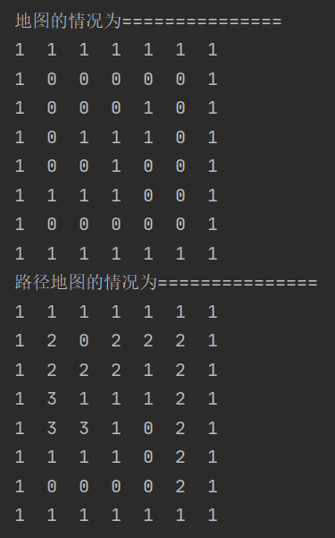

# 1. 递归的应用场景

迷宫问题(回溯)，递归(Recursion)

# 2. 递归的概念

**递归的方法就是自己调用自己，每次调用时传入不同的变量。**

递归有助于编程者解决复杂的问题，同时可以让代码变得简洁。

# 3. 递归的调用机制


# 4. 递归能解决的问题

1. 数学问题：8皇后问题，汉诺塔，阶乘问题，迷宫问题，球和篮子问题
2. 算法：快排，归并排序，二分查找。分治算法
3. 用栈解决的问题-->递归代码（整洁）

# 5. 递归的规则

1. 执行一个方法时，就会创建一个新的受保护的独立空间(栈空间)
2. 方法的局部变量是独立的，不会相互影响
3. 如果方法中使用的是引用类型变量，则会共享该引用类型的数据
4. **递归必须向退出递归的条件逼近**，否则就会无线递归，出现StackOverflowError
5. 当一个方法执行完毕或者遇到return，就会返回，遵守**谁调用就将结果返回给谁**的规则。同时当方法执行完毕或者返回时，该方法也就执行完毕。

# 6. 递归——迷宫问题

代码实现：

```java
package DataStructures.递归;

/**
 * 说明：
 * 1. map表示地图
 * 2. i，j表示小球出发的起始位置
 * 3. 如果小球到达右下角位置(map[6][5])，证明走出迷宫
 * 4. 约定：map[i][j]为0表示该点没有走过；为1表示墙；为2表示通路可走；为3表示该点已经走过，但走不通
 * 5. 策略：下 -> 右 -> 上 -> 左
 */
 
public class MiGong {
    public static void main(String[] args) {
        // 创建二维数组，模拟迷宫
        int[][] map = new int[8][7];
        for (int i = 0; i < 7; i++) {
            map[0][i] = 1;
            map[7][i] = 1;
        }
        for (int i = 0; i < 8; i++) {
            map[i][0] = 1;
            map[i][6] = 1;
        }
        map[5][0] = 1;
        map[5][1] = 1;
        map[5][2] = 1;
        map[5][3] = 1;
        map[4][3] = 1;
        map[3][3] = 1;
        map[3][2] = 1;
        map[3][4] = 1;
        map[2][4] = 1;

        // 输出地图
        System.out.println("地图的情况为===============");
        for (int i = 0; i < 8; i++) {
            for (int j = 0; j < 7; j++) {
                System.out.print(map[i][j] + "  ");
            }
            System.out.println();
        }

        // 使用递归找路
        findWay(map, 1, 1);

        // 输出新的路径地图
        System.out.println("路径地图的情况为===============");
        for (int i = 0; i < 8; i++) {
            for (int j = 0; j < 7; j++) {
                System.out.print(map[i][j] + "  ");
            }
            System.out.println();
        }
    }

    private static boolean findWay(int[][] map, int i, int j) {
        if (map[6][5] == 2) { // 表示小球已经找到出口
            return true;
        } else {
            if (map[i][j] == 0) { // 表示该点还没走过
                map[i][j] = 2;
                if (findWay(map, i+1, j)) {
                    return true;
                } else if (findWay(map, i, j+1)) {
                    return true;
                } else if (findWay(map, i-1, j)) {
                    return true;
                } else if (findWay(map, i, j-1)) {
                    return true;
                } else {
                    map[i][j] = 3;
                    return false;
                }
            } else {
                return false;
            }
        }
    }
}

```

结果：



讨论：小球的路径，和程序员设置的**寻路策略**有关：即和找路的上下左右顺序有关

# 7. 递归——八皇后问题(回溯算法)

八皇后问题：在8✖8的国际象棋棋盘上摆放八个皇后，使其不能相互攻击，即任意两个皇后不能处于同一行、同一列或者同一斜线上，问共有多少种摆法。

思路分析：

1. 首先把第一个皇后放到第一行第一列
2. 第二个皇后放到第二行第一列，判断是否符合规则。若不符合，继续放在第二列、第三列……依次把所有列都放完，找到一个合适的位置
3. 继续放第三个皇后，依次尝试第一列、第二列……直到第八个皇后放在一个符合规则的位置上，得到一个正确解
4. 当得到一个正确解时，栈回退到上一个栈，开始回溯。找到第一个皇后放在第一列的所有符合规则的解
5. 将第一个皇后放在第二列，继续循环执行前四步
代码实现：

```java
package DataStructures.递归;

public class Queen8 {

    // 定义一个max表示共有多少个皇后
    int max = 8;
    // 定义一个数组表示皇后放置的位置
    int[] array = new int[max];
    // 定义两个数记录结果数和计算次数
    static int count = 0;
    static int judgeCount = 0;

    public static void main(String[] args) {
        Queen8 queen8 = new Queen8();
        queen8.check(0);
        System.out.printf("共有%d种解法", count);
        System.out.printf("一共判断冲突的次数%d次", judgeCount);
    }

    // 编写一个方法，放置第n个皇后
    private void check(int n) {
        if (n == max) {
            print();
            return;
        }

        // 依次放入皇后，并判断是否冲突
        for (int i = 0; i < max; i++) {
            // 把当前皇后放在第一列
            array[n] = i;
            // 判断当放置第n个皇后到i列时，是否冲突
            if (judge(n)) { // 若不冲突
                // 接着放置第n+1个皇后，开始递归
                check(n + 1);
            }
        }
    }

    // 当放置第n个皇后时，就去检测该皇后是否和前面已经摆放的皇后冲突
    private boolean judge(int n) {
        judgeCount ++;
        for (int i = 0; i < n; i++) {
            // array[i] == array[n]：判断第n个皇后是否和前面的n-1个皇后同列
            // Math.abs(n-i) == Math.abs(array[n]-array[i])：判断第n个皇后是否和前面的n-1个皇后同一斜线
            if (array[i] == array[n] || Math.abs(n-i) == Math.abs(array[n]-array[i])) {
                return false;
            }
        }
        return true;
    }

    // 输出皇后的摆放位置
    private void print() {
        count ++;
        for (int i = 0; i < array.length; i++) {
            System.out.print(array[i] + " ");
        }
        System.out.println();
    }

}

```

执行结果：

共有92种解法

判断冲突的次数15720次
