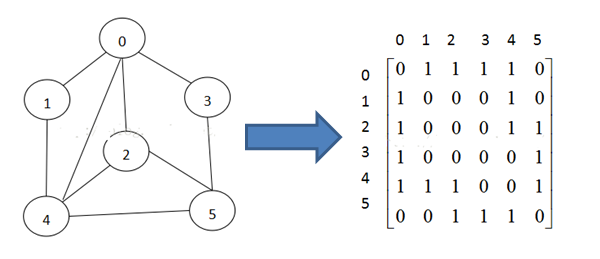
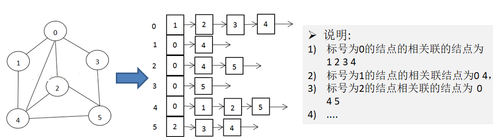
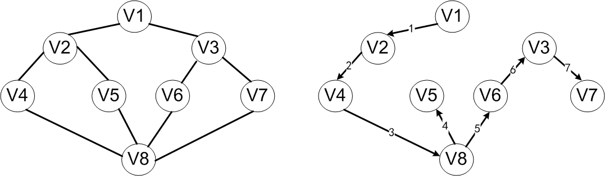
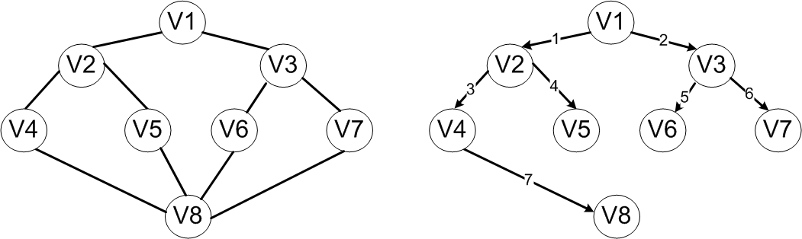
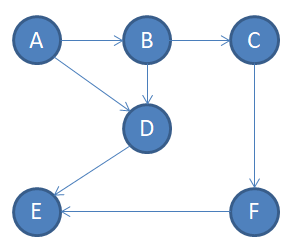
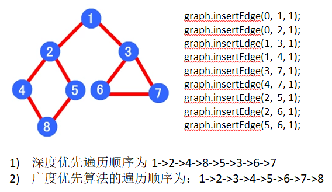

# 1. 图的基本介绍

## 1.1 为什么要有图？

* 线性表局限于一个直接前驱和直接后继的关系
* 树也只能有一个直接前驱也就是父节点
* 当我们需要表示多对多关系时，就用到了图

## 1.2 图的表示方式

### 二维数组表示(邻接矩阵)

邻接矩阵是表示图形中顶点之间相邻关系的矩阵，对于n个顶点的图而言，矩阵的row和col表示的是节点1到n



### 链表表示(邻接表)

邻接矩阵需要为每个顶点都分配n各边的空间，其中有很多边不存在，造成空间的一定损失

邻接表的实现只关心存在的边，不关心不存在的边，因此没有空间的浪费。邻接表由数组+链表构成



# 2. 图的代码实现

## 2.1 图的基本属性和方法

```java
public class Graph {
    private int[][] edges; // 存储图对应的邻接矩阵
    private ArrayList<String> vertexList; // 存储顶点集合
    private int numOfEdges; // 表示边的数目
    private boolean[] isVisited; // 记录某个节点是否被访问

    // 构造器：初始化邻接矩阵和顶点集合
    public Graph(int n) {
        edges = new int[n][n];
        vertexList = new ArrayList<>(n);
        numOfEdges = 0;
    }

    // ======================图中常用方法======================
    // 返回节点的个数
    public int getNumVertex() {
        return vertexList.size();
    }
    // 显示邻接矩阵
    public void showGraph() {
        for (int[] row: edges) {
            System.out.println(Arrays.toString(row));
        }
    }
    // 返回边的数目
    public int getNumOfEdges() {
        return numOfEdges;
    }
    // 返回节点i(下标)对应的数据
    public String getValueByIndex(int i) {
        return vertexList.get(i);
    }
    // 返回矩阵中某点的权值
    public int getWeight(int v1, int v2) {
        return edges[v1][v2];
    }
    // 插入节点
    public void insertVertex(String vertex) {
        vertexList.add(vertex);
    }
    // 添加边
    public void insertEdge(int v1, int v2, int weight) {
        edges[v1][v2] = weight;
        edges[v2][v1] = weight;
        numOfEdges ++;
    }
    // 获得第一个邻接节点的下标w
    public int getFirstNeighbor(int index) {
        for (int j = 0; j < vertexList.size(); j++) {
            if (edges[index][j] > 0) {
                return j;
            }
        }
        return -1;
    }
    // 根据前一个邻接节点的下标来获得下一个邻接节点
    public int getNextNeighbor(int v1, int v2) {
        for (int j = v2 + 1; j < vertexList.size(); j++) {
            if (edges[v1][j] > 0) {
                return j;
            }
        }
        return -1;
    }
}
```

## 2.2 深度优先遍历

### DFS基本思想

图的深度优先遍历类似于二叉树的深度优先遍历，其基本思想是：**从图中某个顶点v出发，访问此顶点，然后从v的未被访问的邻接点出发深度优先遍历图，直至图中所有和v有路径相通的顶点都被访问到。**

显然，这是一个递归的搜索过程。



以上图为例，假定V1是出发点，首先访问V1。这时两个邻接点V2、V3均未被访问，可以选择V2作为新的出发点，访问V2之后，再找到V2的未访问过的邻接点。同V2邻接的有V1、V4和V5，其中V1已经访问过了，可以选择V4作为新的出发点。重复上述搜索过程，继续依次访问V8、V5。访问V5之后，由于与V5相邻的顶点均已被访问过，搜索退回到V8，访问V8的另一个邻接点V6.接下来依次访问V3和V7，最后得到的访问序列为：V1→V2→V4→V8→V5→V6→V3→V7。

### DFS实现代码

```java
    // ======================深度优先遍历======================
    public void DFS(boolean[] isVisited, int i) {
        // 首先访问当前节点，输出
        System.out.print(getValueByIndex(i) + "->");
        // 将当前节点设置为已访问
        isVisited[i] = true;
        // 查找当前节点的第一个邻接节点w
        int w = getFirstNeighbor(i);
        while (w != -1) { // 若存在邻接节点
            if (!isVisited[w]) { // 且未访问过
                DFS(isVisited, w);
            }
            // 若已访问，则以i为当前节点，继续寻找i的下一个邻接节点(体现深度优先)
            w = getNextNeighbor(i, w);
        }
    }
    // 重载DFS，遍历搜有节点进行深度优先遍历(确保每一个节点都被访问到)
    public void DFS() {
        isVisited = new boolean[vertexList.size()];
        for (int i = 0; i< vertexList.size(); i++) {
            if (!isVisited[i]) {
                DFS(isVisited, i);
            }
        }
    }
```

## 2.3 广度优先遍历

### BFS基本思想

图的广度优先遍历算法是一个分层遍历的过程，和二叉树的广度优先遍历类似，其基本思想在于：**从图中的某一个顶点Vi触发，访问此顶点后，依次访问Vi的各个为层访问过的邻接点，然后分别从这些邻接点出发，直至图中所有顶点都被访问到。**



对于上图所示的无向连通图，若从顶点V1开始，则广度优先遍历的顶点访问顺序是：V1→V2→V3→V4→V5→V6→V7→V8

### BFS实现代码

```java
    // ======================广度优先遍历======================
    public void BFS(boolean[] isVisited, int i) {
        int u; // 表示队列的头节点对应下标
        int w; // 表示邻接节点w
        LinkedList queue = new LinkedList(); // 用一个队列记录节点访问的顺序
        // 访问节点，输出节点信息
        System.out.print(getValueByIndex(i) + "->");
        // 标记为已访问
        isVisited[i] = true;
        // 将节点加入队列
        queue.addLast(i);

        while (!queue.isEmpty()) {
            // 取出头节点下标
            u = (Integer) queue.removeFirst();
            // 得到第一个邻接节点的下标w
            w = getFirstNeighbor(u);

            while (w != -1) { // 若存在邻接节点
                if (!isVisited[w]) { // 且未访问过
                    System.out.print(getValueByIndex(w) + "->");
                    isVisited[w] = true; // 标记为已访问
                    queue.addLast(w); // 入队列
                }
                // 若已访问，则以u为当前节点，继续寻找u的下一个邻接节点(体现广度优先)
                w = getNextNeighbor(u, w);
            }
        }
    }
    // 重载BFS，遍历搜有节点进行广度优先遍历(确保每一个节点都被访问到)
    public void BFS() {
        isVisited = new boolean[vertexList.size()];
        for (int i = 0; i< vertexList.size(); i++) {
            if (!isVisited[i]) {
                BFS(isVisited, i);
            }
        }
    }
```

## 2.4 测试



```java
package DataStructures.图;

public class GraphDemo {
    public static void main(String[] args) {
        // 构造邻接矩阵
        Graph graph = new Graph(6);
        graph.insertVertex("A");
        graph.insertVertex("B");
        graph.insertVertex("C");
        graph.insertVertex("D");
        graph.insertVertex("E");
        graph.insertVertex("F");
        graph.insertEdge(0, 1, 1);
        graph.insertEdge(0, 3, 1);
        graph.insertEdge(1, 2, 1);
        graph.insertEdge(1, 3, 1);
        graph.insertEdge(2, 5, 1);
        graph.insertEdge(3, 4, 1);
        graph.insertEdge(4, 5, 1);
        graph.showGraph();

        // DFS
        graph.DFS(); // A->B->C->F->E->D->
        System.out.println();
        // BFS
        graph.BFS(); // A->B->D->C->E->F->
    }
}
```

# 3. DFS和BFS的比较


