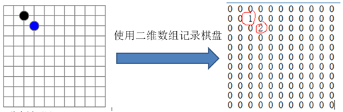
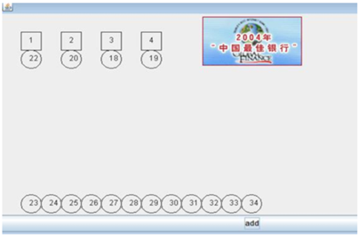
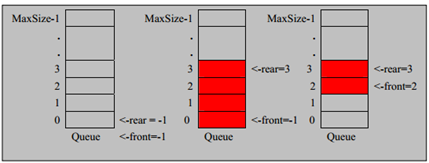

# 1. 稀疏数组

## 1.1 实际需求

五子棋程序中，需要存盘退出和续上盘的功能需求

该二维数组很多默认值为0，所以记录了许多没有意义的数据


## 1.2 应用场景

**当一个二维数组中大部分元素为零或者相同的数值时，可以用稀疏数组来保存**

## 1.3 转换思路

二维数组转稀疏数组

* 遍历原始的二维数组，得到有效数据的个数sum
* 根据sum创建稀疏数组sparseArr int[sum + 1][3]
* 将二维数组的有效数据存入稀疏数组
稀疏数组转二维数组

* 读取稀疏数组的第一行，根据第一行的数据，创建原始的二维数组
* 读取稀疏数组的后几行数据，赋值给原始的二维数组

## 1.4 代码实现(SparseArr.java)

```java
import java.io.*;

public class SparseArr {
    public static void main(String[] args) throws IOException {
        // 创建一个原始的二维数组 11 * 11
        // 0：没有棋子 1：黑子 2：白子
        int[][] chessArr = new int[11][11];
        chessArr[1][2] = 1;
        chessArr[2][3] = 2;
        chessArr[4][5] = 2;
        // 查看原始二维数组
        System.out.println("原始二维数组：");
        printChessArr(chessArr);

        // *****二维数组转换为稀疏数组*****
        int[][] sparseArr = chessTosparse(chessArr);
        System.out.println("二维数组转换稀疏数组：");
        printSparseArr(sparseArr);

        // *****稀疏数组转换为二维数组*****
        int[][] chessArr1 = sparseTochess(sparseArr);
        System.out.println("稀疏数组转换二维数组：");
        printChessArr(chessArr1);

        // *****课后练习*****
        // 1.在前面的基础上，将稀疏数组保存在磁盘上，如：map.data
        File file = new File("map.data");
        FileWriter out = new FileWriter(file);
        for (int i = 0; i < 4; i++) {
            for (int j = 0; j < 3; j++) {
                out.write(sparseArr[i][j] + "\t");
            }
            out.write("\r\n");
        }
        out.close();
        // 2.恢复原来的数组时，读取map.data
        int row = 0;
        int[][] sparseArr1 = new int[4][3];
        BufferedReader in = new BufferedReader(new FileReader(file));
        String line;
        while ((line = in.readLine()) != null) {
            String[] datas = line.split("\t");
            sparseArr1[row][0] = Integer.parseInt(datas[0]);
            sparseArr1[row][1] = Integer.parseInt(datas[1]);
            sparseArr1[row][2] = Integer.parseInt(datas[2]);
            row++;
        }

        System.out.println("从文件中读取的稀疏数组为：");
        printSparseArr(sparseArr1);
        int[][] chessArr2 = sparseTochess(sparseArr1);
        System.out.println("从文件中转换的二维数组为：");
        printChessArr(chessArr2);
    }

    public static int[][] chessTosparse(int[][] chessArr) {
        // *****二维数组转换为稀疏数组*****
        // 1.遍历二维数组，得到非零数据的个数
        int sum = 0;
        for (int[] i : chessArr) {
            for (int j : i) {
                if (j != 0) {
                    sum++;
                }
            }
        }
        // 2.创建对应的稀疏数组
        int[][] sparseArr = new int[sum + 1][3];
        sparseArr[0][0] = sparseArr[0][1] = 11;
        sparseArr[0][2] = sum;
        int count = 1;
        for (int i = 0; i < 11; i++) {
            for (int j = 0; j < 11; j++) {
                if (chessArr[i][j] != 0) {
                    sparseArr[count][0] = i;
                    sparseArr[count][1] = j;
                    sparseArr[count][2] = chessArr[i][j];
                    count++;
                }
            }
        }
        // 3.完成赋值并返回
        return sparseArr;
    }

    public static void printSparseArr(int[][] sparseArr) {
        // *****查看稀疏数组*****
        for (int i = 0; i < sparseArr.length; i++) {
            System.out.printf("%d\t%d\t%d\t", sparseArr[i][0], sparseArr[i][1], sparseArr[i][2]);
            System.out.println();
        }
    }

    public static int[][] sparseTochess(int[][] sparseArr) {
        // *****稀疏数组转换为二维数组*****
        // 1.读取稀疏数组第一行，创建二维数组
        int[][] chessArr = new int[sparseArr[0][0]][sparseArr[0][1]];
        // 2.读取后几行，进行赋值
        for (int i = 1; i < sparseArr.length; i++) {
            chessArr[sparseArr[i][0]][sparseArr[i][1]] = sparseArr[i][2];
        }
        // 3.转换完成并返回
        return chessArr;
    }

    public static void printChessArr(int[][] chessArr) {
        // *****查看二维数组*****
        for (int[] i : chessArr) {
            for (int j : i) {
                System.out.printf("%d\t", j);
            }
            System.out.println();
        }
    }
}
```

---

# 2. 队列

## 2.1 应用场景

银行排队案例：



## 2.2 队列

* 队列是一个有序列表，可以用数组或者链表来实现
* 队列遵循先入先出的原则

示意图：



## 2.3 数组模拟队列

* 队列本身是有序列表，若使用数组的结构来存储队列的数据，则队列数组的声明如下图，其中maxSize是该队列的最大容量。
* 因为队列的输入输出是分别从前后端处理的，因此需要两个变量front和rear分别记录队列前后端的下标，front会随着数据输出而改变，而rear则是随着数据输入而改变。
* 将数据存入队列的方法称"addQueue"，addQueue的处理需要有两个步骤：    * 将尾部指针往后移：rear + 1，**当front == rear时为空**
    * 若尾部指针rear小于队列的最大下标maxSize - 1时，可以存入数据
    
    
    **当rear == maxSize - 1时，队列满**
### 代码实现(ArrayQueueDemo.java)

```java
import java.util.Scanner;

public class ArrayQueueDemo {
    public static void main(String[] args) {
        ArrayQueue queue = new ArrayQueue(3);
        char key = ' ';
        Scanner sc = new Scanner(System.in);
        boolean loop = true;

        while (loop) {
            System.out.println("s(show)：显示队列");
            System.out.println("a(add)：添加数据");
            System.out.println("g(get)：获取数据");
            System.out.println("h(head)：显示头数据");
            System.out.println("e(exit)：退出程序");
            System.out.println("------------------------");

            key = sc.next().charAt(0);

            switch (key) {
                case 's':
                    queue.showQueue();
                    break;
                case 'a':
                    System.out.println("请输入要存入的数据：");
                    int a = sc.nextInt();
                    queue.addQueue(a);
                    break;
                case 'g':
                    try {
                        int res = queue.getQueue();
                        System.out.printf("取出的数据是%d\n", res);
                    } catch (Exception e) {
                        System.out.println(e.getMessage());
                    }
                    break;
                case 'h':
                    try {
                        int res = queue.headQueue();
                        System.out.printf("头数据为%d\n", res);
                    } catch (Exception e) {
                        System.out.println(e.getMessage());
                    }
                    break;
                case 'e':
                    sc.close();
                    loop = false;
                    break;
            }
        }
        System.out.println("程序已退出");
    }
}

class ArrayQueue {
    private int maxSize; // 设置数组的最大容量
    private int front; // 队列头指针
    private int rear; // 队列尾指针
    private int[] arr; // 该数组用于存放数据，模拟队列
    // 创建队列的构造器
    public ArrayQueue(int arrMaxSize) {
        maxSize = arrMaxSize;
        front = -1;
        rear = -1;
        arr = new int[maxSize];
    }
    // 判断队列是否为空
    public boolean isFull() {
        return rear == maxSize - 1;
    }
    // 判断队列是否满
    public boolean isEmpty() {
        return rear == front;
    }
    // 添加数据到队列
    public void addQueue(int n) {
        // 首先判断队列是否为满
        if(isFull()) {
            System.out.println("队列满，不能加入数据！");
            return;
        }
        // 若不为空，尾指针后移，将数据存入
        rear ++;
        arr[rear] = n;
    }
    // 从队列中取出数据
    public int getQueue() {
        // 判断队列是否为空
        if (isEmpty()) {
            throw new RuntimeException("队列空，不能读取数据！");
        }
        // 若不为空，头指针后移，将数据输出
        front ++;
        return arr[front];
    }
    // 获取头数据(不是取出！)
    public int headQueue() {
        if (isEmpty()) {
            throw new RuntimeException("队列空，不能读取数据！");
        }
        return arr[front + 1];
    }
    // 展示队列
    public void showQueue() {
        // 判断是否为空
        if (isEmpty()) {
            System.out.println("队列为空，没有数据");
            return;
        }
        // 循环遍历，格式化输出
        for (int i = 0; i < arr.length; i++) {
            System.out.printf("arr[%d] = [%d]\n", i, arr[i]);
        }
    }
}
```

## 2.4 数组模拟环形队列

* front指向队列的第一个元素，也就是说arr[front]就是队列的第一个元素，**front初始值为0**
* rear指向队列最后一个元素的后一个位置，采用rear指向的位置空间作为一个约定，该位置常变，**rear初始值为0**
* **队列满条件：(rear + 1) % maxsize = front**
* **队列空条件：rear == front**
* 队列中**有效数据个数：(rear + maxsize - front) % maxsize**，队列中最大有效数据个数为maxsize - 1
### 代码实现(ArrayCircleQueueDemo.java)

```java
import java.util.Scanner;

public class ArrayCircleQueueDemo {
   public static void main(String[] args) {
       CircleArray queue = new CircleArray(5);
       char key = ' ';
       Scanner sc = new Scanner(System.in);
       boolean loop = true;

       while (loop) {
           System.out.println("s(show)：显示队列");
           System.out.println("a(add)：添加数据");
           System.out.println("g(get)：获取数据");
           System.out.println("h(head)：显示头数据");
           System.out.println("e(exit)：退出程序");
           System.out.println("------------------------");

           key = sc.next().charAt(0);

           switch (key) {
               case 's':
                   try {
                       queue.showQueue();
                   } catch (Exception e) {
                       System.out.println(e.getMessage());
                   }
                   break;
               case 'a':
                   System.out.println("请输入要存入的数据：");
                   int a = sc.nextInt();
                   queue.addQueue(a);
                   break;
               case 'g':
                   try {
                       int res = queue.getQueue();
                       System.out.printf("取出的数据是%d\n", res);
                   } catch (Exception e) {
                       System.out.println(e.getMessage());
                   }
                   break;
               case 'h':
                   try {
                       int res = queue.headQueue();
                       System.out.printf("头数据为%d\n", res);
                   } catch (Exception e) {
                       System.out.println(e.getMessage());
                   }
                   break;
               case 'e':
                   sc.close();
                   loop = false;
                   break;
           }
       }
       System.out.println("程序已退出");
   }
}

class CircleArray {
   private int maxSize;
   private int front; // 队列头指针
   private int rear; // 队列尾指针
   private int[] arr; // 该数组用于存放数据，模拟队列

   public CircleArray(int arrMaxSize) {
       maxSize = arrMaxSize;
       arr = new int[maxSize];
   }

   public boolean isFull() {
       return (rear + 1) % maxSize == front;
   }

   public boolean isEmpty() {
       return rear == front;
   }

   public void addQueue(int n) {
       if (isFull()) {
           System.out.println("队列已满，无法加入");
           return;
       }
       arr[rear] = n;
       rear = (rear + 1) % maxSize;
   }

   public int getQueue() {
       if (isEmpty()) {
           throw new RuntimeException("队列为空！");
       }
       int value = arr[front];
       front = (front + 1) % maxSize;
       return value;
   }

   public void showQueue() {
       if (isEmpty()) {
           throw new RuntimeException("队列为空！");
       }
       for (int i = front; i < front + size(); i++) {
           System.out.printf("arr[%d]=%d\n", i % maxSize, arr[i % maxSize]);
       }
   }

   public int headQueue() {
       if (isEmpty()) {
           throw new RuntimeException("队列为空！");
       }
       return arr[front];
   }

   public int size() {
       return (rear + maxSize - front) % maxSize;
   }
}
```
