# 1. 为什么需要树结构？

## 1.1 数组存储方式的分析

优点：通过**下标访问元素**，速度快。对于有序数组，还可以使用**二分查找**提高检索速度。

缺点：如果要检索具体某一个值，或者插入值(按一定顺序)会**整体移动**，效率较低。

## 1.2 链式存储方式的分析

优点：在一定程度上对数组存储方式有优化(比如：插入一个数值节点，只需要将插入节点链接到链表中即可，删除效率也很好)

缺点：在进行检索时，效率仍然较低(比如：检索某一个值，需要从头节点开始遍历)

## 1.3 数存储方式的分析

能够提高数据存储、读取的效率，比如利用二叉排序树(Binary Sort Tree)，既可以保证数据的检索速度，同时也可以保证数据的插入、删除和修改的速度。

# 2. 二叉树

## 2.1 二叉树相关概念

1. 二叉树（BinaryTree）：每个节点最多有两个分支（分支的度小于2）的树结构，可为空树，如下所示。

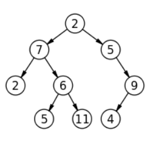

2. 完全二叉树（Complete Binary Tree）：在一棵二叉树中，除了最后一层，都是满的，并且最后一层或者是满的，或者是右边缺少连续若干节点，成为完全二叉树，如图所示：

具有k个节点的完全二叉树深度为log2(k)+1

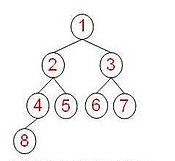

3. 满二叉树(Full Tree):一棵深度为k，并且有(2^k - 1)个节点的二叉树，成为满二叉树，如图所示：

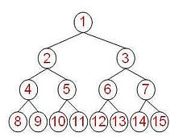

## 2.2 二叉树的遍历

### 说明

* 前序遍历：先输出父节点，再遍历左子树和右子树

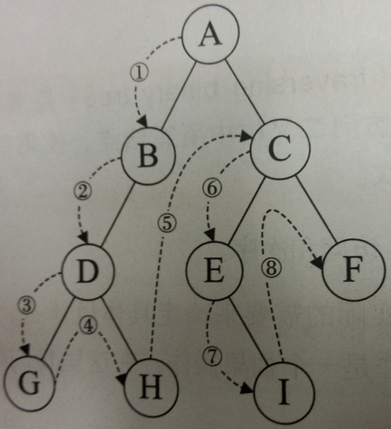

* 中序遍历：先遍历左子树，再输出父节点，再遍历右子树

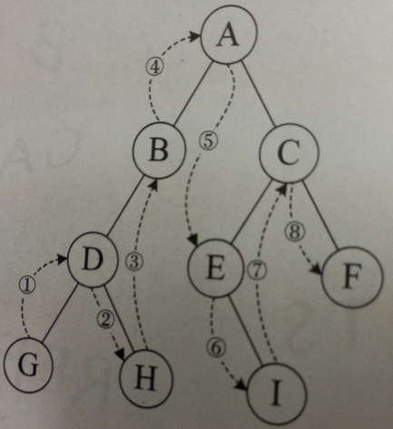

* 后序遍历：先遍历左子树，在遍历右子树，最后输出父节点

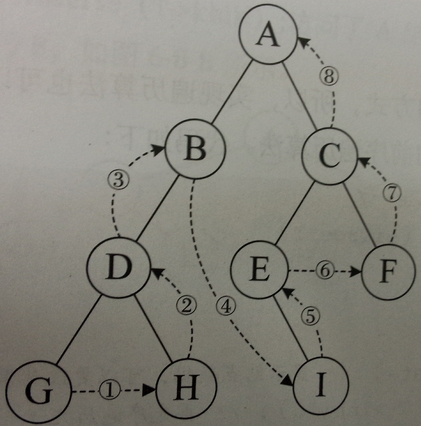
小结：看输出父节点的顺序，确定是前序中序还是后序

### 代码实现

测试用二叉树图示：

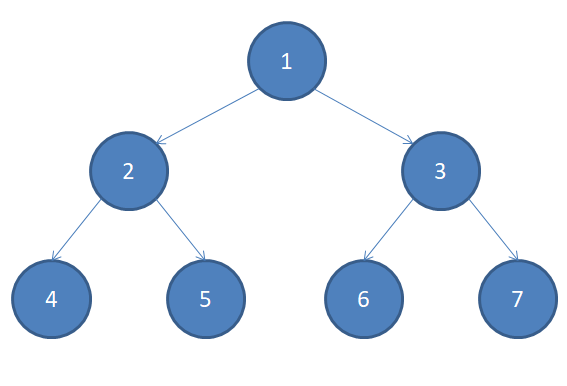

HeroNode类：

```java
package DataStructures.树.二叉树;

class HeroNode {
    private int no;
    private String name;
    private HeroNode left;
    private HeroNode right;

    // 构造器
    public HeroNode(int no, String name) {
        this.no = no;
        this.name = name;
    }

    // toString
    @Override
    public String toString() {
        return "HeroNode{" +
                "no=" + no +
                ", name='" + name + '\'' +
                '}';
    }

    // get/set
    public void setNo(int no) {
        this.no = no;
    }
    public void setName(String name) {
        this.name = name;
    }
    public void setLeft(HeroNode left) {
        this.left = left;
    }
    public void setRight(HeroNode right) {
        this.right = right;
    }
    public int getNo() {
        return no;
    }
    public String getName() {
        return name;
    }
    public HeroNode getLeft() {
        return left;
    }
    public HeroNode getRight() {
        return right;
    }

    // 前序遍历
    public void preOrder() {
        System.out.println(this); // 先输出父节点
        if (this.left != null) { // 递归向左子树前序遍历
            this.left.preOrder();
        }
        if (this.right != null) { // 递归向右子树前序遍历
            this.right.preOrder();
        }
    }

    // 中序遍历
    public void infixOrder() {
        if (this.left != null) { // 递归向左子树中序遍历
            this.left.infixOrder();
        }
        System.out.println(this); // 中间输出父节点
        if (this.right != null) { // 递归向右子树中序遍历
            this.right.infixOrder();
        }
    }

    // 后序遍历
    public void postOrder() {
        if (this.left != null) { // 递归向左子树后序遍历
            this.left.postOrder();
        }
        if (this.right != null) { // 递归向右子树后序遍历
            this.right.postOrder();
        }
        System.out.println(this); // 后序输出父节点
    }
}

```

BinaryTree类：

```java
package DataStructures.树.二叉树;

public class BinaryTree {
    // 定义根节点
    private HeroNode root;
    // set
    public void setRoot(HeroNode root) {
        this.root = root;
    }
    // 前序遍历
    public void preOrder() {
        if (root != null) {
            this.root.preOrder();
        } else {
            System.out.println("二叉树为空，无法遍历");
        }
    }
    // 中序遍历
    public void infixOrder() {
        if (root != null) {
            this.root.infixOrder();
        } else {
            System.out.println("二叉树为空，无法遍历");
        }
    }
    // 后序遍历
    public void postOrder() {
        if (root != null) {
            this.root.postOrder();
        } else {
            System.out.println("二叉树为空，无法遍历");
        }
    }
}

```

BinaryTree测试类：

```java
package DataStructures.树.二叉树;

public class BinaryTreeDemo {
    public static void main(String[] args) {
        // 创建二叉树
        BinaryTree binaryTree = new BinaryTree();
        // 创建需要的节点
        HeroNode heroNode1 = new HeroNode(1, "宋江");
        HeroNode heroNode2 = new HeroNode(2, "吴用");
        HeroNode heroNode3 = new HeroNode(3, "卢俊义");
        HeroNode heroNode4 = new HeroNode(4, "林冲");
        HeroNode heroNode5 = new HeroNode(5, "关胜");
        HeroNode heroNode6 = new HeroNode(6, "杨志");
        HeroNode heroNode7 = new HeroNode(7, "武松");
        // 手动创建二叉树（后续学习递归创建）
        heroNode1.setLeft(heroNode2);
        heroNode1.setRight(heroNode3);
        heroNode2.setLeft(heroNode4);
        heroNode2.setRight(heroNode5);
        heroNode3.setLeft(heroNode6);
        heroNode3.setRight(heroNode7);
        binaryTree.setRoot(heroNode1);
        // 测试
        // 前序遍历
        System.out.println("=====前序遍历=====");
        binaryTree.preOrder(); // 1 -> 2 -> 4 -> 5 -> 3 -> 6 -> 7
        // 中序遍历
        System.out.println("=====中序遍历=====");
        binaryTree.infixOrder(); // 4 -> 2 -> 5 -> 1 -> 6 -> 3 -> 7
        // 后序遍历
        System.out.println("=====后序遍历=====");
        binaryTree.postOrder(); // 4 -> 5 -> 2 -> 6 -> 7 -> 3 -> 1
    }
}

```

## 2.3 二叉树的查找

### 思路分析

* 前序查找

    * 先判断当前节点的id值是否等于要查找的
    * 如果相等，则返回当前节点
    * 如果不等，则判断当前节点的左子节点是否为空，若不为空，则递归前序查找
    * 如果做地柜前需查找找到节点，接返回；否则继续判当前节点的右子节点是否为空，如果不空则继续向右递归前序查找

* 中序查找

    * 判断当前节点的左子节点是否为空，若不为空则递归中序查找
    * 若找到，则返回；若没有找到，就和当前节点相比较，若id相同，则返回当前节点，否则继续向右中序递归查找
    * 找到则返回，否则返回null

* 后续查找

    * 判断当前节点的左子节点是否为空，若不为空，则递归向左后序查找
    * 若找到，就返回；若没找到，则判断当前节点的右子节点是否为空，若非空，则递归向右后序查找
    * 若找到，就返回；若没找到，就与当前节点id比较，id相同则返回，不同就返回null
	
### 代码实现

HeroNode类：

```java
// 前序查找
    public HeroNode preOrderSearch(int id) {
        System.out.println("执行查找1次");
        if (this.no == id) { // 判断当前节点的id是否为所查找id
            return this; // 若是，则直接返回当前节点
        }
        HeroNode resNode = null; // 定义返回结果节点
        if (this.left != null) { // 向左递归前序查找
            resNode = this.left.preOrderSearch(id);
        }
        if (resNode != null) { // 若查到，则返回结果
            return resNode;
        }
        if (this.right != null) { // 若没查到，则继续向右递归前序查找
            resNode = this.right.preOrderSearch(id);
        }
        return resNode; // 返回结果
    }

    // 中序查找
    public HeroNode infixOrderSearch(int id) {
        HeroNode resNode = null; // 定义结果节点
        if (this.left != null) { // 如果当前节点左子节点不为空，则向左递归中序查找
            resNode = this.left.infixOrderSearch(id);
        }
        if (resNode != null) { // 若找到，直接返回
            return resNode;
        }
        System.out.println("执行查找1次");
        if (this.no == id) { // 比较当前节点是否为要查找的值
            return this; // 若是，返回当前节点
        }
        if (this.right != null) { // 如果当前节点的右子节点不为空，则向右递归中序查找
            resNode = this.right.infixOrderSearch(id);
        }
        return resNode; // 返回节点
    }

    // 后序查找
    public HeroNode postOrderSearch(int id) {
        HeroNode resNode = null; // 定义结果节点
        if (this.left != null) { // 若当前节点左子节点不为空，则递归向左后序查找
            resNode = this.left.postOrderSearch(id);
        }
        if (resNode != null) { // 若找到，直接返回
            return resNode;
        }
        if (this.right != null) { // 若当前节点的右子节点不为空，则递归向右后序查找
            resNode = this.right.postOrderSearch(id);
        }
        if (resNode != null) { // 若找到，直接返回
            return resNode;
        }
        System.out.println("执行查找1次");
        if (this.no == id) { // 比较当前节点是否为要查找的节点
            resNode = this; // 若是，直接返回
        }
        return resNode;
```

BinaryTree类：

```java
// 前序查找
    public HeroNode preOrderSearch(int id) {
        if (root != null) {
            return root.preOrderSearch(id);
        } else {
            return null;
        }
    }
    // 中序查找
    public HeroNode infixOrderSearch(int id) {
        if (root != null) {
            return root.infixOrderSearch(id);
        } else {
            return null;
        }
    }
    // 后序查找
    public HeroNode postOrderSearch(int id) {
        if (root != null) {
            return root.postOrderSearch(id);
        } else {
            return null;
        }
    }
```

BinaryTreeDemo测试类：

```java
        // 前序查找
        System.out.println("=====前序查找=====");
        HeroNode resNode = binaryTree.preOrderSearch(6); // 查找次数：6
        System.out.println(resNode);
        // 中序查找
        System.out.println("=====中序查找=====");
        HeroNode resNode1 = binaryTree.infixOrderSearch(6); // 查找次数：5
        System.out.println(resNode1);
        // 后序查找
        System.out.println("=====后序查找=====");
        HeroNode resNode2 = binaryTree.postOrderSearch(6); // 查找次数：4
        System.out.println(resNode2);
```

## 2.4 二叉树删除节点

### 要求

* 如果删除的节点是叶子结点，则删除该节点
* 如果要删除的节点是非叶子结点，则删除该子树

### 思路分析

1. 因为我们的二叉树是单向的，所以我们判断**当前节点的子节点**是否是需要删除的节点，而不是去判断当前节点是不是需要删除的节点
2. 若当前节点的左子节点不为空，并且左子节点就是要删除的节点，就将this.left = null，并在此结束递归
3. 若当前节点的右子节点不为空，并且右子节点就是要删除的节点，就将this.right = null，并结束递归
4. 若第2步和第3步没有删除节点，那就继续向左子树递归删除
5. 若第4步也没有删除，就继续向右子树递归删除

### 实现代码

HeroNode类：

```java
// 删除节点
    public void deleteNode(int id) {
        if (this.left != null && this.left.no == id) {
            this.left = null;
            return;
        }
        if (this.right != null && this.right.no == id) {
            this.right = null;
            return;
        }
        if (this.left != null) {
            this.left.deleteNode(id);
        }
        if (this.right != null) {
            this.right.deleteNode(id);
        }
    }
```

BinaryTree类：

```java
// 删除节点
    public void deleteNode(int id) {
        if (root.getNo() == id) {
            root = null;
        }
        if (root != null) {
            root.deleteNode(id);
        } else {
            System.out.println("空树，不能删除！");
        }
    }
```

BinaryTreeDemo测试类：

```java
// 删除节点
        System.out.println("=====删除前=====");
        binaryTree.preOrder();
        binaryTree.deleteNode(3);
        System.out.println("=====删除后=====");
        binaryTree.preOrder();
```

## 2.5 顺序存储二叉树

### 概念

数组存储方式和树的存储方式可以互相转换，即**数组可以转换成树，树也可以转换成数组**，示意图如下：

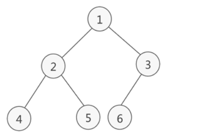

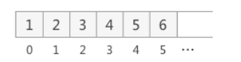

### 要求

* 以数组的方式存放二叉树的节点
* 在遍历数组时，仍然可以以谦虚遍历，中序遍历和后序遍历的方式完成节点的遍历

### 特点

1. 顺序存储二叉树通常只考虑完全二叉树
2. 第n个元素的左子节点为 **2 * n + 1**
3. 第n个元素的右子节点为 **2 * n + 2**
4. 第n个元素的父节点为 **(n - 1) / 2**
5. n表示二叉树中的第几个元素，从0开始记起

### 代码实现

```java
package DataStructures.树.二叉树;

public class ArrBinaryTreeDemo {

    public static void main(String[] args) {
        int[] array = new int[]{1, 2, 3, 4, 5, 6, 7};
        ArrayBinartTree arrayBinartTree = new ArrayBinartTree(array);
        System.out.println("=====前序遍历=====");
        arrayBinartTree.preOrder(); // 1, 2, 4, 5, 3, 6, 7
        System.out.println("=====中序遍历=====");
        arrayBinartTree.infixOrder(); // 4, 2, 5, 1, 6, 3, 7
        System.out.println("=====后序遍历=====");
        arrayBinartTree.postOrder(); // 4, 5, 2, 6, 7, 3, 1
    }

    // 编写一个ArrBinaryTree，实现顺序存储二叉树
    static class ArrayBinartTree {
        private int[] array; // 定义一个存储数据节点的数组

        // 构造器
        public ArrayBinartTree(int[] array) {
            this.array = array;
        }

        // 重载
        public void preOrder() {
            preOrder(0);
        }
        public void infixOrder() {
            infixOrder(0);
        }
        public void postOrder() {
            postOrder(0);
        }

        // 前序遍历方法
        public void preOrder(int index) {
            if (array == null || array.length == 0) {
                System.out.println("数组为空，无法遍历");
            }
            // 输出当前元素
            System.out.println(array[index]);
            // 向左递归遍历
            if ((index * 2) + 1 < array.length) {
                preOrder(index * 2 + 1);
            }
            // 向右递归遍历
            if ((index * 2) + 2 < array.length) {
                preOrder(index * 2 + 2);
            }
        }
        // 中序遍历方法
        public void infixOrder(int index) {
            if (array == null || array.length == 0) {
                System.out.println("数组为空，无法遍历");
            }
            // 向左递归遍历
            if ((index * 2) + 1 < array.length) {
                infixOrder(index * 2 + 1);
            }
            // 输出当前元素
            System.out.println(array[index]);
            // 向右递归遍历
            if ((index * 2) + 2 < array.length) {
                infixOrder(index * 2 + 2);
            }
        }
        // 后序遍历方法
        public void postOrder(int index) {
            if (array == null || array.length == 0) {
                System.out.println("数组为空，无法遍历");
            }
            // 向左递归遍历
            if ((index * 2) + 1 < array.length) {
                postOrder(index * 2 + 1);
            }
            // 向右递归遍历
            if ((index * 2) + 2 < array.length) {
                postOrder(index * 2 + 2);
            }
            // 输出当前元素
            System.out.println(array[index]);
        }
    }
}

```

### 应用实例

堆排序算法

## 2.6 线索化二叉树

### 基本介绍

1. n个节点的二叉链表中含有n+1（2n - (n - 1) = n+1）个空指针域。利用二叉链表中的空指针域，存放指向该节点在某种遍历次序下的前驱和后继节点的指针（这种附加的指针称为线索）
2. 这种添加了线索的二叉链表称为线索链表，相应的二叉树称为线索二叉树(Threaded Binary Tree)。根据线索性质的不同，线索二叉树可以分为前序线索二叉树、中序线索二叉树和后序线索二叉树
3. 一个节点的前一个节点，称为前驱节点
4. 一个节点的后一个节点，称为后继节点

### 代码实现

ThreadedBinaryTreeDemo类：

```java
package DataStructures.树.二叉树.线索化二叉树;

public class ThreadedBinaryTreeDemo {
    public static void main(String[] args) {
        // 创建二叉树
        ThreadedBinaryTree binaryTree = new ThreadedBinaryTree();
        // 创建需要的节点
        ThreadedHeroNode heroNode1 = new ThreadedHeroNode(1, "宋江");
        ThreadedHeroNode heroNode2 = new ThreadedHeroNode(2, "吴用");
        ThreadedHeroNode heroNode3 = new ThreadedHeroNode(3, "卢俊义");
        ThreadedHeroNode heroNode4 = new ThreadedHeroNode(4, "林冲");
        ThreadedHeroNode heroNode5 = new ThreadedHeroNode(5, "关胜");
        ThreadedHeroNode heroNode6 = new ThreadedHeroNode(6, "杨志");
        ThreadedHeroNode heroNode7 = new ThreadedHeroNode(7, "武松");
        // 手动创建二叉树（后续学习递归创建）
        heroNode1.setLeft(heroNode2);
        heroNode1.setRight(heroNode3);
        heroNode2.setLeft(heroNode4);
        heroNode2.setRight(heroNode5);
        heroNode3.setLeft(heroNode6);
        heroNode3.setRight(heroNode7);
        binaryTree.setRoot(heroNode1);
        // 测试
        binaryTree.threadedNodes();
        System.out.println(heroNode4.getLeft()); // null
        System.out.println(heroNode4.getRight()); // HeroNode{no=2, name='吴用'}
        System.out.println(heroNode4.getLeftType()); // 1
        System.out.println(heroNode4.getRightType()); // 1
    }
}
```

ThreadedBinaryTree类：

```java
package DataStructures.树.二叉树.线索化二叉树;

class ThreadedBinaryTree {
    // 定义根节点
    private ThreadedHeroNode root;

    // set
    public void setRoot(ThreadedHeroNode root) {
        this.root = root;
    }

    // 重写threadedNodes
    public void threadedNodes() {
        threadedNodes(root);
    }
    // 为实现线索化，需要创建指向当前节点的前驱结点的指针
    private ThreadedHeroNode pre;
    // 线索化二叉树的方法
    public void threadedNodes(ThreadedHeroNode node) {
        if (node == null) {
            return;
        }
        // 递归线索化左子树
        threadedNodes(node.getLeft());
        // 处理当前节点的前驱结点
        if (node.getLeft() == null) {
            node.setLeft(pre); // 让当前节点的左子节点指向前驱结点
            node.setLeftType(1); // 修改当前节点的左指针类型
        }
        // 处理当前节点的后继节点
        if (pre != null && pre.getRight() == null) {
            pre.setRight(node); // 让当前节点的右子节点指向当前节点
            pre.setRightType(1); // 修改前驱结点的右指针类型
        }
        // ！！！node指向当前处理节点，pre指向上一个处理完的节点！！！
        pre = node;
        // 递归线索化右子树
        threadedNodes(node.getRight());
    }
}
```

ThreadedHeroNode类：

```java
package DataStructures.树.二叉树.线索化二叉树;

class ThreadedBinaryTree {
    // 定义根节点
    private ThreadedHeroNode root;

    // set
    public void setRoot(ThreadedHeroNode root) {
        this.root = root;
    }

    // 重写threadedNodes
    public void threadedNodes() {
        threadedNodes(root);
    }
    // 为实现线索化，需要创建指向当前节点的前驱结点的指针
    private ThreadedHeroNode pre;
    // 线索化二叉树的方法
    public void threadedNodes(ThreadedHeroNode node) {
        if (node == null) {
            return;
        }
        // 递归线索化左子树
        threadedNodes(node.getLeft());
        // 处理当前节点的前驱结点
        if (node.getLeft() == null) {
            node.setLeft(pre); // 让当前节点的左子节点指向前驱结点
            node.setLeftType(1); // 修改当前节点的左指针类型
        }
        // 处理当前节点的后继节点
        if (pre != null && pre.getRight() == null) {
            pre.setRight(node); // 让当前节点的右子节点指向当前节点
            pre.setRightType(1); // 修改前驱结点的右指针类型
        }
        // ！！！node指向当前处理节点，pre指向上一个处理完的节点！！！
        pre = node;
        // 递归线索化右子树
        threadedNodes(node.getRight());
    }
}
```

## 2.7 遍历线索化二叉树

### 实现代码

```java
// 遍历线索化二叉树
    public void threadedList() {
        ThreadedHeroNode node = root; // 定义一个变量，存储当前遍历的节点，从root开始
        while (node != null) { // 当节点存在时
            // 向左循环查找左子节点为1的节点(处理输出左子树)
            while (node.getLeftType() == 0) {
                node = node.getLeft();
            }
            // 找到最深处的节点，打印当前节点
            System.out.println(node);
            // 如果该点的后续节点存在，则输出后续节点(处理输出右子树)
            while (node.getRightType() == 1) {
                node = node.getRight();
                System.out.println(node);
            }
            // 继续循环其他节点直至遍历
            node = node.getRight();
        }
    }
```

# 3. 赫夫曼树

## 3.1 基本介绍

1. 给定n个权值作为n个叶子结点，构造一棵二叉树，**若该树的带权路径长度(wpl)达到最小**，称这样的二叉树为最优二叉树，即赫夫曼树(哈夫曼树、霍夫曼树)
2. 赫夫曼树是带权路径长度最短的树，权值较大的节点里根较近

## 3.2 重要概念

* 路径和路径长度    * 路径：一棵树中，从一个节点往下可以达到的孩子或者孙子节点之间的通路，称为路径。
    * 路径长度：通路中分支的数目称路径长度。若规定根节点层数为1，则从根节点到L层的路径长度为L-1

* 节点的权以及带权路径长度    * 节点的权：若将树中的节点赋予一个有某种含义的数值，则这个数值称为该节点的权
    * 节点的带权路径长度：从根节点到该节点之间的路径长度与该节点的权的乘积

* 树的带权路径长度：树的带权路径长度规定为所有叶子结点的带权路径长度之和，记做WPL(weighted path length)，权值越大的节点离根节点越近的二叉树才是最优二叉树
* WPL最小的就是赫夫曼树

## 3.3 赫夫曼树的创建

### 思路分析

1. 将一个数组从小到大排序，将每一个数据看成一个节点，每个节点可以看做是一棵最简单的二叉树
2. 取出根节点权值最小的两棵二叉树，组成一颗新的二叉树。该二叉树的根节点为权值最小的两棵二叉树节点的权值之和
3. 再将新的二叉树放入数组重新排序，不断重复上述步骤，直到数组中所有数据都被处理，得到一棵赫夫曼树
图示：

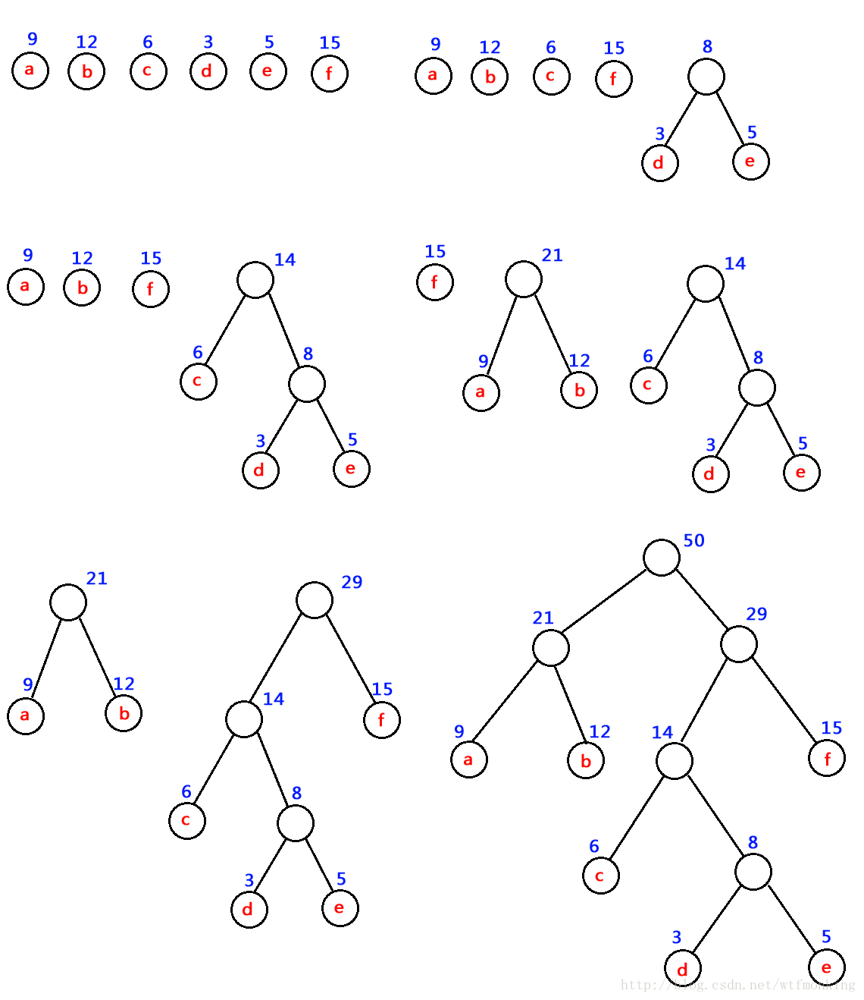

### 代码实现

Node节点类：

```java
package DataStructures.树.赫夫曼树.赫夫曼树的创建;

// 节点类
// 为实现排序功能，让Node实现Comparable接口
public class Node implements Comparable<Node>{

    int value; // 节点权值
    Node left; // 左子节点
    Node right; // 右子节点

    // 前序遍历
    public void preOrder() {
        System.out.println(this);
        if (this.left != null) {
            this.left.preOrder();
        }
        if (this.right != null) {
            this.right.preOrder();
        }
    }

    // 构造器
    public Node(int value) {
        this.value = value;
    }

    // toString
    @Override
    public String toString() {
        return "Node{" +
                "value=" + value +
                '}';
    }

    // 排序
    @Override
    public int compareTo(Node o) {
        return this.value - o.value;
    }
}

```

HuffmanTree：

```java
package DataStructures.树.赫夫曼树.赫夫曼树的创建;

import java.util.ArrayList;
import java.util.Collections;
import java.util.List;

public class HuffmanTree {
    public static void main(String[] args) {
        int[] array = new int[]{13, 7, 8, 3, 29, 6, 1};
        Node huffmanTree = createHuffmanTree(array);
        preOrder(huffmanTree);
    }

    // 创建赫夫曼树的方法
    public static Node createHuffmanTree(int[] array) {
        // 构建一个集合存放所有的节点
        List<Node> nodes = new ArrayList<Node>();
        // 依次取出数组中的元素加入集合
        for (int value: array) {
            nodes.add(new Node(value));
        }
        // 构造赫夫曼树
        while (nodes.size() > 1) { // 只剩一个节点时停止循环
            // 1. 排序
            Collections.sort(nodes);
            // 2. 取出权值最小的两个节点
            Node leftNode = nodes.get(0);
            Node rightNode = nodes.get(1);
            // 3. 创建新节点，权值为上述两个节点的权值之和
            Node parent = new Node(leftNode.value + rightNode.value);
            // 4. 新节点为父节点，与上述两个节点构成新树
            parent.left = leftNode;
            parent.right = rightNode;
            // 5. 在集合中删除两个子节点，将新父节点加入集合，循环重复上述过程
            nodes.remove(leftNode);
            nodes.remove(rightNode);
            nodes.add(parent);
        }
        // 当集合中仅剩一个元素时，返回这个根节点
        return nodes.get(0);
    }

    // 前序遍历
    public static void preOrder(Node root) {
        if (root != null) {
            root.preOrder();
        } else {
            System.out.println("树为空，无法遍历");
        }
    }
}

```

## 3.4 赫夫曼树的应用--赫夫曼编码

### 基本介绍

1. 赫夫曼编码又称为哈夫曼编码、霍夫曼编码，是一种编码方式，属于一种程序算法
2. 赫夫曼编码是赫夫曼树在通信领域中的经典应用之一
3. 赫夫曼编码广泛的用于数据文件的压缩，其压缩率通常在20%~90%之间
4. 赫夫曼码是可变字长编码(VLC)的一种，于1952年由Huffman提出，称为最佳编码

### 赫夫曼编码的基本思想

1. 要传输的字符串为：i like like like java do you like a java
2. 计算各个字符出现的次数：d:1 y:1 u:1 j:2 v:2 o:2 l:4 k:4 e:4 i:5 a:5 "空格":9
3. 按照上面字符出现的次数构建一棵赫夫曼树，次数作为权值
4. 根据赫夫曼树，给各个字符，规定向左的路径为0，向右的路径为1，编码如下:

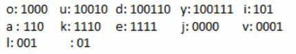

5. 按照上面的赫夫曼编码，我们的"i like like like java do you like a java”字符串对应的编码为(注意这里我们使用的无损压缩)：

10101001101111011110100110111101111010011011110111101000011000111001100111100001100111000100100100110111101111011100100001100001110

通过赫夫曼编码处理长度为133
6. 长度为133，原来长度是359，压缩了(359-133)/359=62.9%

此编码满足前缀编码,即字符的编码都不能是其他字符编码的前缀，不会造成匹配的多义性

### 赫夫曼编码的应用--数据压缩

1. 创建节点类Node

```java
package DataStructures.树.赫夫曼树.数据压缩;

public class Node implements Comparable<Node>{
    Byte data; // 存放数据本身
    int weight; // 存放数据权值
    Node left;
    Node right;

    public void preOrder() {
        System.out.println(this);
        if (this.left != null) {
            this.left.preOrder();
        }
        if (this.right != null) {
            this.right.preOrder();
        }
    }

    @Override
    public String toString() {
        return "Node{" +
                "data=" + data +
                ", weight=" + weight +
                '}';
    }

    public Node(Byte data, int weight) {
        this.data = data;
        this.weight = weight;
    }

    @Override
    public int compareTo(Node o) {
        return this.weight - o.weight;
    }
}

```

2. 生成节点列表

```java
    // 统计出现的字母以及其权值，生成节点列表
    public static List<Node> getNodes(byte[] bytes) {
        // 创建列表，存放生成的节点
        ArrayList<Node> nodes = new ArrayList<>();
        // 创建一个Map，用来统计出现的字母及其权重
        Map<Byte, Integer> counts = new HashMap<>();
        for (byte b: bytes) {
            Integer count = counts.get(b);
            if (count == null) {
                counts.put(b, 1);
            } else {
                counts.put(b, count + 1);
            }
        }
        // 生成节点并存入节点列表
        for (Map.Entry<Byte, Integer> entry: counts.entrySet()) {
            nodes.add(new Node(entry.getKey(), entry.getValue()));
        }
        return nodes;
    }
```

3. 生成赫夫曼树

```java
    // 创建赫夫曼树
    public static Node createHuffmanTree(List<Node> nodes) {
        while (nodes.size() > 1) {
            Collections.sort(nodes);
            Node leftNode = nodes.get(0);
            Node rightNode = nodes.get(1);
            Node parent = new Node(null, leftNode.weight + rightNode.weight);
            parent.left = leftNode;
            parent.right = rightNode;
            nodes.remove(leftNode);
            nodes.remove(rightNode);
            nodes.add(parent);
        }
        return nodes.get(0);
    }

    // 前序遍历
    public void preOrder(Node root) {
        if (root != null) {
            root.preOrder();
        } else {
            System.out.println("树为空！");
        }
    }
```

4. 生成赫夫曼编码表

```java
    // 将赫夫曼编码存放在map<Byte, String>
    static Map<Byte, String> huffmanCodes = new HashMap<>();
    // 生成赫夫曼编码需要去拼接路径，定义一个StringBuilder存储叶子结点路径
    static StringBuilder stringBuilder = new StringBuilder();
    // 得到赫夫曼树的所有叶子节点的赫夫曼编码，并放入huffmanCodes集合
    public static void getCodes(Node node, String code, StringBuilder stringBuilder) {
        StringBuilder stringBuilder2 = new StringBuilder(stringBuilder);
        // 将code拼接到stringBuilder2
        stringBuilder2.append(code);
        if (node != null) {
            if (node.data == null) { // 若当前节点为非叶子结点
                // 向左递归拼接code
                getCodes(node.left, "0", stringBuilder2);
                // 向右递归拼接code
                getCodes(node.right, "1", stringBuilder2);
            } else { // 若当前节点为叶子结点
                // 将对应的数据及其赫夫曼编码存入huffmanCodes集合
                huffmanCodes.put(node.data, stringBuilder2.toString());
            }
        }
    }
    // 重写getCodes，方便调用
    public static Map<Byte, String> getCodes(Node root) {
        if (root == null) {
            return null;
        }
        getCodes(root.left, "0", stringBuilder);
        getCodes(root.right, "1", stringBuilder);
        return huffmanCodes;
    }
```

5. 压缩字节数组

```java
    // 压缩字节数组，将字符串对应的byte数组，通过生成的赫夫曼编码表，返回一个赫夫曼树编码压缩后的byte[]
    public static byte[] zip(byte[] bytes, Map<Byte, String> huffmanCodes) {
        StringBuilder stringBuilder = new StringBuilder();
        for (byte b: bytes) {
            stringBuilder.append(huffmanCodes.get(b));
        }
        // 将二进制转换成十进制并保存在byte[]中
        int len;
        if (stringBuilder.length() % 8 == 0) {
            len = stringBuilder.length() / 8;
        } else {
            len = stringBuilder.length() / 8 + 1;
        }
        // 创建存储压缩数组
        byte[] by = new byte[len];
        int index = 0;
        for (int i = 0; i < stringBuilder.length(); i += 8) {
            String strByte;
            if (i + 8 > stringBuilder.length()) {
                strByte = stringBuilder.substring(i);
            } else {
                strByte = stringBuilder.substring(i, i + 8);
            }
            by[index] = (byte) Integer.parseInt(strByte, 2);
            index ++;
        }
        return by;
    }
```

6. 测试结果

```java
    public static void main(String[] args) {
        String content = "i like like like java do you like a java";
        List<Node> nodes = getNodes(content.getBytes());
        System.out.println("生成的赫夫曼树为：");
        Node huffmanTree = createHuffmanTree(nodes);
        huffmanTree.preOrder();
        System.out.println("=========================");
        System.out.println("赫夫曼编码表为：");
        Map<Byte, String> huffmanCodes = getCodes(huffmanTree);
        System.out.println(huffmanCodes);
        System.out.println("=========================");
        System.out.println("压缩字节数组为：");
        byte[] huffmanCodesBytes = zip(content.getBytes(), huffmanCodes);
        System.out.println(Arrays.toString(huffmanCodesBytes));
        System.out.println("=========================");
    }
```

控制台输出：

```java
生成的赫夫曼树为：
Node{data=null, weight=40}
Node{data=null, weight=17}
Node{data=null, weight=8}
Node{data=108, weight=4}
Node{data=null, weight=4}
Node{data=106, weight=2}
Node{data=111, weight=2}
Node{data=32, weight=9}
Node{data=null, weight=23}
Node{data=null, weight=10}
Node{data=97, weight=5}
Node{data=105, weight=5}
Node{data=null, weight=13}
Node{data=null, weight=5}
Node{data=null, weight=2}
Node{data=100, weight=1}
Node{data=117, weight=1}
Node{data=null, weight=3}
Node{data=121, weight=1}
Node{data=118, weight=2}
Node{data=null, weight=8}
Node{data=101, weight=4}
Node{data=107, weight=4}
=========================
赫夫曼编码表为：
{32=01, 97=100, 100=11000, 117=11001, 101=1110, 118=11011, 105=101, 121=11010, 106=0010, 107=1111, 108=000, 111=0011}
=========================
压缩字节数组为：
[-88, -65, -56, -65, -56, -65, -55, 77, -57, 6, -24, -14, -117, -4, -60, -90, 28]
=========================
```

7. 封装代码

```java
    // 封装代码
    public static byte[] huffmanZip(byte[] bytes) {
        // 1. 统计各个字符及其出现的次数，生成相应的节点，并存放入节点集合
        List<Node> nodes = getNodes(bytes);
        // 2. 将节点集生成赫夫曼树
        Node huffmanTree = createHuffmanTree(nodes);
        // 3. 根据赫夫曼树生成赫夫曼编码表
        Map<Byte, String> huffmanCodes = getCodes(huffmanTree);
        // 4. 根据编码表将要发送的字符串压缩成字节数组
        byte[] zip = zip(bytes, huffmanCodes);
        // 返回结果数组
        return zip;
    }
```

测试：

```java
public static void main(String[] args) {
        String content = "i like like like java do you like a java";
        byte[] huffmanZip = huffmanZip(content.getBytes());
        System.out.println(Arrays.toString(huffmanZip));
    }
 // 结果：[-88, -65, -56, -65, -56, -65, -55, 77, -57, 6, -24, -14, -117, -4, -60, -90, 28]
```

# 4. 二叉排序树

## 4.1 基本介绍

二叉排序树(BST)：Binary Sort(Search) Tree，对于二叉排序树的任意一个非叶子结点，要求左子节点的值比当前节点的值小，右子节点的值比当前节点的值大。

说明：如果有相同的值，可以将该节点放到左子节点或者右子节点

## 4.2 BST的添加和遍历

### 实现代码

Node节点类：

```java
package DataStructures.树.二叉排序树;

public class Node {
    int value;
    Node left;
    Node right;

    public Node(int value) {
        this.value = value;
    }

    @Override
    public String toString() {
        return "Node{" +
                "value=" + value +
                '}';
    }

    // 添加方法
    public void add(Node node) {
        if (node == null) {
            return;
        }
        if (node.value < this.value) { // 若插入节点小于当前节点
            // 若当前节点左子节点为null，则将插入节点挂在当前节点的左子树
            if (this.left == null) { 
                this.left = node;
            } else { // 否则向左递归添加节点
                this.left.add(node);
            }
        } else { // 若插入节点大于等于当前节点
            // 若当前节点右子节点为null，则将插入节点挂在当前节点的右子树
            if (this.right == null) {
                this.right = node;
            } else { // 否则向右递归添加节点
                this.right.add(node);
            }
        }
    }

    // 中序遍历
    public void infixOrder() {
        if (this.left != null) {
            this.left.infixOrder();
        }
        System.out.println(this);
        if (this.right != null) {
            this.right.infixOrder();
        }
    }
}

```

BinarySortTree二叉排序树：

```java
package DataStructures.树.二叉排序树;

public class BinarySortTree {
    private Node root;

    // 添加节点到树
    public void add(Node node) {
        if (root == null) {
            root = node;
        } else {
            root.add(node);
        }
    }

    // 中序遍历树
    public void infixOrder() {
        if (root != null) {
            root.infixOrder();
        } else {
            System.out.println("树为空，无法遍历");
        }
    }
}

```

BinartSortTreeDemo测试

```java
package DataStructures.树.二叉排序树;

public class BinarySortTreeDemo {
    public static void main(String[] args) {
        int[] array = new int[]{7, 3, 10, 12, 5, 1, 9}; // 目标数组
        BinarySortTree binarySortTree = new BinarySortTree(); // 创建BST
        for (int i = 0; i < array.length; i++) { // 循环遍历添加
            binarySortTree.add(new Node(array[i]));
        }
        binarySortTree.infixOrder(); // 中序遍历：1，3，5，7，9，10，12
    }
}

```

## 4.3 BST删除节点

### 思路分析

* 第一种情况：删除叶子结点

    * 首先查找要删除的节点targetNode
    * 查找要删除节点的父节点parentNode
    * 确定targetNode是parenrNode的左子节点还是右子节点    * 如果为左子节点：parent.left = null;
        * 如果为右子节点：parent.right = null;

* 第二种情况：删除只有一颗子树的节点

    * 首先查找要删除的节点targetNode
    * 查找要删除节点的父节点parentNode
    * 确定targetNode存在的是左子节点还是右子节点
    * 确定targetNode是parentNode的左子节点还是右子节点
    * 如果targetNode存在左子节点    * 若targetNode是parentNode的左子节点，parentNode.left = targetNode.left
        * 若targetNode是parentNode的右子节点，parentNode.right = targetNode.left
    
    * 如果targetNode存在右子节点    * 若targetNode是parentNode的左子节点，parentNode.left = targetNode.right
        * 若targetNode是parentNode的右子节点，parentNode.right = targetNode.right

* 第三种情况：删除有两棵子树的节点

    * 首先查找要删除的节点targetNode
    * 查找要删除节点的父节点parentNode
    * 从targetNode的右子树中寻找最小的节点，并将最小节点的值保存在temp中
    * 删除查找到的最小节点
    * 将最小节点的值赋值给tragetNode：targetNode.value = temp
	
### 实现代码

Node节点类：

```java
    // 查询要删除的目标节点
    public Node searchTargetNode(int value) {
        if (this.value == value) { // 若当前节点即targetNode
            return this;
        } else if (value < this.value) { // 若当前节点的值大于targetNode，向左子树递归查找
            if (this.left != null) {
                return this.left.searchTargetNode(value);
            } else {
                return null;
            }
        } else { // 若当前节点的值小于targetNode，向右子树递归查找
            if (this.right != null) {
                return this.right.searchTargetNode(value);
            } else {
                return null;
            }
        }
    }

    // 查询要删除的目标节点的父节点
    public Node searchParentNode(int value) {
        // 若当前节点就是targetNode的parentNode，则返回当前节点
        if ((this.left != null && this.left.value == value)
                || (this.right != null && this.right.value == value)) {
            return this;
        } else {
            if (this.left != null && value < this.value) {
                return this.left.searchParentNode(value); // 向左递归查找
            } else if (this.right != null && value >= this.value) {
                return this.right.searchParentNode(value); // 向右递归查找
            } else {
                return null; // 没有找到父节点
            }
        }
    }
```

BinarySortTree类：

```java
    // 查找要删除的节点
    public Node searchTargetNode(int value) {
        if (root == null) {
            return null;
        } else {
            return root.searchTargetNode(value);
        }
    }

    // 查找要删除节点的父节点
    public Node searchParentNode(int value) {
        if (root == null) {
            return null;
        } else {
            return root.searchParentNode(value);
        }
    }

    // 查找目标节点右子树中的最小节点，并删除
    public int delRightTreeMin(Node node) {
        Node target = node; // 设置一个辅助指针
        while (target.left != null) { // 遍历查找以传入节点为根节点的树的最小左子节点
            target = target.left;
        }
        deleteNode(target.value); // 删除查找到的最小节点
        return target.value; // 返回最小节点
    }

    // 删除节点
    public void deleteNode(int value) {
        if (root == null) {
            return;
        } else {
            // 1. 首先查找要删除的节点
            Node targetNode = searchTargetNode(value);
            if (targetNode == null) { // 若没有找到要删除的节点，直接返回
                return;
            }
            // 若当前二叉树只有一个节点，则删除
            if (root.left == null && root.right == null) {
                root = null;
                return;
            }
            // 2. 查找要删除节点的父节点
            Node parentNode = searchParentNode(value);
            // 3.1 如果要删除的节点是叶子结点
            if (targetNode.left == null && targetNode.right == null) {
                // 判断targetNode是parentNode的左子节点还是右子节点
                if (parentNode.left != null && parentNode.left.value == value) { // 是左子节点
                    parentNode.left = null;
                } else if (parentNode.right != null && parentNode.right.value == value) { // 是右子节点
                    parentNode.right = null;
                }
            } else if (targetNode.left != null && targetNode.right != null) { // 3.2 删除有两棵子树的节点
                int minValue = delRightTreeMin(targetNode.right);
                targetNode.value = minValue;
            } else { // 3.3 删除只有一棵子树的节点
                // 3.3.1 如果targetNode存在左子节点
                if (targetNode.left != null) {
                    if (parentNode != null) {
                        // 如果targetNode是parentNode的左子节点
                        if (parentNode.left.value == value) {
                            parentNode.left = targetNode.left;
                        }
                        // 如果targetNode是parentNode的右子节点
                        if (parentNode.right.value == value) {
                            parentNode.right = targetNode.left;
                        }
                    } else { // 如果没有父节点，即根节点就是目标节点
                        root = targetNode.left;
                    }
                } else { // 3.3.2 如果targetNode存在右子节点
                    if (parentNode != null) {
                        // 如果targetNode是parentNode的左子节点
                        if (parentNode.left.value == value) {
                            parentNode.left = targetNode.right;
                        }
                        // 如果targetNode是parentNode的右子节点
                        if (parentNode.right.value == value) {
                            parentNode.right = targetNode.right;
                        }
                    } else { // 如果没有父节点，即根节点就是目标节点
                        root = targetNode.right;
                    }
                }
            }
        }
    }
```

BinarySortTreeDemo测试类：

```java
package DataStructures.树.二叉排序树;

public class BinarySortTreeDemo {
    public static void main(String[] args) {
        int[] array = new int[]{7, 3, 10, 12, 5, 1, 9, 2, 11}; // 目标数组
        BinarySortTree binarySortTree = new BinarySortTree(); // 创建BST
        for (int i = 0; i < array.length; i++) { // 循环遍历添加
            binarySortTree.add(new Node(array[i]));
        }
        binarySortTree.infixOrder(); // 中序遍历

        // 测试删除节点
        System.out.println("删除后：");
        binarySortTree.deleteNode(7);
        binarySortTree.infixOrder();
    }
}

```

# 5. 平衡二叉树

## 5.1 BST树的问题

给定数列{1, 2, 3, 4, 5, 6}，其创建的二叉排序树如下：

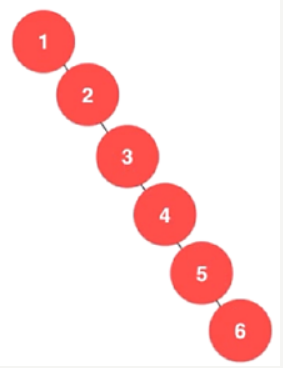

其存在问题：

1. 左子树全部为空，从形式上看更像一个单链表
2. 插入速度没有影响，查询速度明显降低(因为需要依次比较)，不能发挥BST的优势。因为每一次还需要比较左子树，故其查询速度比单链表还要慢

## 5.2 AVL平衡二叉树基本介绍

* 平衡二叉树也叫平衡二叉搜索树，又称AVL树，可以保证查询效率较高
* 特点：它是一棵空树或它的左右两个子树的高度差的绝对值不超过1，并且左右子树都是一棵平衡二叉树。
* 平衡二叉树常用的实现方法有红黑树、AVL、替罪羊树、Treap、伸展树等

## 5.3 AVL的左旋转

### 思路分析

1. 创建一个**新节点newNode**，其值等于当前根节点的值
2. 将新节点的左子树设置为当前节点的左子树：**newNode.left = left**
3. 将新节点的右子树设置为当前节点的右子树的左子树：**newNode.right = right.left**
4. 把当前节点的值替换为右子节点的值：**value = right.value**
5. 把当前节点的右子树设置为右子树的右子树：**right = right.right**
6. 把当前节点的左子树设置为新节点：**left = newNode**

### 代码实现

```java
    // 左旋转的方法
    public void leftRotate() {
        // 1. 创建一个新节点newNode，其值等于当前根节点的值
        Node newNode = new Node(this.value);
        // 2. 将新节点的左子树设置为当前节点的左子树
        newNode.left = this.left;
        // 3. 将新节点的右子树设置为当前节点的右子树的左子树
        newNode.right = this.right.left;
        // 4. 把当前节点的值替换为右子节点的值
        this.value = this.right.value;
        // 5. 把当前节点的右子树设置为右子树的右子树
        this.right = this.right.right;
        // 6. 把当前节点的左子树设置为新节点
        this.left = newNode;
    }
```

## 5.4 AVL的右旋转

### 思路分析

1. 创建一个**新节点newNode**，其值等于当前根节点的值
2. 将新节点的右子树设置为当前节点的有子树：**newNode.right = right**
3. 将新节点的左子树设置为当前节点的左子树的右子树：**newNode.left = left.right**
4. 把当前节点的值替换为左子节点的值：**value = left.value**
5. 把当前节点的左子树设置为左子树的左子树：**left = left.left**
6. 把当前节点的右子树设置为新节点：**right = newNode**

### 代码实现

```java
    // 右旋转的方法
    public void rightRotate() {
        // 1. 创建一个新节点newNode，其值等于当前根节点的值
        Node newNode = new Node(this.value);
        // 2. 将新节点的右子树设置为当前节点的右子树
        newNode.right = this.right;
        // 3. 将新节点的左子树设置为当前节点的左子树的右子树
        newNode.left = this.left.right;
        // 4. 把当前节点的值替换为左子节点的值
        this.value = this.left.value;
        // 5. 把当前节点的左子树设置为左子树的左子树
        this.left = this.left.left;
        // 6. 把当前节点的右子树设置为新节点
        this.right = newNode;
    }
```

## 5.5 AVL的双旋转

### 解决思路

当符合右旋转的条件时，如果他的左子树的右子树高度大于左子树的高度，则先对当前这个节点的左子节点进行左旋转，在对当前这个节点进行右旋转即可。

### 实现代码--实现添加节点直接生成AVL树

```java
    // 添加方法——生成平衡二叉树
    public void addToAVL(Node node) {
        if (node == null) {
            return;
        }
        if (node.value < this.value) { // 若插入节点小于当前节点
            // 若当前节点左子节点为null，则将插入节点挂在当前节点的左子树
            if (this.left == null) {
                this.left = node;
            } else { // 否则向左递归添加节点
                this.left.addToAVL(node);
            }
        } else { // 若插入节点大于等于当前节点
            // 若当前节点右子节点为null，则将插入节点挂在当前节点的右子树
            if (this.right == null) {
                this.right = node;
            } else { // 否则向右递归添加节点
                this.right.addToAVL(node);
            }
        }
        // 当添加完一个节点后，如果：(右子树的高度 - 左子树的高度) > 1，则执行左旋转
        if (this.rightHeight() - this.leftHeight() > 1) {
            // 如果当前节点的右子树的左子树高度大于右子树高度
            if (this.right != null && this.right.leftHeight() > this.right.rightHeight()) {
                // 先对当前节点的右子节点进行右旋转
                this.right.rightRotate();
                // 然后对当前节点进行左旋转
                this.leftRotate();
            } else { // 否则直接对当前节点进行左旋转即可
                this.leftRotate();
            }
            return;
        }
        // 当添加完一个节点后，如果：(左子树的高度 - 右子树的高度) > 1，则执行右旋转
        if (this.leftHeight() - this.rightHeight() > 1) {
            // 如果当前节点的左子树的右子树高度大于左子树高度
            if (this.left != null && this.left.rightHeight() > this.left.leftHeight()) {
                // 先对当前节点的左子节点进行左旋转
                this.left.leftRotate();
                // 然后对当前节点进行右旋转
                this.rightRotate();
            } else { // 否则直接对当前节点进行右旋转即可
                this.rightRotate();
            }
        }
    }
```

## 5.6 AVL树整合代码

Node类：

```java
package DataStructures.树.平衡二叉树;

public class Node {
    int value;
    Node left;
    Node right;

    public Node(int value) {
        this.value = value;
    }

    @Override
    public String toString() {
        return "Node{" +
                "value=" + value +
                '}';
    }

    // 添加方法——生成二叉排序树
    public void addToBST(Node node) {
        if (node == null) {
            return;
        }
        if (node.value < this.value) { // 若插入节点小于当前节点
            // 若当前节点左子节点为null，则将插入节点挂在当前节点的左子树
            if (this.left == null) {
                this.left = node;
            } else { // 否则向左递归添加节点
                this.left.addToBST(node);
            }
        } else { // 若插入节点大于等于当前节点
            // 若当前节点右子节点为null，则将插入节点挂在当前节点的右子树
            if (this.right == null) {
                this.right = node;
            } else { // 否则向右递归添加节点
                this.right.addToBST(node);
            }
        }
    }

    // 添加方法——生成平衡二叉树
    public void addToAVL(Node node) {
        if (node == null) {
            return;
        }
        if (node.value < this.value) { // 若插入节点小于当前节点
            // 若当前节点左子节点为null，则将插入节点挂在当前节点的左子树
            if (this.left == null) {
                this.left = node;
            } else { // 否则向左递归添加节点
                this.left.addToAVL(node);
            }
        } else { // 若插入节点大于等于当前节点
            // 若当前节点右子节点为null，则将插入节点挂在当前节点的右子树
            if (this.right == null) {
                this.right = node;
            } else { // 否则向右递归添加节点
                this.right.addToAVL(node);
            }
        }
        // 当添加完一个节点后，如果：(右子树的高度 - 左子树的高度) > 1，则执行左旋转
        if (this.rightHeight() - this.leftHeight() > 1) {
            // 如果当前节点的右子树的左子树高度大于右子树高度
            if (this.right != null && this.right.leftHeight() > this.right.rightHeight()) {
                // 先对当前节点的右子节点进行右旋转
                this.right.rightRotate();
                // 然后对当前节点进行左旋转
                this.leftRotate();
            } else { // 否则直接对当前节点进行左旋转即可
                this.leftRotate();
            }
            return;
        }
        // 当添加完一个节点后，如果：(左子树的高度 - 右子树的高度) > 1，则执行右旋转
        if (this.leftHeight() - this.rightHeight() > 1) {
            // 如果当前节点的左子树的右子树高度大于左子树高度
            if (this.left != null && this.left.rightHeight() > this.left.leftHeight()) {
                // 先对当前节点的左子节点进行左旋转
                this.left.leftRotate();
                // 然后对当前节点进行右旋转
                this.rightRotate();
            } else { // 否则直接对当前节点进行右旋转即可
                this.rightRotate();
            }
        }
    }

    // 中序遍历
    public void infixOrder() {
        if (this.left != null) {
            this.left.infixOrder();
        }
        System.out.println(this);
        if (this.right != null) {
            this.right.infixOrder();
        }
    }

    // 返回左子树的高度
    public int leftHeight() {
        if (this.left == null) {
            return 0;
        }
        return this.left.height();
    }

    // 返回右子树的高度
    public int rightHeight() {
        if (this.right == null) {
            return 0;
        }
        return this.right.height();
    }

    // 返回以该节点为根节点的树的高度
    public int height() {
        return Math.max(this.left == null ? 0 : this.left.height(),
                this.right == null ? 0 : this.right.height()) + 1;
    }

    // 左旋转的方法
    public void leftRotate() {
        // 1. 创建一个新节点newNode，其值等于当前根节点的值
        Node newNode = new Node(this.value);
        // 2. 将新节点的左子树设置为当前节点的左子树
        newNode.left = this.left;
        // 3. 将新节点的右子树设置为当前节点的右子树的左子树
        newNode.right = this.right.left;
        // 4. 把当前节点的值替换为右子节点的值
        this.value = this.right.value;
        // 5. 把当前节点的右子树设置为右子树的右子树
        this.right = this.right.right;
        // 6. 把当前节点的左子树设置为新节点
        this.left = newNode;
    }

    // 右旋转的方法
    public void rightRotate() {
        // 1. 创建一个新节点newNode，其值等于当前根节点的值
        Node newNode = new Node(this.value);
        // 2. 将新节点的右子树设置为当前节点的右子树
        newNode.right = this.right;
        // 3. 将新节点的左子树设置为当前节点的左子树的右子树
        newNode.left = this.left.right;
        // 4. 把当前节点的值替换为左子节点的值
        this.value = this.left.value;
        // 5. 把当前节点的左子树设置为左子树的左子树
        this.left = this.left.left;
        // 6. 把当前节点的右子树设置为新节点
        this.right = newNode;
    }
}

```

AVLTree类：

```java
package DataStructures.树.平衡二叉树;

public class AVLTree {
    private Node root;
    public Node getRoot() {
        return root;
    }

    // 添加节点到树——生成BST
    public void addToBST(Node node) {
        if (root == null) {
            root = node;
        } else {
            root.addToBST(node);
        }
    }

    // 添加节点到树——生成AVL
    public void addToAVL(Node node) {
        if (root == null) {
            root = node;
        } else {
            root.addToAVL(node);
        }
    }

    // 中序遍历树
    public void infixOrder() {
        if (root != null) {
            root.infixOrder();
        } else {
            System.out.println("树为空，无法遍历");
        }
    }
}

```

AVLTreeDemo测试类：

```java
package DataStructures.树.平衡二叉树;

public class AVLTreeDemo {
    public static void main(String[] args) {
        int[] array = new int[]{2, 1, 3, 4, 5};
        // 添加生成BST树
        AVLTree avlTree1 = new AVLTree();
        for (int i = 0; i < array.length; i++) {
            avlTree1.addToBST(new Node(array[i]));
        }
        // 添加生成AVL树
        AVLTree avlTree2 = new AVLTree();
        for (int i = 0; i < array.length; i++) {
            avlTree2.addToAVL(new Node(array[i]));
        }

        // BST树的高度
        System.out.println("==========BST树==========");
        avlTree1.infixOrder();
        System.out.println("树的高度为：" + avlTree1.getRoot().height()); // 4
        System.out.println("左子树高度为：" + avlTree1.getRoot().leftHeight()); // 1
        System.out.println("右子树高度为：" + avlTree1.getRoot().rightHeight()); // 3

        // AVL树的高度
        System.out.println("==========AVL树==========");
        avlTree2.infixOrder();
        System.out.println("树的高度为：" + avlTree2.getRoot().height()); // 3
        System.out.println("左子树高度为：" + avlTree2.getRoot().leftHeight()); // 1
        System.out.println("右子树高度为：" + avlTree2.getRoot().rightHeight()); // 2
    }
}

```
