# NC78.反转链表
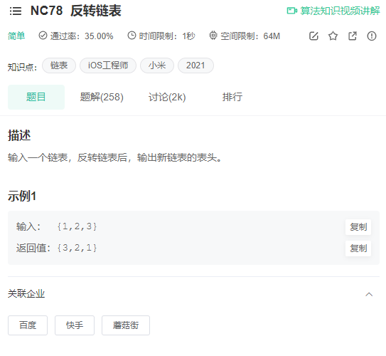

解析：采用递归算法

参考代码：
```java
/*
public class ListNode {
    int val;
    ListNode next = null;

    ListNode(int val) {
        this.val = val;
    }
}*/
public class Solution {
    public ListNode ReverseList(ListNode head) {
        if (head == null || head.next == null) return head;
        ListNode newHead = ReverseList(head.next);
        head.next.next = head;
        head.next = null;
        return newHead;
    }
}
```

# NC4. 判断链表中是否有环
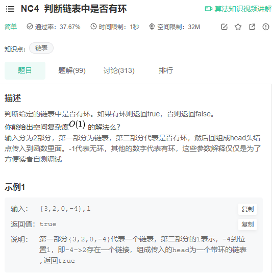

解析：使用快慢指针，若快慢指针能相遇则证明有环

参考代码：
```java
/**
 * Definition for singly-linked list.
 * class ListNode {
 *     int val;
 *     ListNode next;
 *     ListNode(int x) {
 *         val = x;
 *         next = null;
 *     }
 * }
 */
public class Solution {
    public boolean hasCycle(ListNode head) {
        if (head == null) return false;
        ListNode slow = head, fast = head;
        while (fast != null && fast.next != null) {
            slow = slow.next;
            fast = fast.next.next;
            if (slow == fast)
                return true;
        }
        return false;
    }
}
```

# NC76. 用两个栈实现队列
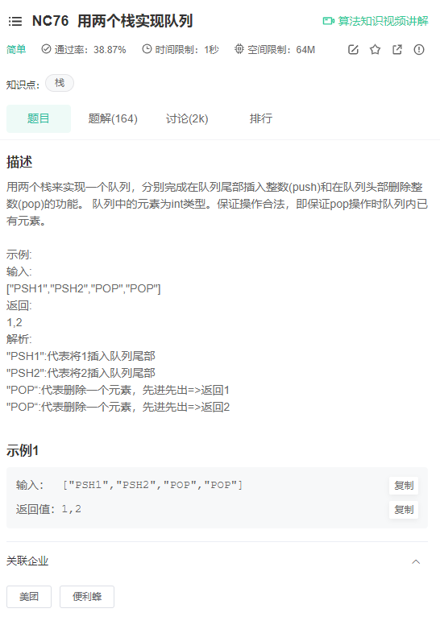

解析：借助辅助栈

参考代码：
```java
import java.util.Stack;

public class Solution {
    Stack<Integer> stack1 = new Stack<Integer>();
    Stack<Integer> stack2 = new Stack<Integer>();
    
    public void push(int node) {
        stack1.push(node);
    }
    
    public int pop() {
        while (!stack1.isEmpty())
            stack2.push(stack1.pop());
        int res = stack2.pop();
        while (!stack2.isEmpty())
            stack1.push(stack2.pop());
        return res;
    }
}
```

# NC105。含重复数的二分查找
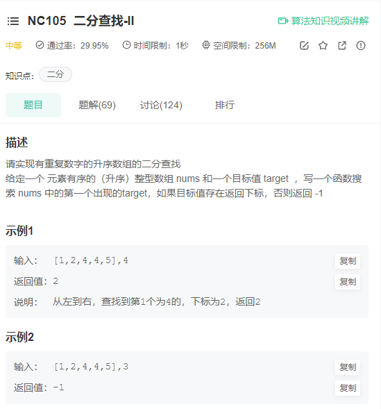

解析：
1. 思路1：按照无重复数的二分查找先找到一个符合的位置，然后向左找到第一个目标数；
2. 思路2：修改二分查找的思路实现，具体看代码；

思路2参考代码：
```java
import java.util.*;


public class Solution {
    /**
     * 代码中的类名、方法名、参数名已经指定，请勿修改，直接返回方法规定的值即可
     *
     * 如果目标值存在返回下标，否则返回 -1
     * @param nums int整型一维数组 
     * @param target int整型 
     * @return int整型
     */
    public int search (int[] nums, int target) {
        if (nums == null || nums.length == 0) return -1;
        return binarySearch(0, nums.length - 1, target, nums);
    }
    public int binarySearch(int left, int right, int target, int[] nums) {
        if (left == right) {
            if (nums[left] == target)
                return left;
            else
                return -1;
        }
        int midIdx = (left + right) >> 1;
        int midVal = nums[midIdx];
        if (midVal >= target)
            return binarySearch(left, midIdx, target, nums);
        else 
            return binarySearch(midIdx + 1, right, target, nums);
    }
}
```

# NC15. 求二叉树的层序遍历
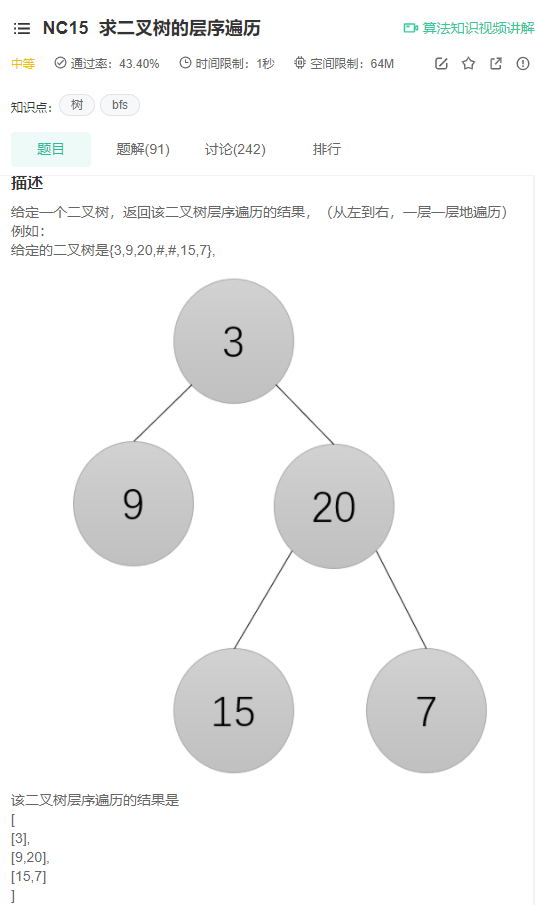

解析：使用队列辅助完成二叉树的层序遍历

参考代码：
```java
import java.util.*;

/*
 * public class TreeNode {
 *   int val = 0;
 *   TreeNode left = null;
 *   TreeNode right = null;
 * }
 */

public class Solution {
    /**
     * 
     * @param root TreeNode类 
     * @return int整型ArrayList<ArrayList<>>
     */
    public ArrayList<ArrayList<Integer>> levelOrder (TreeNode root) {
        ArrayList<ArrayList<Integer>> res = new ArrayList<>();
        Queue<TreeNode> queue = new LinkedList<>();
        if (root != null)
            queue.offer(root);
        while (!queue.isEmpty()) {
            ArrayList<Integer> temp = new ArrayList<>();
            int length = queue.size();
            for (int i = 0; i < length; i++) {
                TreeNode node = queue.poll();
                temp.add(node.val);
                if (node.left != null)
                    queue.offer(node.left);
                if (node.right != null)
                    queue.offer(node.right);
            }
            res.add(temp);
        }
        return res;
    }
}
```

# NC68. 跳台阶
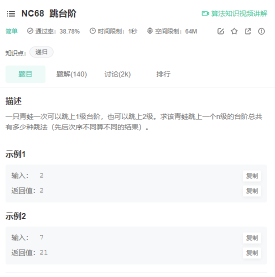

解析：斐波那契数列，使用动态规划求解

参考代码：
```java
public class Solution {
    public int jumpFloor(int target) {
        int[] dp = new int[target + 1];
        dp[0] = 1;
        dp[1] = 1;
        for (int i = 2; i < dp.length; i++)
            dp[i] = dp[i - 1] + dp[i - 2];
        return dp[target];
    }
}
```

# NC41. 最长无重复子数组
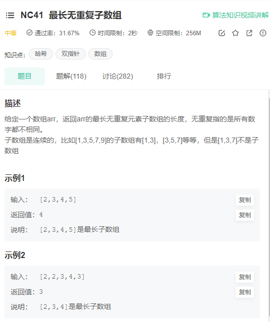

解析：利用队列的特性，若发现重复元素，则将队列至重复元素处的元素全部删除

参考代码：
```java
import java.util.*;


public class Solution {
    /**
     * 
     * @param arr int整型一维数组 the array
     * @return int整型
     */
    public int maxLength (int[] arr) {
        LinkedList<Integer> list = new LinkedList<>();
        int res = 0, index = 0;
        for (int i = 0; i < arr.length; i ++) {
            if (list.contains(arr[i])) {
                index = list.indexOf(arr[i]);
                while (index >= 0) {
                    list.removeFirst();
                    index += -1;
                }
            }
            list.addLast(arr[i]);
            res = Math.max(res, list.size());
        }
        return res;
    }
}
```

# NC102. 在二叉树中寻找两个节点的最近公共祖先
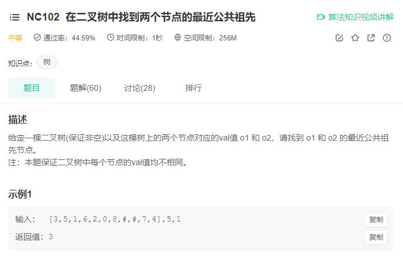

解析：采用递归算法

* 终止条件：
  * 当越过叶子结点，则直接返回 null
  * 当 root = p 或 q，则直接返回 root
* 递推：
  * 递归左子节点 left
  * 递归右子节点 right
* 返回值：
  * 当 left 和 right 同时为空 ：说明 root 的左 / 右子树中都不包含 p,q ，返回 null
  * 当 left 和 right 同时不为空 ：说明 p, q 分列在 root 的 异侧 （分别在 左 / 右子树），因此 root 为最近公共祖先，返回 root
  * 当 left 为空 ，right 不为空 ：p,q 都不在 root 的左子树中，直接返回 right
  * 当 left 不为空 ， right 为空

参考代码：
```java
import java.util.*;

/*
 * public class TreeNode {
 *   int val = 0;
 *   TreeNode left = null;
 *   TreeNode right = null;
 * }
 */

public class Solution {
    /**
     * 
     * @param root TreeNode类 
     * @param o1 int整型 
     * @param o2 int整型 
     * @return int整型
     */
    public int lowestCommonAncestor (TreeNode root, int o1, int o2) {
        TreeNode ancestor = lowestCommonAncestor2(root, o1, o2);
        return ancestor.val;
    }
    public TreeNode lowestCommonAncestor2 (TreeNode root, int o1, int o2) {
        if (root == null || root.val == o1 || root.val == o2)
            return root;
        TreeNode left = lowestCommonAncestor2(root.left, o1, o2);
        TreeNode right = lowestCommonAncestor2(root.right, o1, o2);
        if (left == null && right == null)
            return null;
        if (left == null)
            return right;
        if (right == null)
            return left;
        return root;
    }
}
```

# NC119. 最小的 k 个数
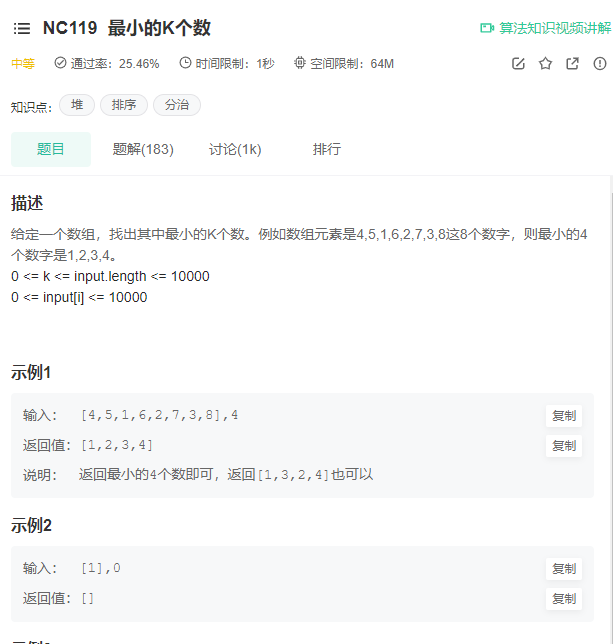

解析：冒泡排序的反向思路--“沉底排序”

实现代码：
```java
import java.util.ArrayList;

public class Solution {
    public ArrayList<Integer> GetLeastNumbers_Solution(int [] input, int k) {
        ArrayList<Integer> res = new ArrayList<>();
        for (int i = 0; i < k; i++) {
            for (int j = input.length - 1; j > 0; j--) {
                if (input[j] < input[j - 1]) {
                    int temp = input[j];
                    input[j] = input[j - 1];
                    input[j - 1] = temp;
                }
            }
            res.add(input[i]);
        }
        return res;
    }
}
```

# NC22. 合并两个有序的数组
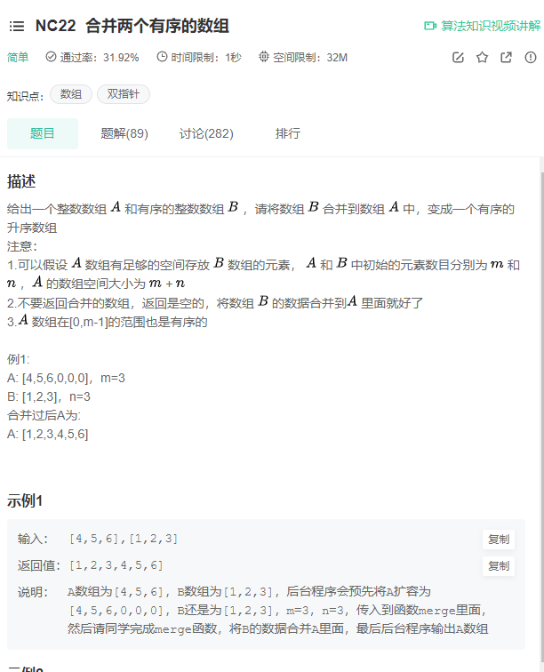

解析：双指针，从后向前，避免占用额外的空间

参考代码：
```java
public class Solution {
    public void merge(int A[], int m, int B[], int n) {
        int i = m - 1, j = n - 1, index = m + n - 1;
        while (index >= 0) {
            if (i < 0) {
                A[index] = B[j];
                index--;
                j--;
                continue;
            }
            if (j < 0) {
                A[index] = A[i];
                index--;
                i--;
                continue;
            }
            if (A[i] > B[j]) {
                A[index] = A[i];
                i--;
            } else {
                A[index] = B[j];
                j--;
            }
            index--;
        }
    }
}
```

# NC45. 二叉树的前序、中序、后序遍历
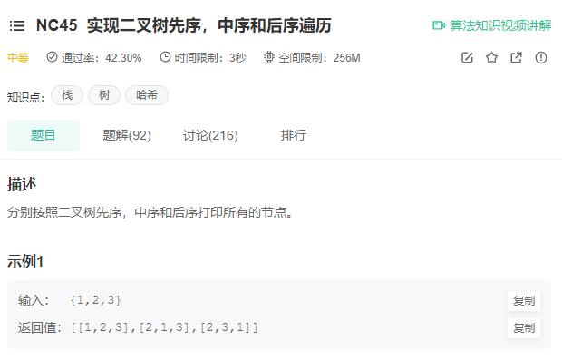

解析：DFS求解

参考代码：
```java
import java.util.*;

/*
 * public class TreeNode {
 *   int val = 0;
 *   TreeNode left = null;
 *   TreeNode right = null;
 * }
 */

public class Solution {
    /**
     * 
     * @param root TreeNode类 the root of binary tree
     * @return int整型二维数组
     */
    public int[][] threeOrders (TreeNode root) {
        List<Integer> preOrderList = new ArrayList<>();
        List<Integer> midOrderList = new ArrayList<>();
        List<Integer> postOrderList = new ArrayList<>();
        preOrder(root, preOrderList);
        midOrder(root, midOrderList);
        postOrder(root, postOrderList);
        int[][] res = new int[3][preOrderList.size()];
        res[0] = trans(preOrderList);
        res[1] = trans(midOrderList);
        res[2] = trans(postOrderList);
        return res;
    }
    public void preOrder (TreeNode root, List<Integer> list) {
        if (root == null) return;
        list.add(root.val);
        preOrder(root.left, list);
        preOrder(root.right, list);
    }
    public void midOrder (TreeNode root, List<Integer> list) {
        if (root == null) return;
        midOrder(root.left, list);
        list.add(root.val);
        midOrder(root.right, list);
    }
    public void postOrder (TreeNode root, List<Integer> list) {
        if (root == null) return;
        postOrder(root.left, list);
        postOrder(root.right, list);
        list.add(root.val);
    }
    public int[] trans (List<Integer> list) {
        int[] res = new int[list.size()];
        for (int i = 0; i < res.length; i++) {
            res[i] = list.get(i);
        }
        return res;
    }
}
```

# NC88。寻找第K大的数
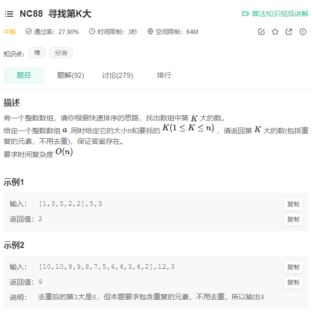

解析：采用快排求解

参考代码：
```java
import java.util.*;

public class Solution {
    public int findKth(int[] a, int n, int K) {
        quickSort(0, n - 1, a);
        return a[n - K];
    }
    public void quickSort(int left, int right, int[] arr) {
        int l = left;
        int r = right;
        int midVal = arr[(left + right) >> 1];
        while (l < r) {
            while (arr[l] < midVal) l++;
            while (arr[r] > midVal) r--;
            if (l >= r) break;
            int temp = arr[l];
            arr[l] = arr[r];
            arr[r] = temp;
            if (arr[l] == midVal) r--;
            if (arr[r] == midVal) l++;
        }
        if (l == r) {
            l++;
            r--;
        }
        if (left < r) quickSort(left, r, arr);
        if (l < right) quickSort(l, right, arr);
    }
}
```

# NC19. 子数组的最大累加和问题
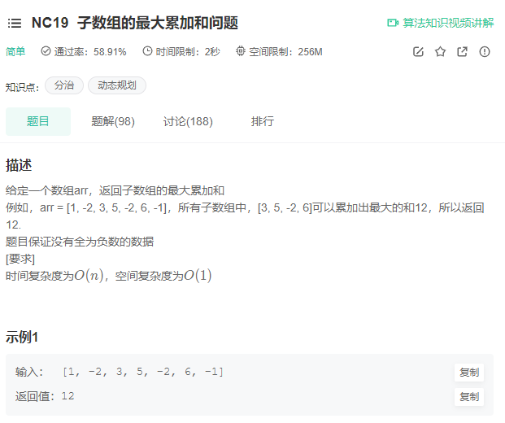

解析：采用动态规划求解

参考代码：
```java
import java.util.*;


public class Solution {
  /**
   * max sum of the subarray
   * @param arr int整型一维数组 the array
   * @return int整型
   */
  public int maxsumofSubarray (int[] arr) {
    int[] dp = new int[arr.length];
    dp[0] = arr[0];
    int res = dp[0];
    for (int i = 1; i < dp.length; i++) {
      dp[i] = Math.max(dp[i - 1] + arr[i], arr[i]);
      res = Math.max(res, dp[i]);
    }
    return res;
  }
}
```

# NC103. 反转字符串
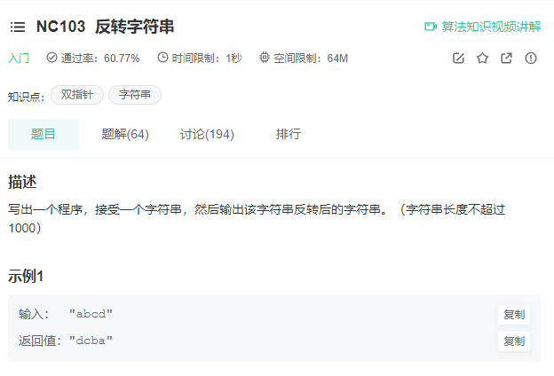

解析：借助 StringBuilder 类的 reverse() 方法实现

参考代码：
```java
import java.util.*;


public class Solution {
    /**
     * 反转字符串
     * @param str string字符串 
     * @return string字符串
     */
    public String solve (String str) {
        StringBuilder builder = new StringBuilder();
        for (int i = 0; i < str.length(); i++)
            builder.append(str.charAt(i));
        builder.reverse();
        return builder.toString();
    }
}
```

# NC17. 最长子回文串


解析：动态规划的思想，采用动态规划数组`boolean[][] dp`来记录两个字符之间能否形成回文串

参考代码：
```java
import java.util.*;

public class Solution {
    public int getLongestPalindrome(String A, int n) {
        boolean[][] dp = new boolean[n][n];
        int res = 0;
        for (int len = 0; len < n; len ++) {
            for (int start = 0; start < n - len; start++) {
                int end = start + len;
                if (A.charAt(start) == A.charAt(end)) {
                    if (len == 0 || len == 1)
                        dp[start][end] = true;
                    else
                        dp[start][end] = dp[start + 1][end - 1];
                    if (dp[start][end])
                        res = Math.max(res, len + 1);
                }
            }
        }
        return res;
    }
}
```


