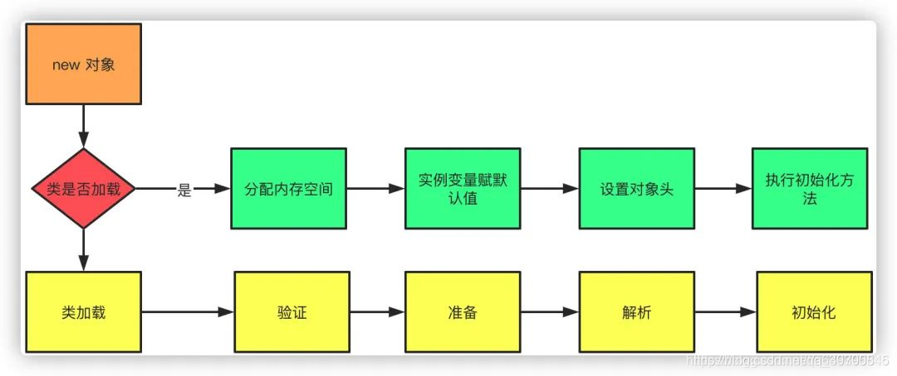

# 1. 你遇到过哪些 OOM 的情况？什么原因造成的？怎么解决的？
### Java heap space
当堆内存(heap space)没有足够空间存储新创建的对象时，就会抛出`java.lang.OutOfMemoryError:Java heap space`错误

常见导致原因：
* 请求创建一个超大对象，通常是一个大数组
* 过度使用终结器 finalizer，导致对象没有立即被 GC
* 内存泄漏，大量对象没有被释放，JVM 无法对其进行回收，常见于使用了 File 等资源没有回收

解决方法：
* 大部分情况下只需要通过`-Xmx`参数提高 JVM 堆内存空间即可
* 如果是超大对象，检查其合理性，比如是否一次性查询了数据库的全部结果，而没有做结果数限制
* 如果是内存泄漏，需要找到对应的业务逻辑，修改代码设计
* 如果是业务峰值压力，考虑添加机器资源，或者做限流降级

### GC overhead limit exceeded
当 Java 花费 98% 以上的时间执行 GC 但只恢复了不到 2% 的内存，且该动作连续重复了 5 次，就会抛出`java.lang.OutOfMemoryError:GC overhead limit exceeded`错误。
该错误说明应用程序已经基本耗尽了所有可用内存，GC 也无法回收。

该错误的导致原因和解决方法跟 Java heap space 类似。

### Permgen space
该错误表示永久代 Permgen space 已经用满。

导致原因：通常是因为加载的 class 数目太多或体积太大。Permgen 的使用量与加载到内存的 class 的数量/大小正相关。

解决方案：根据报错的时机，有不同的解决方案
* 程序启动报错：修改`-XX:MaxPermSize`启动参数，调大永久代空间
* 应用重新部署时报错：可能时应用没有重启，导致加载了多份 class 信息，只需重启 JVM 即可解决
* 运行时报错：应用程序可能动态的创建了大量的 class，而这些 class 的生命周期很短，但 JVM 默认不会卸载 class，可以设置`-XX:+CMSClassUnloadingEnabled 和 -XX:+UseConcMarkSweepGC`两个参数允许 JVM 卸载 class

### Metaspace
JDK 1.8 使用 Metaspace 替代了永久代，该错误表示 Metaspace 已被用满，通常是因为加载的 class 数目太多或体积太大。

此类问题的原因与解决方法跟 Permgen space 非常类似。需要特别注意的是调整 Metaspace 空间大小的启动参数为`-XX:MaxMetaspaceSize`

# 2. 说说 JVM 的内存结构
### 堆内存 (java heap)
堆内存是线程共享的内存区域，在虚拟机启动时创建，此内存区域用来存放对象实例，几乎所有的对象实例都在这里分配内存。

堆是垃圾收集器管理的主要区域，因此很多时候也被称为 GC 堆。其还可以细分为新生代和老年代，其中新生代又分为 Eden 区、From Survivor 空间、To Survivor 空间，三者默认按照 8：1：1 的比例分配。

### 方法区 (method area)
方法区也是线程共享的区域，此区域用于存储已被虚拟机加载的类信息、常量、静态变量、JIT 编译器编译的代码等数据。虽然 Java 虚拟机规范将方法区描述为堆的一个逻辑部分，但它有一个别名 Non-Heap。

### 程序计数器 (Program Counter Register)
程序计数器是一块比较小的内存空间，它的作用可以看作是当前线程执行的字节码的行号指示器，字节码解释器工作时就是通过改变这个计数器的值来选取下一条需要执行的字节码指令，分支、循环、跳转、异常处理、线程恢复等基础功能都需要依赖这个计数器来完成。

此内存区域是唯一一个在 Java 虚拟机规范中没有规定任何 OOM 的区域。

### JVM 栈 (JVM Stack)
与程序计数器一样，Java 虚拟机栈也是线程私有的，其生命周期与线程相同。虚拟机栈描述的是 Java 方法执行的内存模型，每个方法被执行时都会创建一个栈帧 Stack Frame 用于存储局部变量表、操作数栈、动态链接、方法出口等信息。
每一个方法被调用直至执行完成的过程，就对应着一个栈帧从虚拟机栈中从入栈到出栈的过程。

在 Java 虚拟机规范中，对这个区域规定了两种异常情况：
* 若线程请求的栈的深度大于虚拟机锁允许的深度，将抛出 StackOverFlowError 异常；
* 若虚拟机栈可动态扩展，当扩展时无法申请到足够的内存时，将抛出 OutOfMemoryError 异常；

### 本地方法栈
本地方法栈与虚拟机栈所发挥的作用是非常相似的，其区别不过是虚拟机栈为虚拟机执行 Java 方法（也就是字节码）服务，而本地方法栈则是为虚拟机使用到的 Native 方法服务。

与虚拟机栈一样，本地方法栈区域也会抛出 StackOverflowError 和 OutOfMemoryError 异常。

# 3. new 一个对象的过程是什么？
new 一个对象时，首先判断当前类是否已经加载，若类没有加载，则首先执行类的加载，加载完成后在为对象分配空间、进行初始化等。

### 类加载机制
new 一个对象时，首先验证当前类是否被加载，如果没有加载，则执行类加载机制：
* 加载：从字节码文件加载成二进制流的过程
* 验证：加载完成后，需要校验 Class 文件是否符合虚拟机规范
* 准备：为静态变量和常量赋默认值
* 解析：将常量池中的符号引用(以符号描述引用的目标)替换为直接引用(指向目标的指针或者句柄)的过程
* 初始化：执行 static 代码块进行初始化，若存在父类，则先对父类进行初始化

### 对象空间分配及初始化
类加载完成后，接着为对象分配内存空间和初始化的过程：
* 首先为对象分配合适大小的内存空间
* 为实例变量赋予默认值
* 设置对象的头信息、hash 码、GC 分代年龄、元数据信息等
* 执行构造函数初始化

# 4. 简单说一下垃圾回收机制
任何语言在运行过程中都会创建对象，这些对象都需要在内存中分配空间，如果对象只增加不减少，那么堆空间很快就会被耗尽。因此，需要在这些对象失去意义的时候，释放掉这些内容，保证内存能够提供给新的对象使用。
对于对象内存的释放就是垃圾回收机制，即 GC (Garbage Collection)。

对于java开发者来说 GC 是一个双刃剑，像 C 语言的垃圾回收是人工的，工作量大，但是可控性高。而 Java 是自动化的，但是可控性很差，甚至有时会出现内存溢出的情况。

# 5. JVM 在什么时候会进行 GC？
JVM 常在一下几种场景进行 GC 操作：
* 在 CPU 空闲时自动进行回收；
* 主动调用 System.gc() 后尝试进行回收，真正是否回收由 JVM 决定；
* Eden 区已满或者新创建的对象大小大于 Eden 区剩余的空间大小，此时执行 Minor GC；
* 升级到老年代的对象大小大于老年代剩余的空间大小，此时执行 Full GC；或者 Young GC 中发生 promotion failure 时强制 Full GC；
* 堆内存存储满了之后进行 GC，若 GC 和非 GC 的时间比超过了 GC TimeRatio 的限制，将引发 OOM；

tips：Young GC 出现 promotion failure的场景: 
promotion failure 发生在 Young GC, 如果 Survivor 区当中存活对象的年龄达到了设定值，会就将 Survivor 区当中的对象拷贝到老年代，如果老年代的空间不足，就会发生 promotion failure， 强制进行 Full GC。

## 5.1 介绍一下不同代空间的垃圾回收机制
* 新生代 (Young Generation)：从年轻代空间（包括 Eden 和 Survivor 区域）回收内存被称为 Minor GC，因为 Java 对象大多数都朝生夕灭，故 Minor GC 非常频繁，回收速度也比较快。
* 老年代 ()

