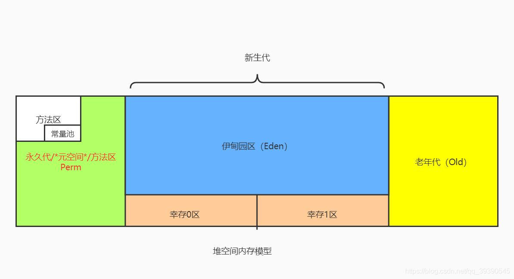

# 1. 你遇到过哪些 OOM 的情况？什么原因造成的？怎么解决的？
### Java heap space
当堆内存(heap space)没有足够空间存储新创建的对象时，就会抛出`java.lang.OutOfMemoryError:Java heap space`错误

常见导致原因：
* 请求创建一个超大对象，通常是一个大数组
* 过度使用终结器 finalizer，导致对象没有立即被 GC
* 内存泄漏，大量对象没有被释放，JVM 无法对其进行回收，常见于使用了 File 等资源没有回收

解决方法：
* 大部分情况下只需要通过`-Xmx`参数提高 JVM 堆内存空间即可
* 如果是超大对象，检查其合理性，比如是否一次性查询了数据库的全部结果，而没有做结果数限制
* 如果是内存泄漏，需要找到对应的业务逻辑，修改代码设计
* 如果是业务峰值压力，考虑添加机器资源，或者做限流降级

### GC overhead limit exceeded
当 Java 花费 98% 以上的时间执行 GC 但只恢复了不到 2% 的内存，且该动作连续重复了 5 次，就会抛出`java.lang.OutOfMemoryError:GC overhead limit exceeded`错误。
该错误说明应用程序已经基本耗尽了所有可用内存，GC 也无法回收。

该错误的导致原因和解决方法跟 Java heap space 类似。

### Permgen space
该错误表示永久代 Permgen space 已经用满。

导致原因：通常是因为加载的 class 数目太多或体积太大。Permgen 的使用量与加载到内存的 class 的数量/大小正相关。

解决方案：根据报错的时机，有不同的解决方案
* 程序启动报错：修改`-XX:MaxPermSize`启动参数，调大永久代空间
* 应用重新部署时报错：可能时应用没有重启，导致加载了多份 class 信息，只需重启 JVM 即可解决
* 运行时报错：应用程序可能动态的创建了大量的 class，而这些 class 的生命周期很短，但 JVM 默认不会卸载 class，可以设置`-XX:+CMSClassUnloadingEnabled 和 -XX:+UseConcMarkSweepGC`两个参数允许 JVM 卸载 class

### Metaspace
JDK 1.8 使用 Metaspace 替代了永久代，该错误表示 Metaspace 已被用满，通常是因为加载的 class 数目太多或体积太大。

此类问题的原因与解决方法跟 Permgen space 非常类似。需要特别注意的是调整 Metaspace 空间大小的启动参数为`-XX:MaxMetaspaceSize`

# 2. 说说 JVM 的内存结构
### 堆内存 (java heap)
堆内存是线程共享的内存区域，在虚拟机启动时创建，此内存区域用来存放对象实例，几乎所有的对象实例都在这里分配内存。

堆是垃圾收集器管理的主要区域，因此很多时候也被称为 GC 堆。其还可以细分为新生代和老年代，其中新生代又分为 Eden 区、From Survivor 空间、To Survivor 空间，三者默认按照 8：1：1 的比例分配。

### 方法区 (method area)
方法区也是线程共享的区域，此区域用于存储已被虚拟机加载的类信息、常量、静态变量、JIT 编译器编译的代码等数据。虽然 Java 虚拟机规范将方法区描述为堆的一个逻辑部分，但它有一个别名 Non-Heap。

### 程序计数器 (Program Counter Register)
程序计数器是一块比较小的内存空间，它的作用可以看作是当前线程执行的字节码的行号指示器，字节码解释器工作时就是通过改变这个计数器的值来选取下一条需要执行的字节码指令，分支、循环、跳转、异常处理、线程恢复等基础功能都需要依赖这个计数器来完成。

此内存区域是唯一一个在 Java 虚拟机规范中没有规定任何 OOM 的区域。

### JVM 栈

### 本地方法栈

