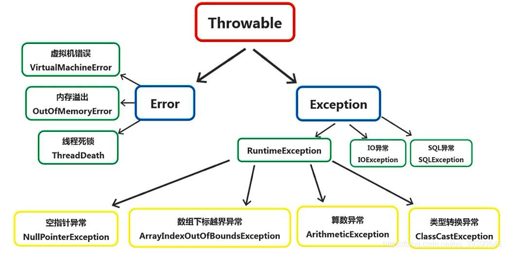

# 1. Java 中操作字符串的有哪些类？他们之间有什么区别？
* String 声明的是不可变的对象，每一次操作都会生成新的 String 对象，然后将指针指向新生成的对象。
* StringBuilder 和 StringBuffer 都可以在原对象的基础上进行操作。两者之间最大的区别是：StringBuilder 是线程不安全的；StringBuffer 是线程安全的。

|  | String | StringBuffer | StringBuilder |
| --- | --- | --- | --- |
| 是否可变 | 不可变 | 可变 | 可变 |
| 功能 | 每次对 String 的操作都会在常量池中生成新的 String 对象 | 其指向的字符串的任何操作都不会产生新的对象。每个 StringBuffer 对象都有一定的缓冲区容量，字符串大小没有超过容量时，不会分配新的容量；超过容量时自动扩容 | 功能与 StringBuffer 基本相同，但是不存在同步锁，速度更快 | 
| 线程安全性 | 线程安全 | 线程安全 | 线程不安全 |
| 使用场景 | 单次操作或循环外操作字符串 | 多线程操作字符串 | 单线程操作字符串 |

## 1.1 追问：这三者在效率上有什么区别？
StringBuilder(字符串变量，无同步锁) > StringBuffer(字符串变量，有同步锁) > String(字符串常量)

## 1.2 追问：StringBuffer 和 StringBuilder 的线程安全差别体现在哪里？
在源码中，StringBuilder 的很多方法被 Synchronized 关键字修饰。

那么 String 是不是也是不安全的呢？讨论这个问题没有意义，因为 String 是不可变的，县城对于堆中指定的一个 String 只能读取无法修改，故不存在安全性问题。

# 2. 请说一下 Error 和 Exception 的区别是什么？
Error 和 Exception 都是 Throwable 的子类，在 Java 中，只有 Throwable 类型的实例才能被抛出和捕获，他是异常处理机制的基本类型。

* Exception 是程序运行中可以预料的意外情况，可以且应该被捕获进而进行相应的处理，Exception 又分为可检查异常(checked)和不可检查异常(unchecked)
  * 可检查异常在源码中必须显示的进行捕获处理，这是编译期检查的一部分
  * 不可检查异常指运行时异常，例如 NullPointerException、ArrayIndexOutOfBoundsException 等，这类异常是可以避免的逻辑错误，具体需要根据逻辑来判断，不会在编译器强制要求  
* Error 是指正常情况下不太可能出现的情况。大部分的 Error 会导致程序处于非正常的、不可恢复的状态

# 3.  == 和 equals() 的区别是什么？
* ==：其作用是判断两个对象的地址是否相同，即判断两个对象到底是不是同一个对象(基本数据类型比较的值，引用数据类型比较的是内存地址)
* equals()：其作用也是判断两个对象是否相等
  * 当类没有重写 equals() 方法时，其通过 == 比较两个对象
  * 若类重写了 equals() 方法，则根据相应逻辑进行判断(一般我们都会重写该方法，来判断两个类是否相等)
    
## 3.1 追问：重写 equals() 时为什么需要重写 hashcode() 方法？
在重写 equals() 方法时有必要对 hashcode() 方法一并重写，尤其是我们想将该类存储在集合中时。

如果只重写了 equals() 方法，那么在使用 equals() 方法时两个相同的对象，在存入集合比较 hashcode 值时却不同，那么 HashMap 就会认为这是两个对象，从而出现矛盾。

# 4. 说一下抽象类和接口的区别？
从设计层面来讲，抽象类是对类的抽象，是一种模板设计；接口是对行为的抽象，是一种行为的规范。

|  | 抽象类 | 接口 |
| --- | --- | --- |
| 继承 | 一个类只能继承一个父类 | 一个类可以继承多个接口 |
| 普通成员变量 | 抽象类可以存在普通成员变量 | 接口不存在普通成员变量 |
| 静态成员变量 | 抽象类可以存在静态成员变量，访问类型任意 | 接口可以存在静态成员变量，默认为 public static final 类型 |
| 构造方法 | 抽象类可以存在构造方法 | 接口不存在构造方法 |
| 抽象方法 | 访问类型可以是 public 或 protected | 访问类型默认 public abstract |
| 静态方法 | 抽象类可以存在静态方法 | 接口中不能存在静态方法 (注：Java8 中接口引入默认方法和静态方法) |

## 4.1 追问：对于接口和抽象类应该如何选择？
* 对于行为模型应该通过接口进行限制和定义
* 需要规范子类的行为，提供通用的功能时使用抽象类

## 4.2 追问：说一说你对抽象类的理解
我们常说面向对象编程的核心思想是先抽象，后具体。

抽象类是含有抽象方法的类，其不可被实例化，经常被当作模板类来使用。例如，有这么一个 Person 抽象类，其规定了所有人类都遵循的行为：吃饭eat()、睡觉sleep()、工作work()。
但对于每一个人类个体来说，吃饭和睡觉的行为是相同的，但每个人的岗位不同，所以工作行为不同，此时就将 work() 方法定义为抽象方法，由继承的子类自身去实现。
所以，当父类中的某段代码不确定，需要由子类去实现的时候，就应用模板方法设计模式。

## 4.3 追问：用抽象类实现一个接口，和用普通类实现有什么不同？
使用普通类继承接口，该类就必须要实现接口中定义的所有方法，这样可能会导致普通类中需要实现多余的方法，造成代码冗余。
使用抽象类来实现接口，就可以只实现接口中的部分方法，当其他的类继承这个抽象类时，可以去实现接口中存在但抽象类并未实现的方法。

## 4.4 追问：抽象类能使用 final 修饰么？
不可以！定义抽象类的目的就是让其它类去继承的，定义为 final 则不可被继承，故 final 不能修饰抽象类。

# 5. final 在 Java 中有什么作用？
final 在 Java 中用于修饰类、方法和属性。

* 修饰类：表明该类不能被其它类所继承，被修饰的类中的所有成员方法都会被隐式的定义为 final 方法；
* 修饰方法：表明该方法被锁定，防止子类重写；若方法同时被 private 修饰，那么子类将不能直接继承该方法，此时子类中可以自身定义同名的新方法，不会与 final 冲突；
* 修饰变量：表明该变量在初始化之后便不能再改变，被修饰的变量必须显式的进行初始化 (声明时初始化或构造函数中初始化)；当函数的参数被 final 修饰时，表明该参数是只读类型的，可以使用，但无法改变其值。

## 5.1 追问：说一下 final、finally、finalize 的区别
* final：可以修饰类、方法、变量，修饰类表示该类不可被继承，修饰方法表示该方法不可被子类重写，修饰变量表示该变量在初始化后其值不可变。
* finally：用于 try-catch 代码块，在处理异常时，将一定要执行的代码放在 finally 当中，一般用来存放一些关闭资源的代码。
* finalize：Object 类的一个方法，一般由垃圾回收器调用，当我们调用 System.gc() 方法时，由垃圾回收器调用 finalize() 方法回收垃圾，是一个对象可否被回收的最后判断。

# 6. 对 Java 序列化有了解么？
* 序列化：是指将一个 Java 对象转换成二进制内容，实际上就是一个 byte[] 数组。序列化后的 byte[] 数组可以保存在文件当中，或者通过网络传输。通过序列化可以将 Java 对象存储到磁盘或者通过网络传输出去。
* 反序列化：将一个二进制内容 byte[] 数组转换成 Java 对象，通过反序列化可以从磁盘或者网络传输中读取 Java 对象。

序列化的使用示例：
* 以面向对象的方式将数据存储到磁盘(Redis 存储 Java 对象)
* 将程序的状态保存在磁盘上(保存游戏状态)
* 通过网络以表单形式发送数据(数据库查询结果封装为实体类返回)

一个 Java 对象要想序列化，必须继承 java.io.Serializable 接，该接口没有定义任何方法(我们称这样的空接口为“标记接口”)。

## 6.1 追问：Java 序列化是如何工作的？
JVM 负责编写和读取可序列化对象的过程，序列化和反序列化的功能通过流类的两个方法实现：
* `ObjectOutputStream.writeObject(Object)`：将可序列化的对象写入流。若要序列化的某些对象未实现 Serializable 接口，则会引发 NotSerializableException。
* `ObjectInputStream.readObject(Object)`：从输入流读取，构造并返回一个对象。如果找不到序列化对象的类，则会引发 ClassNotFoundException。

若序列化使用的类有问题，则两种方法都会引发 InvalidClassException；如果发生 io 错误，则会引发 IOException。(InvalidClassException 与 NotSerializableException 都是 IOException 的子类)

[序列化的使用和示例](https://zqf787351070.github.io/myblog/docs/JAVA/Base/%E5%BA%8F%E5%88%97%E5%8C%96.html)

## 6.2 追问：什么是 serialVersionUID 常数？
serialVersionUID 是一个常数，用于唯一标识可序列化类的版本。从输入流构造对象时，JVM 在反序列化过程中检查此常数。
如果正在读取的对象的 serialVersionUID 与类中指定的 serialVersionUID 不同，则抛出 InvalidClassException，这是为了确保正在构造的对象与对应的类兼容。

serialVersionUID 是可选的，如果不显式声明，则将会自动生成一个。一般建议显式的声明 serialVersionUID，原因如下：
自动生成的 serialVersionUID 是根据类的元素(成员变量、方法、构造方法等)生成的，这些元素的变化将导致 serialVersionUID 改变。如果我们编写了一个类，在后续开发中对类添加了方法，那么其 serialVersionUID 也发生改变。那么在我们反序列化之前编写的对象时，因为 serialVersionUID 不同，就会导致异常无法反序列化。

## 6.3 追问：知道什么是瞬时变量么？
被关键字 transient 修饰的变量为瞬时变量，JVM 在序列化的过程中将跳过瞬态变量。

如果我们在序列化过程中不希望某些成员变量被序列化，那么可以使用 transient 进行修饰。(如密码等信息)

