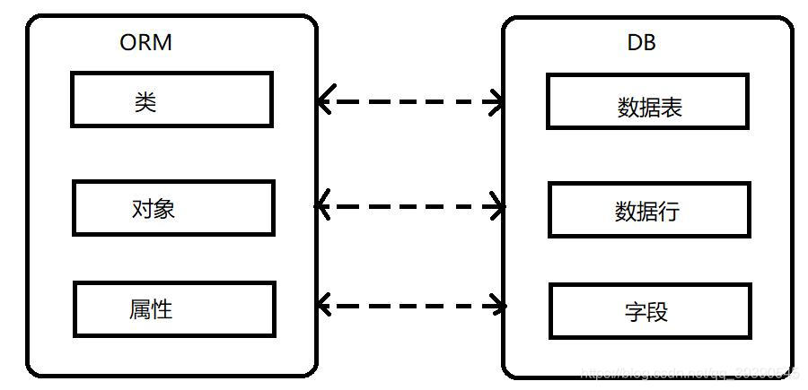

# 1. 谈谈你对 ORM 框架的理解，常见的 ORM 框架有哪些？
ORM (Object Relational Mapping) 即对象关系映射，其主要实现对象到关系型数据库数据的映射。



因为原生的 JDBC 方式效率低，且需要写一大堆模板代码。ORM 是对 JDBC 的封装，我们可以直接使用，不需要重复的造轮子。

目前比较常见的 ORM 框架有 MyBatis、Hibernate、JPA 等...

## 1.1 追问：常见的 MyBatis 框架有哪些优势？
* 入门简单，熟悉 SQL 语句的话即学即用
* 支持注解，面向接口开发
* 使用灵活，对于复杂 SQL，动态 SQL 的编写更加灵活
* 高度封装，使开发人员可以专注于业务逻辑，提高开发效率

# 2。 比较一下 MyBatis 和 Hibernate
MyBatis 和 Hibernate 都支持 JDBC 和 JTA 事务，两者都可以通过 SessionFactoryBuilder 由 XML 配置文件生成 SessionFactory，然后由SessionFactory 生成 Session，由 Session 来开启和执行事务和 SQL 操作。

MyBatis 优势：
* MyBatis 可以进行更为细致的 SQL 优化，减少查询字段
* MyBatis 更易于掌握

Hibernate 优势：
* Hibernate 对 DAO 层的开发比 MyBatis 简单，MyBatis 需要维护 SQL 和结果集映射
* Hibernate 对于对象的维护和缓存优于 MyBatis，对增删改查的对象的维护更方便
* Hibernate 数据库移植性好，MyBatis 移植性差，不同的数据库需要写不同的 SQL
* Hibernate 有更好的二级缓存机制，可以使用第三方缓存，MyBatis 本身提供的缓存机制不佳

## 2.1 追问：MyBatis 和 Hibernate 的缓存机制有哪些区别？
* 相同点：
  * Hibernate 和 Mybatis 的二级缓存除了采用系统默认的缓存机制外，都可以通过实现你自己的缓存或为其他第三方缓存方案，创建适配器来完全覆盖缓存行为。
* 不同点：
  * Hibernate 的二级缓存配置在 SessionFactory 生成的配置文件中进行详细配置，然后再在具体的表-对象映射中配置是那种缓存。
  * MyBatis 的二级缓存配置都是在每个具体的表-对象映射中进行详细配置，这样针对不同的表可以自定义不同的缓存机制。并且 Mybatis 可以在命名空间中共享相同的缓存配置和实例，通过 Cache-ref 来实现。

# 3. MyBatis 中的 # 和 $ 有什么区别？
|  | # | $ |
| --- | --- | --- |
| 字符拼接 | # 将传入的数据当作一个字符串，会将传入的数据添加一个双引号，再拼接到 SQL 语句中 | $ 将传入的数据直接拼接在 SQL 中，试想采用这种方式传入`;drop table user`会如何？ |
| SQL 注入 | # 能很大程度的防止 SQL 注入 | $ 方式无法防止 SQL 注入 |
| 使用 | # 一般用于拼接查询参数 | $ 一般用于拼接数据库对象，如表名等 |

综上所述，我们在编写 MyBatis 映射语句时，能用 # 就尽量不用 $；如果不得已一定要使用 $，则需要做好过滤，防止 SQL 注入攻击。

## 3.1 追问：什么是 SQL 注入？
SQL 注入是一种代码注入技术，用于攻击数据驱动的应用，恶意的 SQL 语句被插入到执行的实体字段中，导致数据库数据泄露，更严重的会导致数据库的结构丢失。

所以我们在应用中需要采取一些手段来防备 SQL 注入攻击，如在一些安全性要求很高的应用中(如银行软件)，常采用将 SQL 语句替换为存储过程的方式防止 SQL 注入。

## 3.2 追问：Mybatis 是如何防止 SQL 注入的？
MyBatis 启用了预编译功能，我们编写好的 SQL 中的 #{...} 字段将在预编译中使用占位符 ？ 代替；而在执行时，直接使用我们传入的参数替代占位符即可。
SQL 注入只能对编译过程起作用，所以采用预编译的方式能很好地避免 SQL 注入的问题。

# 4. 谈一谈你对 MyBatis 的理解
MyBatis 是一个持久层的框架
* 轻量级的框架，没有第三方依赖
* 降低 SQL 和业务代码的耦合，提供 DAO 层，使业务逻辑和数据访问逻辑分离，提高可维护性
* 高效的映射关系，支持对象与数据库中的 ORM 字段关系映射
* 提供 XML 标签，支持动态 SQL

## 4.1 追问：说一下 NyBatis 的原理和工作流程
1. 读取 MyBatis 配置文件：mybatis-config.xml 提供 MyBatis 的全局配置文件
2. 加载映射文件xml：加载 SQL 映射文件，该文件配置了操作数据库的 SQL 语句
3. 构造会话工厂：通过配置信息构造会话工厂 SqlSessionFactory
4. 创建会话对象：由 SqlSessionFactory 创建 SqlSession 对象，该对象包含执行 SQL 语句的所有方法
5. Executor 执行器：MyBatis 底层定义了一个 Executor 接口来操作数据库，它将根据 SqlSession 提供的参数动态的生成需要执行的 SQL 语句，同时负责查询缓存的维护
6. MappedStatement 对象：在 Executor 接口的执行方法中有一个 MappedStatement 类型的参数，该参数封装映射信息，存储要映射的 SQL 语句的 id、参数等信息
7. 输入参数映射：输入参数类型可以是 Map、List 等集合类型，也可以是基本数据类型和 POJO 类型。输入参数映射过程类似于 JDBC 对 preparedStatement 对象设置参数的过程
8. 输出参数映射：输出结果类型可以是 Map、 List 等集合类型，也可以是基本数据类型和 POJO 类型。输出结果映射过程类似于 JDBC 对结果集的解析过程

图示：


## 4.2 列举几个 MyBatis 的核心组件，并解释一下用处
| 组件 | 功能 |
| --- | --- |
| SqlSessionFactory | 根据配置文件构造会话工厂 SqlSession |
| SqlSession | MyBatis 的顶层 API，用于和数据库交互的会话，完成必要的数据库增删改查功能 | 
| Executor | MyBatis 执行器，是调度核心，负责 SQL 语句的生成和查询缓存的维护 | 
| MappedStatement | 维护一条`<insert>/<update>/<delete>/<select>`节点的封装 |

# 5. 说一下 MyBatis 的动态 sql
动态 sql 是指在进行 sql 操作的时候，根据传入的参数对象或者参数值，动态的去判断是否为空、循环、拼接等情况，用于辅助开发者更方便的进行半自动化的 SQL 开发

Mybatis 动态 sql 可以让我们在 xml 映射文件内，以标签的形式编写动态 sql，完成逻辑判断和动态拼接 sql 的功能

常用的动态 sql 标签：`<where>/<if>/<foreach>`

## 5.1 追问：xml 文件中常用的标签有哪些？
* `<insert>/<update>/<delete>/<select>`
* `<where>/<if>/<foreach>`
* `<resultMap>/<parameterMap>/<sql>/<include>/<namespace>`

## 5.2 追问：MyBatis 都存在哪些银蛇形式？
1. sql 列别名，将列的别名定义为对象的属性名，使查询返回结果列名与实体类的属性名保持一致，缺点是不方便维护。
2. 使用 resultMap 标签，逐一定义查询返回结果的列明与对象属性名之间的映射关系，处理起来比较清晰，但相对麻烦。

示例：
```sql
<resultMap type="com.xxxx.entity.Task" id="task">
	<id column="taskId" property="id"/>
	<result column="create_by" property="createBy"/>
	<result column="create_time" property="createTime"/>
	<result column="update_by" property="updateBy"/>
	<result column="update_time" property="updateTime"/>
</resultMap>
```

## 5.3 追问：MyBatis 中有哪些接口绑定方式？
1. 在接口上直接使用`@Select/@Update`等包含 sql 语句的注解来绑定，适用于 sql 语句比较简单的情况。
2. Mapper 标签绑定，使用`<namespace> + <id>`对接口进行唯一绑定。

# 6. 解释一下 MyBatis 的一级缓存和二级缓存？
### 一级缓存
一级缓存是 SqlSession 级别的缓存。在操作数据库是需要构造 sqlSession 对象，该对象中存在一个数据结构用于存储缓存数据。不同的 sqlSession 中缓存数据的区域互不影响。

用户发起查询请求，sqlSession 会先从缓存中查找，如果命中缓存则立即返回，如果没有就执行数据库查询，将查询数据放入一级缓存并返回。如果 sqlSession 执行 commit 即增删改的操作，则会清空缓存，避免脏读。

### 二级缓存
二级缓存是 mapper 级别的缓存，多个 SqlSession 可以操作同一个 mapper 的 sql 语句，故多个 SqlSession 可以共用二级缓存。

在实际开发中，Spring 整合 MyBatis，Spring 将事务放在 Service 中管理，对于每一个 service 来说，其中的 sqlSession 是不同的，因为是通过 mybatis-spring 中的 org.mybatis.spring.mapper.MapperScannerConfigure 创建 sqlSession 自动注入到 service 中的。
每次查询之后都要进行关闭 sqlSession，关闭之后数据即被清空。所以 Spring 整合之后，如果没有事务，一级缓存是没有意义的。

## 6.1 追问：二级缓存的配置方式
MyBatis 对二级缓存的支持粒度很细，它可以指定一条查询语句是否使用二级缓存。

二级缓存的3个必要配置：
1. MyBatis 支持二级缓存的总开关，全局配置变量：`cacheEnable = true`
2. 该 select 语句所在的 Mapper，配置`<cache>`或`cached-ref`节点
3. 该 select 语句参数`useCache = true`


