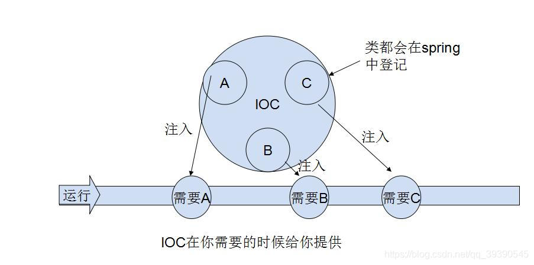
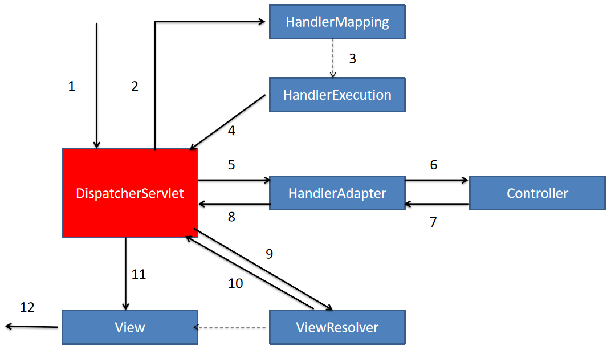
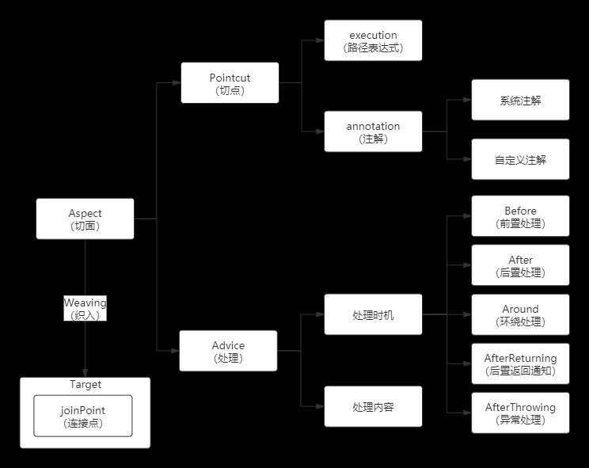

# 1. 简单说一下对 Spring 框架的理解
Spring 是一种轻量级的框架，用于提高开发人员的开发效率和可维护性，其包含多个模块可以方便的协助开发人员进行开发，包括：
* Spring Core：Core 封装包是框架的基础，其提供 IOC 和依赖注入的特性。
* Spring AOP：Spring 的 AOP 库，其提供了 AOP 机制，并提供常用的拦截器供用户自定义和配置。
* Spring JDBC：负责 Java 数据库连接。
* Spring JMS：负责 Java 消息服务。
* Spring ORM：用于支持常用的 Hibernate、MyBatis 等 ORM 框架，其本身不实现 ORM，仅对常见的 ORM 框架进行封装和管理。
* Spring WEB：WEB 模块对常见的框架如 Struts X、SpringMVC、JSF 等提供支持，其能管理这些框架，将 Spring 资源注入给框架，也可以在这些框架的前后插入拦截器。
* Spring TEST：提供对 JUnit 单元测试的支持。

# 2. 谈一谈你对 Spring IOC 的理解
IOC (Inversion Of Control，控制反转) 是一种设计思想，将创建对象的控制权交由 Spring 框架进行管理。 IOC 在其他语言中也有应用，非 Spring 特有。

IOC 容器是实现 IOC 的载体，其实际上就是一个 Map(key, value)，其中存放的是各种对象。



将对象间的依赖关系交给 IOC 来管理，并由 IOC 容器完成对象的注入，这样就可以很大程度上简化应用的开发，把应用从复杂的依赖关系中解放出来。
IOC 容器就像一个工厂一样，当我们需要创建一个对象时，只需要配置好配置文件或者注解即可，而不需要考虑对象是如何创建的。

## 2.1 追问：Spring 中 Bean 的作用域有哪些？
| 作用域 | 解释 |
| --- | --- |
| singleton | 唯一 bean 实例，Spring 中的 bean 默认都是单例的 |
| prototype | 每一次请求都会创建一个新的 bean 实例 |
| request | 每一次 HTTP 请求都会产生一个新的 bean，该 bean 仅在当前 HTTP request 内有效 |
| session | 每一次 HTTP 请求都会产生一个新的 bean，该 bean 仅在当前 HTTP session 内有效 |
| global-session | 全局 session 作用域，Spring 5 中取消 |

## 2.2 追问：Spring 中 Bean 的生命周期？
* 通过构造器创建 bean 实例（无参数构造）
* 为 bean 的属性设置值和对其他 bean 的引用（调用 set 方法）
* 回调 Aware 方法（Aware系列接口，主要用于辅助Spring bean访问Spring容器）  
* 把 bean 实例传递给 bean 后置处理器方法 postProcessBeforeInitialization
* 调用 bean 的初始化方法（需要配置初始化的方法 initMethod）
* 把 bean 实例传递给 bean 后置处理器方法 postProcessAfterInitialization
* 使用 bean（对象获取完成）
* 当容器关闭时，调用 bean 的销毁方法（需要配置销毁的方法 destroyMethod）

## 2.3 追问：Spring 中的 Bean 是线程安全的么？
Spring 容器中的 Bean 本身没有提供线程安全策略，因此可以说 Bean 本身不具备线程安全的特性，但是具体还要作用域来讨论：
* 若为 prototype 作用域的 bean，其每次都创建一个新对象，不同线程之间 bean 不共享，因此也不存在线程安全的问题
* 若为 singleton 作用域的 bean，所有线程共享一个实例 bean，因此可能存在线程安全的问题：
  * 如果 bean 是无状态的 bean，即其内部没有实例变量的对象，不能存储数据，是不变类，则其是线程安全的，如 Controller、Service、Dao 类等
  * 如果 bean 是有状态的 bean，可以保存数据，则该 bean 就是线程不安全的
    
对于有状态的 bean (如 ModelAndView)，就需要自行保证线程安全。最简单的方法就是改变 bean 的作用域。
也可以采用 ThreadLocal 来解决线程安全问题，为每一个线程提供一个独立的变量副本空间，不同的线程只操作自己线程的副本变量。

### ThreadLocal
ThreadLocal 用于在一个线程内进行状态的传递。

很多时候，我们在线程内调用的方法需要传入参数，而方法内部又调用很多方法，同样也需要参数，这样如果全部进行传参的话就会导致某些参数传递到所有地方。
像这种在一个线程中横跨若干个方法调用，需要传递的对象，我们称为上下文 Context，它时一种状态，可以是用户身份、任务信息等等。
Java 库为我们提供了 ThreadLocal 用于在同一个线程中传递同一个对象。

实际上，可以把 ThreadLocal 看作一个全局的 `Map<Thread, Object>`，每个线程获取变量时，总是以 Thread 自身作为 key：
`Object threadLocalValue = threadLocalMap.get(Thread.currentThread());`
因此， ThreadLocal 相当于为每一个线程开辟了独立的存储空间(空间换时间)，各个线程的 ThreadLocal 变量互不影响。

最后需要注意的是，ThreadLocal 一定要在 finally 代码块中清除。
因为当前线程执行完相关代码后，很可能会被重新放入线程池中，如果ThreadLocal没有被清除，该线程执行其他代码时，会把上一次的状态带进去。

ThreadLocal 的实例化：
`static ThreadLocal<User> threadLocalUser = new ThreadLocal<>();`

ThreadLocal 的基本使用：
```java
void processUser(user) {
    try {
        threadLocalUser.set(user);
        step1();
        step2();
    } finally {
        threadLocalUser.remove();
    }
}

void step1() {
    User u = threadLocalUser.get();
    log();
    printUser();
}

void log() {
    User u = threadLocalUser.get();
    println(u.name);
}

void step2() {
    User u = threadLocalUser.get();
    checkUser(u.id);
}
```

# 3. 说一下 SpringMVC 的运行流程



1. 客户端(浏览器)发送请求，请求到达 DispatchServlet
2. DispatchServlet 根据请求信息调用 HandlerMapping，解析请求对应的 handler
3. 解析到对应的 handler (即 Controller 控制器)
4. 将解析后的信息传送回 DispatchServlet
5. HandlerAdapter 表示处理器适配器，其按照特定的规则去执行 Handler
6. handler 执行具体的业务逻辑
7. Controller 将执行的结果返回 HandlerAdapter，如 ModelAndView
8. HandlerAdapter 将 ModelAndView 返回 DispatchServlet
9. DispatcherServlet 调用 ViewResolver (视图解析器)来解析 HandlerAdapter 传递的 ModelAndView
10. ViewResolver 将解析的 View 返回给 DispatcherServlet
11. DispatcherServlet 根据 ViewResolver 解析的视图结果，调用具体的视图
12. 最终视图呈现给用户

## 3.1 追问：介绍一下 SpringMVC 各组件的作用

| 组件 | 名称 | 描述 | 实现 |
| --- | --- | --- | --- |
| DispatchServlet | 前端控制器 | 整个流程的控制中心，由它调用其他组件处理用户的请求。它的存在降低了组件之间的耦合性，提高了系统的扩展性。 | 框架实现 |
| HandlerMapping | 处理器映射器 | 负责根据 url 找到对应的处理器 Handler。SpringMVC 提供了不同的映射器实现了不同的映射方式，不同的映射器按照一定的规则查找，如 xml 配置方式、接口方式、注解方式等。 | 框架实现 | 
| Handler | 处理器 | 在 DispatchServlet 的控制下对用户的具体请求进行处理，涉及业务的处理 | 开发人员实现 |
| HandlerAdapter | 处理器适配器 | 对 Handler 进行执行，这是适配器模式的应用。通过扩展适配器可以对更多类型的处理器进行执行 | 框架实现 |
| ModelAndView | | SpringMVC 的封装对象，将 model 和 view 封装在一起 | |
| ViewResolver | 视图解析器 | 负责将处理结果生成 View 视图。其首先根据逻辑视图名解析成物理视图名即具体的页面地址，在生成 View 视图对象，最后对 View 进行渲染将处理结果通过页面展示给用户 | |
| View | | SpringMVC 的封装对象，是一个接口。一般情况下需要通过页面标签或者页面模板技术将模型数据通过页面展示给用户，需要由开发人员根据业务需求开发具体的页面 | |

# 4. 谈一下你对 AOP 的理解
AOP (Aspect Oriented Programming) 面向切面编程，其主要用于处理一些具有横切性质的系统级服务，如日志记录、事务管理、权限校验等。

在我们日常的开发中，程序中经常会有一些系统级的需求，如日志记录、权限校验等。这些代码穿插在业务逻辑中，使代码冗余且不利于管理维护。采用面向对象的思想，我们可以将这些代码抽离出来写成公共方法，但是还是需要在业务逻辑代码中反复调用。
此时，AOP 就为我们解决了这个问题，它将系统级的需求完全从业务代码中抽离出来，与业务代码分离，在某些节点上将抽离出来的代码切入业务代码中。

使用 AOP 的优势：降低模块的耦合度、使系统易于扩展、提高代码的复用性

AOP 体系梳理：



AOP 的基本概念：

| 概念 | 英文名称 | 描述 |
| --- | --- | --- |
| 切点 | Pointcut | 决定在切入操作在何处切入业务代码。切点分为 execution(路径表达式) 和 annotation(注解) 方式 | 
| 通知 | Advice | 也称处理，即切面对某个连接点所产生的动作。其包括处理时机和处理内容。处理内容即要做什么事，处理时机就是在什么时候执行处理内容，有前置处理、后置处理等 | 
| 切面 | Aspect | 即 Point + Advice | 
| 连接点 | Joint point | 程序执行的一个时间点，比如一个方法的执行或一个异常的处理 |
| 织入 | Weaving | 通过动态代理在目标对象方法中执行处理内容的过程 |

## 4.1 追问：Advice 通知的类型有几种？
| 类型 | 描述 |
| --- | --- |
| 前置通知(Before) | 在目标方法被调用之前调用处理内容 | 
| 后置通知(After) | 在目标方法完成之后调用处理内容，此时不关心方法的输出是什么 | 
| 返回通知(After-returning) | 在目标方法成功执行之后调用处理内容 |
| 异常通知(After-throwing) | 在目标方法抛出异常之后调用处理内容 |
| 环绕通知(Around) | 通知包围了目标方法，在目标方法调用之前和调用之后都调用处理内容 |

## 4.2 追问：在同一个切面 Aspect 中，不同的 Advice 的执行顺序
```
1. around before advice
2. before advice
3. target method
4. around after advice
5. after advice
若无异常：
6. after returning
若有异常：
6. after throwing
7. 异常发生
```

# 5. AspectJ AOP 和 Spring AOP 有什么区别？
| | Spring AOP | AspectJ AOP |
| 适用范围 | 只能在 Spring 容器管理的 bean 上实现 | 可以对所有对象实现 |
| 切入点要求 | 仅支持方法执行切入点 | 支持所有切入点 |
| 织入方式 | 运行时织入(动态代理) | 编译时、编译后、加载时织入(静态代理) |
| 织入能力 | 仅支持方法级编织 | 更强大的织入能力，可编织字段、方法、构造函数等... |
| 代理局限 | 代理由目标对象创建，切面应用在代理上 | 在应用运行之前直接在代码中进行织入 |
| 性能 | 比 AspectJ 慢得多 | 性能优秀 |

## 5.1 追问：了解 JDK 动态代理和 CGLIB 动态代理的原理么？他们有什么区别？
* JDK 动态代理：利用反射机制生成一个实现代理接口的匿名类，它是面向接口的，如果没有通过接口定义业务方法的类，就只能使用 CGLIB 动态代理。其原理是通过在运行期间创建一个接口的实现类来完成对目标对象的代理
* CGLIB 动态代理：是一个基于 ASM 的字节码生成库，它允许我们在运行时对字节码进行修改和动态生成。CGLIB 通过继承的方式实现代理，在子类中采用方法拦截的技术拦截父类方法的调用并织入横切逻辑。其原理是通过字节码底层继承要代理的类，对指定的类生成一个子类，覆盖其中的方法。如果被代理类被关键字 final 修饰，则会代理失败。

### JDK 动态代理
只能对实现了接口的类生成代理。其并不是针对某一个类，而是将目标类型实现的所有接口全部代理。其原理是通过在运行期间创建一个接口的实现类来完成对目标对象的代理。

基本步骤：
* 首先创建接口并创建实现该接口的类，即实际被代理的类
* 定义一个实现 InvocationHandler 接口的类
  * 在该类中通过构造器的方式注入要被代理的类的实例
  * 实现 invoke 方法，进行增强
* 通过 Proxy.newProxyInstance 方法创建代理对象
  * 参数1：类加载器
  * 参数2：被代理接口集
  * 参数3：处理器
* 使用代理对象调用各种方法

### CGLIB 动态代理
cglib 主要针对类实现代理，对其是否实现接口无要求。其原理是对指定的类生成一个子类，覆盖其中的方法。因为是继承，所以被代理的类或者方法不币可以声明为 final 类型。

基本步骤：
* 创建一个普通的类作为代理类
* 创建多个类实现 MethodInterceptor 接口
  * 重写 intercept 方法，编写增强逻辑
  * 在 intercept 中调用 proxy.invokeSuper 执行原生方法的逻辑
* 创建一个类实现 CallbackFilter 接口作为回调拦截器，重写 accept 方法指定对应的调用
* 实例化一个 Enhancer 类对象
  * 使用 setSuperclass 方法设置要代理的父类
  * 使用 setCallbacks 方法设置回调的拦截器数组
  * 使用 setCallbackFilter 方法设置回调选择器
  * 使用 create 方法创建代理对象
* 使用代理对象调用各种方法

# 6. 说一下你常用的 Spring 注解
基于注解允许我们进行一些 Spring 的配置，但是不建议什么都用注解进行配置，因为一旦这些配置需要修改就要改动 class 文件。
因此，建议不会修改或很少修改的配置使用注解，经常修改的配置使用 xml 配置文件进行设置。

[spring 常用注解详解](https://blog.csdn.net/qq_40298902/article/details/107746642?ops_request_misc=%257B%2522request%255Fid%2522%253A%2522162823499716780255286209%2522%252C%2522scm%2522%253A%252220140713.130102334..%2522%257D&request_id=162823499716780255286209&biz_id=0&utm_medium=distribute.pc_search_result.none-task-blog-2~all~top_positive~default-1-107746642.first_rank_v2_pc_rank_v29&utm_term=springboot%E5%B8%B8%E7%94%A8%E6%B3%A8%E8%A7%A3&spm=1018.2226.3001.4187)


