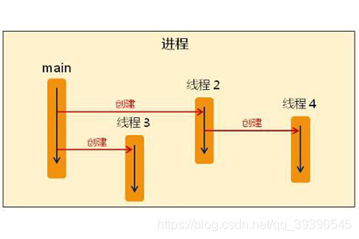
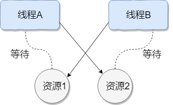

# 1. 简单说一下对进程和线程的理解？

* 进程：一个在内存中运行的应用程序。每个进程都有自己独立的一块内存空间，一个进程可以有多个线程。在 Windows 系统中，一个运行的 XXX.exe 就是一个进程。
* 线程：进程中的一个执行任务(控制单元)，主要负责当前进程中程序的执行。一个进程至少有一个线程，多个线程可以共享数据。

形象比喻：进程 --> 火车；线程 --> 车厢。

## 1.1 追问：进程和线程有哪些区别？
* 进程之间不会相互影响；而一个线程挂掉会导致整个进程挂掉 (一辆火车故障不会导致另一辆火车故障；而火车中的一节车厢故障将导致整个火车故障)；
* 进程可以拓展到多机；线程最多扩展到多核 CPU (不同的火车可以在不同额轨道上行驶，同一火车的车厢不能行进在不同的轨道上)；
* 进程使用的内存地址可以上锁，即一个线程使用某些共享内存时，其他线程必须等待它使用结束，才能使用这一块内存 (火车上的洗手间 -- 互斥锁)；
* 进程使用的内存地址可以限定使用量 (火车上的餐车，最多只允许有限个人进入，满了就需要等待有人出来在进去 -- 信号量)；

# 2. 守护线程和用户线程有什么区别？
* 用户线程：运行在前台，执行具体的任务。如程序的主线程、连接网络的子线程等都是用户线程。用户线程独立存在，不会因为其他用户线程退出而退出。
* 守护线程：运行在后台，为其他非守护线程服务。当所有的用户线程都运行结束时，守护线程随着 JVM 一起结束工作。守护线程依赖于用户线程，当所有用户线程都退出了，守护线程才退出。典型的守护线程如垃圾回收线程。

注意事项：
* setDaemon(true) 必须在 start() 方法之前执行，否则会抛出 IllegalThreadStateException 异常；
* 守护线程中产生的新线程也是守护线程；
* 不是所有的任务都可以分配给守护线程来执行，比如读写操作或者计算逻辑；
* 守护线程中不能依靠 finally 代码块来确保代码一定执行。因为守护线程随着用户线程的结束而结束，故 finally 代码块可能不会被执行；

# 3. 什么是线程死锁？
死锁是指两个或者连个以上的线程在执行过程中，由于资源的竞争或者彼此的通信而造成的一种阻塞现象，若无外力作用他们将永远无法推进任务。
此时成系统处于死锁状态，这些永远相互等待的线程称为死锁线程。

个人理解：凡凡拿着杯子想要从水壶倒水喝；楠楠拿着水壶想要倒水到杯子里喝。导致两个人一直等待下去，谁也喝不到水。

死锁示意图：

## 3.1 追问：形成死锁的四个必要条件是什么？

| 条件 | 描述 |
| --- | --- |
| 互斥 | 某种资源只允许一个线程访问。某资源一旦分配给某一个线程，其他线程便无法再访问，直到占有资源的线程访问结束 |
| 不可抢占 | 某资源已经被占有，需求该资源的线程不可抢夺被占有的资源 |
| 占有且等待 | 一个线程本身占有资源，同时还有资源为得到满足，正在等待其它线程释放该资源 |
| 循环等待 | 每一个线程都占有着其它线程所必须的某些资源 |

上述四个条件全部满足时，必然会造成死锁；若有一个条件不满足，则不会发生死锁。

## 3.2 追问：如何避免死锁？
打破上述的四个必要条件就能有效预防死锁的发生

| 方法 | 描述 |
| --- | --- |
| 打破互斥 | 改造独占性资源为虚拟资源 |
| 打破不可抢占 | 当一个线程占有一个独占性资源而又申请另一个独占性资源但无法得到时，释放原来占有的资源 |
| 打破占有且等待 | 采用资源预先分配策略，在程序运行前申请全部的资源，若满足则运行，不满足则等待，这样就不会一般占有着一边等待其他资源 |
| 打破循环等待 | 实现资源有序分配策略，对线程进行编号，所有线程根据序号递增的形式申请资源 |

# 4. 说一下你对 ReentrantLock 的理解？
ReentrantLock 在 JDK 1.5 引入，拥有与 synchronized 相同的并发性和内存语义，并添加了许多高级功能。ReentrantLock 主要利用 CAS + AQS 实现，支持公平锁和非公平锁。

### CAS(compare and swap)
CAS + volatile 是 java 并发包的基石。synchronized 是一种独占锁，悲观锁；而借助 CAS 指令可以实现乐观锁。CAS 引用乐观锁的思想，每一次拿数据的时候都认为其他线程不会修改这个数据，但是在更新数据的时候，会判断在此期间其他线程是否修改过该数据。
如果发现该数据被其他线程修改且未完成，其并不会像悲观锁一样阻塞线程，而是直接返回，可以重新尝试获取锁，也可以直接退出。

### AQS(AbstractQueuedSynchronizer)
AQS 利用硬件原语指令实现了轻量级的多线程同步机制，其不会引起 CPU 上下文的切换和调度，同时提供了内存可见性和原子性的保证。
AQS 本质上是一个同步器的基础框架，其作用是提供加锁、释放锁，并在内部维护一个 FIFO 队列，用于存储因锁竞争而阻塞的队列。

## 4.1 追问：ReentrantLock 与 synchronized 有什么区别？
两者的共同点：
* 都用来协调多线程对共享对象、变量的访问
* 都是可重入锁，同一线程可以多次获得同一个锁
* 都保证了可见性和互斥性

不同点：

| | ReentrantLock | synchronized | 
| --- | --- | --- |
| 级别 | API 级别 | JVM 级别 |
| 分类 | Lock 是一个接口 | 关键字 |
| 锁的获取 | 可以知道有没有成功获取锁 | 无法得知 |
| 锁的释放 | 显式的获得、释放锁 | 隐式的释放锁 |
| 条件 | Condition 可绑定多条件 | |
| 公平锁/非公平锁 | 可实现公平锁 | 非公平锁 |
| 中断响应 | 可响应中断 | 不可响应中断 |
| 异常处理 | 发生异常时如果不主动通过 unLock() 释放锁，则很可能造成死锁现象，因此使用时需要在 finally 块中去释放锁 | 发生异常会主动释放锁，不会导致死锁 |
| 底层实现 | 同步非阻塞，乐观并发策略 | 同步阻塞，悲观并发策略 |

# 5. 解释一下公平锁和非公平锁
ReentrantLock 可以指定为公平锁或非公平锁，但 synchronized 只能为非公平锁。所谓公平就是指是否按照先来后到的顺序获取锁。

* 公平锁：`new ReentrantLock(true)`，阻塞队列中的线程遵循先入先出的原则，保证锁的公平性
* 非公平锁：在锁被释放后，所有阻塞线程一齐争抢锁，谁能争抢到锁是完全随机的

# 6. 谈一下对 CAS 的理解
CAS 机制使用了三个基本操作数：内存地址、预期值A、替换值B。其规则是，当需要更新一个变量的值的时候，只有当预期值A和内存地址中存储的值的实际值相同时，才将对应地址的值替换为替换值B。

## 6.1 追问：CAS 的缺陷有哪些？
* ABA 问题：某一个线程将 A 改变为 B，然后又将 B 改变为 A，此时 CAS 检查其时符合规则的，便认为没有发生改变。但实际上它已经发生了变化。
  * 解决方法：添加版本号或时间戳，例如 AtomicStampedReference
* 自旋资源消耗：多线程争夺同一个资源时，如果自旋获取锁一直不成功，将会一直占用 CPU
  * 解决方法：破坏循环，可以设定当超过一定的次数或一定的时间时退出
* 多变量共享一致性问题：CAS 操作时是针对一个变量的
  * 解决方法：要对多变量进行操作，可以通过加锁或者封装成对象解决
    
## 6.2 追问：说一下什么是 ABA 问题？如何解决？
ABA：如果另一个线程修改 V 值假设原来是 A，先修改成 B，再修改回成 A。当前线程的 CAS 操作无法分辨当前V值是否发生过变化。

解决方法：使用 “版本号 + 值” 来判断。例如 Java 中的 AtomicStampedReference 类。

