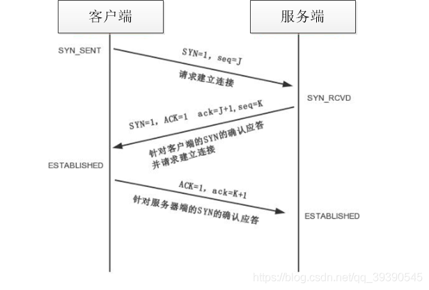
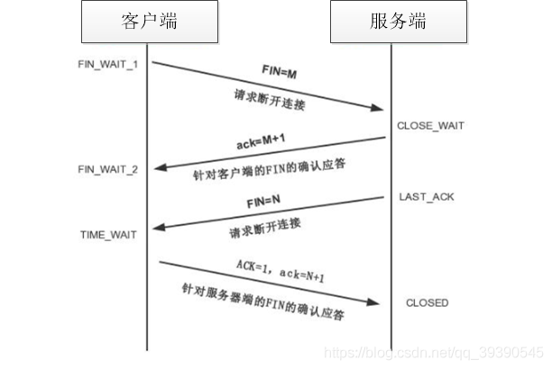
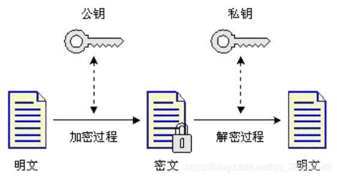

# 1. 说一下 TCP 连接的三次握手和四次挥手
三次握手：三次握手的本质是确认通信双方(Client/Server)收发数据的能力。建立一个 TCP 连接时，需要客户端和服务器总共发送 3 个包，通过这 3 个请求包，来确认双方的接收能力和发送能力是否正常，同时指定自己的初始化序列号为后面的可靠性传输做准备。

三次握手流程图：

* 第一次握手：客户端将标志位 SYN 置为 1，随机产生一个值 seq = J，将数据包发送给服务端，客户端进入 SYN_SENT 状态，等待服务器端确认。
* 第二次握手：服务器接收到数据包后，由标志位 SYN = 1 得知客户端请求建立连接，服务端将 SYN 与 ACK 都置为 1，ack = J + 1，并随机产生一个值 seq = K，将该数据包发送给客户端以确认连接请求，服务端进入 SYN_RCVD 状态。
* 第三次握手：客户端收到确认后，检查 ack 是否等于 J + 1，ACK 是否为 1，如果正确，则将 ACK 置为 1，ack = K + 1，发送数据包给服务端；服务端接收到数据包，检查 ACK 是否为 1，ack 是否为 K + 1，如果正确则连接建立成功，服务器与客户端进入 ESTABLISHED 状态，完成三次握手，之后客户端与服务器之间就可以开始传输数据了。

四次挥手：需要断开一个 TCP 连接时，服务器与客户端总共要发送 4 个数据包以确认连接的断开。这一过程由客户端或服务端的任一方执行 close 触发。

四次挥手流程图：

* 第一次挥手：客户端发送 FIN = M，用以关闭客户端到服务端的数据传送，客户端进入 FIN_WAIT_1 状态。(意思是说我客户端已经没有数据要发送给你了，但是如果你还有数据没有发送完成，则不必急着关闭连接，可以继续发送数据)
* 第二次挥手：服务端收到 FIN 后，先发送一个 ack = M + 1，表明已经收到客户端的断开连接请求。此时客户端进入 FIN_WAIT_2 状态，继续等待服务端的报文。服务端进入 CLOSE_WAIT 状态。
* 第三次挥手：服务端已经确认数据全部发送完毕，向客户端发送 FIN = N，表明数据发送完毕，准备好关闭连接了，服务端进入 LAST_ACK 状态。
* 第四次挥手：客户端收到 FIN = N 的报文，知道可以关闭连接了，便发送 ack = N + 1 给服务端说明已收到，之后进入 TIME_WAIT 状态。如果服务端收到 ACK，就断开连接，客户端等待 2MSL 后依旧没有服务端的回复的话，就说明服务端已经正常关闭，此时客户端即可正常关闭连接。

## 1.1 追问：问什么连接需要三次握手，断开却需要四次挥手？
因为服务端收到客户端发送的 SYN 请求连接报文后，可以直接发送 SYN + ACK 报文，其中 SYN 报文用于同步，ACK 报文用于应答。
而在关闭连接时，服务端收到 FIN 报文后，很可能不会立即关闭 SOCKET，只能先回复 ACK 告知客户端你的请求我收到了。
只有等客户端的所有数据全部发送完毕之后，才能发送 FIN 报文，所以需要四次挥手。
总结来说就是断开连接的时候由任意一方发起，但另外一方此时可能还存在未传送完毕的数据，只有等待数据全部传输完毕才能够断开连接。

## 1.2 追问：如果已经建立了连接，但是客户端突然出现了故障怎么办？
TCP 连接设置有一个保活计时器，如果客户端出现故障，服务端不会一直等待下去白白浪费资源。
服务器每收到一次客户端的请求都会复位这个计数器，该计时器通常设为 2h，若两小时内还没有收到客户端的任何数据，服务器就会发送一个探测报文段，并每隔 75s 发送一次。
如果一连发送 10 个探测报文仍旧没有反馈，那么服务器就认为客户端出现了故障，接着关闭连接。

# 2. 常见的 HTTP 状态码有哪些？

### 状态码的类别
| 状态码 | 状态信息 |
| --- | --- |
| 1XX | informational：信息性状态码 -- 请求正在处理 |
| 2XX | success：成功状态码 -- 请求正常处理完毕 |
| 3XX | redirection：重定向状态码 -- 需要附加操作以完成请求 |
| 4XX | client error：客户端错误状态码 -- 服务器无法处理请求 |
| 5XX | server error：服务器错误状态码 -- 服务器处理请求出错 |

### 2XX 系列状态码
| 状态码 | 状态信息 |
| --- | --- |
| 200 | OK，成功，表示请求在服务端被正确处理 |
| 204 | No content，请求成功但是响应报文不含实体的主体部分 |
| 206 | Partial content，进程范围请求成功 |

### 3XX 系列状态码
| 状态码 | 状态信息 |
| --- | --- |
| 301 | Moved permanently，永久性重定向，表示资源已经被分配了新的 URL |
| 302 | Found，临时性重定向，表示资源被临时分配了新的 URL |
| 303 | See other，表示资源存在着另一个 URL，应该使用 GET 方法获取资源 |
| 304 | Not modified，表示服务器允许访问资源但是请求未满足条件 |
| 307 | Temporary redirect，临时重定向，与 302 类似，但是期望客户端请求方法不变而向新的地址发出请求 |

### 4XX 系列状态码
| 状态码 | 状态信息 |
| --- | --- |
| 400 | Bad request，请求报文存在语法错误 |
| 401 | Unauthorized，表示发送的请求需要有通过 HTTP 认证的认证信息 |
| 403 | Forbidden，表示请求资源的访问被服务器拒绝，可以在实体的主体部分返回原因描述 |
| 404 | Not found，表示在服务器上没有找到请求的资源 |

### 5XX 系列状态码
| 状态码 | 状态信息 |
| --- | --- |
| 500 | Internal sever error，表示服务端在处理请求时发生了错误 |
| 501 | Not implemented，表示服务器不支持当前请求所需要的某个功能 |
| 503 | Service unavailable，表明服务器暂时处于超负载或正在停机维护，无法处理请求 |

# 3. GET 和 POST 请求有哪些区别？
| | GET | POST |
| --- | --- | --- |
| 参数数据类型 | ASCII 字符 | 无限制 |
| 参数长度 | 在 URL 中传送参数的长度是有限制的 | 无限制 |
| 安全性 | 不安全，参数直接暴露在 URL 中，并且会被完整保留在浏览器历史记录中 | 较为安全，参数放在 request body 中 |
| 编码方式| 只支持 url 编码 | 支持多种编码方式 |
| 缓存 | 会被浏览器主动缓存 | 不会被浏览器缓存，除非手动设置 |
| 回退 | 无影响 | 会再次提交请求 |

## 3.1 追问：GET 请求有 Request Body 么？如果有那参数可以像 POST 请求一样放在里面么？
GET 和 POST 在本质上没有区别，都是 HTTP 协议中规定的两种发送请求的方法，底层是 TCP/IP 协议，即他们都是 TCP 连接。
GET 和 POST 能做的事情是完全一样的，在 GET 中加上 Request Body 和在 POST 的 URL 上携带参数，在技术上是完全行得通的。

但是 TCP 协议划分了请求的分类，我们就应该按照规则去使用这些方法。TCP 运输数据，就像一辆辆的货车，如果不进行分类的话，各种货车都是一样的，运作起来一团混乱。
但规定了 GET 类的货车就只能在车顶运输数据；POST 类的货车就只能在车厢中运输数据。各自有各自的功能，这样就显得有条理许多。
当然，如果 GET 想要在车厢里藏些货物，POST 想在车顶堆满货物，也是可以的，但不建议这么做。

## 3.2 追问：URL 中传输的参数的长度有限制么？
之前我们将请求方法比喻成货车，那对应的，客户端和服务端就是运输公司。

理论上来说，我们可以在车顶无限的添加货物(URL 中无线的加参数)，但是运输公司也不傻，装卸货物也需要大量成本，所以他们会限制单次运输量来控制风险，数据量过大对于浏览器和服务器都有很大负担。
大多数浏览器通常会限制 URL 长度在 2K 个字节，大多数服务器最多处理 64K 大小的 URL，超出的部分不再处理。

## 3.3 追问：GET、POST 发送的数据包有什么不同么？
GET 请求时产生 1 个 TCP 数据包；POST 请求时产生 2 个 TCP 数据包。

* GET：浏览器将 http header 和 data 一并发送出去，服务器响应 200
* POST：浏览器先发送 header，服务器响应 100；随后浏览器再发送 data，服务器响应 200

按照之前的思路，GET 请求相当于货车一趟就把货物送到了，而 POST 相当于先跟服务器打个招呼“我又一批货一会送过去”，然后再将货物送出。

# 4. HTTP 和 HTTPS 有什么区别？
|  | HTTP | HTTPS |
| --- | --- | --- |
| 协议 | 运行在 TCP 之上，明文传输，客户端与服务端都无法验证对方身份 | 身披 SSL 外壳的 HTTP，运行在 SSL 之上，SSL 运行于 TCP 之上，是添加了加密和认证机制的 HTTP |
| 端口 | 80 | 443 | 
| 资源消耗 | 较少 | 由于加解密处理，会消耗更多的 CPU 和内存资源 | 
| 开销 | 无需证书 | 需要证书，证书一般需要向认证机构购买 |
| 加密机制 | 无 | 共享密钥加密和公开密钥加密并用的混合加密机制 |
| 安全性 | 弱 | 存在加密机制，安全性强 | 

## 4.1 追问：HTTPS 的工作机制是什么样的？
客户端在使用 HTTPS 方式与 web 服务器通信是有一下几个步骤：
1. 客户端使用 https 的 URL 访问服务器，要求与服务器建立 SSL 连接
2. 服务器收到请求，将网站证书信息(证书中含有公钥)发送给客户端
3. 客户端的浏览器与服务器协商 SSL 连接的安全等级，即信息加密的等级
4. 客户端的浏览器根据双方协定的安全等级，建立会话密钥，然后利用网站的公钥将会话密钥进行加密，传送给服务器
5. 服务器收到信息并利用自己的私钥解密出会话密钥
6. 服务器利用会话密钥加密与客户端之间的通信

# 5. 了解对称加密和非对称加密么？
### 对称加密
对称加密是最快速、最简单的一种加密方式，加密与解密用的是同样的密钥。对称加密有很多种算法，由于他的效率很高，所以被广泛使用在很多加密协议的核心当中。

加解密过程如下：
* 加密：原文 + 密钥 = 密文
* 解密：密文 - 密钥 = 原文

### 非对称加密
显然，非对称加密就是使用不同的密钥进行加密和解密。

非对称加密有两个密钥：公钥(public key)和私钥(private key)。公钥和私钥成对存在，若对原文使用公钥加密，则只能使用对应的私钥才能解密。

非对称加密算法的密钥是通过一些列算法获取的一长串随机数，通常随机数的长度越长，加密信息越安全。通过私钥经过一系列算法是可以推导出公钥的，即公钥是基于私钥存在的。但是无法通过公钥推导出私钥，该过程是单向的。

### 折中的解决方法
密钥二次加密。将对称加密的密钥使用非对称加密的公钥进行加密，然后将二次加密后的密钥发送出去，接收方使用私钥解密出对称加密的密钥，然后双方使用对称加密进行通信。

# 6. 说一下对 Session 和 Cookie 的理解
会话跟踪是 Web 程序中常用的技术，用来跟踪用户的整个会话。常用的会话跟踪技术有 Cookie 和 Session。
* Cookie：通过在客户端记录以确定用户身份
* Session：通过在服务器端记录以确定用户身份

总的来说：Cookie 是服务器给客户端发放通行证来确认身份；Session 是客户端自己维护一张”客户端访客记录表“来确认身份。

### Cookie
在程序中，会话跟踪是很重要的事情。一个用户发出的所有请求都应该属于同一个会话，另一个用户发出的所有请求则应该属于另一个会话。
但 Web 程序使用的是 HTTP 协议传输数据，HTTP 协议是无状态的。一旦数据交换完毕，服务器与客户端之间的连接就会关闭，再次交换数据需要建立新的连接，这也就意味着服务器无法跟踪上一次连接的会话。

Cookie 就是一种弥补 HTTP 协议无状态的不足的一种机制。服务器会给客户端们颁发各自的通行证，每个客户端前来访问服务器时都必须携带着自身的 Cookie，这样服务器就能通过通行证确认客户端的身份。此即 Cookie 的工作原理。

Cookie 实际上是一小段的文本信息。客户端访问服务器时，如果服务器需要记录该用户的状态，就使用 response 向客户端浏览器颁发一个 Cookie，客户端浏览器会将 Cookie 保存起来。
当浏览器再次请求该网站时，浏览器会将请求的 URL 与 Cookie 一起提交给服务器。服务器检查该 Cookie 并以此辨认用户状态。此外，服务器还可以根据需要修改 Cookie 的内容。

### Session
Session 也被用来记录客户端的状态。Session 是服务器端使用的记录客户端状态的机制，使用上较 Cookie 来说简单，但增加了服务器的存储压力。

客户端访问服务器时，如果服务器需要记录该用户的状态，服务器就将客户端的状态 Session 保存在服务器上。当客户端浏览器再次访问时只需要从 Session 中查找该客户端的状态即可。

## 6.1 追问：介绍一下 Session 的生命周期
Session 保存在服务器端。为了获取更高的存取速度，服务器一般将 Session 存放在内存中。Session 的内容应该尽量精简，如果过于复杂将会导致大量客户端访问时造成内存溢出。

Session 在用户第一次访问服务器时自动创建。只用访问 Servlet 和 JSP 等程序才会创建 Session，只访问 HTML、image 等静态资源不会创建 Session。如果没有生成 Session，也可以通过`request.getSession(true)`强制生成 Session。

Session 生成后，只要客户端继续访问，服务器就会更新 Session 的最后访问时间，并对其进行维护。

## 6.2 追问：如何设置 Cookie 和 Session 的有效期？
* Session
  * Session 的超时时间为 maxInactiveInterval 属性，可以通过方法`getMaxInactiveInterval()`获取，通过方法`setMaxInactiveInterval(long interval)`修改。
  * Session 的超时时间也可以通过 web.xml 配置文件进行修改。
  * 调用 Session 的`invalidate()`方法可以使 Session 失效。
* Cookie
  * Cookie 的 maxAge 参数决定 Cookie 的有小区，单位为 s。Cookie 中通过`getMaxAge()`和`setMaxAge()`方法来读写该属性。
  * maxAge 为正数，表明该 Cookie 会在 maxAge 秒后失效。浏览器会将 maxAge 为正的 Cookie 持久化到对应的 Cookie 文件当中；
    maxAge 为负数，表示该 Cookie 尽在本次打开的浏览器窗口中有效，关闭窗口即失效。这种 Cookie 为临时性 Cookie，不会被浏览器持久化；
    maxAge 为 0，表示删除该 Cookie。Cookie 机制没有提供删除 Cookie 的方法，因此通过设置该 Cookie 即时失效达到删除的效果。
    
## 6.3 追问：介绍一下 Cookie 的属性和用处
| 属性 | 描述 |
| --- | --- |
| name(String) | Cookie 的名称，一旦创建名称不可更改 | 
| value(Object) | Cookie 的值。若为 Unicode 字符则需要为字符编码；若为二进制数据，则需要使用 BASE64 编码 |
| maxAge(int) | Cookie 失效时间，单位秒 |
| secure(boolean) | Cookie 是否使用安全协议(HTTPS)传输，默认为 false |
| path(String) | Cookie 的使用路径。若设置为“/sessionWeb/”，则只有路径为"/sessionWeb"的程序可以访问该 Cookie |
| domain(String) | 可以访问该 Cookie 的域名。若设置为".google.com"，则所有以 google.com 结尾的域名都可以访问该 Cookie |
| comment(String) | Cookie 的用处说明 |
| version(int) | Cookie 的版本号 |

## 6.4 Cookie、Session 有哪些区别？
|  | Cookie | Session |
| --- | --- | --- |
| 存储位置 | 客户端的浏览器 | 服务器 | 
| 安全性 | Cookie 存放在客户端本地，不安全 | 存放在服务器，相对安全 | 
| 设置过期 | 设置 Cookie 过期时间可以使其过期 | 使用 session.destroy() 将会销毁会话 |
| 使用 | 单个 Cookie 保存的数据不超过 4K，很多浏览器限制一个站点最多保存 20 个 Cookie | Session 在一定时间内会保存再服务器上，当访问量增大会印象性能。不过其没有数据量的限制，还可以保存更为复杂的数据结构 |
| 生命周期(★) | 永久的保存在本地的文件 | 从 IE 启动到 IE 关闭 |

