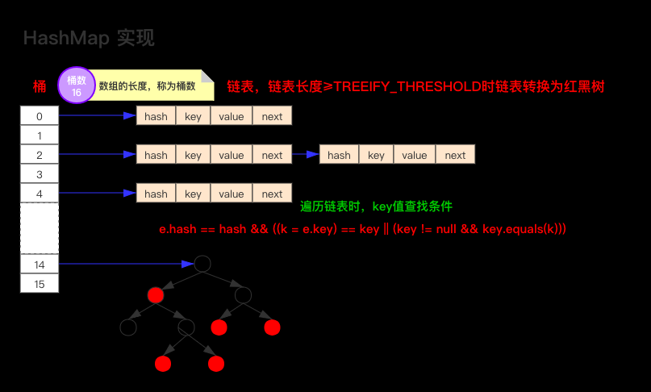
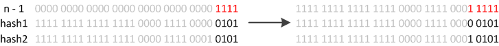

# 1. 对比 Vector、ArrayList、LinkedList 有何区别？适合在什么场景下使用？
三者都实现了集合框架中的 List，即有序集合。

* Vector
  * Java 早期提供的线程安全的动态数组(如果不需要线程安全不建议选择)； 
  * Vector 内部使用对象数组来保存数据，可以根据需要自动扩容。数组满时，会创建一个新的扩容后数组，然后拷贝原数组数据到新数组；
* ArrayList (擅长“查询”和“更新”)
  * 本身不是线程安全的，故性能更好。其与 Vector 相似也可以根据需要调整容量，但 Vector 扩容时提高一倍，ArrayList 只增加 50%；
  * 数据结构：动态数组；
  * 随机查询效率(优势)：ArrayList 在随机访问的时候效率优于 LinkedList。因为 LinkedList 是线性的数据存储方式，需要移动指针从头到尾依次查找，而 ArrayList 可以根据脚标直接锁定位置；
  * 插入和删除效率(劣势)：ArrayList 在插入和删除数据时的效率差于 LinkedList。因为 ArrayList 在插入和删除数据时会影响其他元素的位置(整体移动)，但是对于末尾追加元素的方式效率基本相同；
  * 内存空间占用(优势)：ArrayList 在内存占用方面优于 LinkedList。因为 LinkedList 的节点除了存储数据，还维护了两个引用：一个指向前驱元素，一个指向后继元素；
* LinkedList (擅长“插入”和“删除”)
  * Java 提供的双向链表，不需要调整容量，不保证线程安全；
  * 数据结构：双向链表；
  * 随机查询效率(劣势)
  * 插入和删除效率(优势)：LinkedList 在查询数据时需要从前向后遍历查询，但是在插入数据时只需要记录当前项的前驱元素和后继元素即可，故速度较快；
  * 内存空间占用(劣势)
  
## 1.1 追问：多线程场景下就不能使用 ArrayList 么？
ArrayList 不是线程安全的，如果确实需要在多线程场景下使用 ArrayList，可以通过 Collections 提供的 synchronizedList 方法将 ArrayList 转换成线程安全的容器再使用。

`List<String> syncList = Collections.synchronizedList(arrayList);`

# 2. List 和 Set 有什么区别？
List 和 Set 都继承自 Collection 接口，两者的区别主要体现在以下几点：
* 重复对象：List 允许存在重复的对象；Set 不允许存在重复对象
* null 元素：List 可以插入多个 null 元素；Set 只能够插入一个 null 元素
* 容器是否有序：List 有序，保证每一个元素的插入顺序；Set 无序(TreeSet 通过 Comparator 或 Comparable 维护了一个排序顺序)
* 遍历方式：List 支持 for 循环遍历和迭代器 Iterator 遍历；Set 只能用迭代器遍历，因为它无序
* 常用的实现类：List：ArrayList、LinkedList、Vector；Set：HashSet、LinkedHashSet、TreeSet

## 2.1 追问：List 与 Set 相比效率如何？
* List：可以动态增长，查找元素效率高，插入删除元素效率低，因为会引起其他元素位置的变化；
* Set：插入和删除元素效率高，查询元素效率低(但是理想情况下，不考虑哈希冲突，一次定位即可完成，但是不现实)；

## 2.2 追问：说一下 HashSet 的实现原理
HashSet 底层是基于 HashMap 实现的，能够继承 HashMap 的所有特性，因此其底层的数据结构也是 数组 + 链表 + 红黑树。
HashSet 的操作基本上都是直接调用底层 HashMap 的相关方法来完成，其不允许 key 重复，但是支持 null 对象作为 key。

## 2.3 追问：HashSet 是如何保证 key 不重复的？
HashSet 的元素是不能重复的，故其在业务上经常被用来去重。当我们在 HashSet 中添加一个元素时，调用的是它的 add() 方法。其源码如下：

```java
    public boolean add(E e) {
        return map.put(e, PRESENT)==null;
    }
```

由源码可知，其维护了一个 HashMap 来实现元素的添加，因为 HashMap 的 Key 是不能重复的(通过 hashcode() 与 equals() 方法判断)，而向 HashSet 中添加元素时也是将元素添加到 HashMap 的 key 的位置，这也就决定了 HashSet 中的元素也是唯一的。


# 3. Array 和 ArrayList 有什么区别？
* Array 即数组，可以存储基本数据类型和引用数据类型；而 ArrayList 只能存储引用数据类型
* Array 大小固定；ArrayList 可以自动扩容
* Array 的内置方法没有 ArrayList 多，比如 addAll()/removeAll()/iteration() 等...

Array 与 ArrayList 可以相互转换
* `Array --> List ：Arrays.asList(array);`
* `List --> Array ： list.toArrat(array);`

# 4. 说一下 HashMap 的实现原理



上图为 JDK 1.8 版本中 HashMap 的数据结构，为 数组 + 链表 + 红黑树；在 JDK 1.7 中为 数组 + 链表。

通常将数组中的每一个节点称为桶。当向桶中添加键值对时，首先需要计算 key 的 hash 值，从而确定应该插入哪一个桶。如果要插入的桶已经存在元素，则采用尾插法(JDK 1.7 前为头插法)将当前元素添加在链表的尾部。
当链表的长度超过 8 (TREEIFY_THRESHOLD - 阈值) 时，链表自动转化为红黑树。

## 4.1 追问：如何实现 HashMap 有序？
可以采用 LinkedHashMap 或者 TreeMap。

### LinkedHashMap
内部维护了一个单链表，有头尾节点。其节点 Entry 内部除了继承了 HashMap 的 Node 属性，还维护了 before 和 after 用于标识其前置节点和后置节点，因此可以实现按照插入的顺序或者访问的顺序排序。

源码分析：
```java
transient LinkedHashMap.Entry<K,V> head; // 头节点
transient LinkedHashMap.Entry<K,V> tail; // 尾节点

// 将加入的 p 节点添加到链表末尾
private void linkNodeLast(LinkedHashMap.Entry<K,V> p) {
  LinkedHashMap.Entry<K,V> last = tail;
  tail = p;
  if (last == null)
    head = p;
  else {
    p.before = last;
    last.after = p;
  }
}

// LinkedHashMap 的节点类
static class Entry<K,V> extends HashMap.Node<K,V> {
  Entry<K,V> before, after;
  Entry(int hash, K key, V value, Node<K,V> next) {
    super(hash, key, value, next);
  }
}
```

### TreeMap
TreeMap 实现了 SortedMap 接口，是一个 key 有序的 Map 类。
TreeMap 按照 key 的自然顺序或 Comparator 的排序规则进行排序，其内部通过红黑树实现。
TreeMap 比较规则的制定有两种方法：要么 Key 所存储的类实现 Comparable 接口；要么 TreeMap 自定义实现一个 Comparator 比较器，用于 key 的比较

## 4.2 追问：put 方法的原理是什么？


源码分析：
```java
/**
 * 将指定参数key和指定参数value插入map中，如果key已经存在，那就替换key对应的value
 * @param key 指定 key
 * @param value 指定 value
 * @return 如果 value 被替换，则返回旧的 value；否则返回 null。当然，可能 key 对应的 value 就是 null
 */
public V put(K key, V value) {
    //putVal方法的实现就在下面
    return putVal(hash(key), key, value, false, true);
}
```
```java
/**
 * Map.put和其他相关方法的实现需要的方法
 * @param hash 指定参数 key 的哈希值
 * @param key 指定参数 key
 * @param value 指定参数 value
 * @param onlyIfAbsent 如果为 true，即使指定参数 key 在 map 中已经存在，也不会替换 value
 * @param evict 如果为false，数组table在创建模式中
 * @return 如果 value 被替换，则返回旧的 value，否则返回 null；当然，可能key对应的 value 就是 null
 */
final V putVal(int hash, K key, V value, boolean onlyIfAbsent,boolean evict) {
    Node<K,V>[] tab; Node<K,V> p; int n, i;
    //如果哈希表为空，调用resize()创建一个哈希表，并用变量n记录哈希表长度
    if ((tab = table) == null || (n = tab.length) == 0)
        n = (tab = resize()).length;
    //如果指定参数hash在表中没有对应的桶，即为没有碰撞
    if ((p = tab[i = (n - 1) & hash]) == null)
        //直接将键值对插入到map中即可
        tab[i] = newNode(hash, key, value, null);
    else {
        Node<K,V> e; K k;
        //如果碰撞了，且桶中的第一个节点就匹配了
        if (p.hash == hash &&
            ((k = p.key) == key || (key != null && key.equals(k))))
            //将桶中的第一个节点记录起来
            e = p;
        //如果桶中的第一个节点没有匹配上，且桶内为红黑树结构，则调用红黑树对应的方法插入键值对
        else if (p instanceof TreeNode)
            e = ((TreeNode<K,V>)p).putTreeVal(this, tab, hash, key, value);
        //不是红黑树结构，那么就肯定是链式结构
        else {
            //遍历链式结构
            for (int binCount = 0; ; ++binCount) {
                //如果到了链表尾部
                if ((e = p.next) == null) {
                    //在链表尾部插入键值对
                    p.next = newNode(hash, key, value, null);
                    //如果链的长度大于TREEIFY_THRESHOLD这个临界值，则把链变为红黑树
                    if (binCount >= TREEIFY_THRESHOLD - 1) // -1 for 1st
                        treeifyBin(tab, hash);
                    //跳出循环
                    break;
                }
                //如果找到了重复的key，判断链表中结点的key值与插入的元素的key值是否相等，如果相等，跳出循环
                if (e.hash == hash &&
                    ((k = e.key) == key || (key != null && key.equals(k))))
                    break;
                //用于遍历桶中的链表，与前面的e = p.next组合，可以遍历链表
                p = e;
            }
        }
        //如果key映射的节点不为null
        if (e != null) { // existing mapping for key
            //记录节点的vlaue
            V oldValue = e.value;
            //如果onlyIfAbsent为false，或者oldValue为null
            if (!onlyIfAbsent || oldValue == null)
                //替换value
                e.value = value;
            //访问后回调
            afterNodeAccess(e);
            //返回节点的旧值
            return oldValue;
        }
    }
    //结构型修改次数+1
    ++modCount;
    //判断是否需要扩容
    if (++size > threshold)
        resize();
    //插入后回调
    afterNodeInsertion(evict);
    return null;
}
```

## 4.3 追问：HashMap 的扩容机制
首先需要了解 HashMap 中维护的几个扩容相关的属性：
* `capacity`：容量，默认为 16；
* `loadFactory`：加载因子，默认为 0.75；
* `threashold`：阈值，= 容量 * 加载因子，默认 12。元素数量超过阈值即触发扩容(调用 resize() 方法)。

HashMap 的容量变化存在下列几种情况：
* 空参数的构造函数：实例化的 HashMap 默认内部的数组为 null，没有实例化。该情况下，当第一次调用 put() 方法时，开始初始化扩容，容量为 16。
* 有参构造函数：指定容量。内部会根据指定的正整数寻找不小于该数的 2 的幂次方，并将该幂次方设置为阈值。当第一次调用 put() 方法时，会将阈值赋值给容量，然后将阈值重新赋值为 容量 * 加载因子。
* 非首次扩容：容量将变化为之前的 2 倍，阈值也变为之前的 2 倍。

在扩容时，空间扩大，为使 hash 散列均匀分布，部分元素的位置会发生移动。

### JDK 1.7 扩容后的元素迁移
JDK 1.7 中维护的是链表，当新的扩容后数组准备好之后，遍历每一个桶，然后遍历桶中的元素，重新计算其 hash 值，找到该元素在桶中的新位置，以头插法插入链表。

问题：头插法会导致新旧链表的元素位置发生改变；元素迁移过程中在多线程的场景下可能会触发死循环(无限进行链表反转)。

### JDK 1.8 扩容后的元素迁移
因为数组的容量是以 2 的幂次方进行扩容的，所以一个 Entity 哎扩容时，新的位置要么就是在原位置，要么就是原位置 + 原长度的位置。



数组变为原来的两倍，表现在二进制上就是多了一个高位参与数组下标的确认，此时，我们只需要判断该高位是 0 还是 1 即可：
* 若为 0 ：说明还在原位置
* 若为 1 ：说明移动到原位置 + 原容量的位置

此外，JDK 8 在迁移元素时是正序的，不会出现链表反转；如果桶内的元素超过 8 个，则链表将会转换成红黑树，提高查询效率。

## 4.4 追问：HashMap 在 JDK 1.8 做了哪些优化？
| | JDK 1.7 | JDK 1.8 |
| --- | --- | --- |
| 存储结构 | 数组 + 链表 | 数组 + 链表 + 红黑树 |
| 初始化方式 | inflateTable() | 集成到了扩容函数 resize() 中 |
| hash 值的计算 | 9 次扰动处理 = 4 次位运算 + 5 次异或运算 | 2 次扰动处理 = 1 次位运算 + 1 异或运算 |
| 数据存放规则 | 无冲突时存放数组；冲突时存放链表 | 无冲突时存放数组；冲突且链表长度<8时存放链表；冲突且链表长度>8时树化并存放红黑树 |
| 数据插入方式 | 头插法(先将所有数据后移一位，再插入数据至头节点) | 尾插法(直接插入链表尾部或红黑树) | 
| 扩容后存储位置的计算 | 全部按照原先方法进行计算(h & length - 1) | 按照扩容后的规律计算(看高位是 0 or 1) |
| 扩容 | 先判断是否需要扩容，再插入 | 先插入，然后再判断是否需要扩容 |

## 4.5 追问：链表和红黑树如何相互转换？
* 链表 --> 红黑树：阈值为 8
* 红黑树 --> 链表：阈值为 6

经计算，在 hash 函数设计合理的情况下，连续发生 8 次 hash 碰撞的概率是百万分之 6 ，从概率上讲，阈值为 8 已足够。
至于红黑树转链表的阈值为 6，是为了防止 hash 碰撞次数在 8 附近徘徊可能频繁导致的链表和红黑树的相互转化。

# 5. HashMap 是线程安全的么？
不是线程安全的：
* JDK 1.7：会产生死循环、数据丢失、数据覆盖等问题
* JDK 1.8：会有数据覆盖的问题

以 1.8 为例，若线程 A 判断 index 的位置，并发现该位置为空，此时 A 挂起；而线程 B 此时向该位置放入了一个元素。而当 A 恢复执行写入数据时，就将 B 写入的数据覆盖了。

## 5.1 追问：如何解决线程不安全的问题？
Java 提供了 HashTable、SynchronizedMap、ConcurrentHashMap 三种实现线程安全的 Map：
* HashTable：直接在相关方法上添加 synchronized 关键字，锁住整个数组，粒度较大
* SynchronizedMap：是使用 Collections 工具类的方法传入 Map 封装成的线程安全的集合，内部维护了一个对象锁，方法内通过对象锁实现
* ConcurrentHashMap：使用分段锁(CAS + synchronized)，降低了锁的细粒度，大大提高并发度

## 5.2 追问：ConcurrentHashMap 底层的具体实现？和 HashTable 有哪些区别？

## 5.3 追问：能说一下 ConcurrentHashMap 分断锁的实现原理么？


