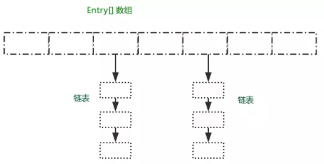
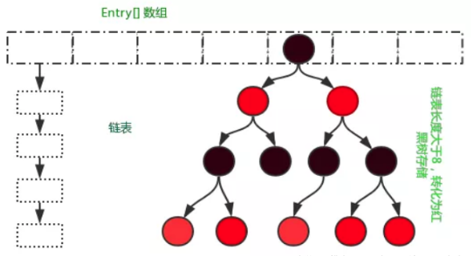
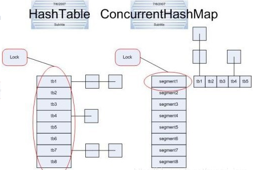
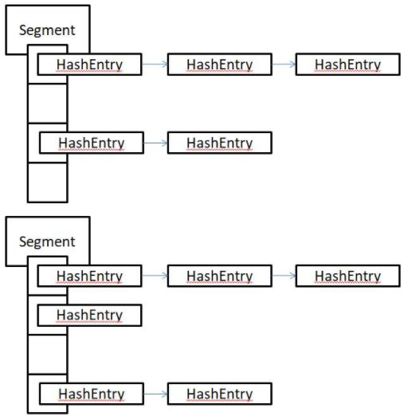
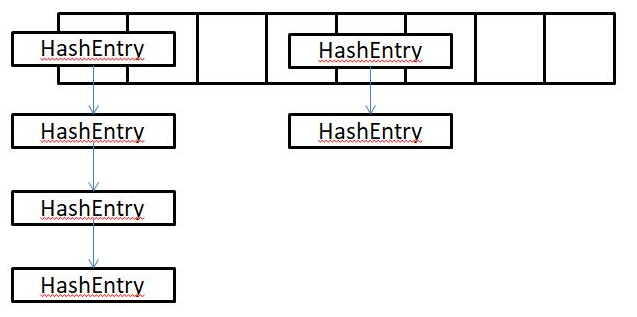

**集合框架**

# 1. Java 容器有哪些？
* Collection
  * Set：HashSet、TreeSet
  * List：ArrayList、LinkedList、Vector
* Map: HashMap、HashTable、TreeMap

# 2. Collection 和 Collections 有什么区别？
* Collection 是最基本的集合接口，其派生了两个子接口 Set 和 List，分别定义了两种不同的存储方式；
* Collections 是一个包装工具类，服务于 Collection 框架，其包含各种有关集合操作的静态方法（对集合的搜索、排序、线程安全化等）；
  
# 3. List 与 Set 的区别？

## List
Java 中有两种 List，一种是 ArrayList，其优点在于随机访问元素；另一种是 LinkedList，它并不是为快速随机访问而设计的，其特点是快速的插入和删除。

* ArrayList：底层由数组实现。其允许对元素进行快速的随机访问，但是向 List 中插入与删除元素的速度很慢；
* LinkedList：对访问顺序进行了优化，向 List 中插入与删除的开销不大，但随机访问相对较慢；
其具有下列方法：`addFirst() / addLast() / getFirst() / GetLast() / removeFirst() / removeLast`，这些方法使得 LinkedList 可以当做堆栈、队列和双向队列使用。

## Set
Set 具有与 Collection 完全相同的接口，因此没有任何额外的功能。实际上 Set 就是 Collection，只是行为不同。

存入 Set 的元素都必须是唯一的，Set 不存储重复元素。加入 Set 的元素必须定义 equals() 方法来保证对象的唯一性。Set 不维护元素的次序。

* HashSet：为快速查找而设计的 Set。加入 Set 的对象必须定义 hashcode()；
* TreeSet：维护元素次序的 Set，底层为树结构，使用 TreeSet 可以从 Set 中获取有序的序列；

## List 与 Set 的区别
* 两者均继承自 Collection 接口
* List 特点：有序可重复；Set 特点：无需不可重复
* List 支持 for 循环下标遍历或者迭代器；Set 只能使用迭代器（因为无序）
* List 与数组相似，可以动态增长，查找元素效率高，插入删除元素效率低（因为会引起其他元素位置的改变）；Set 检索元素效率低，插入和删除元素效率高（不会引起其他元素位置的改变）

# 4. HashMap 和 HashTable 有什么区别？
* HashMap 是线程不安全的；HashTable 是线程安全的
* HashMap 中允许键和值为 null；HashTable 不允许
* HashMap 默认的容量为 16，2 倍扩容；HashTable 初始容量为 11，为 2 倍 + 1 扩容

# 5. 说一下 HashMap 的实现原理？
HashMap 基于 Map 接口，元素以键值对的方式存储，允许存在 null 值，其是线程不安全的

## HashMap 的基本属性
* `static final int DEFAULT_INITIAL_CAPACITY = 1 << 4;`：初始化大小默认 16，2 倍扩容
* `static final float DEFAULT_LOAD_FACTOR = 0.75f;`：负载因子 0.75
* `transient Node<K,V>[] table;`：初始化的默认数组
* `transient int size;`：Map 大小
* `int threshold;`：判断是否需要调整 HashMap 容量

## HashMap 存储结构
在 JDK 1.7 中采用数组 + 链表的方式存储。HashMap 采用 Node<K, V> 数组来存储 key-value，每一个键值对组成一个 Entry 实体，Entry 类实际上是一个单向的链表结构，它具有 next 指针，指向下一个 Entry 实体，以此来解决 Hash 冲突问题。

HashMap 实现一个内部类 Node<K, V>，其重要属性有 hash, key, value, next。



在 JDK 1.8 中采用数据 + 链表 + 红黑树的存储方式。当链表的长度超过阈值`static final int TREEIFY_THRESHOLD = 8;`时，将链表转换为红黑树，使性能进一步提升。



# 6. Set 有哪些实现类？
* HashSet
  * HashSet 是 Set 接口的实现类，也是使用最多的实现类
  * HashSet 是无序不可重复的，通过对象的 hashcode() 和 equals() 方法保证对象的唯一性
  * HashSet 内部的存储结构是 HashMap，是线程不安全的
* TreeSet
  * TreeSet 对元素进行排序有两种方式：若元素自身具备比较功能，则需要实现 Comparable 接口，覆盖 compareTo() 方法；若元素自身不具备比较功能，则需要实现 Comparator 接口，覆盖 compare() 方法
* LinkedHashSet
  * LinkedHashSet 是一种有序的 Set 集合，即元素的存入与输出的顺序是相同的
  
## Comparable接口和Comparator接口有哪些区别？
* Comparable 实现比较简单，但是当需要重新定义比较规则的时候，必须修改源代码，即修改 User 类里边的 compareTo() 方法
* Comparator 接口不需要修改源代码，只需要在创建 TreeMap 的时候重新传入一个具有指定规则的比较器 Comparator 即可。

```java
// 方式一：定义该类的时候，就指定比较规则
class User implements Comparable{
    @Override
    public int compareTo(Object o) {
        // 在这里边定义其比较规则：0判定为相同，1为不同
        return 0;
    }
}

// 方式二：创建TreeMap的时候，可以指定比较规则
public static void main(String[] args) {
    new TreeMap<User, Integer>(new Comparator<User>() {
        @Override
        public int compare(User o1, User o2) {
            // 在这里边定义其比较规则：0判定为相同，1为不同
            return 0;
        }
    });
}
```

# 7. 说一下 HashSet 的实现原理？
HashSet 实际上是一个HashMap 实例，数据存储结构均为数组 + 链表。HashSet 中的元素都存放在 HashMap 的 key，而 value 都是一个统一的对象 PRESENT。 `private static final Object PRESENT = new Object();`

HashSet 中的 add() 方法底层调用的是 HashMap 中的 put() 方法，该方法首先判断要插入的值是否存在，如果存在则不插入，不存在则插入，以此保证 HashSet 中不存在重复值。

# 8. ArrayList 和 LinkedList 的区别是什么？
* ArrayList 采用动态数组实现，查询和遍历效率高
* LinkedList 采用双向链表实现，增加和删除的效率高

# 9. 如何实现 List 和 Array 之间的转换？
```java
String[] arr = {"zs","ls","ww"};
List<String> list = Arrays.asList(arr); // array --> list
System.out.println(list);
 
ArrayList<String> list1 = new ArrayList<String>();
list1.add("张三");
list1.add("李四");
list1.add("王五");
String[] arr1 = list1.toArray(new String[list1.size()]); // list --> array
System.out.println(arr1);
for(int i = 0; i < arr1.length; i++){
    System.out.println(arr1[i]);
}
```

# 10. 在队列 Queue 中，poll() 和 remove() 有什么区别？
* offer() VS add()
  * offer()：添加新元素时，若队列满，返回 false；
  * add()：添加新元素时，若队列满，抛出异常；
* poll() VS remove()
  * poll()：从队列中删除第一个元素，若队列空，返回 null；
  * remove()：从队列中删除第一个元素，若队列空，抛出异常；
* peek() VS element()
  * peek()：查询队列头元素，若队列空，返回 null；
  * element()：查询队列头元素，若队列空，抛出异常；
  
# 11. 哪些集合类是线程安全的？
* Vector：较 ArrayList 相比添加了同步化机制保证线程安全
* Stack：栈继承于 Vector
* HashTable：较 HashMap 相比增加了线程安全
* ConcurrentHashMap：高效且线程安全的集合

# 12. 迭代器 Iterator 是什么？
为方便处理集合中的元素，Java 中出现了一个对象，该对象提供了一些专门处理集合中元素的方法，该对象即迭代器 Iterator

# 13. Iterator 如何使用？
* Iterator 接口被 Collection 接口继承，Collection 接口的 iterator() 方法返回一个 Iterator 对象
* next()：获得集合中的下一个元素
* hasnext()：检查集合中是否还存在元素
* remove()：将迭代器返回的元素删除

# 14. Iterator 和 ListIterator 有什么区别？
ListIterator 继承自 Iterator。Iterator 可以迭代所有集合，ListIterator 只能迭代 List 及其子类。

ListIterator 新增的方法：
* add(E e)：将指定的元素插入列表，插入位置为迭代器当前位置之前
* set(E e)：迭代器返回的最后一个元素替换参数 e
* hasPrevious()：迭代器当前位置，反向遍历集合是否含有元素
* previous()：迭代器当前位置，反向遍历集合，下一个元素
* previousIndex()：迭代器当前位置，反向遍历集合，返回下一个元素的下标
* nextIndex()：迭代器当前位置，返回下一个元素的下标

# 15. 如何确保一个集合不可被修改？
首先这个问题很容易想到 final 关键字。final 关键字修饰类，则该类不可被继承；修饰方法，则该方法不可被重写；修饰成员变量，则该成员变量必须有初始化值，若该变量为基本数据类型，则变量值不能改变，若为引用变量，则其引用地址不可改变，但是其值可以改变！

因此为解决这个问题，Collections 包中提供了 unmodifiableMap(Map) 方法，通过该方法返回的 map 是不可以被修改的。若执行修改则会产生 java.lang.UnsupportedOperationException。

同理，Collections 也提供了对应的 List 和 Set 方法：Collections.unmodifiableList(List)、Collections.unmodifiableSet(Set)

# 16. 队列和栈是什么？有何区别？
* 队列先进先出；栈先进后出；
* 遍历数据的速度不同
  * 栈只能从头部取数据，即最先放入的数据需要遍历整个栈才能取出，且在遍历时还需要开辟额外空间以保持数据在遍历前后的一致性；
  * 队列基于地址指针进行遍历，可以从头部或者尾部开始遍历，但不可同时遍历，其无需开辟额外空间，查询速度快得多；
  
# 17. ConcurrentHashMap 和 Hashtable 的区别

ConcurrentHashMap 结合了 HashMap 和 Hashtable 二者的优势。HashMap 没有考虑同步，Hashtable 考虑了同步的问题。但是Hashtable 在每次同步执行时都要锁住整个结构。

ConcurrentHashMap 锁是微细粒度的，ConcurrentHashMap 将 hash 表分为 16 个桶，诸如 get，put，remove 等常用操作只锁上当前需要用到的桶。

而且在迭代时，concurrentHashMap 使用了不同于传统集合的快速失败迭代器的另一种迭代方式，弱一致迭代器。
在这种方式中，当 iterator 被创建后集合再发生改变就不会抛出 ConcurrentModificationException，取而代之的是在改变时 new 新的数据而不是影响原来的数据，iterator 完成后再讲头指针替代为新的数据。




## ConcurrentHashMap 的原理
* JDK 7
  * 数据结构：ReentrantLock + Segment + HashEntry；在一个 Segment 中包含一个数组，数组的每一个位置存储的又是一个链表结构。其 get() 方法无须加锁，Node.val 使用 voltaile 保证可见性。
  * 元素查询：需要二次 hash，第一次定位到 Segment，第二次定位到元素所在链表的头部。
  * 锁：使用 Segment 分段锁，Segment 继承 ReentrantLock，只锁定当前操作的 Segment，其他的 Segment 不受影响。其并发度为 Segment 的个数，可以通过构造函数指定。数组扩容不会影响其他 Segment。
  


* JDK 8
  * 数据结构：suychronized + CAS + HashEntry + 红黑树；Node 的 val 和 next 都使用 voltaile 保证可见性，数组使用 voltaile 修饰以保证扩容时被读线程感知。
  * 其元素的查找、替换、赋值操作都使用 CAS 实现。
  * 锁：只锁住链表的 head 节点，不影响其他元素的读写，细粒度更细，效率更高。扩容时阻塞所有的读写操作，并发扩容。



# 18. HashMap 和 HashSet 的区别？
* HashMap
  * 实现了 Map 接口
  * 存储键值对
  * 调用 put() 方法添加元素
  * HashMap 使用 key 计算 HashCode
  * HashMap 比 HashSet 速度快
* HashSet
  * 实现了 Set 接口
  * 存储对象
  * 调用 add() 方法添加元素
  * HashSet 使用成员对象来计算 hashcode 值，若 hashcode 相同则调用 equals() 方法判断是否相等
  * HashSet 比 HashMap 速度慢


