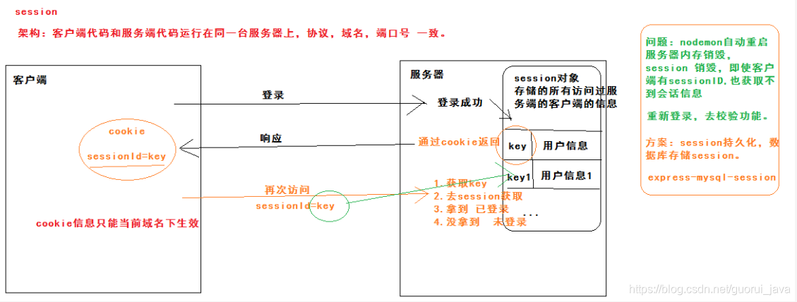
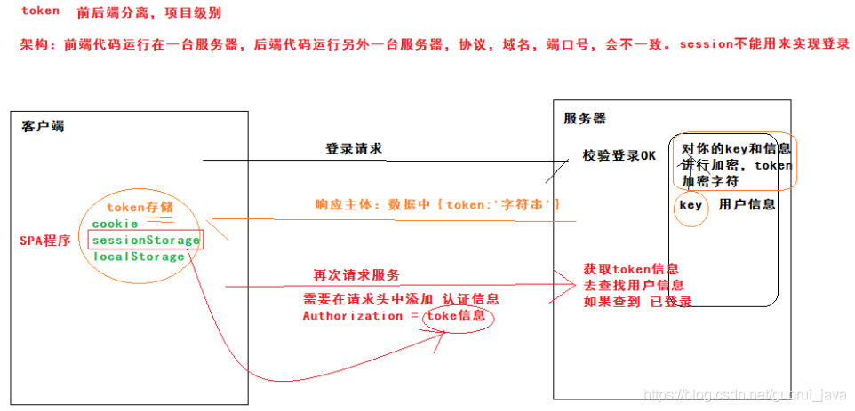

**网络编程**

# 1. jsp 和 servlet 有什么区别？
* servlet 是服务器端的 Java 程序，担当客户端和服务端的中间层
* jsp 全称 java server pages，中文 java 服务器页面，其本质是一个简化的 servlet 设计，是一种动态页面设计，其目的是将表示逻辑从 servlet 中分离出来
* jsp 有内置对象，servlet 没有内置对象

# 2. jsp 有哪些内置对象？作用是什么？
JSP 的 9 大内置对象：
* pageContext：页面上下文对象，相当于页面中所有功能的集合，通过它可以获取 jsp 页面的 out、request、response、session、application 对象
* request：
* response：
* session：
* application：应用程序对象，实现了用户间的数据共享，可以存放全局变量。它开始于服务器启动，直到服务器关闭
* page：即 jsp 本身
* exception：
* out：用于在 web 浏览器内输出信息，管理应用服务器上的输出缓冲区
* config：用于取得服务器的配置信息

# 3. forward 和 redirect 有什么区别？
* forward 是直接请求转发；redirect 是间接请求转发。
* forward 客户端和浏览器执行一次请求；redirect 客户端和浏览器执行两次请求。
* forward 地址不变；redirect 地址改变。
* forward 的常用方法：RequestDispatcher 类的 forward() 方法；redirect 的常用方法：HttpServletRequest 类的 sendRedirect() 方法。

# 4. session 和 cookie 有什么区别？
| | cookie | session |
| --- | --- | --- |
| 存储位置 | 客户端 | 服务器 | 
| 存储容量 | <=4K，一个站点最多保留 20 个 cookie | 无上限，但处于对服务器的保护，session 中不可存储过多的内容，并且需要设置删除机制 |
| 存储方式 | 只能保存 ASCII 字符串，并需要通过编码方式存储为 Unicode 字符或者二进制数据 | 可以存储任何类型的数据 |
| 隐私策略 | 对客户端可见，不安全 | 存储在服务器，安全 |
| 有效期 | 可以设置 cookie 属性，使其长期有效 | session 依赖于名为 JSESSIONID 的 cookie，其过期时间默认为 -1，即关闭窗口 session 就会失效 |
| 跨域 | 支持跨域 | 不支持跨域 |

# 5. 如果客户端进制 cookie，那么 session 还能使用么？
默认情况下，在会话中，服务器存储 session 的 sessionId 是通过 cookie 存储在浏览器中的，一旦浏览器禁用了 cookie，那么其在请求服务器时便无法携带 sessionId，故服务器就无法识别请求的用户身份，session 失效。

但是通过其他方法可以在禁用 cookie 的情况下继续使用 session：
* 通过重写 url，将 sessionId 作为参数追加在原 url 中
* 服务器返回数据中携带 sessionId，浏览器发送请求时，携带 sessionId 参数
* 服务器返回时设置 header 字段信息，在浏览器中通过 js 读取该 header 字段，在请求服务器时携带

# 6. 什么是上下文切换？
多线程编程中，线程数一般大于 CPU 核心数，一个 CPU 在一段时间内只能被一个线程使用，为了让所有线程都能得到有效执行，CPU 采取时间片轮转的形式，当一个线程的时间片用完时，就会重新处于就绪状态，将 CPU 让给其他线程使用，这个过程就属于一次上下文切换。

概括来说，就是当前任务在执行完 CPU 时间片切换到另一个任务之前，会首先保存自己的状态，一边下次再次切换回这个任务时，可以再加载这个任务的状态。任务从保存到在加载的过程就是一次上下文切换。

# 7. 说一下 cookie、session、token 的机制
### cookie and session

session 是服务端存储的一个对象，主要用于存储所有访问过该服务器的客户端的用户信息(也可以是其他信息)，从而保持用户会话状态。但是当服务器重启时，内存会被销毁，存储的用户信息也就消失了。

不同的用户访问服务端时会在 session 对象中存储键值对，键用来存储当前用户信息的“唯一身份证明”，在登陆成功后，将这个唯一证明通过 cookie 返回给客户端，客户端存储为 sessionId；当客户端再次访问时，会携带这这个 sessionId 来实现会话机制。

session 是基于 cookie 实现的：
* cookie 的数据大小 4K 左右
* cookie 存储数据的格式：字符串 key = value
* cookie 存储有效期：可以通过 expires 进行设置
* cookie 的有效范围：当前域名下有效

session 持久化：session 持久化用于解决重启服务器之后 session 消失的问题，将 session 存储在数据库中而不是在内存中。

### token 机制

token 适用于前后端分离的项目。在请求登陆时，token 和 session 的原理相同，在登陆成功后会在响应主体中将 {token:"string"} 返回给客户端。

客户端通过 cookie 进行储存，再次请求时不会默认携带，而是在请求头中添加认证字段 Authorization 携带 cookie 信息，这样服务器就可以通过携带的 token 查找到用户对应的登陆状态。

# 8. 常见的 HTTP 状态码有哪些？
### 状态码的类别
| 状态码 | 状态信息 |
| --- | --- |
| 1XX | informational：信息性状态码 -- 请求正在处理 |
| 2XX | success：成功状态码 -- 请求正常处理完毕 |
| 3XX | redirection：重定向状态码 -- 需要附加操作以完成请求 |
| 4XX | client error：客户端错误状态码 -- 服务器无法处理请求 |
| 5XX | server error：服务器错误状态码 -- 服务器处理请求出错 |

### 常见状态码
| 状态码 | 状态信息 |
| --- | --- |
| 200 | OK，成功，表示请求在服务端被正确处理 |
| 400 | Bad request，请求报文存在语法错误 |
| 401 | Unauthorized，表示发送的请求需要有通过 HTTP 认证的认证信息 |
| 403 | Forbidden，表示请求资源的访问被服务器拒绝，可以在实体的主体部分返回原因描述 |
| 404 | Not found，表示在服务器上没有找到请求的资源 |
| 500 | Internal sever error，表示服务端在处理请求时发生了错误 |

# 9. 简单说一下 TCP 和 UDP 的区别？

