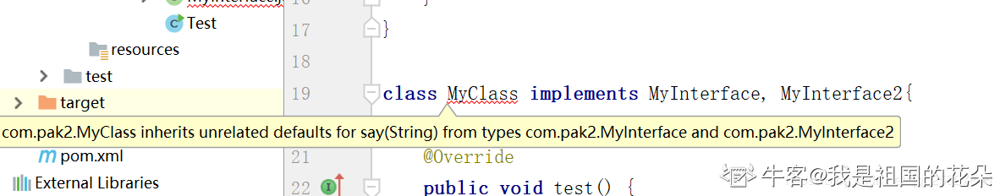
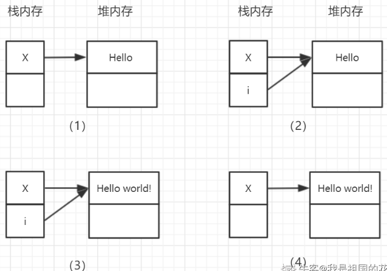
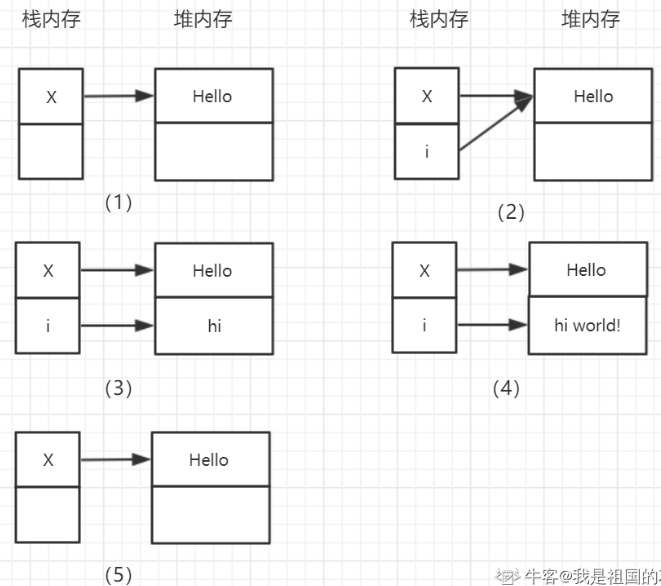
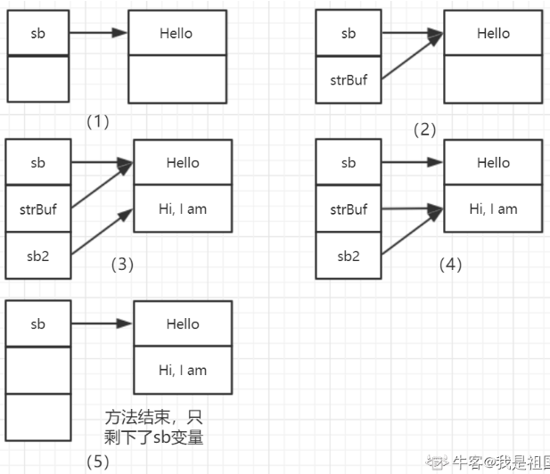

# 1. 面向对象可以解释下么？都有哪些特性？

面向对象是一种思想，可以将复杂问题简单化，让我们从执行者变为了指挥者。面向对象的三大特性为：封装，继承与多态。

* 封装：将事物封装成一个类，减少耦合，隐藏细节。保留特定的接口与外界联系，当接口内部发生改变时，不会影响外部调用方。
* 继承：从一个已知的类中派生出一个新的类，新类可以拥有已知类的行为和属性，并且可以通过重写来增强已知类的能力。
* 多态：多态的本质就是一个程序中存在多个同名的不同方法，主要通过三种方式来实现：    
	* 通过子类对父类的重写来实现
    * 通过在一个类中对方法的重载来实现
    * 通过将子类对象作为父类对象使用来实现

## 关于封装

封装主要是为了增加程序的可读性，解耦合并且隐藏部分实现细节。我们可以将封装的类中的属性私有化，只有通过公共的`get()/set()`方法才能进行访问，在`get()/set()`方法中我们可以对内部逻辑进行封装处理，外部的调用方不必关心我们的处理逻辑。

## 关于继承

我们需要注意Java中不支持多继承，即一个类只可以有一个父类存在。另外Java中的构造函数是不可以继承的。

如果父类构造函数是私有(private)的，则初始化子类的时候不可以被执行，这解释了为什么该类不可以被继承，也就是说其不允许有子类存在。我们知道，子类是由其父类派生产生的，那么子类有哪些特点呢？

* 子类拥有父类非private的属性和方法
* 子类可以添加自己的方法和属性，即对父类进行扩展
* 子类可以重新定义父类的方法，即方法的重写

### 重写(@Override)

重写也叫覆盖，是指在父子类中子类中的方法与父类中继承的方法有完全相同的返回值类型、方法名、参数个数以及参数类型。

子类重写方法的返回值范围应小于等于父类，抛出的异常范围小于等于父类，访问修饰符的范围大于等于父类。

若父类方法的访问修饰符为 private，则子类不能重写该方法。

## 关于多态

通过方法的重写、重载、子类对象作为父类对象使用可以实现多态。

### 重载

重载是指在一个类中（包括父类）存在多个同名的不同方法，这些方法的参数个数、顺序以及类型不同均可以构成方法的重载。如果仅仅是修饰符、返回值、抛出的异常不同，那么这是两个相同的方法。

#### 如果只有方法返回值不同，可以构成重载吗？

不可以。因为我们调用某个方法，有时候并不关心其返回值，这个时候编译器根据方法名和参数无法确定我们调用的是哪个方法。

举例：如果我们分别定义了如下的两个方法：

* `public String Test(String userName){ }`
* `public void Test(String userName){ }`

在调用的时候，直接 Test(“ZQF”)； 那么就会存在歧义。

#### 在 Java 中，什么时候使用重载，什么时候使用重写？
* 重载是多态的集中体现。当需要以统一的方式处理不同的数据类型时，可以使用重载；
* 重写的使用是建立在继承关系上的，子类在继承父类的基础上需要增加新的功能时，可以使用重写；

### 子类对象作为父类对象使用

把不同的子类对象都当作父类对象来看，可以屏蔽不同子类对象之间的差异，写出通用的代码，做出通用的编程，以适应需求的不断变化。这样操作之后，父类的对象就可以根据当前赋值给它的子类对象的特性以不同的方式运作。

对象的引用型变量具有多态性，因为一个引用型变量可以指向不同形式的对象，即：子类的对象作为父类的对象来使用。在这里涉及到了向上转型和向下转型。

在向上转型的时候我们可以直接转，但是在向下转型的时候我们必须强制类型转换。并且，该父类必须实际指向了一个子类对象才可强制类型向下转型，即其是以这种方式Father f = new Son（）创建的父类对象。若以Father f = new Father（）这种方式创建的父类对象，那么不可以转换向下转换为子类的Son对象，运行会报错，因为其本质还是一个Father对象。

#### 向上转型

子类对象转为父类，父类可以是接口。

公式：`Father f = new Son();`Father是父类或接口，Son是子类。

#### 向下转型

父类对象转为子类。

公式：`Son s = (Son) f;`

# 2. JDK，JRE 和 JVM 的区别与联系有哪些？

三者的基本概念可以概括如下：

* JDK (Java Development Kit) 是一个开发工具包，是 Java 开发环境的核心组件，并且提供编译、调试和运行一个 Java 程序所需要的所有工具，可执行文件和二进制文件，是一个平台特定的软件
* JRE (Java Runtime Environment) 是指 Java 运行时环境，是 JVM 的实现，提供了运行 Java 程序的平台。JRE 包含了 JVM，但是不包含 Java 编译器/调试器之类的开发工具
* JVM (Java Virtual Machine) 是指 Java 虚拟机，当我们运行一个程序时，JVM 负责将字节码转换为特定机器代码，JVM 提供了内存管理/垃圾回收和安全机制等

## 区别与联系

* JDK 是开发工具包，用来开发 Java 程序，而 JRE 是 Java 的运行时环境
* JDK 中包含 JRE，JDK 中存在一个名为 jre 的目录，其中包含两个文件夹 bin 和 lib。其中 bin 就是 JVM，lib 则是 JVM 所需要的类库
* JVM 是 Java 编程的核心，独立于硬件和操作系统，具有平台无关性，而这也是Java程序可以一次编写，多处执行的原因

## 什么是字节码？字节码的好处是什么？

在java中，虚拟机能够理解的代码叫做字节码，即 class 文件，他不面向任何特定的处理器，只面向虚拟机

其优势是：java 通过字节码的方式，在一定程度上，解决了传统解释性语言执行效率低的问题。同时又保留了，解释性语言可以移植的特点。

## Java 的跨平台性是如何实现的呢？

* JVM 屏蔽了操作系统和底层硬件的差异
* Java 面向 JVM 编程，先编译生成字节码文件，然后交给 JVM 解释成机器码执行
* 通过规定基本数据类型的取值范围和行为

## Java 语言是编译型还是解释型语言？

Java的执行经历了编译和解释的过程，是一种先编译，后解释执行的语言，不可以单纯归到编译性或者解释性语言的类别中。

# 3. 抽象类和接口有什么区别？
| | 抽象类 | 接口 |
| --- | --- | --- |
| 抽象方法 | 可以没有抽象方法，也可以抽象方法和非抽象方法共存 | 接口中的方法在 JDK8 之前只能是抽象的，JDK8 版本开始提供了接口中方法的 default 实现 |
| 继承 | 单继承 | 可以实现多个父接口 |
| 成员变量 | 可以存在普通的成员变量 | 接口中的变量必须是 static final 类型的，必须被初始化，接口中只有常量，没有变量 |
| 设计目的 | 代码复用，其设计难度和成本较高 | 对类的行为进行约束 |

### 有关默认方法

default方法的具体实现：

```java
public interface MyInterface {
    // 定义一个已经实现的方法，使用default表明
    default void say(String message){
        System.out.println("Hello "+message);
    }
    // 普通的抽象方法
    void test();
}
```

当一个类实现该接口时，可以继承到该接口中的默认方法：

```java
public interface MyInterface {
    // 定义一个已经实现的方法，使用default表明
    default void say(String message){
        System.out.println("Hello "+message);
    }
    // 普通的抽象方法
    void test();
}

class MyClass implements MyInterface{
    @Override
    public void test() {
        System.out.println("test...");
    }
}
class Main{
    public static void main(String[] args) {
        MyClass client = new MyClass();
        client.test();
        client.say("World...");
    }
}
```

如果两个接口中存在同样的默认方法，实现类继承的是哪一个呢？这个时候，实现类那里会编译错误，错误如下：



这个编译错误的大概意思就是说：有两个相同的方法，编译器不知道该如何选择了。我们有两种处理方式，如下所示：

* 重写多个接口中的相同的默认方法
```java
class MyClass implements MyInterface, MyInterface2{
    @Override
    public void say(String message) {
        System.out.println("[Client]-Hello "+message);
    }
    @Override
    public void test() {
        System.out.println("test...");
    }
}
```

* 在实现类中指定要使用哪个接口中的默认方法
```java
class MyClass implements MyInterface, MyInterface2{
    // 手动指定哪个默认方法生效
    public void say(String message) {
        MyInterface.super.say(message);
    }
    @Override
    public void test() {
        System.out.println("test...");
    }
}
```

## JDK8 中为什么会出现默认方法呢？

使用接口，使得我们可以面向抽象编程，但是其有一个缺点就是当接口中有改动的时候，需要修改所有的实现类。

在JDK8中，为了给已经存在的接口增加新的方法并且不影响已有的实现，所以引入了接口中的默认方法实现。


## 抽象类和接口应该如何选择？分别在什么情况下使用呢？

根据抽象类和接口的不同之处，当我们仅仅需要定义一些抽象方法而不需要其余额外的具体方法或者变量的时候，我们可以使用接口；

反之，则需要使用抽象类，因为抽象类中可以有非抽象方法和变量。

# 4. Java 中的 8 种基本数据类型及其取值范围

Java种的8种基本数据类型分别是：byte，short，int，long，float，double，char，boolean。

| 数据类型 | Byte | 存储容量 |
| --- | --- | --- |
| byte | 8位(1Byte) | 最大存储数据量是255，存放的数据范围是-128~127之间 |
| short | 16位(2Byte) | 最大数据存储量是65536，数据范围是-32768~32767之间 |
| int | 32位(4Byte) | 最大数据存储容量是2的32次方减1，数据范围是负的2的31次方到正的2的31次方减1 |
|  long | 64位(8Byte) | 最大数据存储容量是2的64次方减1，数据范围为负的2的63次方到正的2的63次方减1 |
| float | 32位(4Byte) | 数据范围在3.4e-45~1.4e38，直接赋值时必须在数字后加上f或F |
| double | 64位(8Byte) | 数据范围在4.9e-324~1.8e308，赋值时可以加d或D也可以不加 |
| boolean |  | 只有true和false两个取值 |
| char | 16位(2Byte) | 存储Unicode码，用单引号赋值 |

# 5. Java 中的元注解有哪些？

Java中提供了4个元注解，元注解的作用是负责注解其它注解。

| 注解 | 作用 |
| --- | --- |
| @Target | 说明注解所修饰的对象范围 |
| @Retention(保留策略) | 定义了该注解被保留的时间长短 |
| @Documented | 用于描述其它类型的 annotation 应该被作为被标注的程序成员的公共 API |
| @Inherited | 表明某个被标注的类型是被继承的 |
| @Repeatable | 该注解是 Java 1.8 的新特性，被该注解作用的注解可以多次应用 |

### @Target

说明注解所修饰的对象范围，关键源码如下：

```java
public @interface Target {  
    ElementType[] value();  
}  
public enum ElementType {  
	TYPE,FIELD,METHOD,PARAMETED,CONSTRUCTOR,LOCAL_VARIABLE,ANNOCATION_TYPE,PACKAGE,TYPE_PARAMETER,TYPE_USE  
}  
```

### @Retention(保留策略)

保留策略定义了该注解被保留的时间长短。关键源码如下：

```java
public @interface Retention {  
    RetentionPolicy value();  
}  
public enum RetentionPolicy {  
    SOURCE, CLASS, RUNTIME  
} 
```

其中：

* SOURCE：表示在源文件中有效（即源文件保留）
* CLASS：表示在class文件中有效（即 class 保留）
* RUNTIME：表示在运行时有效（即运行时保留）

### @Documented

该注解用于描述其它类型的 annotation 应该被作为被标注的程序成员的公共 API，因此可以被 javadoc 此类的工具文档化。

Documented 是一个标记注解，没有成员。关键源码如下：

```java
public @interface Documented {
}
```

### @Inherited

该注解是一个标记注解，`@Inherited`阐述了某个被标注的类型是被继承的。如果一个使用了`@Inherited`修饰的 annotation 类型被用于一个 class，则这个 annotation 将被应用于该 class 的子类。关键源码如下：

```java
public @interface Inherited {
}
```

### @Repeatable
该注解是 Java 1.8 的新特性，被该注解作用的注解可以多次应用。下面看一个应用实例：
```java
@Person(role = "student")
@Person(role = "son")
@Person(role = "communist")
public class Demo01 {
    String name = "Leo Zhu";

    public static void main(String[] args) {
        Annotation[] annotations = Demo01.class.getAnnotations();
        System.out.println(annotations.length);
        Persons persons = (Persons) annotations[0];
        for (Person p: persons.value()) {
            System.out.println(p.role());
        }
        /
         * 运行结果：
         * 1
         * student
         * son
         * communist
         */
    }
}

@Repeatable(Persons.class) // 括号里的内容相当于用来保存被注解内容的容器
@interface Person {
    String role() default "";
}

@Target(ElementType.TYPE) // 可以对类进行注解
@Retention(RetentionPolicy.RUNTIME) // 可以保留到程序运行时
@interface Persons {
    Person[] value();
}

```

## 注解的作用及定义

代替繁杂的配置文件，简化开发。

### 如何定义一个注解

定义注解类不能使用 class、enum 以及 interface，必须使用`@interface`。下边是一个简单的注解定义：

```java
public @interface MyAnn{} 
```

### 如何定义注解的属性

```java
public @interface MyAnn {  
    String value();  
    int value1();  
}
// 使用注解MyAnn，可以设置属性
@MyAnn(value1=100,value="hello")  
public class MyClass {  
} 
```

定义注解时候的value就是属性，看着是一个方法，但我们称它为属性。当为注解指定属性后，那么在使用注解时就必须要给属性赋值了。

# 6. 说说 Java 中反射机制

反射机制是指在运行中，对于任意一个类，都能够知道这个类的所有属性和方法。对于任意一个对象，都能够调用它的任意一个方法和属性。即动态获取信息和动态调用对象方法的功能称为反射机制。

## 反射机制的作用

* 在运行时判断任意一个对象所属的类
* 在运行时构造一个类的对象
* 在运行时判断任意一个类所具有的成员变量和方法
* 在运行时调用任意一个对象的方法，生成动态代理

## 与反射相关的类

* Class：表示类，用于获取类的相关信息
* Field：表示成员变量，用于获取实例变量和静态变量等
* Method：表示方法，用于获取类中的方法参数和方法类型等
* Constructor：表示构造器，用于获取构造器的相关参数和类型等

## 获取 Class 类的三种基本方式

* 通过类名称 .class 来获取 Class 类对象
```java
Class c = int.class;
Class c = int[ ].class;
Class c = String.class;
```

* 通过对象 .getClass( ) 方法来获取 Class 类对象
```java
Class c = obj.getClass( );
```

* 通过类名称加载类 Class.forName( )，只要有类名称就可以得到 Class
```java
Class c = Class.forName("com.zqf.User");
```

通过反射方式创建对象的示例：

```java
package com.zqf;

public class Demo {
    public static void main(String[] args) throws Exception {
        String className = "com.zqf.User";
        // 获取Class对象
        Class clazz = Class.forName(className);
        // 创建User对象
        User user = (User)clazz.newInstance();
        // 和普通对象一样，可以设置属性值
        user.setUsername("zqf");
        user.setPassword("123456");

        System.out.println(user);
    }
}

class User {
    private String username;
    private String password;
    
    public String getUsername() {
        return username;
    }
    public void setUsername(String username) {
        this.username = username;
    }
    public String getPassword() {
        return password;
    }
    public void setPassword(String password) {
        this.password = password;
    }
    @Override
    public String toString() {
        return "User [username=" + username + ", password=" + password + "]";
    }
}
```

# 7. Java 中的 Exception 和 Error 有什么区别？

* Exception是程序正常运行中预料到可能会出现的错误，并且应该被捕获并进行相应的处理，是一种异常现象
* Error是正常情况下不可能发生的错误，Error会导致JVM处于一种不可恢复的状态，不需要捕获处理

## Exception

* 编译时异常（受检异常）表示当前调用的方法体内部抛出了一个异常，所以编译器检测到这段代码在运行时可能会出异常，所以要求我们必须对异常进行相应的处理，可以捕获异常或者抛给上层调用方。
  * 常见的编译时异常包括：`ClassNotFoundException`、`FileNotFoundException`、`IOException`
* 运行时异常（非受检异常）表示在运行时出现的异常。
  * 常见的运行时异常包括：`NullPointerException`、`ArithmeticException`、`IndexOutOfBoundsException`、`ClassCastException`

### 捕获异常应该遵循哪些原则

* 尽可能捕获比较详细的异常，而不是使用 Exception 一起捕获。
* 当本模块不知道捕获之后该怎么处理异常时，可以将其抛给上层模块。上层模块拥有更多的业务逻辑，可以进行更好的处理。
* 捕获异常后至少应该有日志记录，方便之后的排查。
* 不要使用一个很大的 try – catch 包住整段代码，不利于问题的排查。

## NoClassDefFoundError 和 ClassNotFoundException 有什么区别？

* ClassNotFoundException 一般是类名传入有误导致的
* NoClassDefFoundError 是要查找的类在编译的时候是存在的，但运行的时候找不到了。一般是由于打包时漏掉了部分类或者 jar 包损坏导致

# 8. JIT编译器有了解吗？

JIT 编译器全名叫 Just In Time Compile 也就是即时编译器，把经常运行的代码作为"热点代码"编译成与本地平台相关的机器码，并进行各种层次的优化。

JIT编译除了具有缓存的功能外，还会对代码做各种优化，包括逃逸分析、锁消除、 锁膨胀、方法内联等。

## 逃逸分析

逃逸分析的基本行为就是分析对象动态作用域：当一个对象在方法中被定义后，它可能被外部方法所引用，例如作为调用参数传递到其他地方中，称为方法逃逸。

示例：

```java
public static StringBuffer craeteStringBuffer(String s1, String s2) {
    StringBuffer sb = new StringBuffer();
    sb.append(s1);
    sb.append(s2);
    return sb; // 此处 sb 被返回，可能被其他的方法修改，产生逃逸
}

public static String createStringBuffer(String s1, String s2) {
    StringBuffer sb = new StringBuffer();
    sb.append(s1);
    sb.append(s2);
    return sb.toString(); // 此处的 sb 没有产生逃逸
}
```

使用逃逸分析，编译器可以对代码做如下优化：

#### 同步省略

在动态编译同步块的时候，JIT 编译器可以借助逃逸分析来判断同步块所使用的锁对象是否只能够被一个线程访问而没有被发布到其他线程。

如果同步块所使用的锁对象通过这种分析被证实只能够被一个线程访问，那么 JIT 编译器在编译这个同步块的时候就会取消对这部分代码的同步。这个取消同步的过程就叫同步省略，也叫锁消除

示例：

```java
public void f() {
    Object hollis = new Object();
    synchronized(hollis) {
        System.out.println(hollis);
    }
}
// 代码中对hollis这个对象进行加锁，但是hollis对象的生命周期只在f()方法中，并不会被其他线程所访问到，所以在JIT编译阶段就会被优化掉。
// 优化结果：
public void f() {
    Object hollis = new Object();
    System.out.println(hollis);
}
```

#### 标量替换

* 标量：指一个无法再分解成更小的数据的数据。Java中的原始数据类型就是标量。
* 聚合量：还可以分解的数据。Java中的对象就是聚合量，因为他可以分解成其他聚合量和标量。

在 JIT 阶段，如果经过逃逸分析，发现一个对象不会被外界访问的话，那么经过 JIT 优化，就会把这个对象拆解成若干个其中包含的若干个成员变量来代替。这个过程就是标量替换。

示例：

```java
public static void main(String[] args) {
   alloc();
}

private static void alloc() {
   Point point = new Point（1,2）;
   System.out.println("point.x="+point.x+"; point.y="+point.y);
}
class Point{
    private int x;
    private int y;
}
// 以上代码中，point 对象并没有逃逸出 alloc 方法，并且 point 对象是可以拆解成标量的。那么，JIT 就会不会直接创建Point对象，而是直接使用两个标量 int x ，int y 来替代 Point 对象。
// 以上代码，经过标量替换后，就会变成：
private static void alloc() {
   int x = 1;
   int y = 2;
   System.out.println("point.x="+x+"; point.y="+y);
}
// 标量替换的好处就是对象可以不在堆内存进行分配，为栈上分配提供了良好的基础。
```

### 逃逸分析技术的缺点

技术不是特别成熟，分析的过程也很耗时，如果所有对象都是逃逸的，那么就得不偿失了。

# 9. Java 中的值传递和引用传递可以解释下吗？

* 值传递，意味着传递对象的副本，即使副本被改变，也不会影响源对象。
* 引用传递，意味着传递对象的引用。因此，外部对引用对象的改变会反映到所有的对象上。

示例1：

```java
public class Test {
	public static void main(String[] args) {
		int x = 0;
		change(x);
		System.out.println(x); // x = 0
	}

	static void change(int i) {
		i = 7;
	}
}
// 因为如果参数是基本数据类型，那么是属于值传递的范畴，传递的其实是源对象的一个copy副本，不会影响源对象的值。
```

示例2：

```java
public class Test {
	public static void main(String[] args) {
		StringBuffer x = new StringBuffer("Hello");
		change(x);
		System.out.println(x); // Hello world
	}

	static void change(StringBuffer i) {
		i.append(" world!");
	}
}
```

解析：



示例3：

```java
public class Test {
    public static void main(String[] args)  {
        StringBuffer x = new StringBuffer("Hello");
        change2(x);
        System.out.println(x); // Hello
    }
    static void change2(StringBuffer i) {
        i = new StringBuffer("hi");
        i.append(" world!");
    }
}
```

解析：



示例4：

```java
public class Test {
    public static void main(String[] args)  {
        StringBuffer sb = new StringBuffer("Hello ");
        System.out.println("Before change, sb = " + sb);
        changeData(sb);
        System.out.println("After change, sb = " + sb); // Hello
    }
    public static void changeData(StringBuffer strBuf) {
        StringBuffer sb2 = new StringBuffer("Hi，I am ");
        strBuf = sb2;
        sb2.append("World!");
    }
}
```

解析：



# 10. String、StringBuffer 与 StringBuilder 的区别？
* 线程安全：
  * StringBuilder是线程不安全的，效率较高。
  * StringBuffer是线程安全的，其方法都是被 synchronized 修饰的，故效率较低。
* 数据可变和不可变：
  * String的值不可变的，其是被 final 修饰的。每次对 String 的操作都会产生新的对象。
  * StringBuffer 和 StringBuilder 的值是可变的，两者都是在原对象上进行操作。他们底层使用的是可变字符数组：char[] value。
* 使用场景：
  * 如果需要操作少量的数据用 String
  * 需要改变字符串内容时使用后两个。单线程使用 StringBuilder，多线程使用 StringBuffer。

## String str = "i" 与 String str = new String(“i”) 一样吗？
* String str = "i" 会将 str 分配到字符串常量池中。常量池中不存在重复的元素，若常量池中已经存在 “i”，则会将 "i" 的地址赋予 str；若常量池中不存在，就会在常量池中创建一个 "i" 再赋值给 str。
* String str = new String(“i”) 会将 str 分配到堆中，即使存在相同的元素还是会创建一个新的对象

## String str = new String(“a”) + new String(“b”)会创建几个对象？
* 对象1：new StringBuilder()；
* 对象2：new String("a")；
* 对象3：常量池中的"a"；
* 对象4：new String("b")；
* 对象5：常量池中的"b"；
* 对象6：new String("ab")

### String str = "a"+"b";产生几个对象？
答案是3个，字符串常量区存储"a","b","ab"三个对象。

### String str = "a"+new String("b");产生几个对象？
答案是3个，字符串常量区存储"a","b"，堆中存储new String("b")的对象。

## String.intern() 方法
调用这个方法之后就是去看当前字符串是否在常量池中存在
* 存在：那就直接返回该字符串在字符串常量池中所对应的地址给栈中要引用这个字符串的变量。
* 不存在：
  * jdk1.6：先在字符串常量池中创建该字符串，地址与堆中字符串地址不相同。返回值为刚创建的字符串在字符串常量池中所对应的地址给栈中要引用这个字符串的变量。
  * jdk1.7及以后：直接将堆中该字符串的地址复制到字符串常量池中，此时字符串常量池中的字符串只是一个对堆中字符串对象的引用，它们两个的地址相同，然后再将该地址返回给栈中要引用这个字符串的变量。

```java
public class StringIntern {
    public static void main(String[] args) {
        String s = new String("1"); // 在堆中和字符串常量池中都创建了该字符串1对象，但它们地址不相同
        s.intern(); // 调用此方法之前，字符串常量池中已经存在了"1"，所以什么也不做
        String s2 = "1"; // 这时在字符串常量池中已经存在1对象了，所以此步只是把new String()在常量池中创建1对象地址赋给s2
        System.out.println(s == s2); // jdk6：false   jdk7/8：false   一个地址是在堆中一个在常量池中肯定不相等

        String s3 = new String("1") + new String("1"); // s3变量记录的地址为：new String("11")
        //执行完上一行代码以后，字符串常量池中，是否存在"11"呢？答案：不存在！！
        s3.intern(); // 在字符串常量池中生成"11"。如何理解：
        // jdk6:创建了一个新的对象"11",也就有新的在常量池中的地址。
        // jdk7:此时常量中并没有创建"11",而是创建一个指向堆空间中new String("11")的地址，两个地址相同
        String s4 = "11"; // s4变量记录的地址：使用的是上一行代码代码执行时，在常量池中生成的"11"的地址
        System.out.println(s3 == s4); // jdk6：false  jdk7/8：true
    }
}
```

## 如何将字符串反转？
将对象封装到 StringBuilder 中，调用 reverse() 方法进行反转
```java
public class test {
    public static void main(String[] args) {
        String str = "abcdefg";
        StringBuilder stringBuilder = new StringBuilder(str);
        String res = stringBuilder.reverse().toString();
        System.out.println(res);
    }
}
```

## String 类的常用方法有哪些？
* 获取功能
  * length(): 获取字符串长度
  * charAt(int index): 获取指定索引位置的字符
  * indexOf(String str): 返回指定字符在此字符串中第一次出现处的索引
  * substring(int start, int end): 截取字符串
* 判断功能
  * equals(Object obj): 比较字符串的内容是否相同，区分大小写
  * contains(String str): 判断字符串中是否包含传入的字符
  * startsWith(String str): 判断字符串是否以传入的字符开头
  * endsWith(String str): 判断字符串是否以传入的字符结尾
  * isEmpty(): 判断字符串的内容是否为空
* 转换功能
  * byte[] getBytes(): 将字符串转换为字节数组
  * char[] toCharArray(): 把字符串转换为字符数组
  * String valueOf(char[] chs): 将字符数组转换为字符串
  * toLowerCase(): 将字符串转换为小写
  * toUpperCase(): 将字符串转换为大写
  * concat(): 拼接字符串
* 其他常用功能
  * replace(char old,char new): 将指定字符进行互换
  * replace(String old,String new): 将指定字符串进行互换
  * trim(): 去除两端空格

# 11. Java 中的泛型的理解
泛型的本质是参数化类型

泛型的作用：
* 使用泛型能写出更加灵活通用的代码
* 泛型将代码安全性检查提前到编译期
  * 使用泛型后，能让编译器在编译的时候借助传入的类型参数检查对容器的插入，获取操作是否合法，从而将运行时 ClassCastException 转移到编译时
* 泛型能够省去类型强制转换
  * 在 JDK1.5 之前，Java 容器都是通过将类型向上转型为 Object 类型来实现的，因此在从容器中取出来的时候需要手动的强制转换。
  * 加入泛型后，由于编译器知道了具体的类型，因此编译期会自动进行强制转换，使得代码更加优雅。

# 12. Java 序列化与反序列化
序列化和反序列化的概念：
* 把对象转换为字节序列的过程称为对象的序列化。
* 把字节序列恢复为对象的过程称为对象的反序列化。

对象的序列化主要有两种用途：
* 把对象的字节序列永久地保存到硬盘上，通常存放在一个文件中；
*  在网络上传送对象的字节序列。

## 什么是 serialVersionUID 常数？
serialVersionUID 是一个常数，用于唯一标识可序列化类的版本。从输入流构造对象时，JVM 在反序列化过程中检查此常数。
如果正在读取的对象的 serialVersionUID 与类中指定的 serialVersionUID 不同，则抛出 InvalidClassException，这是为了确保正在构造的对象与对应的类兼容。

serialVersionUID 是可选的，如果不显式声明，则将会自动生成一个。一般建议显式的声明 serialVersionUID，原因如下：
自动生成的 serialVersionUID 是根据类的元素(成员变量、方法、构造方法等)生成的，这些元素的变化将导致 serialVersionUID 改变。如果我们编写了一个类，在后续开发中对类添加了方法，那么其 serialVersionUID 也发生改变。那么在我们反序列化之前编写的对象时，因为 serialVersionUID 不同，就会导致异常无法反序列化。

## 知道什么是瞬时变量么？
被关键字 transient 修饰的变量为瞬时变量，JVM 在序列化的过程中将跳过瞬态变量。

如果我们在序列化过程中不希望某些成员变量被序列化，那么可以使用 transient 进行修饰。(如密码等信息)

## JDK 类库中的序列化 API

`java.io.ObjectOutputStream`代表对象输出流，它的`writeObject(Object obj)`方法可对参数指定的obj对象进行序列化，把得到的字节序列写到一个目标输出流中。

`java.io.ObjectInputStream`代表对象输入流，它的`readObject()`方法从一个源输入流中读取字节序列，再把它们反序列化为一个对象，并将其返回。

只有实现了 Serializable 和 Externalizable 接口的类的对象才能被序列化。

Externalizable 接口继承自 Serializable 接口，实现 Externalizable 接口的类完全由自身来控制序列化的行为，而仅实现 Serializable 接口的类可以 采用默认的序列化方式。

对象序列化包括如下步骤：

1. 创建一个对象输出流，它可以包装一个其他类型的目标输出流，如文件输出流；
2. 通过对象输出流的`writeObject()`方法写对象。

对象反序列化的步骤如下：

1. 创建一个对象输入流，它可以包装一个其他类型的源输入流，如文件输入流；
2. 通过对象输入流的`readObject()`方法读取对象。

示例：

```java
import java.io.*;

/*
 * ClassName: TestObjSerializeAndDeserialize
 * Description: 测试对象的序列化和反序列
 */
public class TestObjSerializeAndDeserialize {

	public static void main(String[] args) throws Exception {
		SerializePerson();//序列化Person对象
		Person p = DeserializePerson();//反序列Perons对象
		System.out.println(MessageFormat.format("name={0},age={1},sex={2}", p.getName(), p.getAge(), p.getSex()));
	}

	/*
	 * MethodName: SerializePerson
	 * Description: 序列化Person对象
	 * @throws FileNotFoundException
	 * @throws IOException
	 */
	private static void SerializePerson() throws FileNotFoundException, IOException {
		Person person = new Person();
		person.setName("gacl");
		person.setAge(25);
		person.setSex("男");
		// ObjectOutputStream 对象输出流，将Person对象存储到E盘的Person.txt文件中，完成对Person对象的序列化操作
		ObjectOutputStream oo = new ObjectOutputStream(new FileOutputStream(
				new File("E:/Person.txt")));
		oo.writeObject(person);
		System.out.println("Person对象序列化成功！");
		oo.close();
	}

	/*
	 * MethodName: DeserializePerson
	 * Description: 反序列Perons对象
	 * @return
	 * @throws Exception
	 * @throws IOException
	 */
	private static Person DeserializePerson() throws Exception, IOException {
		ObjectInputStream ois = new ObjectInputStream(new FileInputStream(
				new File("E:/Person.txt")));
		Person person = (Person) ois.readObject();
		System.out.println("Person对象反序列化成功！");
		return person;
	}

}
```

# 13. equals 和 hashCode 的关系？

* 若 hashcode 值相等，则 euqals 不一定为 true；若 hashcode 不相等，则 equals 一定为 false。
* 若 equals 为 true，则 hashcode 一定相等；若 equals 为 false，则 hashcode 不一定相等。

## hashCode()

hashCode() 的作用是获取哈希码，也称为散列码；它实际上是返回一个 int 整数。这个哈希码的作用是确定该对象在哈希表中的索引位置。

散列表存储的是键值对(key-value)，它的特点是：能根据 key 快速的检索出对应的 value。这其中就利用到了散列码！（可以快速找到所需要的对象）

### 为什么要有 hashCode

以“HashSet 如何检查重复”为例子来说明为什么要有 hashCode：

当你把对象加入 HashSet 时，HashSet 会先计算对象的 hashcode 值来判断对象加入的位置，同时也会与其他已经加入的对象的 hashcode 值作比较，如果没有相符的hashcode，HashSet会假设对象没有重复出现。但是如果发现有相同 hashcode 值的对象，这时会调用 equals()方法来检查 hashcode 相等的对象是否真的相同。如果两者相同，HashSet 就不会让其加入操作成功。如果不同的话，就会重新散列到其他位置。这样我们就大大减少了 equals 的次数，相应就大大提高了执行速度。

因此我们可以看出：hashCode() 的作用就是获取哈希码，也称为散列码；它实际上是返回一个int整数。这个哈希码的作用是快速确定该对象在哈希表中的索引位置。

# 14. Java 和 C++ 的区别有哪些？

* 都是面向对象的语言，都支持封装、继承和多态
* Java 不提供指针来直接访问内存，程序内存更加安全
* Java 的类是单继承的，C++ 支持多重继承；虽然 Java 的类不可以多继承，但是接口可以多继承。
* Java 有自动内存管理机制 (GC)，不需要程序员手动释放无用内存
* 在 C 语言中，字符串或字符数组最后都会有一个额外的字符‘\0’来表示结束。但是，Java 语言中没有结束符这一概念。

# 15. 静态方法与非静态的区别？

* 静态方法不需要类实例化就可以调用；反之非静态方法需要实例化后才能调用；
* 静态方法只能访问静态成员和方法；非静态方法都可以访问；
* 静态方法不能标记为 override ，导致子类不能重写，但是可以访问；
* 从内存分配上来说静态是连续的，非静态在内存的存储上是离散的，因此静态方法和非静态方法，在调用速度上，静态方法速度一定会快点，因为非静态方法需要实例化，分配内存，但静态方法不用，但是这种速度上差异可以忽略不计；

## 在 Java 中，为什么不允许从静态方法中访问非静态变量？
* 静态变量属于类本身，在类加载时就会被分配到内存，可以通过类名直接访问；
* 非静态变量属于类的对象，只有当类的对象产生时，才会分配内存，通过类的实例去访问；

静态方法也属于类本身，但是此时没有类的实例，内存中没有非静态变量，故无法调用。

# 16. Java 中 equals 方法和 == 的区别？
* 对于基本类型，== 比较的是值；对于引用类型，== 比较的是地址
* equals 不能用于基本类型的比较。若没有重写 equals 方法，则其等价于 ==；若重写了 equals 方法，则其比较的是对象的内容

# 17. 请简述 final 关键字的作用？
* final 修饰类：表示类不能被继承
* final 修饰方法：表示该方法不能被子类重写，但是可以重载
* final 修饰变量：表示变量一旦被赋值，其值便不能再被更改。对于基本类型的变量，数值一旦初始化，便不能改变；对于引用类型的变量，其指向的引用地址不能再改变，但其引用的值可改变

## final、finally、finalize 有什么区别？
* final 可以修饰类，属性，方法。其修饰的类不可被继承，修饰的变量不可被重新赋值，修饰的方法不能被重写
* finally 用于捕捉到异常后的收尾处理，finally 代码块内的语句无论是否发生异常，都会执行，常用于一些流的关闭
* finalize 方法用于垃圾回收。一般情况下不需要我们实现 finalize()，只有当对象被回收的时候需要释放一些资源才会实现。比如 socket 链接，在对象初始化时创建，在整个生命周期内有效，需要实现 finalize() 在其被回收时关闭这个链接

### try-catch-finally 中，如果 catch 中 return 了，finally 还会执行吗？
finally 代码块内的语句一定执行。一般来说的执行顺序为：catch --> finally --> catch 中的 return


# 18. Java 中 Math 提供的几个取整方法
* ceil(): 向上取整
* floor(): 向下取整
* round(): 四舍五入

# 19. Java 中的 IO 流分为几种？
* 按流划分，可以分为输入流和输出流
* 按单位划分，可以分为字节流和字符流

# 20. BIO / NIO / AIO 有什么区别？

### 同步与异步
IO 操作主要分为两个步骤，即发起 IO 请求和实际 IO 操作，同步 IO 与异步 IO 的区别就在于第二个步骤是否阻塞。

* 若实际 IO 操作阻塞请求进程，即请求进程需要等待或者轮询查看 IO 操作是否就绪，则为同步 IO。
* 若实际 IO 操作并不阻塞请求进程，而是由操作系统来进行实际 IO 操作并将结果返回，则为异步 IO。

### 阻塞与非阻塞
IO 操作主要分为两个步骤，即发起 IO 请求和实际 IO 操作，阻塞 IO 与非阻塞 IO 的区别就在于第一个步骤是否阻塞。

* 若发起 IO 请求后请求线程一直等待实际 IO 操作完成，则为阻塞 IO。
* 若发起 IO 请求后请求线程返回而不会一直等待，即为非阻塞 IO。

### BIO / NIO / AIO

* BIO 表示同步阻塞式 IO，服务器实现模式为一个连接一个线程，即客户端有连接请求时服务器端就需要启动一个线程进行处理，如果这个连接不做任何事情会造成不必要的线程开销，当然可以通过线程池机制改善。
* NIO 表示同步非阻塞 IO，服务器实现模式为一个请求一个线程，即客户端发送的连接请求都会注册到多路复用器上，多路复用器轮询到连接有 I/O 请求时才启动一个线程进行处理。
* AIO 表示异步非阻塞 IO，服务器实现模式为一个有效请求一个线程，客户端的 I/O 请求都是由操作系统先完成 IO 操作后再通知服务器应用来启动线程进行处理。

举个生活中简单的例子：烧水。小时候你比较笨，在那里傻等着水开（**同步阻塞**）。等你再长大一点，你知道每次烧水的空隙可以去干点其他事，然后只需要时不时来看看水开了没有（**同步非阻塞**）。后来，你们家用上了水开了会发出声音的壶，这样你就只需要听到响声后就知道水开了，在这期间你可以随便干自己的事情（**异步非阻塞**）。

# 21. Files的常用方法都有哪些？
* `Files.exists()`：检测文件路径是否存在。
* `Files.createFile()`：创建文件。
* `Files.createDirectory()`：创建文件夹。
* `Files.delete()`：删除一个文件或目录。
* `Files.copy()`：复制文件。
* `Files.move()`：移动文件。
* `Files.size()`：查看文件个数。
* `Files.read()`：读取文件。
* `Files.write()`：写入文件。

# 22. 为什么要使用克隆？如何实现对象克隆？深拷贝和浅拷贝的区别是什么？

### 为什么使用克隆？
想对一个对象进行复制，又想保留原有的对象进行接下来的操作，此时需要克隆。

### 如何实现对象克隆？
* 实现 Cloneable 接口，重写 clone() 方法
* 实现 Serializable 接口，通过对象的序列化和反序列化实现克隆，该方式可以实现真正的深克隆
* BeanUtils，apache，Spring 都提供了 bean 工具，但都是浅克隆

### 深拷贝和浅拷贝的区别是什么？
* 浅拷贝：仅仅克隆基本类型变量，不克隆引用类型变量，即克隆得到的新对象的引用类型变量地址与原对象相同
* 深拷贝：既克隆基本类型变量，又克隆引用类型变量

# 23. throw 和 throws 的区别？
* throw
  * 作用在方法内，表示抛出一个具体异常，由方法体内的语句进行处理
  * throw 表明一定抛出了异常
* throws
  * 作用在方法的声明上，表示可能会抛出异常，该异常需要由调用者进行处理
  * throws 表明可能发生异常，但不一定会发生异常

# 25. Java 中都有哪些引用类型？
* 强引用：Java 默认声明的就是强引用（比如 new 生成的对象）。只要强引用存在，垃圾回收器就永远不会回收被引用的对象。若想回收对象，可以将对象设置为 null；
* 软引用：当内存足够时，软引用不会被回收。只有当内存不足时，系统才会回收软引用对象。若回收了软引用对象后，仍然没有足够的内存，则会出现内存溢出异常；
* 弱引用：只要进行垃圾回收，弱引用就会被回收；
* 虚引用
* 引用队列：引用队列可以与软引用、弱引用、虚引用一起配合使用。当垃圾回收器准备回收一个对象时，如果发现其还有引用，就会在回收对象之前，将这个引用放入引用队列当中。
  程序可以通过引用队列是否加入了引用，来判断被引用的对象受否将要被垃圾回收，这样可以在对象被回收之前采取一些必要的措施；

# 26. 什么是 Java 内存模型？
为解决并发编程的三大问题（可见性、原子性、有序性），提出了 JSR-133 内存模型，JDK 5 开始使用：
* Java 内存模型是 JVM 的一种规范
* 定义了共享内存在多线程程序中读写操作的行为规范
* 屏蔽了各种硬件和操作系统的访问差异，保证了 Java 程序在各种平台下对内存的访问效果一致
* 解决并发问题采用的方式：限制处理器优化和使用内存屏障
* 增强了三个同步原语 synchronized、volatile、final 的内存语义
* 定义了 happens-before 规则

# 27. 实例化对象有哪几种方式？
* new
* clone()
* 通过反射机制创建
* 通过序列化与反序列化

# 28. byte 类型 127 + 1 是多少？

byte的范围是 -128 ~ 127。字节长度为 8 位，最左边的是符号位，而 127 的二进制为 01111111，所以执行+1操作时，01111111 变为 10000000。

一个数如果为正，则它的原码、反码、补码相同；一个正数的补码，将其转化为十进制，可以直接转换。

已知一个负数的补码，将其转换为十进制数，步骤如下：

1. 先对各位取反；
2. 将其转换为十进制数；
3. 加上负号，再减去1；

例如 10000000，最高位是 1，是负数，对各位取反得 01111111，转换为十进制就是 127，加上负号得 -127，再减去 1 得 -128；

# 29. 什么时内部类？内部类的作用是什么？
将一个类定义在另一个类或者另一个方法里面，这样的类称为内部类。内部类可以访问外部类的所有成员，包括 private 修饰的。

内部类的作用：
* 内部类可以很好的实现隐藏：非内部类是不可以使用 private 和 protected 修饰的，但是内部类可以，从而达到隐藏的作用。也可以将存在一定逻辑关系的类组织在一起，增强可读性。
* 内部类可以间接的实现多继承：每个类都能够独立的继承一个类，所以无论外部类是否已经继承了某个类，对于内部类来说都没有影响。

内部类的特点：
* 内部类仍然是一个独立的类，在编译后内部类会被编译成独立的 .class 文件，只不过前面冠以外部类的类名和 $ 符号；
* 内部类不能以普通的方式访问。内部类是外部类的一个成员，因此内部类可以自由的访问外部类的成员变量，无论是否是 private 的；
* 如果将内部类声明成静态的，那么就不能随便访问外部类的成员变量了，此时就只能访问外部类的静态成员变量；

## 内部类有哪几种？介绍一下
内部类分为成员内部类、局部内部类、静态内部类和匿名内部类

### 成员内部类
* 内部类就像一个实例成员一样存在于外部类当中；
* 内部类可以访问外部类所有的成员；
* 内部类中，this 是指内部类实例对象本身，如果要使用外部类的实例对象需要使用 类名.this 获得；
* 内部类对象中不能有静态变量，因为其本身是外部类实例对象的一个成员；

示例代码：
```java
public class Outer {
    //不对外开放的
    class Inner{
        public void show(){
            System.out.println("成员内部类");
        }
    }
}
```

### 局部内部类
* 局部内部类就是定义在一个方法或一个作用域当中的类；
* 方法中的内部类没有访问修饰符，即方法内部类对包围它的方法外部的任何东西都不可见；
* 方法内部类只能访问该方法中的局部变量；

示例代码：
```java
class Outer {
      public void method(){
          class Inner {
             String name = "局部内部类";
          }
      }
  }
```

### 静态内部类
* 使用 static 修饰的内部类（正常来说 static 不能修饰类，但内部类可以视作外部类中的一个成员，故可以使用 static 修饰）
* 不能使用外部类的非 static 的成员变量和成员方法

示例代码：
```java
class Outter {
      int age1 = 10;
      static int age2 = 20;
      public Outter() {        
      }
       
      static class Inner {
          public method() {
              System.out.println(age1);//错误
              System.out.println(age2);//正确
          }
      }
  }

  public class Test {
      public static void main(String[] args)  {
          Outter.Inner inner = new Outter.Inner();
          inner.method();
      }
  }
```

### 匿名内部类
* 其本质是继承该类或实现接口的子类匿名对象
* 一个类用于继承其他类或实现接口，并不需要增加额外的方法，只是对继承方法的实现或是覆盖。

代码示例：
```java
public abstract class A implements B{

    public void A(){
        System.out.println("A");
    }

}

public interface B{

  public void B();

}

public class Test {

  public static void main(String[] args) {
      //new出接口或者实现类
      A a = new A() {
          //实现接口里未实现的方法
          public void B() {
            System.out.println("匿名内部类");
          }
      };
      a.A();
      a.B();
  }
}
```


