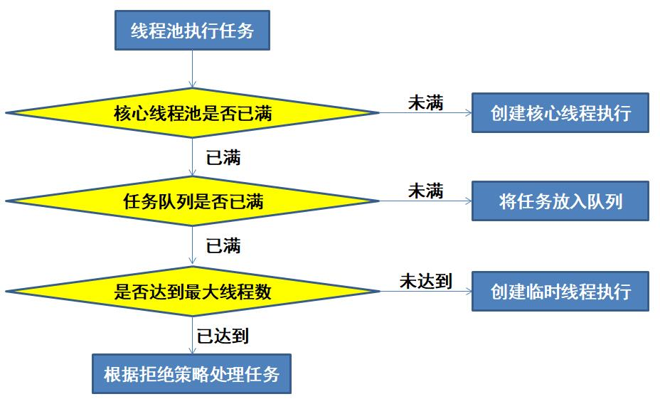
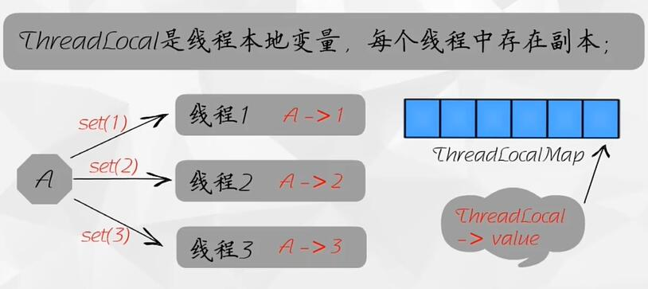

# 1. 进程与线程的区别

* 进程：一个在内存中运行的应用程序。每个进程都有自己独立的一块内存空间，一个进程可以有多个线程。在 Windows 系统中，一个运行的 XXX.exe 就是一个进程。
* 线程：进程中的一个执行任务(控制单元)，主要负责当前进程中程序的执行。一个进程至少有一个线程，多个线程可以共享数据。

形象比喻：进程 --> 火车；线程 --> 车厢。

进程和线程的区别如下：
* 进程之间不会相互影响；而一个线程挂掉会导致整个进程挂掉 (一辆火车故障不会导致另一辆火车故障；而火车中的一节车厢故障将导致整个火车故障)；
* 进程可以拓展到多机；线程最多扩展到多核 CPU (不同的火车可以在不同额轨道上行驶，同一火车的车厢不能行进在不同的轨道上)；
* 进程使用的内存地址可以上锁，即一个线程使用某些共享内存时，其他线程必须等待它使用结束，才能使用这一块内存 (火车上的洗手间 -- 互斥锁)；
* 进程使用的内存地址可以限定使用量 (火车上的餐车，最多只允许有限个人进入，满了就需要等待有人出来在进去 -- 信号量)；

## 线程上下文切换比进程上下文切换快的原因

* 进程切换时，涉及到当前进程的 CPU 环境的保存和新被调度运行进程的 CPU 环境的设置
* 线程切换时，仅需要保存和设置少量的寄存器内容，不涉及存储管理方面的操作

## 谈谈你对守护线程的理解

守护线程为所有非守护线程提供服务，任何一个守护线程都是整个 JVM 中所有非守护线程的保姆。守护线程的生死无关紧要，它依赖整个进程运行；当其他线程都结束了，没有要执行的线程时，守护线程自动中断。

守护线程的作用：GC 垃圾回收线程就是一个经典的守护线程，当我们的程序中不再有任何进程，GC 线程便自动断开。其始终在低级别的状态中运行，用于实时监控和管理系统中的可回收资源。

守护线程的应用场景：
1. 为其他线程提供服务支持
2. 在任何情况下，程序结束时，该进程必须立即关闭，那么就可以当做守护进程来使用；否则就只能作为用户线程

### 守护线程和用户线程有什么区别？
* 用户线程：运行在前台，执行具体的任务。如程序的主线程、连接网络的子线程等都是用户线程。用户线程独立存在，不会因为其他用户线程退出而退出。
* 守护线程：运行在后台，为其他非守护线程服务。当所有的用户线程都运行结束时，守护线程随着 JVM 一起结束工作。守护线程依赖于用户线程，当所有用户线程都退出了，守护线程才退出。典型的守护线程如垃圾回收线程。

注意事项：
* setDaemon(true) 必须在 start() 方法之前执行，否则会抛出 IllegalThreadStateException 异常；
* 守护线程中产生的新线程也是守护线程；
* 不是所有的任务都可以分配给守护线程来执行，比如读写操作或者计算逻辑；
* 守护线程中不能依靠 finally 代码块来确保代码一定执行。因为守护线程随着用户线程的结束而结束，故 finally 代码块可能不会被执行；

## 线程的 run() 和 start() 有什么区别？
每个线程都是通过特定的 Thread 对象所对应的 run() 方法来完成操作的，run() 方法称为线程体；通过调用 Thread 类的 start() 方法来启动一个线程。

start() 方法用来启动线程，run() 方法用于执行线程运行时的代码。run() 方法可以重复调用，start() 只能调用一次。

start() 方法启动一个线程，真正实现了多线程运行。调用 start() 方法无须等待 run 方法体代码执行完毕，可以直接执行其他的代码，此时线程处于就绪状态，并没有运行；然后通过此 Thread 类的 run() 方法来完成其运行状态；run() 方法运行结束，此线程终止，CPU 继续调度其他线程。

run() 方法时存在于线程内的，只是线程里的一个函数，若直接调用 run() 则相当于直接调用了一个普通函数，而不是多线程的。直接调用 run() 方法必须等待 run() 方法体执行完毕才能执行下面的代码，故执行路径还是只有一条，不存在线程的特征。所以在执行多线程时要使用 start() 方法而不是 run()。

# 2. 多线程与单线程的关系

* 多线程是指在一个进程中，并发执行了多个线程，每个线程都实现了不同的功能
* 多线程会存在线程上下文切换，反而会降低速度。但是对于用户来说，可以减少用户的等待响应时间，提高了资源的利用效率

## 对于线程安全你如何理解？

所谓线程安全是指由于内存中存在一块共享的内存区域，即所谓的堆。当多线程共同操作堆中的对象时，返回的结果可能与单线程操作的结果不同，即所谓的线程安全问题。其本质其实就是内存安全问题。

## 如何实现多线程之间的同步协作与通信协作？

### 线程间的同步协作
线程之间的同步可以由下列方法实现：
* synchronized 同步锁
```java
syncrhoized（Object lock）{
    需要同步的代码...;
}
```
* ReentrantLock 可重入锁
```java
Lock lock = new ReentranLock();

lock.lock();
 　 需要同步的代码；
lock.unlock();
```
* ReadWriteLock 读写锁
```java
ReentranReadWriteLock lock = new ReentranReadWriteLock();

lock.readLock().lock();
 　 需要读锁同步的代码；
lock.readLock().unlock();

lock.writeLock().lock();
 　 需要写锁同步的代码；
lock.writeLock().unlock();
```

### 线程间的通信协作
在线程获得锁而执行的过程中，执行到某一处时需要申请同一把锁的其他线程先执行，此时就需要当前线程让出同步锁以及 CPU (进入阻塞状态)，让其他的线程先获取同步锁以及 CPU 而执行。
等待其他线程执行完毕并释放同步锁之后再通知当前线程唤醒 (就绪态)，继而申请同步锁和 CPU 以继续执行。

在这个过程中线程之间的资源让出、挂起、唤醒等操作就是通过线程的通信来实现的。其主要有下列两种方式：
* synchronized 加锁线程的 `wait() / notify() / notifyAll()`
* ReentrantLock 类加锁线程的 Condition 类的 `await() / signal() / signalAll()`

# 3. 线程的状态包括哪些？
| 状态 | 概述 |
| --- | --- |
| NEW | 一个已经创建的线程，但是还没有调用 start 方法启动的线程所处的状态 |
| RUNNABLE | 该状态包含两种可能。有可能正在运行，或者正在等待 CPU 资源 |
| BLOCKED | 阻塞状态，当线程准备进入 synchronized 同步块或同步方法的时候，需要申请一个锁而进行的等待，会使线程进入 BLOCKED 状态 |
| WAITING | 该状态的出现是因为调用了`Object.wait()`或者`Thread.join()`。处于该状态下的线程在等待另一个线程将其唤醒 |
| TIMED_WAITING | 该状态和上一个状态其实是一样的，是不过其等待的时间是明确的 |
| TERMINATED | 消亡状态。`run()`方法执行结束表示线程处于消亡状态了 |

# 4. 多线程编程中常用的函数比较
| 方法 | 描述 |
| --- | --- |
| sleep() | Thread 类的静态方法，当前线程将睡眠 n 毫秒，线程进入阻塞状态。当睡眠时间到了，会解除阻塞，进入可运行状态，等待 CPU 的到来。睡眠不释放锁（如果有的话） |
| wait() | Object 的方法，必须与 synchronized 关键字一起使用，线程进入阻塞状态，当`notify()`或者`notifyall()`被调用后，会解除阻塞。但是，只有重新占用互斥锁之后才会进入可运行状态。睡眠时，会释放互斥锁 |
| join() | 线程调用该方法后，会进入阻塞，等待被调用`join()`的线程执行完毕，再继续执行 |
| yield() | 该方法使得线程放弃当前分得的 CPU 时间。但是不使线程阻塞，即线程仍处于可执行状态，随时可能再次分得 CPU 时间 |

# 5. 线程活性故障有哪些？

由于资源的稀缺性或者程序自身的问题导致线程一直处于非 Runnable 状态，并且其处理的任务一直无法完成的现象被称为是线程活性故障。常见的线程活性故障包括死锁，锁死，活锁与线程饥饿

| 活性故障 | 描述 |
| --- | --- |
| 死锁 | 死锁是最常见的一种线程活性故障。死锁的起因是多个线程之间相互等待对方而被永远暂停（处于非Runnable） |
| 锁死 | 线程锁死是指等待线程由于唤醒其所需的条件永远无法成立，或者其他线程无法唤醒这个线程而一直处于非运行状态（线程并未终止）导致其任务一直无法进展。线程死锁和线程锁死的外部表现是一致的，即故障线程一直处于非运行状态使得其所执行的任务没有进展。但是锁死的产生条件和线程死锁不一样，即使产生死锁的4个必要条件都没有发生，线程锁死仍然可能已经发生。 |
| 活锁 | 活锁是一种特殊的线程活性故障。当一个线程一直处于运行状态，但是其所执行的任务却没有任何进展称为活锁。比如，一个线程一直在申请其所需要的资源，但是却无法申请成功 |
| 线程饥饿 | 线程饥饿是指线程一直无法获得其所需的资源导致任务一直无法运行的情况。线程调度模式有公平调度和非公平调度两种模式。在线程的非公平调度模式下，就可能出现线程饥饿的情况 |

## 死锁产生的必要条件
| 条件 | 描述 |
| --- | --- |
| 互斥 | 某种资源只允许一个线程访问。某资源一旦分配给某一个线程，其他线程便无法再访问，直到占有资源的线程访问结束 |
| 不可抢占 | 某资源已经被占有，需求该资源的线程不可抢夺被占有的资源 |
| 占有且等待 | 一个线程本身占有资源，同时还有资源为得到满足，正在等待其它线程释放该资源 |
| 循环等待 | 每一个线程都占有着其它线程所必须的某些资源 |

## 如何避免死锁的发生？
打破上述的四个必要条件就能有效预防死锁的发生

| 方法 | 描述 |
| --- | --- |
| 打破互斥 | 改造独占性资源为虚拟资源 |
| 打破不可抢占 | 当一个线程占有一个独占性资源而又申请另一个独占性资源但无法得到时，释放原来占有的资源 |
| 打破占有且等待 | 采用资源预先分配策略，在程序运行前申请全部的资源，若满足则运行，不满足则等待，这样就不会一般占有着一边等待其他资源 |
| 打破循环等待 | 实现资源有序分配策略，对线程进行编号，所有线程根据序号递增的形式申请资源 |

## 线程锁死的分类
* 信号丢失锁死：信号丢失锁死是因为没有对应的通知线程来将等待线程唤醒，导致等待线程一直处于等待状态。
  * 典型例子是等待线程在执行`Object.wait( )/Condition.await( )`前没有对保护条件进行判断，而此时保护条件实际上可能已经成立，此后可能并无其他线程更新相应保护条件涉及的共享变量使其成立并通知等待线程，这就使得等待线程一直处于等待状态，从而使其任务一直无法进展。
* 嵌套监视器锁死：嵌套监视器锁死是由于嵌套锁导致等待线程永远无法被唤醒的一种故障。
  * 比如一个线程，只释放了内层锁 Y.wait()，但是没有释放外层锁 X；但是通知线程必须先获得外层锁X，才可以通过 Y.notifyAll() 来唤醒等待线程，这就导致出现了嵌套等待现象。

# 6. 谈一谈原子性、可见性、有序性

多线程环境下的线程安全主要体现在原子性，可见性与有序性方面。

* 原子性是一组操作要么完全发生，要么没有发生，其余线程不会看到中间过程的存在。注意，原子操作+原子操作不一定还是原子操作。
* 可见性是指一个线程对共享变量的更新对于另外一个线程是否可见的问题。
* 有序性是指一个线程对共享变量的更新在其余线程看起来是按照什么顺序执行的问题。

例如：原子性和可见性考虑 i ++ ：
1. 读取 i 到工作内存
2. 执行  i++ 计算
3. 将计算结果写回工作内存（即将结果赋值给 i）
4. 将工作内存结果刷入主存

原子性即保证上述 1.2.3 三步为一个整体，不可分割；可见性保证 3.4 为一个整体

## 原子性

定义：对于涉及到共享变量访问的操作，若该操作从执行线程以外的任意线程来看是不可分割的，那么该操作就是原子操作，该操作具有原子性。即，其它线程不会看到该操作执行了部分的中间结果。

例如：银行转账流程中，A 账户减少了 100 元，那么 B 账户就会多 100 元，这两个动作是一个原子操作。我们不会看到 A 减少了 100 元，但是 B 余额保持不变的中间结果。

### 原子性的实现方式？

* 利用锁的排他性，保证同一时刻只有一个线程在操作一个共享变量（synchronized 关键字）
* 利用 CAS(Compare And Swap) 保证
* Java 语言规范中，保证了除 long 和 double 型以外的任何变量的写操作都是原子操作
* Java 语言规范中规定，volatile 关键字修饰的变量可以保证其写操作的原子性

### 关于原子性

* 原子性针对的是多个线程的共享变量，所以对于局部变量来说不存在共享问题，也就无所谓是否是原子操作
* 单线程环境下讨论是否是原子操作没有意义
* volatile 关键字仅仅能保证变量写操作的原子性，不保证复合操作，比如说读写操作的原子性

## 可见性

定义：可见性是指一个线程对于共享变量的更新，对于后续访问该变量的线程是否可见的问题。

### 可见性如何保证？

* 当前处理器需要刷新处理器缓存，使得其余处理器对变量所做的更新可以同步到当前的处理器缓存中
* 当前处理器对共享变量更新之后，需要冲刷处理器缓存，使得该更新可以被写入处理器缓存中

使用 锁(sychronized)、volatile 关键字、final 关键字均可保证可见性

## 有序性

定义：有序性是指一个处理器上运行的线程所执行的内存访问操作在另外一个处理器上运行的线程来看是否有序的问题。

### 为什么代码会重排序？
为了提高程序执行的性能，Java 编译器在其认为不影响程序正确性的前提下，可能会对源代码顺序进行一定的调整，导致程序运行顺序与源代码顺序不一致。

重排序是对内存读写操作的一种优化，在单线程环境下不会导致程序的正确性问题，但是多线程环境下可能会影响程序的正确性。

举例：`Instance instance = new Instance()` 都发生了什么？

具体步骤如下所示三步：

1. 在堆内存上分配对象的内存空间
2. 在堆内存上初始化对象
3. 设置 instance 指向刚分配的内存地址

第二步和第三步可能会发生重排序，导致引用型变量指向了一个不为 null 但是也不完整的对象。（在多线程下的单例模式中，我们必须通过volatile来禁止指令重排序）

# 7. 公平调度与非公平调度
* 公平调度：按照申请的先后顺序授予资源的独占权。
* 非公平调度：在该策略中，资源的持有线程释放该资源的时候，等待队列中一个线程会被唤醒，而该线程从被唤醒到其继续执行可能需要一段时间。在该段时间内，新来的线程（活跃线程）可以先被授予该资源的独占权。

### 优缺点分析
* 公平调度
    * 优点：吞吐率较高，单位时间内可以为更多的申请者调配资源；不会出现线程饥饿的现象
    * 缺点：资源申请者申请资源所需的时间偏差可能较大
* 非公平调度
    * 优点：线程申请资源所需的时间偏差较小；适合在资源的持有线程占用资源的时间相对长或者资源的平均申请时间间隔相对长的情况下，或者对资源申请所需的时间偏差有所要求的情况下使用；
    * 缺点：吞吐率较小

# 8. 谈谈你对 synchronized 关键字的理解

synchronized 是 Java 中的一个关键字，是一个内部锁。它可以使用在方法上和方法块上，表示同步方法和同步代码块。

在多线程环境下，同步方法或者同步代码块在同一时刻只允许有一个线程在执行，其余线程都在等待获取锁，也就是实现了整体并发中的局部串行。

## synchronized 的底层实现
synchronized 又叫做内置锁，因为使用 synchronized 加锁的同步代码块在字节码引擎中执行时，实际上是通过锁对象的 monitor 的取用与释放来实现的。
monitor 内置于任何一个对象，synchronized 利用 monitor 来实现加锁解锁，因此又称为内置锁.也正因于此，锁对象可以是任意对象：

synchronized 加锁的同步块的执行过程：
* 进入时，执行`monitorenter()`，将计数器+1，释放锁时，执行`monitorexit()`，计数器-1
* 当一个线程判断到计数器为 0 时，则当前锁空闲，可以占用；反之，当前线程进入等待状态
```java
// 现在假设有代码块：  
    syncrhoized（Object lock）{
        同步代码...;
    }
// 它在字节码文件中被编译为：
    monitorenter; // 获取monitor许可证，进入同步块
    同步代码...
    monitorexit; // 离开同步块后，释放monitor许可证
```

## synchronized 如何保证原子性、可见性、有序性？

### synchronized 内部锁对原子性的保证

锁通过互斥来保障原子性，互斥是指一个锁一次只能被一个线程所持有，所以，临界区代码只能被一个线程执行，即保障了原子性。

### synchronized 内部锁对可见性的保证

synchronized内部锁通过写线程冲刷处理器缓存和读线程刷新处理器缓存保证可见性。

* 获得锁之后，需要刷新处理器缓存，使得前面写线程所做的更新可以同步到本线程。
* 释放锁需要冲刷处理器缓存，使得当前线程对共享数据的改变可以被推送到下一个线程处理器的高速缓冲中。

### synchronized 内部锁对有序性的保证

由于原子性和可见性的保证，使得写线程在临界区中所执行的一系列操作在读线程所执行的临界区看起来像是完全按照源代码顺序执行的，即保证了有序性。
    
## 为什么说 synchronized 是悲观锁？
synchronized 的并发策略是悲观的，无论是否产生竞争，任何数据的操作都必须加锁。

### 乐观锁的实现原理是什么？
乐观锁的核心是 CAS，CAS 包括内存值、预估值、新值。只有当内存值等于预期值时，才会将内存值修改为新值。

### 乐观锁一定就是好的么？
乐观锁认为对一个对象的操作不会引发冲突，所以每一次操作都不加锁，只是当最后提交更改时验证是否发生冲突。如果冲突则继续尝试，直到成功为止，这个过程称为自旋。

乐观锁没有加锁，但其引入了 ABA 问题，此问题一般采用版本号进行控制；如果产生自旋的次数过多，则不能提升效率，反而降低效率；乐观锁只能保证一个对象的原子性。

## synchronized 的四种锁状态
* 无锁：无锁是指没有对资源进行锁定，所有的线程都能访问并修改同一个资源，但同时只有一个线程能修改成功。
* 偏向锁：偏向锁指当一段同步代码一直被同一个线程所访问时，即不存在多个线程的竞争时，该线程在后续访问时便会自动获得锁，从而降低锁的获取带来的损耗，提高性能。
* 轻量级锁：轻量级锁指当锁是偏向锁的时候，却被另外的线程所访问，此时偏向锁就会升级成轻量级锁，其他的线程会通过自自旋的方式尝试获取锁，线程不会阻塞，从而提高性能。
* 重量级锁：重量级锁指当一个线程获取锁之后，其余所有等待获得该锁的线程都会处于阻塞状态。

## 多线程中 synchronized 锁升级的原理是什么？
synchronized 锁升级原理：在锁对象的对象头中有一个 threadId 字段。
* 在第一次访问时 threadId 为空，JVM 让其持有偏向锁，并将 threadId 设置为其线程 id。
* 再次进入的时候会首先判断 threadId 是否与其线程 id 一致，若一致则可以直接使用此对象；若不一致，则升级偏向锁为轻量级锁，通过自旋循环一定次数来获取锁。
* 执行一定次数之后如果还没有正常获取到要使用的对象，此时就会把轻量级锁升级为重量级锁。
此过程即 synchronized 锁的升级。

锁的升级的目的：锁升级是为了减低了锁带来的性能消耗。在 Java 6 之后优化 synchronized 的实现方式，使用了偏向锁升级为轻量级锁再升级到重量级锁的方式，从而减低了锁带来的性能消耗。


# 9. 谈谈你对 volatile 关键字的理解

volatile 关键字是一个轻量级的锁，可以保证可见性和有序性，但是不保证原子性。

* volatile 可以保证主内存和工作内存直接产生交互，进行读写操作，保证可见性
* volatile 仅能保证变量写操作的原子性，不能保证读写操作的原子性。
* volatile 可以禁止指令重排序（通过插入内存屏障），典型案例是在单例模式中使用。

## volatile 在什么情况下可以替代锁？

volatile是一个轻量级的锁，适合多个线程共享一个状态变量。可以将多个线程共享的一组状态变量合并成一个对象，用一个 volatile 变量来修饰，从而替代锁。

# 10. ReentrantLock 和 synchronized 的区别？
两者都是阻塞式的同步，也就是说当一个线程获得了对象锁，进入同步代码块，其他访问该同步代码块的线程都必须阻塞在同步代码块外面等候。

* sychronized
    * sychronized 可以定义方法和代码块。其实现了自动的加锁和释放锁。
    * sychronized 是 Java 的关键字，是在原生语法层面的互斥，需要 JVM 实现。其使用较为便利。
    * sychronized 会在同步块的前后分别生成 monitorenter 和 monitorexit 两个字节码指令。在执行 monitorenter 指令时，首先尝试获取锁。若锁未被锁定或当前线程已经拥有锁，则将锁的计数器 +1。
      执行相应的 monitorexit 时，计数器 -1。当计数器为 0 时释放锁。若获取锁时失败，则当前线程阻塞，直到对象锁被另一个线程释放。
    * 对于普通同步方法，锁的是当前实例对象；对于静态同步方法，锁的是当前类的 class 对象；对于同步方法快，锁的是括号里的对象。

* ReentranLock
    * ReentranLock 只能定义代码块。其需要手动加锁和释放锁。
    * ReentranLock 是 java.util.concurrent 包下提供的一套互斥锁，需要 lock() 和 unlock() 方法配合 try/finally 代码块来完成。
    * 相比 Synchronized，ReentrantLock 类提供了一些高级功能：
        * 等待可中断。当持有锁的线程长期不释放锁时，正在等待的线程可以选择放弃等待，该功能通过 lock.lockInterruptibly() 实现；
        * 公平锁。多个线程等待同一个锁时，必须按照申请锁的时间顺序获得锁。Sychronized 是非公平锁，ReentranLock 默认也是非公平锁，但可以通过构造函数传参 true 设置为公平锁。但公平锁性能不好。
        * 一个锁可以绑定多个条件。ReentranLock 提供了一个 Condition 类，可以实现分组唤醒需要唤醒的线程。而 Sychronized 只能随即唤醒一个线程或唤醒全部线程。

## synchronized 和 ReentrantLock 是如何实现可重入的？
可重入性：当一个线程持有锁时，其他的线程尝试获取该锁时，会被阻塞；而这个线程尝试获取自己持有的锁时，如果获取成功，则说明该锁是可重入的；反之则不可重入。

Sychronized 实现可重入：synchronized 关键字经过编译后，会在同步块的前后分别形成 monitorenter 和 monitorexit 两个字节码指令。
每个锁对象内部维护一个计数器，该计数器初始值为 0，表示任何线程都可以获取该锁并执行相应的方法。
根据虚拟机规范要求，在执行 monitorenter 指令时，首先要尝试获取对象的锁，如果这个对象没有被锁定，或者当前线程已经拥有了对象的锁，把锁的计数器+1。
相应的在执行 monitorexit 指令后锁计数器 -1，当计数器为0时，锁就被释放。如果获取对象锁失败，那当前线程就要阻塞等待，直到对象锁被另一个线程释放为止。

ReentranLock 实现可重入：ReentrantLock 使用内部类 Sync 来管理锁，所以真正的锁获取是由 Sync 的实现类控制的。
Sync 有两个实现类：NonfairSync（非公平锁）和 FairSync（公平锁）。Sync 通过继承 AQS 实现，在 AQS 中维护了一个`private volatile int state`来计算重入次数，避免频繁的持有释放操作带来的线程问题。

ReentranLock 源码分析：
```java
public class ReentrantLock implements Lock, java.io.Serializable {
    
  private final Sync sync;

  // Sync继承于AQS
  abstract static class Sync extends AbstractQueuedSynchronizer {
    //......
    final boolean nonfairTryAcquire(int acquires) {
      // 当前想要获取锁的线程  
      final Thread current = Thread.currentThread();
      // 当前锁的状态
      int c = getState();
      // state == 0 此时此刻没有线程持有锁
      if (c == 0) {
        // 通过 CAS 尝试获取锁  
        if (compareAndSetState(0, acquires)) {
          // 到这里就是获取到锁了，标记一下，告诉大家，现在是我占用了锁  
          setExclusiveOwnerThread(current);
          return true;
        }
      } else if (current == getExclusiveOwnerThread()) { // 进入该分支说明进行锁的重入
        int nextc = c + acquires;
        if (nextc < 0) // overflow
          throw new Error("Maximum lock count exceeded");
        setState(nextc);
        return true;
      }
      // 进入这里说明锁的获取失败
      return false;
    }
    //......
  }
  
  static final class NonfairSync extends Sync {
    //......
  }
  
  static final class FairSync extends Sync {
    //......
  }
  
  // ReentrantLock默认是非公平锁
  public ReentrantLock() {
    sync = new NonfairSync();
  }
  // 可以通过向构造方法中传true来实现公平锁
  public ReentrantLock(boolean fair) {
    sync = fair ? new FairSync() : new NonfairSync();
  }
  //......
}
```

当一个线程在获取锁过程中，先判断 state 的值是否为0，如果是表示没有线程持有锁，就可以尝试获取锁。当 state 的值不为0时，表示锁已经被一个线程占用了，这时会做一个判断 `current==getExclusiveOwnerThread()`，判断是看当前持有锁的线程是不是自己，如果是自己，那么将 state 的值 +1，表示重入返回即可。

# 11. Java 中的线程池有了解吗？

java.util.concurrent.ThreadPoolExecutor 类就是一个线程池。线程池的优势体现如下：
* 降低资源损耗：线程池可以重复利用已创建的线程，一次创建可以执行多次任务，有效降低线程创建和销毁所造成的资源消耗；
* 提高响应速度：线程池技术使得请求可以快速得到响应，节约了创建线程的时间；
* 方便管理：线程的创建需要占用系统内存，消耗系统资源，使用线程池可以更好的管理线程，做到统一分配、调优和监控线程，提高系统的稳定性。

## 线程池复用的原理

线程池将线程和任务进行解耦，线程是线程，任务是任务，摆脱了通过 Thread 创建线程时一个线程必须对应一个任务的限制。

在线程池中，同一个线程可以从阻塞队列中不断的获取新任务来执行。其核心原理是线程池对 Thread 进行了封装，每次执行任务时并不是调用`Thread.start()`方法来创建线程（这样就成了在线程池中创建子线程了）,而是让每个线程去执行一个循环任务，在这个循环任务中不停地检查是否有任务需要被执行，有则直接执行（即调用任务中的`run()` 方法）。

## 线程池的创建：七大参数

```java
/*
 * corePoolSize：核心线程池大小
 * maximumPoolSize：最大核心线程池大小
 * keepAliveTime：超时时间(超过这个时间没人调用就会释放)
 * unit：超时单位
 * workQueue：阻塞队列
 * threadFactory：线程工厂(创建线程使用，一般不用动)
 * defaultHandler：拒绝策略
 */
public ThreadPoolExecutor(int corePoolSize,
        int maximumPoolSize,
        long keepAliveTime,
        TimeUnit unit,
        BlockingQueue<Runnable> workQueue,
        ThreadFactory threadFactory){
        this(corePoolSize,maximumPoolSize,keepAliveTime,unit,workQueue,
        threadFactory,defaultHandler);
}
```

## 线程池的处理流程

当我们向线程池提交任务的时候，需要遵循一定的排队策略，具体策略如下：

* 如果运行的线程少于 corePoolSize，则 Executor 始终首选添加新的线程，而不进行排队
* 如果运行的线程等于或者多于 corePoolSize，则 Executor 始终首选将请求加入队列，而不是添加新线程
* 如果无法将请求加入队列，即队列已经满了，则创建新的线程，除非创建此线程超出 maxinumPoolSize，在这种情况下，将根据拒绝策略处理



### 为什么当有任务到来时要先添加队列而不是先创建最大线程？

因为线程的创建和销毁是十分消耗资源的，会影响整体效率。

举例：

一个企业有 10 个正式工 (core)，当任务数量超过正式工人数时，工厂领导( 线程池) 首先不是扩招工人，而是还是使用这 10 个人，将任务稍微积压一下，即先放到队列中 (代价低)。10 个正式工慢慢干，迟早可以完成。

如果任务继续增加，超过正式工的加班忍耐度 (队列满了)，此时就需要招聘外包 (临时工) 来协助工作。

若外包 + 正式工还是不能完成任务，此时就会根据拒绝策略进行相应的处理。

## 常见的线程池类型
| 线程池 | 容量 | 使用场景 |
| --- | --- | --- |
| newCachedThreadPool() | 核心线程池大小为0，最大线程池大小不受限，来一个创建一个线程 | 适合用来执行大量耗时较短且提交频率较高的任务 |
| newFixedThreadPool() | 固定大小的线程池 | 当线程池大小达到核心线程池大小，就不会增加也不会减小工作者线程的固定大小的线程池 |
| newSingleThreadExecutor() | | 便于实现单（多）生产者-消费者模式 |

## 常见的阻塞队列
| 阻塞队列 | 数据结构 | 优点 | 缺点 | 适用场景 |
| --- | --- | --- | --- | --- |
| ArrayBlockingQueue | 内部使用一个数组作为其存储空间，数组的存储空间是预先分配的 | put 和 take 操作不会增加 GC 的负担（因为空间是预先分配的） | put 和 take 操作使用同一个锁，可能导致锁争用，导致较多的上下文切换 | 适合在生产者线程和消费者线程之间的并发程序较低的情况下使用 |
| LinkedBlockingQueue | 是一个无界队列(其实队列长度是Integer.MAX_VALUE)，内部存储空间是一个链表，并且链表节点所需的存储空间是动态分配的 | put 和 take 操作使用两个显式锁(putLock 和 takeLock) | 增加了 GC 的负担，因为空间是动态分配的 | 适合在生产者线程和消费者线程之间的并发程序较高的情况下使用 |
| SynchronousQueue | 可以被看做一种特殊的有界队列 | | | 生产者线程生产一个产品之后，会等待消费者线程来取走这个产品，才会接着生产下一个产品，适合在生产者线程和消费者线程之间的处理能力相差不大的情况下使用 |
	
### 线程池中阻塞队列的作用
队列用先进先出的特点。当放入一个元素时，会放在队列的末尾；取出元素时，会在队列的头部取出。

而当队列为空或队列满的时候，采用阻塞队列会自动帮我们处理这种情况：

* 当阻塞队列为空时，从队列中取出元素的操作就会被阻塞
* 当阻塞队列为满时，往队列中放入元素的操作就会被阻塞
* 一旦空队列有数据了或者满队列有空余位置了，被阻塞的线程就会自动唤醒

所以，采用阻塞队列，我们不需要关心线程何时被阻塞何时被唤醒，一切有阻塞队列自动帮我们完成，我们只需要关心具体的业务逻辑即可。
	
## 拒绝策略

使用 ThreadPoolExecutor 创建线程池的最后一个参数，拥有四种拒绝策略。如下：

| 拒绝策略 | 策略内容 |
| --- | --- |
| ThreadPoolExecutor.AbortPolicy() | 直接抛出异常 |
| ThreadPoolExecutor.CallerRunsPolicy() | 哪来的回哪去(交由主进程处理) |
| ThreadPoolExecutor.DiscardPolicy() | 直接丢掉任务，不会抛出异常 |
| ThreadPoolExecutor.DiscardOldestPolicy() | 尝试与最早的进行竞争，不会抛出异常 |

# 12. 同步器有了解吗？
* Semaphore
    * 通过计数器控制对共享资源的访问
    * `Semaphore(int count)`：创建拥有 count 个许可的信号量
    * `acquire()/acquire(int num)`：获取 1 个或 num 个信号量
    * `release()/release(int num)`：释放 1 个或 num 个信号量
* CountDownLatch
    * 必须发生指定数量的事件后才能继续运行（全班所有人都离开教室后再锁门）
    * `CountDownLatch(int count)`：创建值为 count 的计数器
    * `await()`：等待计数器归零再继续执行
    * `countDown()`：计数 -1
* CyclicBarrier
    * 适用于多个线程都到达指定地点后才继续执行（四个人都到麻将馆才能开始打麻将）
    * `CyclicBarrier(int num, Runnable action)`：指定线程数量以及到达该数量后执行的动作
    * `await()`：等待全部线程到达
    
### CountDownLatch 的内部实现
* CountDownLatch 内部维护一个计数器，`CountDownLatch.countDown()`每被执行一次都会使计数器值减少1。
* 当计数器不为 0 时，`CountDownLatch.await()`方法的调用将会导致执行线程被暂停，这些线程就叫做该 CountDownLatch 上的等待线程。
* `CountDownLatch.countDown()`相当于一个通知方法，当计数器值达到0时，唤醒所有等待线程。当然对应还有指定等待时间长度的`CountDownLatch.await(long , TimeUnit)`方法。

### CyclicBarrier 的内部实现
* 使用 CyclicBarrier 实现等待的线程被称为参与方，参与方只需要执行`CyclicBarrier.await()`就可以实现等待，该栅栏维护了一个显示锁，可以识别出最后一个参与方，当最后一个参与方调用`await()`方法时，前面等待的参与方都会被唤醒，并且该最后一个参与方也不会被暂停。
* CyclicBarrier 内部维护了一个计数器变量 count = 参与方的个数，调用`CyclicBarrier.await()`可以使得count - 1。当判断到是最后一个参与方时，唤醒所有线程。

# 13. ThreadLocal 有了解吗？
ThreadLocal 用于在一个线程内进行状态的传递。

很多时候，我们在线程内调用的方法需要传入参数，而方法内部又调用很多方法，同样也需要参数，这样如果全部进行传参的话就会导致某些参数传递到所有地方。
像这种在一个线程中横跨若干个方法调用，需要传递的对象，我们称为上下文 Context，它时一种状态，可以是用户身份、任务信息等等。
Java 库为我们提供了 ThreadLocal 用于在同一个线程中传递同一个对象。

实际上，可以把 ThreadLocal 看作一个全局的 `Map<Thread, Object>`，每个线程获取变量时，总是以 Thread 自身作为 key：
`Object threadLocalValue = threadLocalMap.get(Thread.currentThread());`
因此，ThreadLocal 相当于为每一个线程开辟了独立的存储空间，各个线程的 ThreadLocal 变量互不影响。

最后需要注意的是，ThreadLocal 一定要在 finally 代码块中清除。
因为当前线程执行完相关代码后，很可能会被重新放入线程池中，如果ThreadLocal没有被清除，该线程执行其他代码时，会把上一次的状态带进去。

ThreadLocal 的实例化：
`static ThreadLocal<User> threadLocalUser = new ThreadLocal<>();`

ThreadLocal 的基本使用：
```java
void processUser(user) {
    try {
        threadLocalUser.set(user);
        step1();
        step2();
    } finally {
        threadLocalUser.remove();
    }
}

void step1() {
    User u = threadLocalUser.get();
    log();
    printUser();
}

void log() {
    User u = threadLocalUser.get();
    println(u.name);
}

void step2() {
    User u = threadLocalUser.get();
    checkUser(u.id);
}
```
## ThreadLocal 内部实现机制

* 每个线程内部都会维护一个类似 HashMap 的对象，称为 ThreadLocalMap，里边会包含若干了 Entry (K-V键值对)，相应的线程被称为这些 Entry 的属主线程
* Entry 的 Key 是一个 ThreadLocal 实例，Value 是一个线程特有对象。Entry 的作用是为其属主线程建立起一个 ThreadLocal 实例与一个线程特有对象之间的对应关系
	* 当执行 set() 方法时，ThreadLocal 首先获取当前线程对象，然后获取当前线程的 ThreadLocalMap 对象。在以当前 ThreadLocal 对象为 Key，将 value 存储禁 ThreadLocalMmap 对象中。
	* 当执行 get() 方法时，ThreadLocal 首先会获取当前线程对象，然后获取当前线程 ThreadLocalMap 对象。在以当前ThreadLocal对象为 Key，获取对应的值 value
* Entry 对 Key 的引用是弱引用；Entry 对 Value 的引用是强引用。



## ThreadLocal 是怎样解决并发安全的？
Java 中常用两种机制来解决多线程的并发问题：
* synchronized 方式，通过锁机制，使一个线程在执行时，另一个线程等待，是一种以时间换空间的方式保证多线程并发安全；
* ThreadLocal 方式：通过创建线程局部变量，以空间换时间的方式保证多线程并发安全；

在 Spring 的源码中，就使用了 ThreadLocal 来管理连接。
在很多开源项目中，都经常使用 ThreadLocal 来控制多线程并发问题，因为它足够的简单，我们不需要关心是否有线程安全问题，因为变量是每个线程所特有的。

## ThreadLocal 应用场景

1. 线程数据隔离
2. 在进行对象跨层传输时，使用 ThreadLocal 可以避免对此传递，打破层次间的约束
3. 进行实物操作，用于存储线程事务信息（Spring 框架事务开始时会为当前线程绑定一个 JDBC Connection，就是使用 ThreadLocal 实现的）

## ThreadLocal 内存泄漏

### 内存泄漏的原因

threadLocalMap 使用 ThreadLocal 的弱引用作为 key，如果一个 ThreadLocal 不存在外部强引用时，ThreadLocal 势必会被 GC 回收，这样就会导致 ThreadLocalMap 中 key 为 null， 而 value 还存在着强引用，只有 thead 线程退出以后，value 的强引用链条才会断掉。

但如果当前线程再迟迟不结束的话，这些 key 为 null 的 Entry 的 value 就会一直存在一条强引用链：`Thread Ref -> Thread -> ThreaLocalMap -> Entry -> value`，所以永远无法回收，造成内存泄漏。

### 避免内存泄漏

当 ThreadLocalMap 的 key 为弱引用回收 ThreadLocal 时，由于 ThreadLocalMap 持有 ThreadLocal 的弱引用，即使没有手动删除，ThreadLocal 也会被回收。当 key 为 null，在下一次 ThreadLocalMap 调用 set()、get()、remove() 方法的时候会被清除 value 值。

即使用弱引用可以多一层保障：弱引用 ThreadLocal 不会内存泄漏，对应的 value 在下一次 ThreadLocalMap 调用 set()、get()、remove() 的时候会被清除。

### ThreadLocal正确的使用方法

* 每次使用完 ThreadLocal 都调用它的 remove() 方法清除数据
* 将 ThreadLocal 变量定义成 private static，这样就一直存在 ThreadLocal 的强引用（延长 ThreadLocal 的生命周期），也就能保证任何时候都能通过 ThreadLocal 的引用访问到 Entry 的 value 值，进而清除掉 。

# 14. Atomic 有了解吗？
JDK 在 java.util.concurrent.atomic 包下的 AtomicInteger 等原子类。

AtomicInteger 类提供了`getAndIncrement()`和`incrementAndGet()`等原子性的自增自减等操作。

Atomic 等原子类内部使用了 CAS 来保证原子性。

# 15. 什么是 happened-before 原则？

happened-before 约束了编译器的优化行为，虽然允许编译器优化，但是编译器优化后一定要遵循 happened-before 原则。

1. 程序顺序规则
2. 传递性
3. volatile 变量规则
4. 锁规则
5. 线程 start() 规则
6. 线程 join() 规则
7. 线程 interrupt() 规则
8. finalize() 规则

# 16. JVM 虚拟机对内部锁有哪些优化？

答：锁消除、锁粗化、偏向锁、适应性锁

### 锁消除

锁消除是 JIT 编译器对内部锁的具体实现所做的一种优化。

在动态编译同步块的时候，JIT 编译器可以借助逃逸分析来判断同步块所使用的锁对象是否只能够被一个线程访问。如果同步块所使用的锁对象只能够被一个线程访问，那么 JIT 编译器在编译这个同步块的时候并不生成 synchronized 所表示的锁的申请与释放对应的机器码，而仅生成原临界区代码对应的机器码，即消除了锁的使用。

### 锁粗化

锁粗化是 JIT 编译器对内部锁的具体实现所做的一种优化。

对于相邻的几个同步块，如果这些同步块使用的是同一个锁实例，那么 JIT 编译器会将这些同步块合并为一个大同步块，从而避免了一个线程反复申请、释放同一个锁所导致的开销。

### 偏向锁

偏向锁是 Java 虚拟机对锁的实现所做的一种优化。

这种优化基于大多数锁并没有被争用，并且这些锁在其整个生命周期内至多只会被一个线程持有。

偏向锁的目标是，减少无竞争且只有一个线程使用锁的情况下，使用轻量级锁产生的性能消耗。轻量级锁每次申请、释放锁都至少需要一次 CAS，但偏向锁只有初始化时需要一次 CAS。

### 适应性锁

适应性锁是 JIT 编译器对内部锁实现所做的一种优化。

存在锁争用的情况下，一个线程申请一个锁的时候如果这个锁恰好被其他线程持有，那么这个线程就需要等待该锁被其持有线程释放。

对于一个具体的锁实例，Java 虚拟机会根据其运行过程中收集到的信息来判断这个锁是属于被线程持有时间“较长”的还是“较短”的。
* 对于被线程持有时间“较长”的锁，Java 虚拟机会选用暂停等待策略；
* 对于被线程持有时间“较短”的锁，Java 虚拟机会选用忙等等待策略；

Java 虚拟机也可能先采用忙等等待策略，在忙等失败的情况下再采用暂停等待策略。Java 虚拟机的这种优化就被称为适应性锁，这种优化同样也需要 JIT 编译器介入。

# 17. 如何进行无锁化编程？

* 针对计数器，可以使用原子加
* 只有一个生产者和一个消费者，那么就可以做到免锁访问环形缓冲区（Ring Buffer）
* RCU（Read-Copy-Update），新旧副本切换机制，对于旧副本可以采用延迟释放的做法
* CAS（Compare-and-Swap），如无锁栈，无锁队列等待

# 18. 谈一下对 CAS 的理解
CAS 机制使用了三个基本操作数：内存地址、预期值A、替换值B。其规则是，当需要更新一个变量的值的时候，只有当预期值A和内存地址中存储的值的实际值相同时，才将对应地址的值替换为替换值B。

## CAS 的缺陷有哪些？
* ABA 问题：某一个线程将 A 改变为 B，然后又将 B 改变为 A，此时 CAS 检查其时符合规则的，便认为没有发生改变。但实际上它已经发生了变化。
  * 解决方法：添加版本号或时间戳，例如 AtomicStampedReference
* 自旋资源消耗：多线程争夺同一个资源时，如果自旋获取锁一直不成功，将会一直占用 CPU
  * 解决方法：破坏循环，可以设定当超过一定的次数或一定的时间时退出
* 多变量共享一致性问题：CAS 操作时是针对一个变量的
  * 解决方法：要对多变量进行操作，可以通过加锁或者封装成对象解决

## 说一下什么是 ABA 问题？如何解决？
ABA：如果另一个线程修改 V 值假设原来是 A，先修改成 B，再修改回成 A。当前线程的 CAS 操作无法分辨当前V值是否发生过变化。

解决方法：使用 “版本号 + 值” 来判断。例如 Java 中的 AtomicStampedReference 类。

# 19. AQS（AbstractQueuedSynchronizer）的原理与实现

# 20. Thread 和 Runnable 的区别？

二者没有本质区别，就是接口和类的区别，其只有使用方式上的不同。

1. Runnable 的使用是实现其接口即可，接口支持多继承（基本不会这么用）
2. Thread 的实现方式是继承该类，Thread 实现了 Runnable 接口并进行了扩展

# 21. 为什么 wait()、notify()、notifyAll() 必须在 Object 类中定义？
Java 中，任何对象都可以作为锁，wait() 方法和 notify() 方法用于等待对象的锁或者唤醒线程；在 Java 线程中并没有可供对象使用的锁，故任意对象调用方法一定定义在 Object 类中。

有人说既然是线程放弃对象锁，那可以把 wait() 方法定义在 Thread 类中，新定义的线程继承于 Thread 类，也不需要重新定义 wait() 的实现。但是这种设计存在一个问题：
一个线程可以持有多个锁，而当线程放弃锁的时候就无法判断到底要放弃哪个锁，所以管理起来更加复杂。

