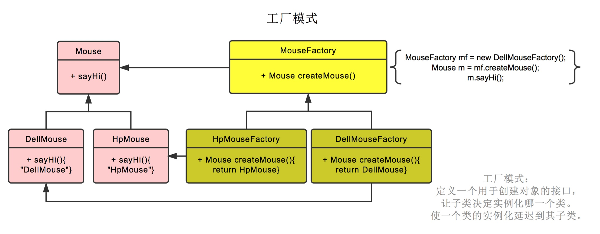
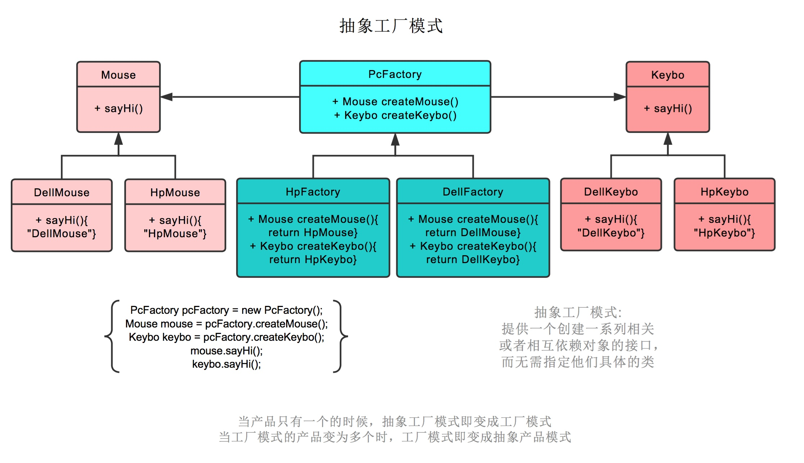

# 1. 设计模式 6 大原则
* 单一职责原则：类或者接口要实现职责单一
* 里氏替换原则：使用子类来替换父类，做出通用的编程
* 依赖倒置原则：面向接口编程
* 接口隔离原则：接口的设计需要精简
* 单一迪米特法则：降低依赖之间耦合
* 开闭原则：对扩展开放，对修改关闭

# 2. 高频设计模式
## 单例模式
单例模式指在一个系统中，一个类有且只有一个对象实例。

* 单例模式的优点：单例模式保证了一个类在一个系统中有且只有一个对象实例，减少了系统内存和性能的开销。
* 单例模式使用场景：创建一个对象需要消耗太多的资源或者在一个系统中不适合创建多个对象实例的情况下，我们可以采用单例模式设计实现。


### 饿汉式
```java
public class demo18_Hungry {
    /**
     * 饿汉式单例
     * 存在问题：可能会浪费空间
     */
    
    // 因为无论是否用到单例对象，下面的代码都会初始化，所以会造成空间浪费
    private byte[] data1 = new byte[1024*2024]; 
    private byte[] data2 = new byte[1024*2024];
    private byte[] data3 = new byte[1024*2024];
    private byte[] data4 = new byte[1024*2024];

    private demo18_Hungry(){}; // 构造方法私有化

    private final static demo18_Hungry hungry = new demo18_Hungry();
    
    public static demo18_Hungry getInstance() {
        return hungry;
    }
    
}
```

### 懒汉式

#### DCL饿汉式
```java
import java.lang.reflect.Constructor;
import java.lang.reflect.InvocationTargetException;

public class demo18_Lazy01 {
    /**
     * DCL懒汉式单例
     * 问题：可以通过反射破解单例
     */

    private demo18_Lazy01(){};

    private volatile static demo18_Lazy01 lazy01; // 使用volatile关键字来避免指令重排

    // 双重检测锁模式的懒汉式单例
    public static demo18_Lazy01 getInstance() {
        if (lazy01 == null) {
            synchronized (demo18_Lazy01.class) {
                if (lazy01 == null) {
                    lazy01 = new demo18_Lazy01(); // 该操作不是一个原子操作！
                }
            }
        }
        return lazy01;
    }

    public static void main(String[] args) throws Exception {
        /**
         * 使用反射破解单例
         */
        demo18_Lazy01 instance1 = demo18_Lazy01.getInstance();
        Constructor<demo18_Lazy01> lazy01Constructor =
                demo18_Lazy01.class.getDeclaredConstructor(null);
        lazy01Constructor.setAccessible(true);
        demo18_Lazy01 instance2 = lazy01Constructor.newInstance();

        System.out.println(instance1); // demo18_Lazy01@2ff4acd0
        System.out.println(instance2); // demo18_Lazy01@54bedef2
    }

}
```

### 三重锁饿汉式
```java
import java.lang.reflect.Constructor;
import java.lang.reflect.Field;

public class demo18_Lazy02 {
    /**
     * 懒汉式单例 -- 添加特定标识符
     * 问题：可以通过反射破解单例
     */

    private static boolean zqf = false;

    private demo18_Lazy02() {
        if (zqf == false) {
            zqf = true;
        } else {
            throw new RuntimeException("不要尝试使用反射破解！");
        }
    }

    ;

    private volatile static demo18_Lazy02 lazy01; // 使用volatile关键字来避免指令重排

    // 双重检测锁模式的懒汉式单例
    public static demo18_Lazy02 getInstance() {
        if (lazy01 == null) {
            synchronized (demo18_Lazy02.class) {
                if (lazy01 == null) {
                    lazy01 = new demo18_Lazy02(); // 该操作不是一个原子操作！
                }
            }
        }
        return lazy01;
    }
}
```

### 静态内部类
```java
public class demo18_Holder {
    /**
     * 单例模式：使用静态内部类实现
     */
    private demo18_Holder() {};
    
    public static demo18_Holder getInstance() {
        return InnerClass.holder;
    }
    
    public static class InnerClass {
        private static final demo18_Holder holder = new demo18_Holder();
    }
}
```

### 枚举
```java
import java.lang.reflect.Constructor;

public enum demo18_Enum {
    /**
     * 单例模式：使用枚举实现
     */
    INSTANCE;

    public demo18_Enum getInstance() {
        return INSTANCE;
    }

}

class Test {
    public static void main(String[] args) throws Exception{
        demo18_Enum instance1 = demo18_Enum.INSTANCE;
        /**
         * 枚举类型最终反编译的源码中，构造器为：
         * private demo18_Enum(String s, int i) {
         *   super(s, i);
         * }
         */
        Constructor<demo18_Enum> constructor =
                demo18_Enum.class.getDeclaredConstructor(String.class, int.class);
        constructor.setAccessible(true);
        demo18_Enum instance2 = constructor.newInstance();

        /**
         * java.lang.IllegalArgumentException: Cannot reflectively create enum objects
         */
        System.out.println(instance1);
        System.out.println(instance2);
    }
}
```

## 工厂模式

工厂模式也就是鼠标工厂是个父类，有生产鼠标这个接口。 戴尔鼠标工厂，惠普鼠标工厂继承它，可以分别生产戴尔鼠标，惠普鼠标。

工厂方法模式定义了一个用于创建对象的接口，让子类决定实例化哪一个类。工厂方法模式使一个类的实例化延迟到其子类。生产哪种鼠标不再由参数决定，而是创建鼠标工厂时，由戴尔鼠标工厂创建。

后续直接调用鼠标工厂.生产鼠标()即可



```java
package niuke.facatory;

public class FactoryMethodTest {
    public static void main(String[] args) {
        // 创建具体的创建类对象
        Creator creator = new ConcreteCreator();
        // 通过传入指定的产品类对象（惠普 or 戴尔），来创建对应的产品
        Product product = creator.createProduct(ConcreteProduct1.class);
        // 创建对象之后，可以进行业务逻辑处理
        product.method1();
        product.method2();
    }
}
// 定义抽象产品类 -- 鼠标
abstract class Product {
    // 产品类的公共方法
    public void method1(){
        // 公共的业务逻辑
    }
    // 抽象方法
    public abstract void method2();
}

// 定义具体产品类
class ConcreteProduct1 extends Product {
    public void method2() {
        // 具体产品类1 -- 惠普鼠标的业务逻辑处理
    }
}
class ConcreteProduct2 extends Product {
    public void method2() {
        // 具体产品类2 -- 戴尔鼠标的业务逻辑处理
    }
}

// 定义抽象创建类
abstract class Creator {
    // 创建对象的抽象方法
    public abstract <T extends Product> T createProduct(Class<T> c);
}
// 定义具体的创建类，真正来创建所需的对象
class ConcreteCreator extends Creator {
    public <T extends Product> T createProduct(Class<T> c){
        Product product=null;
        try {
            // 通过反射技术来创建对象
            product = (Product)Class.forName(c.getName()).newInstance();
        } catch (Exception e) {
            //异常处理
        }
        return (T)product;
    }
}
```

## 抽象工厂模式

抽象工厂模式也就是不仅生产鼠标，同时生产键盘。即 PC 厂商是个父类，有生产鼠标，生产键盘两个接口。

戴尔工厂，惠普工厂继承它，可以分别生产戴尔鼠标+戴尔键盘，和惠普鼠标+惠普键盘。

创建工厂时，由戴尔工厂创建。后续工厂.生产鼠标()则生产戴尔鼠标，工厂.生产键盘()则生产戴尔键盘。



### 抽象工厂模式和工厂模式的区别

如果产品单一，适合使用工厂模式。但是如果有多个业务品种、业务分类时，需要使用抽象工厂模式。也就是说，工厂模式针对的是一个产品等级结构 ，抽象工厂模式针对的是面向多个产品等级结构的。

## 模板模式

模板方法模式定义了一个框架，将一些步骤延迟到其子类中实现，子类可以在不改变框架的前提下重新定义某些特定的执行步骤。


AbstractClass是一个抽象模板，它的方法分为模板方法和基本方法。

* 基本方法：是抽象方法，由子类实现，并且在模板方法中被调用。
* 模板方法：可以有一个或者几个，一般是具体的方法，实现对基本方法的调度，完成确定的业务逻辑，确定一个框架。

```java
package niuke.template;

public class Main {
    public static void main(String[] args) {
        Dog dog = new Dog();
        dog.start();

        Cat cat = new Cat();
        cat.start();
    }
}
// 抽象的父类
abstract class Animal{
    // 定义抽象方法
    abstract void eat();
    abstract void run();

    // 定义具体的模板方法
    public void start(){
        // 定义一个框架，确定方法的执行步骤
        eat();
        run();
    }
}
// 定于子类
class Dog extends Animal{
    @Override
    void eat() {
        System.out.println("我是小狗，我在吃东西...");
    }

    @Override
    void run() {
        System.out.println("我是小狗，我在跑步...");
    }
}

class Cat extends Animal {
    @Override
    void eat() {
        washHand();
        System.out.println("我是小猫，我在吃东西...");
    }

    @Override
    void run() {
        System.out.println("我是小猫，我在跑步...");
    }

    // 其余业务逻辑
    private void washHand() {
        System.out.println("我是小猫，我在洗手...");
    }
}
```

### 模版模式的优点

* 封装不变部分，扩展可变部分
* 提取公共部分代码，便于维护
* 行为由父类控制，子类实现

