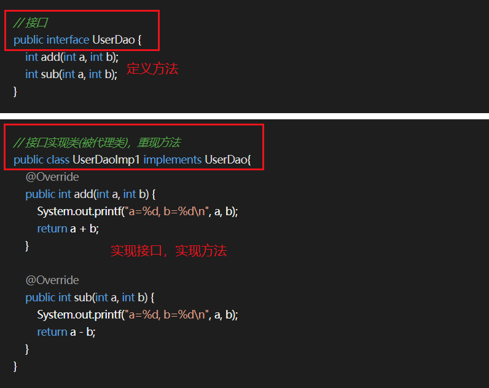
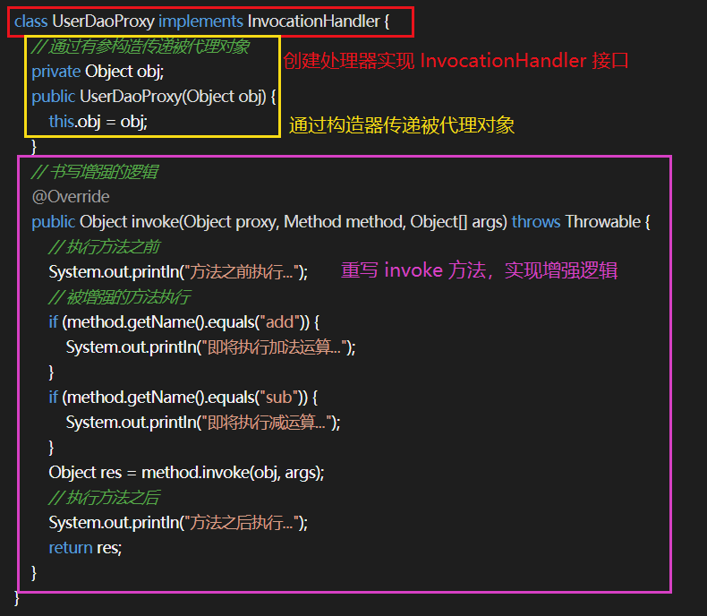
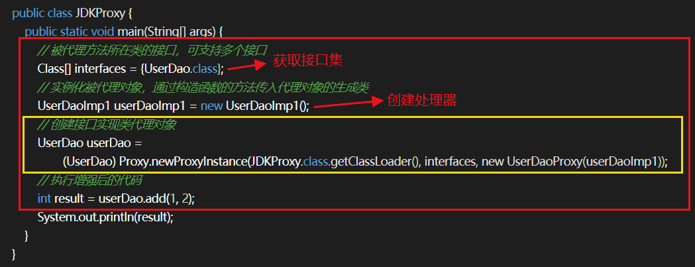
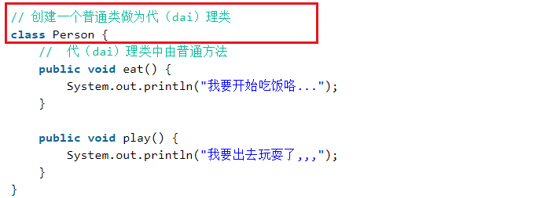
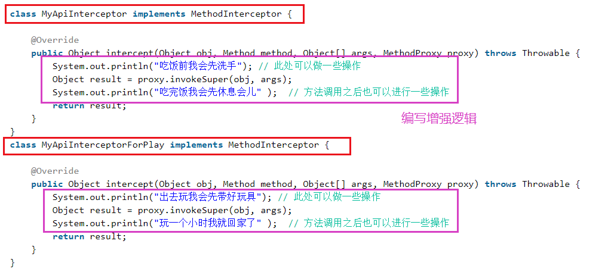
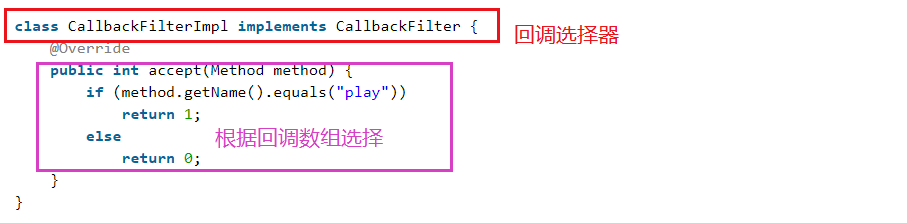
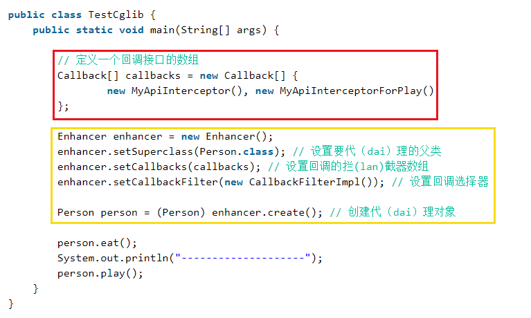
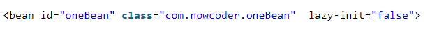
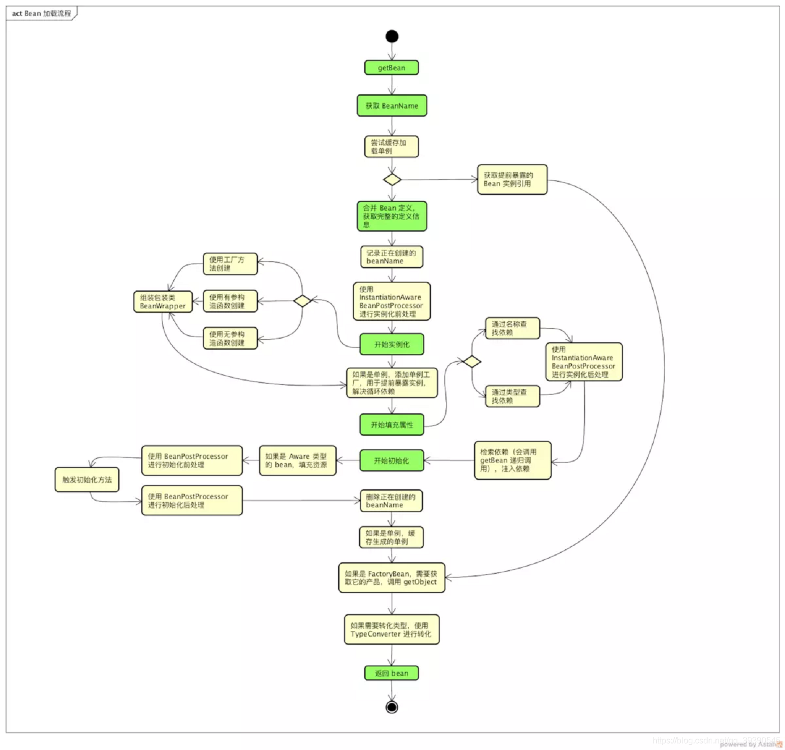
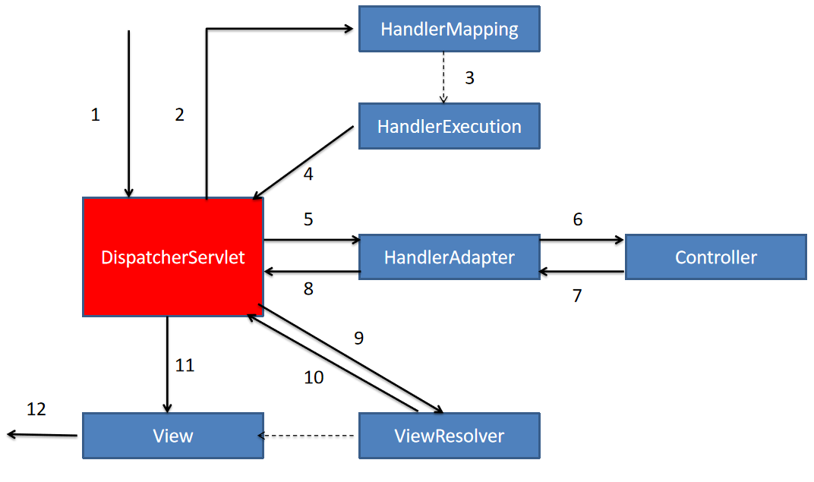

# 1. Spring 是什么？
Spring 是一种轻量级的框架，用于提高开发人员的开发效率和可维护性，其包含多个模块可以方便的协助开发人员进行开发，包括：
* Spring Core：Core 封装包是框架的基础，其提供 IOC 和依赖注入的特性。
* Spring AOP：Spring 的 AOP 库，其提供了 AOP 机制，并提供常用的拦截器供用户自定义和配置。
* Spring JDBC：负责 Java 数据库连接。
* Spring JMS：负责 Java 消息服务。
* Spring ORM：用于支持常用的 Hibernate、MyBatis 等 ORM 框架，其本身不实现 ORM，仅对常见的 ORM 框架进行封装和管理。
* Spring WEB：WEB 模块对常见的框架如 Struts X、SpringMVC、JSF 等提供支持，其能管理这些框架，将 Spring 资源注入给框架，也可以在这些框架的前后插入拦截器。
* Spring TEST：提供对 JUnit 单元测试的支持。

# 2. 说一下 Spring 中的控制反转 (IOC)

IOC 又称控制反转，是将对象间的依赖关系交给 Spring 容器进行管理，使用配置文件/注解来创建依赖的对象，由主动创建对象改为了被动的方式，实现解耦合。

## 如何实现一个 IOC 容器

1. 使用配置文件配置包扫描路径
2. 从配置文件中获取需要扫描的包的路径，将当前路径下的所有 .class 文件添加到一个 Set 中进行存储
3. 遍历这个 Set 集合，获取在类上有指定注解的类，将其交给 IOC 容器，定义一个安全的 Map 来存储这些对象
4. 遍历 IOC 容器，获取每一个类的实例，判断依赖进行注入

# 3. Spring 中的面向切面编程 (AOP) 有了解么

AOP 即面向切面编程，指当需要在一个方法执行的前后需要做一些额外的功能（如日志记录、权限判断、异常统计）时，可以利用 AOP 将功能代码从业务逻辑中分离出来。

## AOP 操作术语

| 概念 | 英文名称 | 描述 |
| --- | --- | --- |
| 切点 | Pointcut | 决定在切入操作在何处切入业务代码。切点分为 execution(路径表达式) 和 annotation(注解) 方式 | 
| 通知 | Advice | 也称处理，即切面对某个连接点所产生的动作。其包括处理时机和处理内容。处理内容即要做什么事，处理时机就是在什么时候执行处理内容，有前置处理、后置处理等 | 
| 切面 | Aspect | 即 Point + Advice | 
| 连接点 | Joint point | 程序执行的一个时间点，比如一个方法的执行或一个异常的处理 |
| 织入 | Weaving | 通过动态代理在目标对象方法中执行处理内容的过程 |

## Advice 通知的类型有几种？
| 类型 | 描述 |
| --- | --- |
| 前置通知(Before) | 在目标方法被调用之前调用处理内容 | 
| 后置通知(After) | 在目标方法完成之后调用处理内容，此时不关心方法的输出是什么 | 
| 返回通知(After-returning) | 在目标方法成功执行之后调用处理内容 |
| 异常通知(After-throwing) | 在目标方法抛出异常之后调用处理内容 |
| 环绕通知(Around) | 通知包围了目标方法，在目标方法调用之前和调用之后都调用处理内容 |

### 在同一个切面 Aspect 中，不同的 Advice 的执行顺序
```
1. around before advice
2. before advice
3. target method
4. around after advice
5. after advice
若无异常：
6. after returning
若有异常：
6. after throwing
7. 异常发生
```

## Spring 中 AOP 的实现方式

### JDK 动态代理

只能对实现了接口的类生成代理。其并不是针对某一个类，而是将目标类型实现的所有接口全部代理。

其原理是通过在运行期间创建一个接口的实现类来完成对目标对象的代理。

基本步骤：

* 首先创建接口并创建实现该接口的类，即实际被代理的类
* 定义一个实现 InvocationHandler 接口的类    
	* 在该类中通过构造器的方式注入要被代理的类的实例
    * 实现 invoke 方法，进行增强

* 通过 Proxy.newProxyInstance 方法创建代理对象    
	* 参数1：类加载器
    * 参数2：被代理接口集
    * 参数3：处理器
* 使用代理对象调用各种方法

示例：







### cglib

cglib 主要针对类实现代理，对其是否实现接口无要求。

其原理是对指定的类生成一个子类，覆盖其中的方法。因为是继承，所以被代理的类或者方法不币可以声明为 final 类型。

基本步骤：
* 创建一个普通的类作为代理类
* 创建多个类实现 MethodInterceptor 接口    
	* 重写 intercept 方法，编写增强逻辑
    * 在 intercept 中调用 proxy.invokeSuper 执行原生方法的逻辑
* 创建一个类实现 CallbackFilter 接口作为回调拦截器，重写 accept 方法指定对应的调用
* 实例化一个 Enhancer 类对象    
	* 使用 setSuperclass 方法设置要代理的父类
    * 使用 setCallbacks 方法设置回调的拦截器数组
    * 使用 setCallbackFilter 方法设置回调选择器
    * 使用 create 方法创建代理对象
* 使用代理对象调用各种方法

示例：









## Spring 对于两种代理方式的选择

* 如果目标对象实现了接口，默认情况下会采用 JDK 的动态代理实现 AOP，但也可以强制使用 cglib 实现
* 如果目标对象没有实现接口，必须采用 cglib 库，Spring 会自动在 JDK 动态代理和 cglib 之间转换

# 3. IOC 容器的初始化过程

IOC 容器的初始化主要包括：Resource定位、载入和注册

### Resource资源定位

Resource 定位指 BeanDefinition 的资源定位，即 IOC 容器寻找数据的过程。

Spring 使用外部资源来描述一个 Bean 对象，IOC 容器第一步就是定位 Resource 的外部资源。

该过程由 ResourceLoader 通过统一的 Resource 接口完成定位。

### BeanDefinition载入

载入过程即将一个定义好的 Bean 封装成 IOC 容器内部的数据结构 BeanDefinition。

配置文件中的每一个 Bean 都对应着一个 BeanDefinition 对象。

该过程通过 BeanDefinitionReader 读取，解析 Resource 定位的资源，将用户定义好的 Bean 封装成 BeanDefinition。

在 IOC 内部维护着一个 BeanDefinitionMap 的数据结构，通过该结构可以更好的管理 Bean。

### BeanDefinition注册

注册即将 BeanDefinition 保存到 BeanDefinitionMap 的过程。

该过程通过 BeanDefinitionRegistry 接口实现。
注意：

IOC 容器的初始化过程并不会对 Bean 进行依赖注入。

lazy-init=false：表示不开启延迟加载，在容器启动的时候就创建 Bean

lazy-init=true：表示开启延迟加载，只有当应用程序第一次向容器索取Bean时才创建，通过 getBean() 方法调用完成。



## BeanFactory 和 FactoryBean 的区别

* BeanFactory：Bean 工厂，是 Spring IOC 容器的顶层接口，其作用是管理 Bean，即实例化、定位、配置应用程序中的对象以及建立对象间的依赖。
* FactoryBean：工厂 Bean，是一个 Bean，其作用是产生其他的 Bean 实例。其需要提供一个工厂方法，该方法返回其他 Bean 实例。

## BeanFactory 和 ApplicationContext 有什么区别？

* BeanFactory：
Spring 中最顶层的接口，是 IOC 的基本实现。
采用延迟加载来注入Bean，加载配置文件时不会创建对象，在获取对象(使用)时才去创建对象。这样带来的问题就是不能发现一些存在于 Spring 配置中的问题，如果某个 Bean 没有注入成功，只有当调用它时才会抛出异常。

* ApplicationContext：
ApplicationContext 在容器启动时，一次性创建了所有 Bean。这样就可以发现 Spring 中存在的配置错误。
ApplicationContext 是 BeanFactory 的子接口，它除了 BeanFactory 所具有的功能外，还提供了更完整的框架功能。    
	* 支持国际化
	* 提供了统一的资源文件的访问方式
	* 提供Listener中注册Bean的事件
	* 提供同时加载多个配置文件的功能
	* 载入多个有继承关系的上下文

### ApplicationContext 的常见实现方式

* FileSystemXmlApplicationContext：
此容器从一个 XML 文件中加载 Bean 的定义，XML Bean 配置文件中需要提供的 Bean 的全路径名

* ClassPathXmlApplicationContext：
此容器也从一个 XML 文件中加载 Bean 的定义，需要正确设置 classpath。

* WebXmlApplicationContext：
此容器加载一个 XML 文件，定义了一个 WEB 应用的所有 Bean

### BeanFactory 和 ApplicationContext 的优缺点分析

* BeanFactory
    * 优点：应用启动时占用的资源少，对资源要求较高的应用比较有优势
    * 缺点：运行速度相对较慢，且有可能出现空指针异常错误；通过 Bean 工厂创建的 Bean 生命周期相对简单

* ApplicationContext
    * 优点：所有的 Bean 在启动时进行加载，系统运行时速度快；在启动的时候就可以发现系统中的配置问题
    * 缺点：所有的 Bean 全部预加载，内存占用较大
	
# 4. Spring Bean 的生命周期

1. 解析类得到 BeanDefinition
2. 推断构造方法（一般使用无参构造），实例化得到一个对象，并根据注解进行属性的注入
3. 回调 Aware 方法（Aware系列接口，主要用于辅助Spring bean访问Spring容器）
4. 调用 Bean 后置处理器方法 postProcessBeforeInitialization
5. 调用初始化方法
6. 调用 Bean 后置处理器方法 postProcessAfterInitialization
7. 使用 Bean
8. 调用 Bean 的销毁方法

## 简述一下 Bean 的加载过程
我们知道，Spring 的工作流主要包括下列两个环节：
1. 解析：读取 xml 配置，扫描类文件，从配置或者注解中获取 Bean 的定义信息，注册一些扩展功能
2. 加载：通过解析完的定义信息获取 Bean 实例

Bean 加载的主要阶段：
1. 获取 BeanName：对传入的 name 进行解析，转化成可以从 Map 中获取到的 BeanDefinition 的 Bean name；
2. 合并 Bean 定义：对父类的定义进行合并和覆盖，如果父类还有父类，则递归合并，从而获取完整的 Bean 定义信息；
3. 实例化：调用构造方法或者工厂方法创建 Bean 实例
4. 属性填充：寻找并且注入依赖，依赖的 Bean 还会递归调用 getBean() 方法获取；
5. 初始化：调用自定义的初始化内容；
6. 获取最终的 Bean：如果是 FactoryBean 需要调用 getObject 方法，如果需要类型转换调用 TypeConverter 进行转化；

getBean() 调用链流程图：




# 5. Spring 中 Bean 的作用域有哪几种？

Spring 框架支持一下5种 Bean 的作用域：

| 作用域 | 解释 |
| --- | --- |
| singleton | 唯一 bean 实例，Spring 中的 bean 默认都是单例的 |
| prototype | 每一次请求都会创建一个新的 bean 实例 |
| request | 每一次 HTTP 请求都会产生一个新的 bean，该 bean 仅在当前 HTTP request 内有效 |
| session | 每一次 HTTP 请求都会产生一个新的 bean，该 bean 仅在当前 HTTP session 内有效 |
| global-session | 全局 session 作用域，Spring 5 中取消 |

## Spring 中的 Bean 是线程安全的么？

Spring 容器中的 Bean 本身没有提供线程安全策略，因此可以说 Bean 本身不具备线程安全的特性，但是具体还要作用域来讨论：
* 若为 prototype 作用域的 bean，其每次都创建一个新对象，不同线程之间 bean 不共享，因此也不存在线程安全的问题
* 若为 singleton 作用域的 bean，所有线程共享一个实例 bean，因此可能存在线程安全的问题：
    * 如果 bean 是无状态的 bean，即其内部没有实例变量的对象，不能存储数据，是不变类，则其是线程安全的，如 Controller、全家桶.Service、Dao 类等
    * 如果 bean 是有状态的 bean，可以保存数据，则该 bean 就是线程不安全的

对于有状态的 bean (如 ModelAndView)，就需要自行保证线程安全。最简单的方法就是改变 bean 的作用域。也可以采用 ThreadLocal 来解决线程安全问题，为每一个线程提供一个独立的变量副本空间，不同的线程只操作自己线程的副本变量。

## 什么是循环依赖？
比如存在三个类 A B C：A 依赖 B，B 依赖 C，C 依赖 A，这三个类就形成了一个循环依赖。注意，方法的调用不构成循环依赖，循环依赖必须持有引用。

循环依赖发生的场景：
* 构造器循环依赖：依赖的对象是通过构造器传入的，发生在实例化 Bean 的时候；
    * 构造器循环依赖本质上是无法解决的，因为调用 A 的构造器时发现依赖 B，于是调用 B 的构造器实例化 B，结果其又依赖 A，形成循环调用，导致 A 无法创建。
* 设值循环依赖：依赖的对象通过 setter 方法传入，对象已经实例化，发生在属性填充和依赖注入的时候；
    * 如果是设值循环依赖，可以通过对还在创建中的单例进行缓存，提前暴露该单例的方法，使得其它实例可以引用该依赖。
    
### 循环依赖的解决思路
Spring 通过三级缓存进行解链。
* 一级缓存 singletonObjects，存放完全实例化属性赋值完成的 Bean，可以直接使用
* 二级缓存 earlySingletonObjects，存放早期 Bean 的引用，是尚未属性装配的 Bean
* 三级缓存 singletonFactories，存放实例化完成的 Bean 工厂

# 6. Spring 中应用了哪些设计模式？

* 简单工厂模式（不属于23种常用设计模式）：Spring 中的 BeanFactory 就是简单工厂模式的体现，根据传入一个唯一的标识来获得 bean 对象。
* 工厂模式：Spring使用工厂模式可以通过 BeanFactory 或 ApplicationContext 创建 bean 对象。
* 单例模式：Spring 中 bean 的默认作用域就是 singleton 的。
* 代理模式：Spring 中的 AOP 就是基于代理模式，有 JDK 动态代理和 cglib 两种方式。
* 适配器模式：在 Spring MVC 中，DispatcherServlet 根据请求信息调用 HandlerMapping，解析请求对应的 Handler。解析到对应的 Handler（也就是我们平常说的 Controller 控制器）后，开始由 HandlerAdapter 适配器处理。HandlerAdapter 作为期望接口，具体的适配器实现类用于对目标类进行适配，Controller 作为需要适配的类。

# 7. Spring 事务有了解么？

Spring 支持编程式事务管理和声明式事务管理。

* 编程式事务管理：使用TransactionTemplate 实现
* 声明式事务管理：底层使用 AOP 原理。其本质是通过 AOP 在方法的前后进行拦截，将事务处理的功能添加到拦截方法中，即在目标方法开始之前加入一个事务，执行方法之后提交或回滚事务。

### 声明式事务管理的优点
不需要在业务代码中掺杂事务管理的代码，只需要在配置文件中声明然后使用 `@Tansactional` 注解即可。

### 事务选择

声明式事务管理优于编程式事务管理，这是 Spring 倡导的非侵入式开发方式，可以是业务代码不受污染，只添加注解即可获得事务支持。

不足之处在于声明式事务管理的最细粒度只能作用到方法级别，而编程式事务管理可以作用到代码块级别。

## 事务传播行为

指一个被事务管理的方法在被另一个被事务管理的方法调用时，前者将如何进行。

| 传播行为 | 解释 |
| --- | --- |
| REQUIRED(默认) | 如果当前存在事务，则加入当前事务；如果当前没有事务，则自己创建一个事务 |
| SUPPORTS | 如果当前存在事务，则加入当前事务；如果当前没有事务，就以非事务方法执行 |
| MANDATORY | 如果当前存在事务，则加入当前事务；如果当前没有事务，则抛出异常 |
| REQUIRED_NEW | 创建一个新事物，若当前存在事务，则挂起该事物 |
| NOT_SUPPORTED | 以非事务方式执行，如果当前存在事务，则挂起当前事务 |
| NEVER | 不使用事务，如果当前存在事务，则抛出异常 |
| NESTED | 如果当前事务存在，则嵌套在事务中执行(子事务)，否则就自己开启一个事务 |

## Spring 事务什么时候会失效？

Spring 事务管理的原理是 AOP，那么事务失效的根本原因就是 AOP 失效，常见失效情况如下：

1. 发生自调用，类中调用本类的方法，那么意味着这个方法不是通过代理类调用，而是通过自身类调用，所以导致 AOP 失效。解决方法：在该类中注入自身。
2. 方法不是 public 修饰的
3. 数据库不支持事务（MyISAM引擎）
4. 当前类没有被 Spring 管理
5. 异常被捕获，事务不会回滚

# 8. Spring、Spring MVC 和 SpringBoot 的区别

* Spring 是一个 IOC 容器，用来管理 Bean，使用依赖注入实现控制反转，可以很方便的整合各种框架；提供 AOP 机制弥补 OOP 的代码重复问题
* Spring MVC 是 Spring 对 web 框架的一个解决方案，提供一个总的前端控制区 DispatcherServlet 用来接收请求，并定义了一整套路由策略 (url 到 handler 的映射) 以及适配器执行 handler，将 handler 的执行结果使用视图解析器生成视图展示给前端
* SpringBoot 是 Spring 提供的快速开发包，简化了配置，整个了一系列的解决方案（start 机制）


# 9. SpringMVC 的消息处理流程有了解么？

SpringMVC 是一种轻量级的 web 层框架，是一个基于请求驱动的 web 框架，使用 前端控制器(DispatcherServlet) 模型进行设计，再根据请求的映射规则分发给相应的页面控制器进行处理。



具体流程：

实线表示SpringMVC框架提供的技术，不需要开发者实现；虚线表示需要开发者实现

1. DispatcherServlet表示前置控制器，是整个SpringMVC的控制中心。用户发出请求，DispatcherServlet接收请求并拦截请求

2. HandlerMapping为处理器映射器。DispatcherServlet调用HandlerMapping，HandlerMapping根据请求url查找Handler。

3. HandlerExecution表示具体的Handler，其主要作用是根据url查找控制器。如上述url被查找的控制器为hello。

4. HandlerExecution将解析后的信息传递给DispatcherServlet。

5. HandlerAdapter表示处理器适配器，其按照特定的规则去执行Handler。

6. Handler让具体的Controller执行。

7. Controller将具体的执行信息返回给HandlerAdapter，如ModelAndView。

8. HandlerAdapter将视图逻辑名或模型传递给DispatcherServlet。

9. DispatcherServlet调用ViewResolver(视图解析器)来解析HandlerAdapter传递的逻辑视图名。

10. ViewResolver将解析的逻辑视图名返回给DispatcherServlet。

11. DispatcherServlet根据ViewResolver解析的视图结果，调用具体的视图。

12. 最终视图呈现给用户。

假设请求的 URL 为 `http://localhost:8080/Spring01/hello` ，将被拆解为三部分

    * http://localhost:8080 表示服务器域名
    * Spring01 表示部署在服务器上的web站点
    * hello 表示控制器

故上述的URL表示为：请求位于服务器`http://localhost:8080 上的 Spring01 站点的 hello 控制器`


## SpringMVC 的三大组件

* 处理器映射器HandlerMapping：用户请求路径到 Controller 方法的映射
* 处理器适配器HandlerAdapter：根据 handler(controlelr类) 的开发方式（注解开发/其他开发） 方式的不同区寻找不同的处理器适配器
* 视图解析器ViewResolver：根据 handler 返回的 view 地址文件类型(jsp/pdf….)去寻找相应的视图解析器来进行解析

## 介绍一下 SpringMVC 各组件的作用

| 组件 | 名称 | 描述 | 实现 |
| --- | --- | --- | --- |
| DispatchServlet | 前端控制器 | 整个流程的控制中心，由它调用其他组件处理用户的请求。它的存在降低了组件之间的耦合性，提高了系统的扩展性。 | 框架实现 |
| HandlerMapping | 处理器映射器 | 负责根据 url 找到对应的处理器 Handler。SpringMVC 提供了不同的映射器实现了不同的映射方式，不同的映射器按照一定的规则查找，如 xml 配置方式、接口方式、注解方式等。 | 框架实现 | 
| Handler | 处理器 | 在 DispatchServlet 的控制下对用户的具体请求进行处理，涉及业务的处理 | 开发人员实现 |
| HandlerAdapter | 处理器适配器 | 对 Handler 进行执行，这是适配器模式的应用。通过扩展适配器可以对更多类型的处理器进行执行 | 框架实现 |
| ModelAndView | | SpringMVC 的封装对象，将 model 和 view 封装在一起 | |
| ViewResolver | 视图解析器 | 负责将处理结果生成 View 视图。其首先根据逻辑视图名解析成物理视图名即具体的页面地址，在生成 View 视图对象，最后对 View 进行渲染将处理结果通过页面展示给用户 | |
| View | | SpringMVC 的封装对象，是一个接口。一般情况下需要通过页面标签或者页面模板技术将模型数据通过页面展示给用户，需要由开发人员根据业务需求开发具体的页面 | |

# 10. @Resource 和 @Autowired 有什么区别？
* `@Resource`：默认根据名字注入，其次根据类型注入；
* `@Autowired`：根据类型注入，结合`@Qualifie("name")`可以根据名称和类型注入，等同于`@Resource`；

总结：

| | @Autowired | @Resource |
| --- | --- | --- |
| 装配方式 | byType | byName |
| 参数 | 只包含一个参数：required，默认为 true | 包含七个参数：其中 name 和 type 最常用 |
| 定义 | Spring 定义的注解 | JSR-250 定义的注解 |
