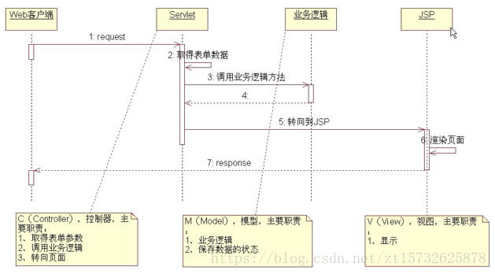

# 1. jsp 和 servlet 有什么区别？
* servlet 是服务端的 Java 程序，它担当客户端和服务端的中间层；
* jsp 全名 java server pages，中文名 java 服务器页面，其本质是一个简化的 servlet 设计。jsp 是一种动态页面设计，其主要目的是将表示逻辑从 servlet 中分离出来；
* JVM 只能识别 Java 代码，不能识别 jsp。jsp 编译之后就变成了 servlet，web 容器将 jsp 的代码编译成 JVM 能够识别的 Java 类 servlet；
* jsp 有内置对象，servlet 没有内置对象。

# 2. jsp 有哪些内置对象？作用是什么？
* PageContext：javax.servlet.jsp.PageContext JSP的页面容器
* request：javax.servlet.http.HttpServletrequest 获取用户的请求信息
* response：javax.servlet.http.HttpServletResponse 服务器向客户端的回应信息
* session：javax.servlet.http.HttpSession 用来保存每一个用户的信息
* application：javax.servlet.ServletContext 表示所有用户的共享信息
* config：javax.servlet.ServletConfig 服务器配置信息，可以取得初始化参数
* out：javax.servlet.jsp.jspWriter 页面输出
* page：java.lang.object
* exception：java.lang.Throwable

# 3. forward 和 redirect 的区别？
* forward：直接请求转发；redirect：间接请求转发，又叫重定向。
* forward：客户端和浏览器执行一次请求；redirect：客户端和浏览器执行两次请求。
* forward，经典的 MVC 模式就是 forward；redirect：用于避免用户的非正常访问（例如用户非正常访问，servlet 就可以将 HTTP 请求重定向到登录页面）
* forward：地址不变；redirect：地址改变。

# 5. session 和 cookie 有什么区别？
* 存储位置不同：cookie 存储在客户端浏览器；session 存储在服务器
* 存储容量不同：cookie <= 4k，一个站点最多保留 20 个 cookie；session 没有上限，但出于对服务器的保护，session 内不可存储过多的东西，并且需要设置 session 删除机制
* 存储方式不同：cookie 只能保存 ASCII 字符，并且需要通过编码的方式存储为 Unicode 字符或者二进制数据；session 可以存储任何类型的数据，包括但不限于 String、Integer、List、Map 等
* 隐私策略不同：cookie 对客户端是可见的，不安全；session 存储在服务器上，比较安全
* 有效期不同：开发中可以通过设置 cookie 属性，达到 cookie 长期有效的效果；session 依赖于名为 JESSIONID 的 cookie，其过期时间默认为 -1，关闭窗口则 session 就会失效，因此 session 达不到长期有效的效果
* 跨域支持上不同：cookie 支持跨域；session 不支持跨域

# 6. 